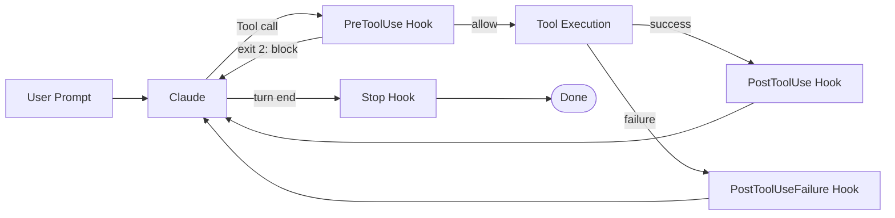
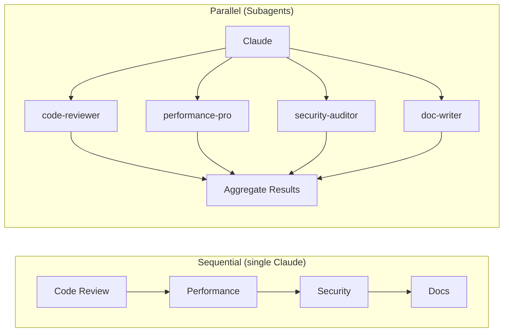

# Chapter 4: Connect Claude to Everything — MCP, Hooks, and Subagents in Practice

## 1. Preface

With Commands, you can already compress repeated prompts into a single word.

But Claude itself has limits — it cannot operate a database directly, search the web, or push code to GitHub.

**MCP and Hooks are the two keys that break through that boundary:**

| Tool  | What it solves                                            | Analogy                                |
| ----- | --------------------------------------------------------- | -------------------------------------- |
| MCP   | Lets Claude call external services (DB / GitHub / search) | "Plugins" for Claude                   |
| Hooks | Automatically runs scripts before/after Claude's actions (lint, tests, notifications) | "Triggers" for Claude |

---

## 2. MCP Integration

### 2.1 What MCP Is

MCP (Model Context Protocol) is the **"USB standard"** for connecting AI to external tools — a single protocol, so any MCP Server can be plugged in and called by Claude.

| Comparison      | Without MCP                          | With MCP                              |
| --------------- | ------------------------------------ | ------------------------------------- |
| Integration cost | Build a custom wrapper per tool     | Build once, reuse everywhere          |
| Compatibility   | Not portable across platforms        | Open standard, cross-platform         |
| Ecosystem       | Each tool stands alone               | Community-built, drop-in ready        |

### 2.2 How to Configure

**Method 1: configuration file (recommended for teams)**

Create `.mcp.json` in the project root:

```json
{
  "mcpServers": {
    "server-name": {
      "command": "npx",
      "args": ["-y", "package-name", "extra-args"],
      "env": {
        "API_KEY": "${ENV_VAR_NAME}"
      }
    }
  }
}
```

> `${GITHUB_TOKEN}` resolves from the environment variable of the same name. **Never hard-code secrets in the file.**

**Method 2: CLI quick add (personal testing)**

```bash
claude mcp add <mcp address>                # Add
claude mcp list                              # List all
claude mcp remove <name>                     # Remove
claude mcp add filesystem -s user -- npx -y @modelcontextprotocol/server-filesystem D:/Desktop D:/develop
```


```bash
claude mcp list
# or in interactive mode:
/mcp
```


```bash
claude mcp remove filesystem -s user
```


Removed successfully:


**Scoping flags:**

```bash
claude mcp add --scope project <name> ...   # Project scope (default)
claude mcp add --scope user <name> ...      # User scope (global)
```

### 2.3 Common Server Cheat Sheet

| Category | Server       | Package                                     | API Key needed | Pick |
| -------- | ------------ | ------------------------------------------- | -------------- | ---- |
| Files    | filesystem   | `@modelcontextprotocol/server-filesystem`   | No             | ⭐⭐⭐  |
| Files    | memory       | `@modelcontextprotocol/server-memory`       | No             | ⭐⭐   |
| Database | sqlite       | `@modelcontextprotocol/server-sqlite`       | No             | ⭐⭐⭐  |
| Database | postgres     | `@modelcontextprotocol/server-postgres`     | No (conn str)  | ⭐⭐   |
| Dev      | github       | `@modelcontextprotocol/server-github`       | Yes            | ⭐⭐⭐  |
| Dev      | git          | `@modelcontextprotocol/server-git`          | No             | ⭐⭐   |
| Search   | brave-search | `@modelcontextprotocol/server-brave-search` | Yes            | ⭐⭐⭐  |
| Search   | fetch        | `@modelcontextprotocol/server-fetch`        | No             | ⭐⭐   |
| Docs     | context7     | `@upstash/context7-mcp`                     | No             | ⭐⭐⭐  |
| Automation | puppeteer  | `@modelcontextprotocol/server-puppeteer`    | No             | ⭐⭐   |

**Typical config (Filesystem + GitHub):**

```json
{
  "mcpServers": {
    "filesystem": {
      "command": "npx",
      "args": ["-y", "@modelcontextprotocol/server-filesystem", "."],
      "env": {}
    },
    "github": {
      "command": "npx",
      "args": ["-y", "@modelcontextprotocol/server-github"],
      "env": { "GITHUB_TOKEN": "${GITHUB_TOKEN}" }
    }
  }
}
```

When you launch `claude` and see `✓ filesystem` and `✓ github`, MCP is connected. (On Windows, the per-user state is in `%USERPROFILE%\.claude.json`.)


### 2.4 The Three Scopes

| Scope    | Storage location                  | Priority | Use case                                       |
| -------- | --------------------------------- | -------- | ---------------------------------------------- |
| Local    | `~/.claude.json` (project entry)  | Highest  | Contains API keys; never commit to Git         |
| Project  | `.mcp.json` in project root       | Medium   | Team-shared, version-controlled                |
| User     | `~/.claude.json` (global)         | Lowest   | Personal generic tools, available everywhere   |

> **Rule of thumb:** has secrets → Local; team-required → Project; personal staple → User.

### 2.5 Calling MCP from a Command

The `allowed-tools` field in Chapter 3 accepts MCP tools directly. Format: `mcp__server__tool`.

```markdown
---
allowed-tools:
  - mcp__github__create_issue
  - mcp__filesystem__read_file
  - mcp__brave-search__brave_web_search
---
```

This lets Commands drive GitHub, the filesystem, web search, etc., forming a complete automation pipeline.


### 2.6 Troubleshooting

| Symptom                       | Cause                              | Fix                                                                  |
| ----------------------------- | ---------------------------------- | -------------------------------------------------------------------- |
| MCP servers don't show on launch | Config file path or format wrong | Confirm `.mcp.json` is in project root and JSON is valid             |
| Server fails to start          | Node.js version too old            | Upgrade to v18+                                                      |
| `${VAR}` not resolving         | Variable not exported / shell stale | Verify with `echo $VAR`; restart your shell                         |
| Tool call rejected             | Not declared in `allowed-tools`    | Add the tool to the command's frontmatter                            |
| `npx` download times out       | Network issue                      | Configure a faster npm mirror or check your network/proxy            |

---

## 3. Hooks

### 3.1 What Hooks Are

Hooks are **event-driven automation triggers** — when Claude performs a specific action, your preset shell script runs automatically.

A common case: after Claude writes some code, automatically format it so the final code looks consistent.

| Hook event         | Trigger                            | Typical use                                                   |
| ------------------ | ---------------------------------- | ------------------------------------------------------------- |
| `PreToolUse`       | **Before** Claude calls a tool     | Block dangerous commands, validate arguments                  |
| `PostToolUse`      | **After** Claude calls a tool      | Auto-lint / test / format                                     |
| PostToolUseFailure | After a tool call fails            | Error logging, retry triggers, failure analysis               |
| `Notification`     | When Claude sends a notification   | Desktop popup, audible alert                                  |
| `Stop`             | After Claude finishes a turn       | Auto-save, send completion notification                       |

> Analogy: MCP gives Claude plugins; Hooks give Claude "auto-triggers" — when it finishes an action, the script runs for you.



### 3.2 Configuration

Hooks live under the `hooks` field in `settings.json`. Two locations are supported:

| Location | Path                       | Scope                                  |
| -------- | -------------------------- | -------------------------------------- |
| Project  | `.claude/settings.json`    | Current project only; can commit to Git |
| User     | `~/.claude/settings.json`  | All projects                            |

**Format:**

```json
{
  "hooks": {
    "EventName": [
      {
        "matcher": "tool-name regex",
        "hooks": [
          {
            "type": "command",
            "command": "shell command to run"
          }
        ]
      }
    ]
  }
}
```

**`matcher` regex rules:**

`matcher` controls which tools the hook triggers on. It supports regular expressions.

| Pattern         | Meaning                       | Example                                            |
| --------------- | ----------------------------- | -------------------------------------------------- |
| Empty `""`      | Match any tool                | Triggers on every tool call                        |
| Exact match     | Tool name equals              | `Write` matches only the Write tool                |
| Pipe `|`        | Logical OR, multiple tools    | `Write|Edit` matches both                          |
| `.`             | Any single character          | `Wr.te` matches Write                              |
| `^`             | Start anchor                  | `^Bash$` exactly matches Bash, avoids false hits   |
| `$`             | End anchor                    | `Tool$` matches tools ending in `Tool`             |

**Common matcher examples:**

```json
{
  "hooks": {
    "PostToolUse": [
      {
        "matcher": "",
        "hooks": [{"type": "command", "command": "echo 'triggers on any tool'"}]
      },
      {
        "matcher": "Write",
        "hooks": [{"type": "command", "command": "echo 'only Write triggers'"}]
      },
      {
        "matcher": "^Bash$",
        "hooks": [{"type": "command", "command": "echo 'exact Bash match; avoids BashScript'"}]
      },
      {
        "matcher": "Write|Edit",
        "hooks": [{"type": "command", "command": "prettier --write $CLAUDE_FILE_PATHS"}]
      },
      {
        "matcher": "Read.*",
        "hooks": [{"type": "command", "command": "echo 'tools starting with Read'"}]
      }
    ]
  }
}
```

**Best practices:**

- Use `^exact$` to avoid over-broad regexes that fire unexpectedly.
- Use strict regexes in PreToolUse for defense against dangerous commands.
- PostToolUse can use looser regexes (e.g., `Write|Edit`).

### 3.3 Hands-on Example

**Auto-format after writing files (most common)** — extract the path, format the file:

```json
{
  "hooks": {
    "PostToolUse": [
      {
        "matcher": "Write|Edit",
        "hooks": [
          {
            "type": "command",
            "command": "jq -r '.tool_input.file_path' | xargs prettier --write"
          }
        ]
      }
    ]
  }
}
```

### 3.4 Available Environment Variables

Hook scripts receive these variables from Claude:

| Variable               | Meaning                                  | Example value                |
| ---------------------- | ---------------------------------------- | ---------------------------- |
| `$CLAUDE_TOOL_NAME`    | Name of the tool just invoked            | `Write`                      |
| `$CLAUDE_FILE_PATHS`   | File paths involved (space-separated)    | `src/app.ts src/utils.ts`    |
| `$CLAUDE_PROJECT_DIR`  | Project root directory                   | `/Users/me/project`          |
| `$CLAUDE_TOOL_INPUT`   | Full tool input as JSON                  | `{"command":"ls -la"}`       |

### 3.5 Common Scenarios Cheat Sheet

| Scenario                        | Event       | matcher       | Sample script                                        |
| ------------------------------- | ----------- | ------------- | ---------------------------------------------------- |
| Auto-prettier after save        | PostToolUse | `Write|Edit`  | `prettier --write $CLAUDE_FILE_PATHS`                |
| Auto-ESLint after save          | PostToolUse | `Write|Edit`  | `eslint --fix $CLAUDE_FILE_PATHS`                    |
| Run unit tests after writing    | PostToolUse | `Write`       | `npm test -- --passWithNoTests`                      |
| Log every Bash command          | PreToolUse  | `Bash`        | `echo $CLAUDE_TOOL_INPUT >> audit.log`               |
| Play a sound when done          | Stop        | (empty)       | `afplay /System/Library/Sounds/Glass.aiff`           |
| Desktop notification when done  | Stop        | (empty)       | `osascript -e 'display notification...'`             |

> **Note:** when a `PreToolUse` hook exits with code `2`, the tool call is **blocked**. Other exit codes don't block.

### 3.6 Troubleshooting

| Symptom                          | Cause                                | Fix                                                  |
| -------------------------------- | ------------------------------------ | ---------------------------------------------------- |
| Hook never fires                 | Wrong path or format in settings.json | Confirm location; validate JSON with an online tool |
| Script reports "command not found" | Script uses an alias or partial PATH | Use full paths, e.g. `/usr/local/bin/prettier`     |
| PreToolUse blocks accidentally   | matcher regex too broad              | Tighten it, e.g. `^Bash$` instead of `Bash`         |
| File path variable is empty      | The tool didn't touch files          | Use `$CLAUDE_TOOL_INPUT` for full input             |

---

## 4. Subagents

### 4.1 What a Subagent Is

After MCP and Hooks, you can extend Claude's boundaries — call external services and run scripts automatically.

But there's a deeper problem: **how can one Claude be an expert in 100+ specialized domains at once?**

**Subagents are the answer:** specialized AI agents launched by Claude Code via the Task tool, each an expert in its domain.

| Tool         | What it solves                          | Analogy                              |
| ------------ | --------------------------------------- | ------------------------------------ |
| MCP          | Lets Claude call external services      | "Plugins" for Claude                 |
| Hooks        | Lets Claude run scripts automatically   | "Triggers" for Claude                |
| **Subagent** | **Lets Claude coordinate an expert team** | **"Advisory board" for Claude**    |

#### Core Advantages

**Parallel collaboration:** launch several expert agents at once and process different tasks in parallel.



**Domain specialization:** each Subagent is a deep expert in its field, producing higher-quality output than a generalist.

**On-demand scaling:** a 100+ agent library — say what you need and Claude calls the right expert.

> **⚠️ Important:** parallel Subagent calls burn a lot of tokens. Each Subagent opens a fresh context window. **Call on demand; don't launch too many at once.**

---

### 4.2 Quick Install

#### Option 1: Interactive script (recommended)

```bash
claude plugin marketplace add VoltAgent/awesome-claude-code-subagents
claude plugin install <plugin-name>
```

Or use the **Installed** tab in `/plugin` to install through the UI.

#### Option 2: Manual install (full control)

1. **Pick the location:**
   - Globally available: `~/.claude/agents/`
   - Project-only: `.claude/agents/` (in the project root)
2. **Copy the file:** grab the `.md` agent definition you want from the repository's `categories/` folder and drop it into the path above.

**Verify install:**

```bash
# List enabled Subagents
claude /agents
```

### Troubleshooting and screenshots

If you hit network errors, check your proxy settings. Installation may require a proxy — adjust per your setup (or install manually):

```powershell
$env:HTTP_PROXY = "http://127.0.0.1:7897"
$env:HTTPS_PROXY = "http://127.0.0.1:7897"
```


---

### 4.3 `/agents` — Build One from Scratch Interactively

Beyond installing prebuilt agents, you can use `/agents` to **create a Subagent from scratch** — guided end-to-end, no config files to hand-write.

#### Step 1: type `/agents`

In the Claude Code conversation, type `/agents`. You'll see your current agents, with **Create new agent** at the bottom:


#### Step 2: choose a location

| Option                         | Notes                  | Best for                                          |
| ------------------------------ | ---------------------- | ------------------------------------------------- |
| `Project (.claude/agents/)`    | Current project only   | Project-specific agents                           |
| `Personal (~/.claude/agents/)` | Globally available     | Generic agents reusable across projects           |


#### Step 3: pick a creation mode

| Mode                              | Notes                                                        | Best for                       |
| --------------------------------- | ------------------------------------------------------------ | ------------------------------ |
| **Generate with Claude (recommended)** | Describe what you need; Claude generates the full config    | First choice for newcomers     |
| Manual configuration              | Fill in every field by hand                                 | Scenarios needing precise control |


#### Step 4: describe the agent's job

Describe what the agent should do and when it should be invoked, in natural language. **The more detail, the better the result:**

```
This is a Subagent for code review. Invoke it when the user asks for a "code review".
```


#### Step 5: let Claude generate

Claude auto-generates the agent's name, system prompt, tool selection, etc.:


#### Step 6: choose tool permissions

Pick which tools the agent can use, based on its job:

| Tool category    | Includes               | Notes                                |
| ---------------- | ---------------------- | ------------------------------------ |
| Read-only tools  | Glob, Grep, Read, etc. | Safe, no side effects                |
| Edit tools       | Edit, Write, etc.      | Can modify files                     |
| Execution tools  | Bash, etc.             | Can run commands                     |
| MCP tools        | Configured MCP services | Calls external services             |


#### Step 7: pick a model

| Model                 | Characteristics                            | Suggested use                   |
| --------------------- | ------------------------------------------ | ------------------------------- |
| **Sonnet**            | Balanced — speed and quality               | **Default for daily agents**    |
| Opus                  | Strongest reasoning, highest cost          | Complex architecture / deep analysis |
| Haiku                 | Fastest, cheapest                          | Simple or batch tasks           |
| Inherit from parent   | Use the main session's model               | Follow current setting          |


#### Step 8: pick a color

Assign a background color so the agent's output is recognizable at a glance (green for code review, red for security, etc.).


#### Step 9: configure memory

| Option                              | Notes                                              | Recommendation              |
| ----------------------------------- | -------------------------------------------------- | --------------------------- |
| **Enable (.claude/agent-memory/)**  | Project memory; agent remembers prior context      | **Recommended**             |
| None                                | No persistent memory                               | One-off tasks               |
| User scope                          | Global memory (`~/.claude/agent-memory/`)          | Cross-project generic agent |
| Local scope                         | Local memory, not committed to Git                 | Sensitive-information cases |


#### Step 10: confirm and save

The full agent config is displayed; press `s` or `Enter` to save:

```
Name:        code-reviewer
Location:    .claude/agents/code-reviewer.md
Tools:       Glob, Grep, Read, WebFetch, WebSearch
Model:       Sonnet
Memory:      Project (.claude/agent-memory/)

Description: Use this agent when the user explicitly requests a
             code review, review code, check code, etc.

System prompt:
You are a senior code reviewer with 15+ years of software
engineering experience, fluent across many languages and
architectures...
```


#### Putting it to use

Once saved, say in the conversation: **"please do a code review."** Claude detects the intent and invokes the `code-reviewer` agent you just created.

You'll see the **colored tag** indicating the Subagent is running independently:


When it's done, the agent returns a full review report:


> **Tip:** the interactive `/agents` flow is the recommended way today — no `.md` files to write by hand, and Claude generates the full config (name, description, system prompt, tool permissions) for you. A custom agent in two minutes.

---

### 4.4 Agent Catalog Overview

VoltAgent ships 10 expert agent categories (100+ agents). Install what you need:

#### 1️⃣ Core Development

api-designer / backend-developer / electron-pro / frontend-developer / fullstack-developer / graphql-architect / microservices-architect / mobile-developer / ui-designer / websocket-engineer / wordpress-master

#### 2️⃣ Language Specialists

typescript-pro / python-pro / rust-engineer / golang-pro / java-architect / javascript-pro / react-expert / vue-expert / angular-architect / nextjs-developer / swift-expert / kotlin-expert / cpp-pro / csharp-developer / php-pro / sql-pro / django-developer / laravel-expert / rails-expert / spring-boot-engineer / flutter-expert / elixir-expert / dotnet-core-expert / powershell-pro

#### 3️⃣ Infrastructure

cloud-architect / devops-engineer / kubernetes-expert / terraform-engineer / database-admin / sre / deployment-engineer / azure-infra-engineer / network-engineer / platform-engineer / security-engineer / incident-responder / windows-infra-admin

#### 4️⃣ Quality & Security

code-reviewer / security-auditor / qa-automation-engineer / performance-engineer / debugging-expert / error-detective / penetration-tester / architecture-reviewer / accessibility-tester / chaos-engineer / compliance-auditor / testing-automation-expert

#### 5️⃣ Data & AI

ai-engineer / llm-architect / ml-engineer / data-engineer / data-scientist / data-analyst / database-optimizer / postgres-pro / mlops-engineer / nlp-engineer / prompt-engineer

#### 6️⃣ Developer Experience

refactoring-expert / documentation-engineer / git-workflow-manager / legacy-code-modernizer / mcp-developer / build-engineer / cli-developer / dependency-manager / dx-optimizer / tooling-engineer

#### 7️⃣ Specialized Domains

blockchain-developer / game-developer / fintech-engineer / iot-engineer / embedded-systems-engineer / api-documenter / seo-specialist / mobile-app-developer / m365-admin

#### 8️⃣ Business & Product

product-manager / business-analyst / project-manager / scrum-master / technical-writer / ux-researcher / customer-success-manager / sales-engineer / legal-advisor / content-marketing-specialist

#### 9️⃣ Meta & Orchestration

multi-agent-coordinator / workflow-orchestrator / agent-organizer / agent-installer / context-manager / task-dispatcher / error-coordinator / performance-monitor / knowledge-synthesizer / it-ops-orchestrator

**Recommended starting set:**

- `code-reviewer` (code review)
- `debugging-expert` (debugging)
- `refactoring-expert` (refactoring)
- `documentation-engineer` (docs)

---

### 4.5 Calling Multiple Experts in Parallel

#### Automatic invocation

When your description matches an agent's domain, Claude **invokes it automatically**:

```
You: this code has a performance problem
Claude: [auto-detected] calling performance-engineer...
        Based on perf best practices, I'll analyze the bottleneck...

You: review my code quality
Claude: [auto-detected] calling code-reviewer...
        I noticed the following quality issues...
```

#### Explicit parallel invocation

For complex tasks, **explicitly call multiple experts in parallel**:

```
Invoke each expert in parallel to look at / resolve XXXX:

- code-reviewer to check code quality
- performance-engineer to analyze performance
- security-auditor to audit security
```

Claude launches all three Subagents at once and returns a combined report.

#### Common scenarios

| Scenario                    | Agents to call                                                  | Effect                          |
| --------------------------- | --------------------------------------------------------------- | ------------------------------- |
| **Code review**             | code-reviewer                                                   | Quickly surface quality issues  |
| **Performance optimization** | performance-engineer + database-optimizer                      | End-to-end bottleneck analysis  |
| **Security audit**          | security-auditor + penetration-tester                           | Deep security review            |
| **New project kickoff**     | architecture-reviewer + project-manager + tech-writer           | Generate architecture docs fast |
| **Legacy refactor**         | legacy-code-modernizer + refactoring-expert                     | System modernization            |
| **API design**              | api-designer + api-documenter                                   | Full design package             |

---

### 4.6 Troubleshooting

| Symptom                            | Cause                                              | Fix                                                                  |
| ---------------------------------- | -------------------------------------------------- | -------------------------------------------------------------------- |
| `/agents` shows nothing            | Wrong install path or repo not cloned              | Confirm agent files live in `~/.claude/agents/` or `.claude/agents/` |
| Installed but not invoked          | Agent definition file format error                 | Check the `.md` file's frontmatter                                   |
| Parallel calls time out            | Too many agents launched; token limit exceeded     | Reduce concurrency; call in batches                                  |
| Results don't match intent         | Agent description doesn't match your request well  | Be more explicit, or call the agent by name                          |
| Token usage too high               | Each Subagent has its own context                  | Call on demand; avoid launching many at once                         |

---

## 5. Summary

This chapter covered:

1. **MCP essentials** — the USB standard for AI ↔ external tools; configured via `.mcp.json`, launched via `npx`.
2. **Common servers** — filesystem / github / sqlite / context7 and 10 popular Servers at a glance.
3. **Three scopes** — Local (private) > Project (team) > User (global); pick by need.
4. **Commands integration** — call MCP from Commands via `mcp__server__tool`.
5. **Hooks essentials** — event-driven shell scripts at PreToolUse / PostToolUse / Stop.
6. **Hooks in practice** — auto-format, security logs, completion notifications — set once, runs forever.
7. **Subagents essentials** — an expert team Claude can coordinate; 100+ agent library; parallel on demand.
8. **`/agents` creation** — interactive build-from-scratch in two minutes; no hand-written config.
9. **Subagents in practice** — quick install, auto-detect, explicit parallel calls — 10× the productivity.
