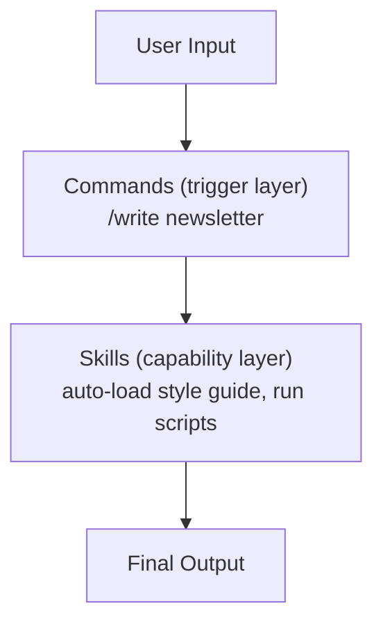

# Chapter 5: Skills — Give Claude a Domain-Specific Capability Pack

## 1. Preface

With Commands, you can collapse a recurring prompt into a single command.

But there's a deeper problem: **Commands are one-shot triggers — no memory, no accumulated knowledge.** Every new project or scenario means teaching Claude from scratch again.

**Skills break through that boundary:**

| Aspect             | Commands              | Skills                       |
| ------------------ | --------------------- | ---------------------------- |
| Position           | Trigger (button)      | Capability pack (app)        |
| Knowledge capacity | Hundreds to a few thousand chars | Up to tens of thousands |
| Trigger            | Must type `/command` | Auto-detection + explicit call |
| Script integration | Limited               | Supports Python/JS scripts   |
| Maintainability    | Simple and direct     | Modular, layered             |

> Analogy: Commands are shortcuts, Skills are apps on your phone — install one and Claude instantly becomes an expert in that domain.

---

## 2. Skills Core Concepts

### 2.1 What Skills Are

Skills are Claude Code's **"capability apps"** — packaging domain knowledge, rules, and tools into reusable modules.

**Without Skills:**

```
You: write me a newsletter article
Claude: Sure — what style? How long? Any specific requirements?

...next conversation...

You: write me another one
Claude: Sure — what style? (starting from zero again)
```

**With Skills:**

```
You: write me a newsletter article
Claude: [auto-loads the newsletter writing Skill — reads style guide, headline formulas]
        Based on your writing standards, here you go...
```

Why Skills matter:

| Scenario           | Effect                                          |
| ------------------ | ----------------------------------------------- |
| Domain expertise   | Loads domain knowledge — instantly specialized  |
| Team collaboration | Configure once, everyone shares the same standard |
| Knowledge buildup  | Centrally managed, version-controlled           |
| Quality consistency | Standardized flow, stable outputs              |

### 2.2 Skills vs Commands

**One-liner:** Commands are the "entry point," Skills are the "capability" — they usually work together.

| Dimension        | Commands (slash commands) | Skills (capability packs)   |
| ---------------- | ------------------------- | --------------------------- |
| File structure   | Single `.md` file         | Multi-file directory        |
| Trigger          | Must type `/name`         | Keyword auto-detection      |
| State management | Stateless                 | Can maintain config/state   |
| Tool integration | Inline in the `.md`       | Can call external scripts   |
| Best for         | Single task               | Complex workflows           |

**How they cooperate:**



Best practice:

- Simple task → use a Command directly.
- Complex workflow → Command as the entry point + Skill providing the capability.

### 2.3 Progressive Disclosure

Skills use a **load-on-demand** design: only surface complex functionality when the user actually needs it, avoiding wasted context.

| Layer            | Content                                       | When loaded        | Footprint              |
| ---------------- | --------------------------------------------- | ------------------ | ---------------------- |
| Layer 1: metadata | YAML frontmatter `name` and `description`    | Always resident    | Tiny (<100 bytes)      |
| Layer 2: instructions | SKILL.md Markdown body                    | When Skill activates | Loaded on demand    |
| Layer 3: resources | `scripts/`, `templates/`, `config/`         | Only when called   | Released after use     |

> That's why dozens of installed Skills don't slow Claude down — metadata is tiny and details load only when needed.

---

## 3. Prerequisites

### 3.1 Account Requirements

| Account type        | Skills supported | Notes                                 |
| ------------------- | ---------------- | ------------------------------------- |
| Claude Pro          | Yes              | Recommended, full features            |
| Claude Teams        | Yes              | Recommended for enterprise            |
| Claude Enterprise   | Yes              | Strongest enterprise feature set      |
| Free tier           | No               | Not supported                         |

### 3.2 Environment

**Required tools:**

- **Claude Desktop** (web or desktop)

  - Download: https://www.anthropic.com/claude-desktop
  - Minimum: 2.0+ (latest recommended)

- **Claude Code CLI** (for local development)

  ```bash
  # Verify install
  claude --version

  # If missing, reinstall per Chapter 1
  ```

- **Python 3.8+** (if you'll use scripts)

  ```bash
  python --version
  ```

---

## 4. Official Skills Quick Reference

Core Skill packs published by Anthropic:

> **Official resources:**
>
> - [Anthropic official Claude Plugins repo](https://github.com/anthropics/claude-plugins-official)
> - [SkillsMP — Skills marketplace](https://skillsmp.com)
> - [ComposioHQ — Awesome Claude Skills](https://github.com/ComposioHQ/awesome-claude-skills)
> - [sickn33 — Antigravity Awesome Skills](https://github.com/sickn33/antigravity-awesome-skills)

| Skill pack              | Function          | Core capabilities                                            | Best for                                  |
| ----------------------- | ----------------- | ------------------------------------------------------------ | ----------------------------------------- |
| **document-skills**     | Document processing | Parse Excel/Word/PPT/PDF, extract data, generate reports    | Data analysis, report automation, extraction |
| **example-skills**      | Skill dev examples | Skill creation templates, MCP build examples                | Learning to build custom Skills            |
| **planning-with-files** | File planning     | Project documentation, task breakdowns, Gantt charts         | Project management, planning              |
| **frontend-design**     | Frontend design   | UI/UX guidance, code generation, component recommendations   | Frontend dev, designs-to-code             |

**Recommended install order:**

1. Install `example-skills` first to learn Skill development.
2. Add `document-skills` for the most common task — document processing.
3. Pick the rest based on your scenario.

---

## 5. Installing Skills

### 5.1 Installing Official / Third-party Skills

**Method 1: web/desktop install (easiest)**

```
1. Open Claude on the web or desktop.
2. Settings → Features → Skills.
3. Toggle on the official Skills you want.
4. Or click "Upload Skill" and pick a .skill file for third-party Skills.
```

**Method 2: Claude Code CLI install (recommended for developers)**

Step 1: add the official Skill marketplace, or search [SkillsMP](https://skillsmp.com) for what you need and install it.

```bash
/plugin marketplace add anthropics/skills
```


Or install through the marketplace interface:


Step 2: install official packs (multiple allowed)

```bash
# Document handling (Excel, Word, PPT, PDF...)
/plugin install document-skills@anthropic-agent-skills

# Example Skills (great learning material for custom Skill development)
/plugin install example-skills@anthropic-agent-skills
```


| Option                                                       | Plain meaning                                                                  | Best for                                                  |
| ------------------------------------------------------------ | ------------------------------------------------------------------------------ | --------------------------------------------------------- |
| Install for you (user scope)                                 | **User scope** — the plugin works for your account across all repos/projects   | Personal use; want this in every project                  |
| Install for all collaborators on this repository (project scope) | **Project scope** — the plugin applies to this repo only; visible to all collaborators | Team collaboration; test a Skill only in a specific repo |
| Install for you, in this repo only (local scope)             | **Local repo scope** — applies only to you, only in this repo                  | Testing in one project without affecting others or the team |
| Back to plugin list                                          | Cancel and return to the plugin list                                           | Decided not to install                                    |

Or, in a repo where the marketplace is already added, use `/plugin Discover` and pick the Skills you want:


Step 3: restart Claude Code to activate

```bash
# Quit and relaunch
claude
```

**Method 3: manual install (advanced)**

Place the Skill folder in either location and Claude will pick it up automatically:

Officially installed ones live under `plugins/marketplaces/<official>/skills`.

```bash
# Personal (all projects)
~/.claude/skills/your-skill-name/

# Project-only
/path/to/project/.claude/skills/your-skill-name/
```

### 5.2 Manual Install — Hands-on

```bash
# Create a plugin directory (under your home for easy lookup)
mkdir -p ~/claude-plugins/connect-apps-plugin
cd ~/claude-plugins/connect-apps-plugin

# Clone a Skill repo (install Git first if needed)
git clone https://github.com/ComposioHQ/awesome-claude-skills.git .

# Windows CMD — copy into .claude\skills\
xcopy "%USERPROFILE%\claude-plugins\connect-apps-plugin" "%USERPROFILE%\.claude\skills\" /E /H /Y

# Verify install
claude
/skills
```


**PowerShell:**

```powershell
# 1. Ensure the target directory exists
New-Item -Path "~\.claude\skills" -ItemType Directory -Force

# 2. Copy all files/subfolders from the source to the target (note the trailing \*)
Copy-Item -Path "~\claude-plugins\connect-apps-plugin\*" -Destination "~\.claude\skills" -Recurse -Force
```


### 5.3 Custom Skill Development (Local Install)

Once you've created a custom Skill, install it like this:

**Drop it into the standard directory**

```bash
# macOS / Linux
mkdir -p ~/.claude/skills/my-skill
cp -r ./my-skill/* ~/.claude/skills/my-skill/

# Windows PowerShell
New-Item -ItemType Directory -Path "$env:USERPROFILE\.claude\skills\my-skill" -Force
Copy-Item -Recurse ".\my-skill\*" "$env:USERPROFILE\.claude\skills\my-skill\" -Force
```

---

## 6. Build Your First Custom Skill

### 6.1 Directory Layout

Each Skill is its own directory under `.claude/skills/`:

```
.claude/skills/[skill-name]/
├── SKILL.md          # [required] core definition (YAML metadata + Markdown instructions)
├── scripts/          # [optional] helper scripts (Python/JS)
├── templates/        # [optional] output templates
├── config/           # [optional] config files
└── data/             # [optional] static data
```

| File/dir     | Required | Purpose                                  |
| ------------ | -------- | ---------------------------------------- |
| `SKILL.md`   | Yes      | The Skill's ID card and manual           |
| `scripts/`   | No       | Executable automation scripts            |
| `templates/` | No       | Output format templates                  |
| `config/`    | No       | Runtime configuration parameters         |

> **Naming convention:** directory names only allow lowercase letters, digits, and hyphens (`-`) — no spaces or underscores.

### 6.2 SKILL.md Fields

`SKILL.md` has two parts: **YAML frontmatter** (machine-read) plus **Markdown body** (AI-read).

**YAML frontmatter fields** (only 2 are required):

| Field         | Type   | Required | Description                                              |
| ------------- | ------ | -------- | -------------------------------------------------------- |
| `name`        | string | Yes      | Skill name, must match the directory name                |
| `description` | string | Yes      | Trigger scenario description — Claude uses this for auto-activation |
| `version`     | string | No       | Version (e.g., `1.0.0`)                                  |
| `author`      | string | No       | Author name                                              |

**Minimal example:**

```markdown
---
name: code-commenter
description: Activate when the user says "add comments", "code comments", or "comment this code"
---

# Code Comment Generator

## Role
You are a code review expert skilled at writing clear comments.

## Commenting Principles
- Explain "why" not "what"
- Keep it concise
- Keep technical terms (API, JWT, etc.)
```

**`description` comparison:**

| Style                                                        | Effect                                  |
| ------------------------------------------------------------ | --------------------------------------- |
| ✅ `Activate when the user says "add comments" or "comment this code"` | Clear trigger words, accurate auto-activation |
| ❌ `Code commenting tool`                                     | Too vague — auto-activation unreliable  |

**Recommended Markdown body structure:**

```markdown
# Skill Name

## 1. Role
[The role the AI plays and its background]

## 2. Core Capabilities
[List 3-5 core capabilities]

## 3. Workflow
### Step 1: [Name]
[Detailed description]

## 4. Rules
[Rules that must be followed]

## 5. Output Format
[Output structure definition]
```

### 6.3 Hands-on: a Code Comment Skill in 5 Minutes

**Step 1: create the directory**

```bash
# macOS / Linux
mkdir -p .claude/skills/code-commenter

# Windows PowerShell
New-Item -ItemType Directory -Path ".claude\skills\code-commenter" -Force
```

**Step 2: create SKILL.md**

Create `.claude/skills/code-commenter/SKILL.md`:

````markdown
---
name: code-commenter
description: When the user asks to "add comments", "comment this code", or "comment the code", automatically add clear comments to the code.
---

# Code Comment Generator

## Role
You are an experienced code reviewer, skilled at writing clear, accurate, and high-value comments.

## When to Activate
Activate this Skill when the user says any of:
- "Help me add comments"
- "Add comments to this code"
- "Comment this code"

## Commenting Principles

### 1. Explain "why" not "what"
```python
# Bad: loops through the list
for item in items:
    process(item)

# Good: filter out expired orders to prevent duplicate shipping
for item in items:
    process(item)
```
````


### 2. Comment format

- **Functions/methods:** state purpose, parameters, return value
- **Complex logic:** explain the business context
- **Magic numbers:** explain the meaning (e.g., 86400 = 24 hours)

### 3. Language

- Use concise wording
- Keep technical terms (API, JWT, JSON)

### 6.4 Test the Skill

**Step 1: launch Claude Code**

```bash
claude
```

**Step 2: trigger it**

In the conversation, type:

```
Add comments to this code

def calculate_discount(price, user_level):
    if user_level == "vip":
        return price * 0.8
    elif user_level == "svip":
        return price * 0.7
    else:
        return price
```

**Step 3: verify the expected response**

Claude should auto-activate `code-commenter` and return code with detailed comments:

```python
def calculate_discount(price, user_level):
    """
    Calculate the discounted price based on user level.

    Args:
        price: original price
        user_level: user tier (vip / svip / regular)

    Returns:
        Discounted price
    """
    # VIP users get a 20% discount
    if user_level == "vip":
        return price * 0.8
    # SVIP users get a 30% discount
    elif user_level == "svip":
        return price * 0.7
    # Regular users get no discount
    else:
        return price
```


**🎯 Hot reloading**

After you edit `SKILL.md`, **no need to restart Claude Code** — the changes apply on the next message!

Try it:

1. Edit `.claude/skills/code-commenter/SKILL.md` — change the commenting rules.
2. Go back to Claude Code and continue the conversation (no restart).
3. See the new rules take effect immediately.

---

## 7. Using Skills

### 7.1 Auto-activation vs Manual Trigger

**Auto-activation (recommended):**

Claude detects trigger keywords in your input and activates the matching Skill:

```
You: add comments to this code
Claude: [auto-detected "add comments" → activating code-commenter Skill]
```

The key is to write a good `description` field with explicit trigger words:

```yaml
---
name: code-commenter
description: Activate when the user asks to "add comments", "comment the code", or "comment this code"
---
```

**Manual trigger:**

The user explicitly declares the Skill at the start:

```
I need the code-commenter Skill. Add comments to this code:
def calculate():
    ...
```

### 7.2 Skill Interaction Patterns

| Pattern            | Use case                                | Example                                          |
| ------------------ | --------------------------------------- | ------------------------------------------------ |
| **Single trigger** | One sentence activates, continue chatting | "Add comments" → paste code → applied automatically |
| **Chained calls**  | Multiple Skills cooperate               | title-generator first → then content-writer      |
| **Repeat iterations** | Same Skill used multiple times       | Generate titles → user feedback → regenerate     |

### 7.3 Pairing with Commands

**Best practice:** Command as entry point, Skill provides the capability.

```
Command layer: /write "Title"
       │
       ▼
Skill layer: auto-load title-generator and content-writer
       │
       ▼
Output: complete article
```

Calling a Skill from a Command's `.md`:

```markdown
# /write command

Write a newsletter article on {topic}.

> Uses Skills: title-generator + newsletter-writer
```

---

## 8. Advanced Usage

### 8.1 Prompt Organization Tips

This section: best practices for organizing prompts inside SKILL.md.

> **Major change in 2.10+:** all prompt content goes in SKILL.md's Markdown body — no separate `prompts/` folder needed.

#### 8.1.1 How to Organize Prompts

Organize **by function as sections**, keeping a clear hierarchy:

```markdown
# [Skill Name]

## 1. Role
[Who the AI is]

## 2. Core Capabilities
[3-5 capabilities]

## 3. Workflow
### Step 1: ...
### Step 2: ...

## 4. Rules
[Must-follow rules]

## 5. Examples
[Good vs bad examples]

## 6. Output Format
[Output structure]
```

#### 8.1.2 Section Naming Conventions

| Pattern         | Example                              | Description                |
| --------------- | ------------------------------------ | -------------------------- |
| `## 1. xxx`     | `## 1. Role`                         | Major sections             |
| `## {feature} Spec` | `## Title Generation Spec`       | Feature description        |
| `### {sub}`     | `### Formula 1: Tool Recommendation` | Sub-feature detail         |

**Best practice:** stay within 3 levels and use clear titles.

#### 8.1.3 Prompt Structure Template

```markdown
---
name: skill-name
description: Activate when the user [specific scenario]
version: 1.0.0
---

# Skill Name

## 1. Role
You are a [professional background] expert...

## 2. Core Capabilities
1. [Capability 1]
2. [Capability 2]
3. [Capability 3]

## 3. Workflow
### Step 1: [Analyze / Prepare]
### Step 2: [Execute]
### Step 3: [Verify]

## 4. Rules
- Must-follow rule 1
- Must-follow rule 2

## 5. Examples
✅ **Good example**
❌ **Bad example**
```

#### 8.1.4 Prompt Versioning

Track version history at the top of SKILL.md:

```markdown
---
name: my-skill
version: 2.0.0
---

## Version History
### V2.0.0 (2025-01)
- Added: XXX
- Improved: YYY

### V1.0.0 (2024-12)
- Initial release
```

#### 8.1.5 Prompt Optimization Tips

**1. Use code blocks to highlight formulas**

```markdown
### Title Formula
[Brand] + [Number] + [Recommendation phrase]
```

**2. Use tables to compare versions**

| Version | Improvements      |
| ------- | ----------------- |
| V1.0    | Basic features    |
| V2.0    | Added XXX         |

**3. Use strong directives instead of suggestions**

- ❌ "It's suggested to keep it concise"
- ✅ "Must keep it concise"

### 8.2 Python Script Integration

**When do you need a script?**

| Task type        | Native Claude   | With scripts          |
| ---------------- | --------------- | --------------------- |
| Text analysis    | Fuzzy judgment  | Precise NLP analysis  |
| Numeric calculation | May err      | 100% accurate         |
| File batch ops   | Inefficient     | Efficient bulk processing |
| Complex validation | Hard to be consistent | Deterministic checks |

**Standard script template** (drop into `scripts/`):

```python
#!/usr/bin/env python3
# -*- coding: utf-8 -*-
"""Brief description of the script's purpose"""
import sys
import json

def process(input_data: str) -> dict:
    """Core processing logic"""
    # Implement specific functionality here
    return {
        "success": True,
        "data": {"result": input_data},
        "message": "Processed successfully"
    }

if __name__ == "__main__":
    if len(sys.argv) < 2:
        print(json.dumps({"success": False, "message": "Missing arguments"}))
        sys.exit(1)

    result = process(sys.argv[1])
    print(json.dumps(result, ensure_ascii=False, indent=2))
    sys.exit(0 if result["success"] else 1)
```

**Calling the script from SKILL.md:**

```markdown
## Tool Calls
- Quality check: `python scripts/quality_detector.py "article content" --json`
- Title generation: `python scripts/title_generator.py "topic keyword"`
```

**Passing arguments — cheat sheet:**

| Method       | Best for       | Example                                |
| ------------ | -------------- | -------------------------------------- |
| CLI argument | Simple args    | `python script.py "topic"`             |
| stdin        | Large text     | `echo "content" \| python script.py`   |
| File         | Complex data   | `python script.py --input file.json`   |

### 8.3 Multi-step Workflows

Describe complete workflows in SKILL.md's Markdown body using natural language:

```markdown
## Workflow

### Step 1: Topic Filter
Check three dimensions: timeliness, viral potential, worth writing
- Not worth writing → give a suggestion and stop
- Worth writing → continue

### Step 2: Information Gathering (as needed)
If the topic needs current data:
- WebSearch for "topic latest 2025"
- Organize key data and viewpoints

### Step 3: Write the Article
Apply writing-style standards; keep word count 1500-2000

### Step 4: Quality Check
Call `scripts/quality_detector.py` to check AI-tone and naturalness
- Pass → save the article
- Fail → revise per suggestions and re-check
```

> Commands can be the workflow entry point and the Skill provides the underlying capability: `/write topic` → triggers Command → Command calls the newsletter writing Skill.

---

## 9. Troubleshooting

| Symptom                          | Cause                                | Fix                                                                  |
| -------------------------------- | ------------------------------------ | -------------------------------------------------------------------- |
| Skill doesn't auto-activate      | `description` is vague               | Spell out trigger keywords, e.g. "when the user mentions" or "when the user asks" |
| AI responses don't match the spec | Markdown body instructions too soft | Use strong directives like `must`, `forbidden` instead of `suggested` |
| Official Skill install fails     | Network issue or insufficient account permissions | Check network, confirm a paid account, try restarting Claude Code |
| Script execution fails           | Python path or permission issue      | Verify with `python --version`; add `chmod +x` on macOS/Linux        |
| YAML parse error                 | Missing space after colon or `---`   | Check format: `name: skill-name`, space after colon                  |
| File path issue                  | Directory name doesn't match `name`  | Make sure the directory name matches the YAML `name` exactly         |

**Quick YAML validation:**

```bash
# Validate the YAML portion of SKILL.md with Python
python3 -c "
import yaml
with open('.claude/skills/your-skill/SKILL.md', 'r', encoding='utf-8') as f:
    content = f.read()
# Extract the YAML wrapped by ---
parts = content.split('---')
yaml.safe_load(parts[1])
print('YAML format OK')
"
```
