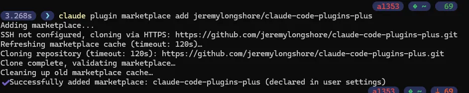
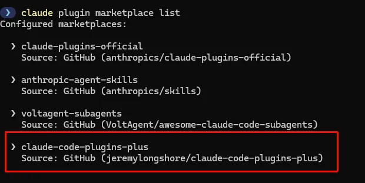
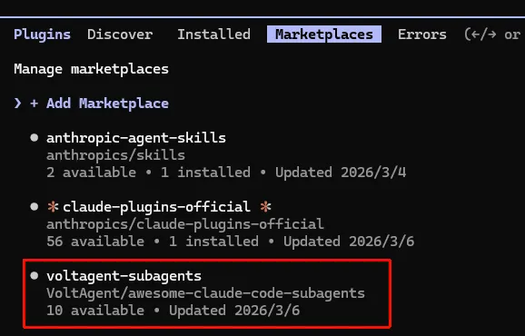
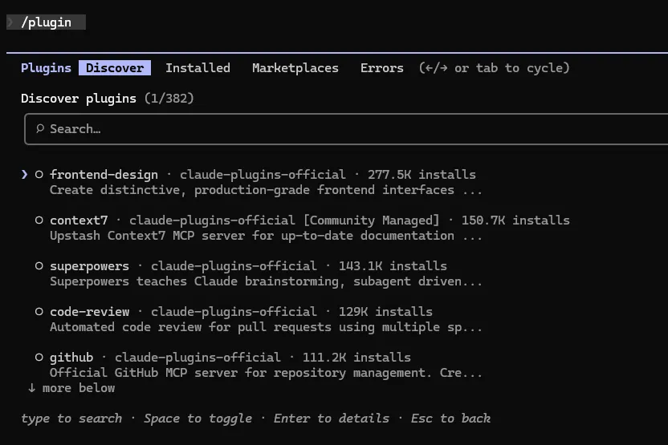
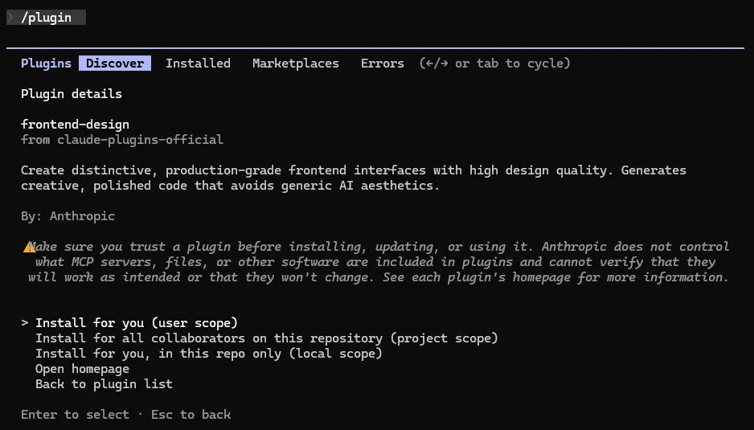
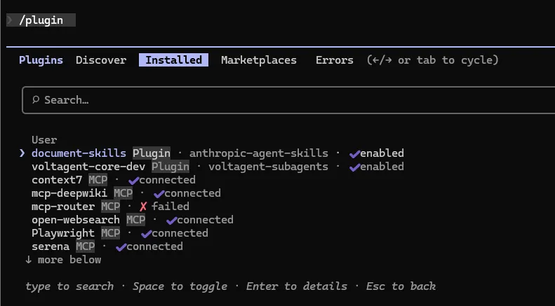
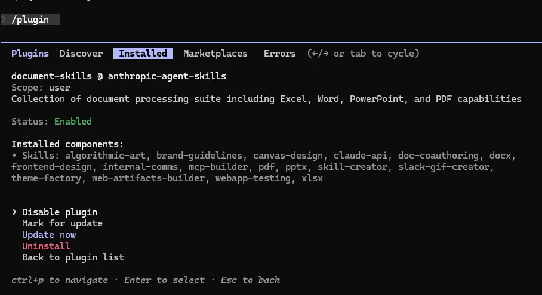
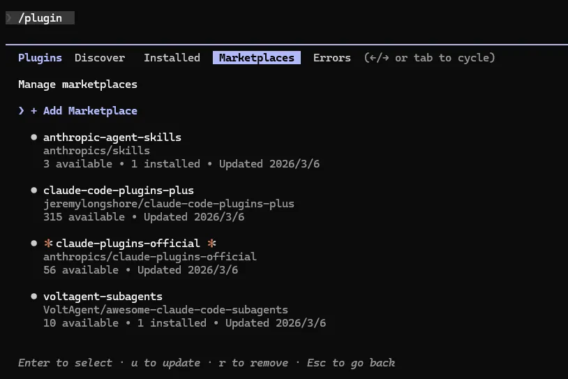
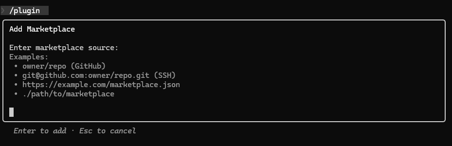

# Chapter 6: The Plugin Playbook — One-Click Install, and Build Your Own

## 1. Preface

With Skills, you can already give Claude all kinds of capability packs.

But have you noticed: **all those Commands + Skills + Hooks you carefully built — do you have to redo them in every new project? Want to share with the team? Copy and paste manually?**

**Plugins are the ultimate answer:**

| Pain point                    | How Plugins solve it                                  | Analogy             |
| ----------------------------- | ----------------------------------------------------- | ------------------- |
| Configs aren't portable       | One Plugin packages everything; install with one click | Phone backup/restore |
| Sharing means manual copying  | Search the Marketplace and install                    | App Store           |
| Updates are entirely on you   | Auto-update — when the author ships a release, you get it | App auto-update  |
| Hard to find good tools       | 200+ community Plugins to pick from                   | Leaderboard         |

In a sentence: **a Plugin is a shareable, installable, auto-updating bundle of Commands + Skills + Hooks + MCP.**

---

## 2. Plugin Core Concepts

### 2.1 What a Plugin Is

A Plugin is a Claude Code **extension pack** — Commands, Skills, Hooks, and MCP configs bundled into a single installable, shareable, auto-updatable unit.

**Analogy:**

| Phone                       | Claude Code         |
| --------------------------- | ------------------- |
| Operating system (iOS/Android) | Claude Code core |
| App Store                   | Plugin Marketplace  |
| Installed apps              | Installed Plugins   |
| App auto-update             | Plugin auto-update  |

**Core value:**

| Value             | Details                                        |
| ----------------- | ---------------------------------------------- |
| Reusable          | Build once, use across many projects           |
| Shareable         | One-click install via Marketplace, no copying  |
| Modular           | Each Plugin focuses on one domain — no overlap |
| Community-driven  | 200+ community Plugins, ready to go            |

### 2.2 Plugin vs Commands / Skills / MCP

A common question: "I already have Commands and Skills — why do I need Plugins?"

One table makes it clear:

| Dimension       | Commands           | Skills            | MCP            | **Plugins**          |
| --------------- | ------------------ | ----------------- | -------------- | -------------------- |
| Definition      | Markdown prompt    | Pro-grade Agent capability | External service integration | **Bundled extension** |
| Location        | `.claude/commands/` | `.claude/skills/` | `.mcp.json`    | `.claude/plugins/`   |
| Shareable       | No, manual copy    | No, manual copy   | Partial, needs config | Yes, one-click install |
| Auto-update     | No                 | No                | Partial         | Yes                 |
| Contains        | Single prompt      | Multiple files + config | Server config | **Everything above** |
| Use cases       | Simple repeating tasks | Complex domain tasks | External API calls | **All scenarios**  |

> **Key distinction:** Plugin is a **"superset"** concept — `Plugin = Commands + Skills + Hooks + MCP config + docs`, bundled into one installable, shareable unit.

**Decision guide — when to use what:**

- **Commands** — simple repeating tasks within a project (e.g., `/format-code`). If it's enough, don't reach for a Plugin.
- **Skills** — complex domain tasks within a project (e.g., code comment generation) — capabilities you want to accumulate and reuse.
- **MCP** — calling external services (e.g., GitHub API, databases) — solves the connection problem.
- **Plugins** — **any functionality you want to share with the team or community** — the best choice for packaged distribution.

### 2.3 Ecosystem Snapshot

**Three main marketplaces:**

| Platform                       | URL                                                 | Characteristics              |
| ------------------------------ | --------------------------------------------------- | ---------------------------- |
| Anthropic official Marketplace | code.claude.com/plugins                             | Strictly reviewed; quality   |
| Jeremy Longshore community     | github.com/jeremylongshore/claude-code-plugins-plus | 200+ Plugins, kept updated   |
| Composio Integration           | composio.dev                                        | Integrates 2000+ external tools |

**Popular Plugin categories:**

| Category        | Typical Plugin     | Use                                  | Source           | Popularity |
| --------------- | ------------------ | ------------------------------------ | ---------------- | ---------- |
| Documents       | document-skills    | Full PDF/PPTX/XLSX document handling | Anthropic official | ⭐⭐⭐⭐⭐    |
| Examples        | example-skills     | Official Skill development samples   | Anthropic official | ⭐⭐⭐      |
| Code quality    | code-review-expert | Automated code review                | Community        | ⭐⭐⭐⭐     |
| Project mgmt    | task-master-ai     | Task breakdown and tracking          | Community        | ⭐⭐⭐⭐     |
| API integration | connect-apps       | Gmail / Slack / GitHub integrations  | Community        | ⭐⭐⭐⭐⭐    |
| Data analysis  | data-viz-pro       | Data visualization                   | Community        | ⭐⭐⭐      |

> **Note:** `document-skills` is Anthropic's official document-processing suite (from the `anthropics/skills` source). After installing it you get `document-skills:pdf`, `document-skills:pptx`, `document-skills:xlsx`, etc. — one install, all available.

---

## 3. Install Your First Plugin in 5 Minutes

### 3.1 Prerequisites

```bash
# 1. Confirm Claude Code version (need v2.1+)
claude --version

# 2. Confirm you're in a project directory
cd /path/to/your/project
```

> Plugin support shipped with Claude Code v2.1 on October 9, 2025. Upgrade first if your version is older.

### 3.2 Browse the Marketplace

**Method 1: in-conversation `/plugin` command (most convenient)**

In a Claude Code conversation, type:

```bash
/plugin
```

This opens the Plugin management UI; switch to the `Marketplace` tab to browse all available Plugins.

**Method 2: CLI**

```bash
# Add a community Marketplace source (first-time use needs this)
claude plugin marketplace add anthropics/skills

# List added Marketplace sources
claude plugin marketplace list
```

After adding, you can browse and install Plugins from that source.





**Hands-on: add a Marketplace source and install a Plugin**

Using the VoltAgent Subagent collection as an example:

```bash
# 1. Add the Marketplace source
claude plugin marketplace add VoltAgent/awesome-claude-code-subagents
# 2. Install the Plugin you want from that source
claude plugin install <plugin-name>
```

Or type `/plugin` in conversation and switch to the `Installed` view to install from the UI.





> **Network issues?** If install times out or downloads fail, check your proxy:
>
> ```powershell
> # Windows PowerShell (adjust port to your proxy)
> $env:HTTP_PROXY = "http://127.0.0.1:7897"
> $env:HTTPS_PROXY = "http://127.0.0.1:7897"
> # macOS / Linux
> export HTTP_PROXY="http://127.0.0.1:7897"
> export HTTPS_PROXY="http://127.0.0.1:7897"
> ```

**Method 3: web browser**

Visit the official Marketplace page directly: `https://code.claude.com/plugins`

---

## 4. End-to-End Plugin Management

Type `/plugin` in the conversation to open the graphical management UI. Four tabs at the top cover every management scenario:

| Tab              | Function                              |
| ---------------- | ------------------------------------- |
| **Discover**     | Browse and install Plugins (default)  |
| **Installed**    | View and manage installed Plugins     |
| **Marketplaces** | Manage Plugin sources                 |
| **Errors**       | Diagnose load errors                  |

> **Navigation:** `↑↓` to move, `Space` to install/toggle, `Enter` to view details, `ESC` to go back.

### 4.1 Installing Plugins (Discover tab)

Open `/plugin` to land on **Discover**, which lists every available Plugin from your added Marketplace sources:



**Install steps:**

1. Use `↑↓` to highlight the Plugin you want.
2. Press **Enter** to see details (or **Space** for quick install).
3. On the details page, pick the **install scope** and confirm.



**Install scopes:**

| Scope                                                        | Description                                       | Best for                                          |
| ------------------------------------------------------------ | ------------------------------------------------- | ------------------------------------------------- |
| Install for you (user scope)                                 | Personal — available in all your projects         | General-purpose tools (recommended)               |
| Install for all collaborators on this repository (project scope) | Project — shared across the whole repo's collaborators | Team projects                                |
| Install for you, in this repo only (local scope)             | Local repo — just you, just this project          | Local testing without affecting others            |

**Three install sources:**

| Source                      | How                                                |
| --------------------------- | -------------------------------------------------- |
| Marketplace Plugin (recommended) | Pick from the Discover tab                    |
| GitHub URL                  | Enter a GitHub repo URL at the top of Discover     |
| Local directory             | Enter a local path at the top of Discover (dev/test) |

> **Can't find the Plugin?** Go to **Marketplaces** to add the source first, then come back to Discover and refresh.

### 4.2 Managing Installed Plugins (Installed tab)

Switch to **Installed** to see everything currently enabled:



The list shows both Plugin-installed extensions and MCP connections, each with name, version, and status.

**Update / disable / uninstall:**

Select a Plugin and press **Enter** to see details. Available actions:

| Action     | Effect                                                       |
| ---------- | ------------------------------------------------------------ |
| Update     | Upgrade to the latest version (shown when one is available)  |
| Disable    | Temporarily off; files retained; re-enable any time          |
| Uninstall  | Completely remove the Plugin and its files                   |

> **Auto-update:** Claude Code checks every Plugin for updates on launch — no manual trigger needed.



### 4.3 Managing Marketplace Sources (Marketplaces tab)

Switch to **Marketplaces** to manage Plugin sources:



The page lists every added Marketplace source with available / installed Plugin counts and last-update timestamps.

**Add a new Marketplace source:**

1. In Marketplaces, choose "Add source."
2. Enter the source address (format: `username/repo`).
3. After confirming, Discover automatically syncs new Plugins from that source.



**Recommended Marketplace sources:**

| Source                                     | Content                                            | Recommendation |
| ------------------------------------------ | -------------------------------------------------- | -------------- |
| `anthropics/skills`                        | Official Skills suite (with full document-skills)  | ⭐⭐⭐⭐⭐          |
| `anthropics/claude-plugins-official`       | Anthropic official Plugins                         | ⭐⭐⭐⭐           |
| `VoltAgent/awesome-claude-code-subagents`  | 100+ expert Subagents (see Chapter 4)              | ⭐⭐⭐⭐           |
| `jeremylongshore/claude-code-plugins-plus` | 200+ community Plugins, kept updated               | ⭐⭐⭐            |

**Sample Marketplace details** (`anthropics/skills`):

```
anthropic-agent-skills (anthropics/skills)
3 available · 1 installed · Updated 2026/3/6

  ✅ document-skills (installed)
     Collection of document processing suite including Excel...
  ○  example-skills
     Collection of example skills demonstrating various capabi...
```

> **Install first:** `document-skills` — Anthropic's official document-handling suite. After install you automatically get the pdf, pptx, xlsx, etc. Skills — every format covered in one install.

---

## 5. Build a Custom Plugin

### 5.1 Plugin Structure

A Plugin is a directory with a `.claude-plugin/plugin.json` manifest plus the capabilities you want to bundle.

**Minimal structure (single Skill):**

```
my-plugin/
├── .claude-plugin/
│   └── plugin.json      # required: Plugin manifest
└── skills/
    └── my-skill/
        └── SKILL.md
```

**Full structure (everything):**

```
my-plugin/
├── .claude-plugin/
│   └── plugin.json      # required: Plugin manifest (only this lives in .claude-plugin/)
├── README.md            # recommended: usage docs
├── LICENSE              # recommended: license
├── skills/              # optional: Agent Skills
│   └── my-skill/
│       └── SKILL.md
├── commands/            # optional: Slash Commands
│   └── my-command.md
├── agents/              # optional: custom Agent definitions
├── hooks/               # optional: event hooks
│   └── hooks.json
├── .mcp.json            # optional: MCP service config
└── settings.json        # optional: default settings applied when Plugin is enabled
```

> ⚠️ **Common mistake:** `commands/`, `skills/`, `agents/`, `hooks/` all go in the **plugin root**, not inside `.claude-plugin/`. Only `plugin.json` lives in `.claude-plugin/`.

Directory roles at a glance:

| Directory/File               | Role                                              |
| ---------------------------- | ------------------------------------------------- |
| `.claude-plugin/plugin.json` | Plugin manifest — defines name/version/author     |
| `skills/`                    | Agent Skills (subdirectories containing SKILL.md) |
| `commands/`                  | Slash commands (Markdown files)                   |
| `agents/`                    | Custom Agent definitions                          |
| `hooks/`                     | Event handlers (hooks.json)                       |
| `.mcp.json`                  | MCP service configuration                         |
| `settings.json`              | Default settings applied when Plugin is enabled   |

### 5.2 plugin.json

`plugin.json` lives in the `.claude-plugin/` directory — it's the Plugin's ID card.

**Full example:**

```json
{
  "name": "my-awesome-plugin",
  "description": "One-line summary of what this Plugin does",
  "version": "1.0.0",
  "author": {
    "name": "Your Name"
  },
  "license": "MIT",
  "homepage": "https://github.com/yourname/my-plugin",
  "repository": "https://github.com/yourname/my-plugin"
}
```

**Field reference:**

| Field         | Required | Description                                              |
| ------------- | -------- | -------------------------------------------------------- |
| `name`        | Yes      | Unique Plugin identifier; also the namespace prefix for Skills |
| `description` | Yes      | Function description; used in Marketplace search/display |
| `version`     | Yes      | Semver (`major.minor.patch`, e.g., `1.0.0`)              |
| `author`      | Recommended | Author info (`name` / `email` / `url`)                 |
| `license`     | Recommended | License (`MIT` or `Apache-2.0` recommended)           |
| `homepage`    | Optional | Project homepage or docs URL                             |
| `repository`  | Optional | Source repository URL                                    |

> **Critical:** the `name` field determines the Skill's invocation prefix. If your Plugin is named `my-plugin`, the `hello` Skill inside is triggered as `/my-plugin:hello`. This namespacing prevents Skill name conflicts across Plugins.

### 5.3 Hands-on: Hello World Plugin

Create and test your first Plugin in 5 minutes:

**Step 1: create the directory structure**

```bash
mkdir -p hello-plugin/.claude-plugin
mkdir -p hello-plugin/skills/hello
```

**Step 2: create the manifest `.claude-plugin/plugin.json`**

```json
{
  "name": "hello-plugin",
  "description": "A simple greeting example Plugin",
  "version": "1.0.0",
  "author": {
    "name": "Your Name"
  },
  "license": "MIT"
}
```

**Step 3: create the Skill at `skills/hello/SKILL.md`**

```markdown
---
description: Greet the user with a friendly message
---

Greet the user in a warm, friendly way.

Steps:
1. Get the current system time.
2. Adjust the greeting based on the time of day (morning / afternoon / evening).
3. Reply in a relaxed, cheerful tone.

Sample output:
"Good morning! It's 10:23 — fresh day. What can I help with?"
```

**Step 4: local test**

No install needed — load with the `--plugin-dir` flag:

```bash
# Load the plugin and launch Claude Code
claude --plugin-dir ./hello-plugin

# After launch, type in conversation (note the namespace format)
> /hello-plugin:hello
```

If you see the greeting output, your first Plugin works!

> `--plugin-dir` is a development flag. After editing a Skill, restart Claude Code and you're good — no install needed. To test multiple Plugins at once, pass it more than once: `claude --plugin-dir ./plugin-a --plugin-dir ./plugin-b`.

**Step 5: a Skill with arguments**

The `$ARGUMENTS` placeholder captures the user input, letting the Skill respond dynamically:

```markdown
---
description: Greet the user with a personalized message
---

Greet a user named "$ARGUMENTS" warmly, making the greeting personal.
```

Restart and test:

```bash
> /hello-plugin:hello alice
# Claude greets using the name you passed
```

### 5.4 Advanced: a Full Plugin with a Skill

Create a code-quality checker that demonstrates the power of Skill + Commands together:

**Project structure:**

```
code-quality-checker/
├── .claude-plugin/
│   └── plugin.json
├── README.md
├── skills/
│   └── code-review/
│       └── SKILL.md
└── commands/
    └── check.md
```

**`.claude-plugin/plugin.json`:**

```json
{
  "name": "code-quality-checker",
  "description": "Automated code quality review with severity-graded recommendations",
  "version": "1.0.0",
  "author": { "name": "Your Name" },
  "license": "MIT"
}
```

**`skills/code-review/SKILL.md`:**

```markdown
---
description: Reviews code for best practices, security issues, and quality problems. Use when reviewing code, checking PRs, or analyzing code quality.
---

# Code Quality Expert

## Role
You are a senior code reviewer, skilled at spotting quality issues and giving concrete improvement suggestions.

## Review Dimensions
1. **Naming** — are variable/function names semantically clear?
2. **Function complexity** — any function too long or too deeply nested?
3. **Duplication** — repeated logic that can be extracted?
4. **Error handling** — are exception boundaries covered?
5. **Security risks** — injection / XSS / etc.?

## Output Format
Sorted by severity:
- 🔴 Critical: must fix
- 🟡 Warning: should fix
- 🟢 Suggestion: nice to improve

Each item: issue description + code location + suggested fix.
```

**`commands/check.md`:**

```markdown
Perform a quality check on the given code.

Argument: $ARGUMENTS (optional — file path to check)

Steps:
1. If a file path was given, check only that file.
2. If none was given, check recently modified files (via `git diff --name-only`).
3. Analyze across the 5 dimensions and output a severity-graded report.
```

**Test:**

```bash
claude --plugin-dir ./code-quality-checker

# Trigger the Skill (auto-detected)
> please review this code's quality

# Explicit command call (note the namespace)
> /code-quality-checker:check src/app.ts
```

> Plugin's "superset" power shows here clearly: **Commands provide the trigger, Skills provide the expertise** — bundled together you get a shareable, complete tool.

### 5.5 Development Best Practices

**1. Iterate as a standalone config first; convert to a Plugin later**

| Stage          | Approach                       | Why                                                |
| -------------- | ------------------------------ | -------------------------------------------------- |
| Experimenting  | Drop in `.claude/skills/`      | Short Skill names (`/hello`), fast iteration       |
| Ready to share | Bundle as a Plugin             | Namespaced Skill (`/my-plugin:hello`), easy to distribute |

**2. Semantic versioning**

```
Version format: major.minor.patch (e.g., 1.2.3)
  - Major (1.x.x): breaking changes, not backward-compatible
  - Minor (x.2.x): new features, backward-compatible
  - Patch (x.x.3): bug fixes
```

**3. README should cover four parts**

| Part          | Content                                                  |
| ------------- | -------------------------------------------------------- |
| What it does  | What problem this Plugin solves                          |
| How to install | Install commands from Marketplace or GitHub             |
| Usage examples | At least one real scenario (with Skill invocation format) |
| Configuration | Any configurable options                                 |

**4. Skill `description` is critical**

The `description` in `SKILL.md`'s frontmatter determines whether Claude can auto-detect the scenario and activate the Skill:

```markdown
# Bad — too vague, auto-activation unreliable
description: Code review tool

# Good — explicit triggers, accurate detection
description: Reviews code for best practices and potential issues. Use when reviewing code, checking PRs, or analyzing code quality.
```

---

## 6. Publishing and Sharing

### 6.1 Pre-publish Checklist

**Must do:**

- ✅ `.claude-plugin/plugin.json` valid; `name`/`description`/`version` filled in.
- ✅ `README.md` covers install and usage (with the `/plugin:skill` invocation format).
- ✅ `LICENSE` file present (MIT recommended).
- ✅ Local test with `claude --plugin-dir .` passes; all Skills and commands work.

**Recommended:**

- ⭐ `CHANGELOG.md` records each version's changes.
- ⭐ Add GitHub Topics (e.g., `claude-code-plugin`) for discoverability.
- ⭐ Note the minimum Claude Code version in the README.

### 6.2 Publish to GitHub

```bash
# 1. Initialize repo
cd my-plugin
git init
git add .
git commit -m "feat: initial release v1.0.0"

# 2. Push to GitHub
git remote add origin https://github.com/yourname/my-plugin.git
git branch -M main
git push -u origin main
```

**Create a Release (so others can install by version):**

1. On the GitHub repo, click **Releases → Draft a new release**.
2. Tag version: `v1.0.0` (must start with `v`).
3. Fill in release notes.
4. Click **Publish release**.

After publishing, others can install directly from the GitHub URL:

```bash
# In /plugin → Discover tab, enter the GitHub URL at the top
# Or via the CLI
claude plugin install https://github.com/yourname/my-plugin
```

> Add a version badge in the README so users see the current version at a glance:
>
> ```markdown
> [Version](https://img.shields.io/github/v/release/yourname/my-plugin)
> ```

### 6.3 Submit to the Official Marketplace

Want every Claude Code user worldwide to discover your Plugin? Use the **in-app submission form** — no forking or PRs, just one form:

| Platform           | Submission URL                       |
| ------------------ | ------------------------------------ |
| Claude.ai          | `claude.ai/settings/plugins/submit`  |
| Anthropic Console  | `platform.claude.com/plugins/submit` |

**Confirm before submitting:**

| Item                          | Requirement                                  |
| ----------------------------- | -------------------------------------------- |
| `.claude-plugin/plugin.json`  | Valid; required fields complete              |
| README                        | Complete install and usage info, with Skill invocation format |
| Code safety                   | No malicious code; dependencies from trusted sources |
| Feature completeness          | `--plugin-dir` test passes end-to-end        |

After submission, wait for Anthropic's review (typically 1–3 business days). Once approved, your Plugin appears in the official Marketplace and any Claude Code user can install it.

---

## 7. Troubleshooting

### 7.1 Install Problems

| Symptom                | Cause                                  | Fix                                                  |
| ---------------------- | -------------------------------------- | ---------------------------------------------------- |
| `Plugin not found`     | Misspelled or Marketplace source not added | Add the source in Marketplaces, then search Discover |
| Download times out     | Network issue                          | Set a proxy or switch the npm mirror                 |
| `/plugin` doesn't exist | Claude Code version too old           | Upgrade to v1.0.33+ (`claude --version` to check)    |

```bash
# Network issues? Try a different npm mirror
npm config set registry https://registry.npmmirror.com

# Need a proxy? (adjust port to your proxy)
export HTTP_PROXY="http://127.0.0.1:7897"
export HTTPS_PROXY="http://127.0.0.1:7897"
```

### 7.2 Runtime Problems

| Symptom                  | Cause                                | Fix                                                  |
| ------------------------ | ------------------------------------ | ---------------------------------------------------- |
| Wrong Skill call format  | Forgot the namespace prefix          | Use `/plugin-name:skill-name` for Plugin Skills      |
| Skill doesn't auto-activate | `description` too vague          | Spell out triggers, e.g., "Use when reviewing code..." |
| Hook script permission error | Script not executable             | `chmod +x hooks/my-hook.sh`                          |
| Config changes don't apply | Didn't restart Claude Code         | Restart after editing Plugin contents                |

### 7.3 Development Debugging

| Symptom                  | Cause                            | Fix                                                  |
| ------------------------ | -------------------------------- | ---------------------------------------------------- |
| `--plugin-dir` load fails | Wrong directory structure       | Confirm `.claude-plugin/plugin.json` exists in Plugin root |
| Skill not found in Plugin | `skills/` in wrong location     | `skills/` must be in Plugin root, not inside `.claude-plugin/` |
| `plugin.json` parse error | Invalid JSON                    | Validate online; confirm spaces after colons, no trailing commas |

```bash
# Enable verbose logging to debug
export CLAUDE_LOG_LEVEL=debug
claude --plugin-dir ./my-plugin
```

---

## 8. FAQ

**Q1: What's the actual difference between Plugin and Skill?**

In one line: **Skill is the capability itself; Plugin is the capability packaged for installation and sharing.** A Plugin can contain Skills, Commands, Hooks, MCP configs, and more.

**Q2: Will Plugin updates overwrite my settings?**

No. Updates preserve your `config.json` (personal settings) and only update Plugin code files (skills/, commands/, etc.).

**Q3: Does Plugin development require coding?**

| Type                       | Coding needed? | Notes                              |
| -------------------------- | -------------- | ---------------------------------- |
| Plugin with only Commands  | No             | Just Markdown                      |
| Plugin with Skills         | No             | Markdown (SKILL.md)                |
| Plugin with scripts        | Yes            | Basic Python / JavaScript          |
| Plugin with an MCP Server  | Yes            | Node.js / Python development       |

**Q4: Can Plugins work offline?**

Locally installed Plugins work offline. But any feature that calls an external API (GitHub API, etc.) requires network.

**Q5: Which languages do Plugins support?**

| Language              | Support | Best for                              |
| --------------------- | ------- | ------------------------------------- |
| JavaScript/TypeScript | ⭐⭐⭐⭐⭐   | MCP integration, CLI tools            |
| Python                | ⭐⭐⭐⭐⭐   | Data processing, AI integration       |
| Shell Script          | ⭐⭐⭐⭐    | System operations, automation         |
| Go / Rust             | ⭐⭐      | High-performance tools (compiled)     |

**Q6: How can I see how many tokens a Plugin uses?**

Use `/cost` for overall token consumption. Plugins aren't billed separately — usage depends on the prompts they load and the conversation content.

**Q7: Can I install multiple versions of the same Plugin?**

No. Only one version per Plugin can be installed. To use different versions across projects, use project-scope install (the default) to isolate.

**Q8: How do I get help when a Plugin errors out?**

1. Check the Plugin's README and GitHub Issues.
2. Ask in Anthropic Discord's `#claude-code-plugins` channel.
3. When filing a GitHub Issue, include: system environment, Claude Code version, Plugin version, full error message.

---

## 9. Summary

This chapter covered:

1. **Plugin essentials** — a shareable bundle of Commands + Skills + Hooks + MCP, one-click install, auto-update.
2. **The core distinction** — Plugin is a "superset" concept that solves the sharing pain of Commands/Skills.
3. **Ecosystem snapshot** — official Marketplace + 200+ community Plugins.
4. **Install & manage** — `/plugin` UI's Discover / Installed / Marketplaces tabs cover the whole flow.
5. **Custom development** — `.claude-plugin/plugin.json` manifest + `skills/` + `commands/` standard structure; `--plugin-dir` for instant tests.
6. **Publish & share** — GitHub Release + official Marketplace submission form; ship to the world.
