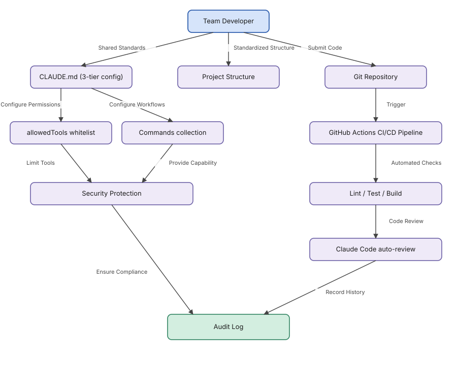
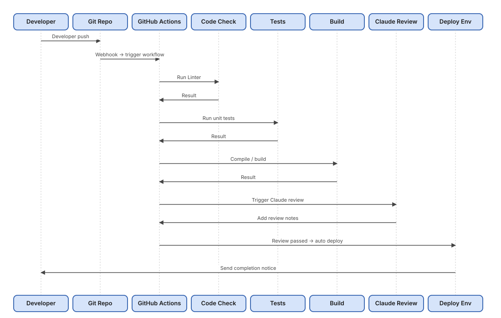

# Chapter 7: From Solo to Team — Enterprise Collaboration Standards, CI/CD, and Security in Practice (GitHub Edition)

## 1. Preface

After Chapters 1–6, you can use Claude Code skillfully — custom Commands, MCP integration, one-click Plugins, packaged Skills — your personal workflow is sorted.

But now: **swap roles. You're no longer a solo dev — you lead a team of 5 or 10. How do you roll Claude Code out?**

You've probably seen these team chaos patterns:

| Chaos pattern                                      | Root cause                | Result                                    |
| -------------------------------------------------- | ------------------------- | ----------------------------------------- |
| Every developer's CLAUDE.md is different           | No unified standard       | AI-generated code style is a mess         |
| Secrets accidentally pushed to the repo by AI      | No permission limits      | Security incident; awkward chat with boss |
| Code reviews are all manual                        | No CI/CD integration      | Slow; issues slip through                 |
| Every new project starts configs from scratch      | No standardized structure | Wasted effort; new hires confused         |
| Team's monthly bill suddenly doubles               | No cost controls          | Finance is calling                        |

**This chapter solves all of that.**

From team standards to CI/CD integration, security and compliance to cost control — one chapter covers the essentials for enterprise Claude Code rollout. Works for 3-person teams or 100-person teams.

### Chapter at a Glance



---

## 2. Team Collaboration Standards

### 2.1 Why Standards Matter

Under 3 people, you can muddle through with verbal coordination. Beyond 5, lack of standards becomes a disaster.

Standards solve three core problems:

| Problem                          | Solution                                                       |
| -------------------------------- | -------------------------------------------------------------- |
| Inconsistent AI output quality   | One CLAUDE.md, shared by everyone                              |
| Configs can't be inherited       | Config files in the repo, versioned alongside code             |
| Slow onboarding                  | Standardized layout + checklist — productive within a day      |

### 2.2 Standardized Project Structure

**Recommended enterprise directory layout:**

```
project-root/
├── .claude/                      # Claude Code configs (all committed)
│   ├── settings.json             # Team-wide permissions and tool config
│   ├── settings.local.json       # Personal local overrides (NEVER commit)
│   ├── commands/                 # Team-shared Slash commands
│   │   ├── code-review.md        # Code review command
│   │   ├── security-check.md     # Security check command
│   │   └── deploy.md             # Deployment command
│   └── skills/                   # Project-specific Skills
│       └── project-skill/
│           └── SKILL.md
├── .github/
│   └── workflows/
│       └── claude-review.yml     # CI/CD automated review
├── docs/
│   └── ai-context/               # The project manual, written for the AI
│       ├── project-structure.md
│       ├── coding-standards.md
│       └── architecture.md
├── src/
├── tests/
├── CLAUDE.md                     # Main project config (committed)
├── .mcp.json                     # MCP server config (committed)
└── .gitignore
```

**What goes in the repo, what doesn't:**

| File / Directory                | Repo policy             | Why                                   |
| ------------------------------- | ----------------------- | ------------------------------------- |
| `.claude/settings.json`         | Must commit             | Team-wide permission config           |
| `.claude/settings.local.json`   | Never commit            | Personal preferences; may contain local paths |
| `.claude/commands/`             | Must commit             | Team-shared commands                  |
| `.claude/skills/`               | Must commit             | Project-specific capabilities         |
| `CLAUDE.md`                     | Must commit             | Team-shared project standards         |
| `.mcp.json`                     | Must commit (no secrets) | Team-shared MCP config              |
| `.env` / `.env.local`           | Never commit            | Secrets and sensitive info            |

**Spell this out in `.gitignore` — don't trust memory:**

```gitignore
# Never commit
.claude/settings.local.json
.env
.env.local
.env.*.local

# Ensure these aren't excluded by other rules
!.claude/settings.json
!.claude/commands/
!.claude/skills/
!CLAUDE.md
!.mcp.json
```

**What's `docs/ai-context/` for?**

This directory holds project context **for the AI** — not a README for humans, but a "manual" that helps Claude understand the project quickly:

```markdown
# docs/ai-context/project-structure.md (example)

## Tech Stack
- Frontend: React 18 + TypeScript + Vite
- Backend: Node.js 20 + Fastify
- Database: PostgreSQL + Prisma ORM

## Core Modules
### User module (src/modules/user/)
Handles registration, login, permissions; depends on JWT + bcrypt.

### Order module (src/modules/order/)
Handles ordering, payment, state management; depends on the user module and the payment gateway.

## Code Conventions
- All API responses: { data, error, meta }
- Database operations must go through the Prisma Client
- All datetimes are UTC
```

Park the detail here. CLAUDE.md only needs to say "see docs/ai-context/" — the AI can find it without blowing up the main config's token budget.

### 2.3 The Three-tier CLAUDE.md System

Claude Code supports three CLAUDE.md tiers, priority low → high:

| Tier            | File location          | Scope                        | Repo recommendation       |
| --------------- | ---------------------- | ---------------------------- | ------------------------- |
| Global          | `~/.claude/CLAUDE.md`  | All projects                 | Personal file, don't commit |
| Project         | `<root>/CLAUDE.md`     | Whole team, this project     | Must commit               |
| Module          | `src/legacy/CLAUDE.md` | Specific subdirectory        | Commit as needed          |

**Project CLAUDE.md template (slim version, target <1,000 tokens):**

```markdown
# [Project] — Claude Code Config

## 1. Project Overview
- **Tech stack:** React 18 + Node.js 20 + PostgreSQL
- **Current phase:** in development
- **Detailed context:** see docs/ai-context/

## 2. Code Standards
- Language: TypeScript; `any` is forbidden (justify with a comment if you must)
- Naming: files kebab-case, classes PascalCase, variables camelCase, constants UPPER_SNAKE_CASE
- Functions ≤50 lines, classes ≤300 lines
- All public APIs must have JSDoc comments

## 3. Security Rules
- No hard-coded API keys, passwords, or other secrets
- Never commit `.env`
- All DB queries must be parameterized — no string concatenation

## 4. Testing
- New features must have unit tests; core logic >80% coverage
- Integration tests must cover the main user flows

## 5. Git Conventions
Commit format: `<type>(<scope>): <description>`
Types: feat / fix / docs / refactor / test / chore

## 6. Project-specific Notes
[Fill in project-specific rules — handling legacy code, forbidden third-party libraries, etc.]
```

> **Slim it down:** target <1,000 tokens for CLAUDE.md. A bloated config burns tokens on every request — not worth it. Push detail into `docs/ai-context/`.

**Global CLAUDE.md template (`~/.claude/CLAUDE.md`):**

```markdown
# Global Claude Code Config

## Personal Preferences
- Concise, direct code style
- Comments in English
- Minimal but informative inline comments

## Security Floor (applies to every project)
- Never include real API keys in code
- Never auto-run dangerous commands like `rm -rf` or `DROP TABLE` without confirmation
- Never force-push to main/master
```

### 2.4 The Code Review Command

Standardize code review by creating a team-shared command at `.claude/commands/code-review.md`:

```markdown
Conduct a thorough review of the current code changes.

Argument: $ARGUMENTS (optional, file path; if empty, review every change in `git diff`)

## Review Dimensions

### 1. Code Quality
- Are names meaningful? Is there duplicated code?
- Do functions/classes exceed the size limit?

### 2. Security
- Any SQL injection or XSS risk?
- Any hard-coded sensitive info?
- Is sensitive data handled safely?

### 3. Performance
- N+1 queries?
- Unnecessary computation inside loops?

### 4. Testing
- Are new features covered by tests?
- Are edge cases covered?

## Output Format

### Must Fix (Blocking)
- Issue description + code location + suggested fix

### Suggested (Suggestion)
- Issue description + improvement suggestion

### Well-done (Praise)
- Good practices worth keeping
```

How to use:

```bash
/code-review              # Review all recent changes
/code-review src/auth/    # Review a specific directory only
```

### 2.5 New Member Onboarding Checklist

```markdown
## Claude Code Onboarding Checklist

### Step 1: Environment
- [ ] Install the Claude Code CLI (see Chapter 1)
- [ ] Configure ~/.claude/CLAUDE.md (write your personal preferences)
- [ ] Get an API key and put it in an environment variable

### Step 2: Project Setup
- [ ] Clone the repo
- [ ] Enter the project directory, run `claude` to initialize
- [ ] Run `/mcp` to confirm MCP servers connect
- [ ] Create your personal `.claude/settings.local.json` (overrides, not committed)

### Step 3: Learn the Standards
- [ ] Read CLAUDE.md and docs/ai-context/
- [ ] Run `/help` to view team custom commands
- [ ] Run `/code-review` once to experience the flow

### Step 4: Verify Configuration
- [ ] Submit a test PR; confirm CI auto-review triggers correctly
- [ ] Check permissions: try a dangerous command and confirm it's blocked
```

---

## 3. CI/CD Integration

**CI/CD flow overview:**



### 3.1 Basic GitHub Actions Setup

Anthropic provides an official GitHub Action: `anthropics/claude-code-action`. It triggers Claude Code review directly on PRs — zero-code config.

**Prep — add a Secret to your GitHub repo:**

1. Go to **Settings → Secrets and variables → Actions**.
2. Click **New repository secret**.
3. Name: `ANTHROPIC_API_KEY`. Value: your API key.

**Minimal config** (`.github/workflows/claude-review.yml`):

```yaml
name: Claude Code Review

on:
  pull_request:
    types: [opened, synchronize, reopened]
  issue_comment:
    types: [created]

permissions:
  contents: read
  pull-requests: write
  issues: write

jobs:
  claude-review:
    if: |
      github.event_name == 'pull_request' ||
      (github.event_name == 'issue_comment' &&
       contains(github.event.comment.body, '@claude'))
    runs-on: ubuntu-latest

    steps:
      - uses: actions/checkout@v4
        with:
          fetch-depth: 0   # Full history for diff comparison

      - name: Run Claude Code Review
        uses: anthropics/claude-code-action@v1
        with:
          anthropic_api_key: ${{ secrets.ANTHROPIC_API_KEY }}
          model: claude-sonnet-4-6-20250929
          max_tokens: 4096
          timeout: 300
```

Once set up:

- Every PR triggers Claude to auto-review and post a comment.
- Comment `@claude xxx` on a PR/Issue to get an interactive response.

### 3.2 Multi-scenario Workflow

A complete team workflow typically needs three parallel jobs:

| Job             | Trigger                  | Purpose                  |
| --------------- | ------------------------ | ------------------------ |
| `review`        | PR created/updated       | Code quality review      |
| `security-scan` | PR created/updated       | Security scan            |
| `interactive`   | Comment contains `@claude` | Respond to commands    |

```yaml
name: Claude Code CI

on:
  pull_request:
    types: [opened, synchronize, reopened]
  issue_comment:
    types: [created]

permissions:
  contents: read
  pull-requests: write
  issues: write

env:
  CLAUDE_MODEL: claude-sonnet-4-6-20250929

jobs:
  # ===== Code Review =====
  review:
    name: Code Review
    if: github.event_name == 'pull_request'
    runs-on: ubuntu-latest
    steps:
      - uses: actions/checkout@v4
        with:
          fetch-depth: 0

      - name: Claude Code Review
        uses: anthropics/claude-code-action@v1
        with:
          anthropic_api_key: ${{ secrets.ANTHROPIC_API_KEY }}
          model: ${{ env.CLAUDE_MODEL }}
          max_tokens: 4096
          prompt: |
            Please review the code changes in this PR with a focus on:
            1. Code quality and maintainability
            2. Potential bugs and security issues
            3. Performance considerations
            4. Test coverage suggestions
            Output three sections: "Must fix", "Suggested", and "Strengths".

  # ===== Security Scan =====
  security-scan:
    name: Security Scan
    if: github.event_name == 'pull_request'
    runs-on: ubuntu-latest
    steps:
      - uses: actions/checkout@v4

      - name: Claude Security Scan
        uses: anthropics/claude-code-action@v1
        with:
          anthropic_api_key: ${{ secrets.ANTHROPIC_API_KEY }}
          model: ${{ env.CLAUDE_MODEL }}
          max_tokens: 2048
          prompt: |
            Run a security scan on this PR. Check for:
            1. Hard-coded sensitive data (API keys, passwords, tokens...)
            2. SQL injection / XSS / command injection risks
            3. Insecure dependency versions
            4. Permission misconfiguration
            Tag high-severity findings with [SECURITY-CRITICAL] at the start.

  # ===== Interactive Commands =====
  interactive:
    name: Interactive Commands
    if: |
      github.event_name == 'issue_comment' &&
      contains(github.event.comment.body, '@claude')
    runs-on: ubuntu-latest
    steps:
      - uses: actions/checkout@v4

      - name: Process Command
        uses: anthropics/claude-code-action@v1
        with:
          anthropic_api_key: ${{ secrets.ANTHROPIC_API_KEY }}
          model: ${{ env.CLAUDE_MODEL }}
          prompt: ${{ github.event.comment.body }}
```

**Interactive command examples (in PR/Issue comments):**

```
@claude analyze the performance bottlenecks in this code
@claude generate unit tests for this module
@claude /code-review src/payment/
```

### 3.3 Full Pipeline Example

A complete 6-stage pipeline including lint, test, build, and deploy:

```yaml
name: Full CI/CD Pipeline

on:
  push:
    branches: [main, develop]
  pull_request:
    branches: [main]

jobs:
  lint:
    name: Lint & Format
    runs-on: ubuntu-latest
    steps:
      - uses: actions/checkout@v4
      - uses: actions/setup-node@v4
        with:
          node-version: '20'
      - run: npm ci && npm run lint && npm run format:check

  test:
    name: Unit Tests
    needs: lint
    runs-on: ubuntu-latest
    steps:
      - uses: actions/checkout@v4
      - uses: actions/setup-node@v4
        with:
          node-version: '20'
      - run: npm ci && npm test -- --coverage

  claude-review:
    name: Claude Review
    if: github.event_name == 'pull_request'
    needs: test
    runs-on: ubuntu-latest
    steps:
      - uses: actions/checkout@v4
        with:
          fetch-depth: 0
      - uses: anthropics/claude-code-action@v1
        with:
          anthropic_api_key: ${{ secrets.ANTHROPIC_API_KEY }}
          model: claude-sonnet-4-6-20250929
          max_tokens: 4096
          prompt: Review the PR. Output quality assessment, security check, and improvement suggestions.

  build:
    name: Build
    needs: [test]
    runs-on: ubuntu-latest
    steps:
      - uses: actions/checkout@v4
      - uses: actions/setup-node@v4
        with:
          node-version: '20'
      - run: npm ci && npm run build
      - uses: actions/upload-artifact@v4
        with:
          name: build-output
          path: dist/

  deploy-staging:
    name: Deploy Staging
    if: github.ref == 'refs/heads/develop'
    needs: build
    runs-on: ubuntu-latest
    environment: staging
    steps:
      - uses: actions/download-artifact@v4
        with:
          name: build-output
      - run: echo "Deploying to Staging..."

  deploy-production:
    name: Deploy Production
    if: github.ref == 'refs/heads/main'
    needs: build
    runs-on: ubuntu-latest
    environment: production
    steps:
      - uses: actions/download-artifact@v4
        with:
          name: build-output
      - run: echo "Deploying to Production..."
```

> **Note:** the `claude-review` job runs only on PR events — not on pushes to main/develop — to avoid wasting tokens.

---

## 4. Security and Compliance

### 4.1 Permission System

Claude Code uses an **allow / deny dual-list** permission model:

| Level         | Behavior                          | Best for                                       |
| ------------- | --------------------------------- | ---------------------------------------------- |
| Allow         | Execute directly, no confirmation | Low-risk, high-frequency ops (reads, searches) |
| Ask (default) | Prompt for confirmation           | Operations with some impact (edits)            |
| Deny          | Reject outright; cannot bypass    | Dangerous ops (delete, force push, sudo)       |

**`.claude/settings.json` permission example:**

```json
{
  "permissions": {
    "allow": [
      "Read",
      "Glob",
      "Grep",
      "WebFetch",
      "WebSearch",
      "Bash(npm test *)",
      "Bash(git diff *)",
      "Bash(git log *)",
      "Bash(git status)"
    ],
    "deny": [
      "Bash(rm -rf /)",
      "Bash(rm -rf ~)",
      "Bash(git push --force)",
      "Bash(git reset --hard)",
      "Bash(sudo *)",
      "Bash(curl * | bash)",
      "Read(./.env)",
      "Read(./secrets/**)"
    ]
  }
}
```

> **Rules:** anything not in either list defaults to ask. Deny outranks allow. Wildcards are supported.

### 4.2 `allowedTools` Whitelist

Finer-grained tool control than `permissions`, supporting path restrictions:

```json
{
  "allowedTools": [
    "Read",
    "Glob",
    "Grep",
    "Edit(src/**)",
    "Write(src/**)",
    "Write(tests/**)",
    "Bash(npm *)",
    "Bash(git status)",
    "Bash(git diff *)",
    "Bash(git add *)",
    "Bash(git commit *)",
    "mcp__context7__*",
    "mcp__github__*"
  ],
  "disallowedTools": [
    "Bash(rm -rf *)",
    "Bash(sudo *)",
    "Write(.env*)",
    "Write(**/secrets/*)"
  ]
}
```

**Pattern matching cheat sheet:**

| Pattern              | Meaning                  | Example                                |
| -------------------- | ------------------------ | -------------------------------------- |
| `"Read"`             | Exact tool match         | Allow only the Read tool               |
| `"Bash(npm *)"`      | Wildcard for command args | Allow all `npm` sub-commands          |
| `"Edit(src/**)"`     | Path wildcard            | Only allow edits under `src`           |
| `"mcp__context7__*"` | MCP tool wildcard        | Allow all context7 functionality       |

**Per-environment recommendations:**

| Environment | Strategy                              | Notes               |
| ----------- | ------------------------------------- | ------------------- |
| Dev         | Loose, but keep dangerous-command deny | Easier iteration   |
| Staging     | Medium; restrict Write scope          | Mirror production   |
| CI/CD       | Strict; only essential tools          | Least privilege     |

### 4.3 Audit Logs

**Enable audit logs in `.claude/settings.json`:**

```json
{
  "audit": {
    "enabled": true,
    "logPath": "./logs/claude-audit/",
    "retention": "90d",
    "events": [
      "tool_use",
      "file_access",
      "command_execution",
      "permission_change",
      "error"
    ]
  }
}
```

**Sample log format:**

```json
{
  "entries": [
    {
      "timestamp": "2026-01-15T10:30:45.123Z",
      "userId": "dev@company.com",
      "event": "tool_use",
      "tool": "Bash",
      "command": "npm test",
      "status": "success",
      "duration": 5432
    },
    {
      "timestamp": "2026-01-15T10:31:00.456Z",
      "userId": "dev@company.com",
      "event": "permission_denied",
      "tool": "Read",
      "path": ".env.production",
      "reason": "Path in denied list",
      "status": "blocked"
    }
  ]
}
```

**Enterprise compliance checklist:**

| Compliance item     | Check                                          | Pass condition                       |
| ------------------- | ---------------------------------------------- | ------------------------------------ |
| Key safety          | API keys passed via env vars                   | No hard-coded keys in code           |
| Sensitive file guard | `.env`-style files in deny list               | AI cannot read                       |
| Dangerous-command block | `rm -rf` / `sudo` explicitly forbidden     | Deny list covers them                |
| Audit traceability  | All tool calls fully logged                    | `audit.enabled = true`               |
| Log retention       | Retention meets company/industry policy        | `retention >= 90d`                   |
| Least privilege     | Each role has only necessary permissions       | `allowedTools` scoped explicitly     |

---

## 5. Performance and Cost Optimization

### 5.1 Context Management

**Context window composition** (Claude Sonnet 4.6, 200K cap):

| Component                | Typical size       | Optimization priority |
| ------------------------ | ------------------ | --------------------- |
| System prompt            | ~2,000 tokens      | Cannot optimize       |
| CLAUDE.md                | 1,000–5,000 tokens | ⭐⭐⭐ Focus              |
| Conversation history     | Grows dynamically  | ⭐⭐⭐ Clean periodically |
| Tool return data         | Grows dynamically  | ⭐⭐ Limit read sizes    |
| Current message          | User input         | ⭐ Keep concise          |

**Three practical optimization strategies:**

**Strategy 1: slim CLAUDE.md**

```markdown
# Bad — verbose (wastes thousands of tokens per call)
Our team uses the following code standards. First, all code must
be written in TypeScript. Second, we require all functions to have
JSDoc comments. Furthermore, variable naming must follow camelCase
conventions... (continues for 500 more words)

# Good — concise (same information)
## Code Standards
- Language: TypeScript; `any` forbidden
- Comments: JSDoc required
- Naming: variables camelCase, classes PascalCase
- Size: functions ≤50, classes ≤300
```

**Strategy 2: break big tasks into steps**

```
# Bad — one giant task (likely to overflow, Claude prone to errors)
"Refactor the user, order, and payment modules across the project..."

# Good — step by step
Step 1: analyze the current state of the user module
Step 2: propose a refactor plan
Step 3: execute the user module refactor; verify
Step 4: continue with the order module
```

**Strategy 3: layered CLAUDE.md**

```
project-root/CLAUDE.md       # Global rules (target <1,000 tokens)
├── src/CLAUDE.md            # Source-specific rules (<500 tokens)
├── tests/CLAUDE.md          # Test rules (<300 tokens)
└── src/legacy/CLAUDE.md     # Legacy code rules (<300 tokens)
```

**Common conversation management commands:**

| Command           | When                                | Effect                                       |
| ----------------- | ----------------------------------- | -------------------------------------------- |
| `/clear`          | After a task; before switching      | Wipe history, free context                   |
| `/compact`        | Long convo, need to keep context    | Compress into a summary, save tokens         |
| `Shift + Enter`   | Multi-line instructions             | Newline without sending; organize first      |

### 5.2 Cost Control

**Model pricing reference (2026):**

| Model              | Input   | Output  | Recommended for                       |
| ------------------ | ------- | ------- | ------------------------------------- |
| Claude Haiku 4.5   | $0.25/M | $1.25/M | Simple code gen, batch file processing |
| Claude Sonnet 4.6  | $3/M    | $15/M   | Daily dev, code review (default pick) |
| Claude Opus 4.5    | $15/M   | $75/M   | Architecture, complex reasoning       |

**Per-call cost estimation:**

```
cost = (input tokens / 1M × input price) + (output tokens / 1M × output price)

Example (Sonnet 4.6, 10K input + 2K output):
= (10,000 / 1M × 3) + (2,000 / 1M × 15)
= $0.03 + $0.03 = $0.06 per call
```

**Cost control config (`.claude/settings.json`):**

```json
{
  "costControl": {
    "dailyLimit": 10.0,
    "monthlyLimit": 200.0,
    "alertThreshold": 0.8,
    "actions": {
      "onDailyLimitReached": "warn",
      "onMonthlyLimitReached": "block"
    }
  }
}
```

**Five savings tips:**

| Tip                                              | Savings                       |
| ------------------------------------------------ | ----------------------------- |
| Haiku for simple tasks; Opus for complex ones    | Up to 80% reduction           |
| Batch process: review many files at once         | Cuts repeated init overhead   |
| Use `/compact` for long conversations            | Reduces history accumulation  |
| Slim CLAUDE.md (target 1K tokens)                | Cuts per-call fixed cost      |
| Set `max_tokens` cap in CI                       | Prevents runaway calls        |

### 5.3 Verbose Debugging

Verbose mode shows the full token cost and tool-call trace per request — the most direct tool for finding perf bottlenecks:

```bash
# One-shot
claude --verbose

# Persistent (in config)
# .claude/settings.json
{
  "verbose": true
}
```

**Key log fields:**

```
[DEBUG] CLAUDE.md tokens: 1,234          → How many tokens CLAUDE.md uses
[DEBUG] Context size: 8,432 tokens       → Current total context
[DEBUG] Available context: 191,568 tokens → Remaining capacity
[DEBUG] Tool call: Glob → 12 files found  → A tool call's result
[DEBUG] Input tokens: 8,011              → Tokens sent this request
[DEBUG] Output tokens: 1,234            → Tokens returned this response
[DEBUG] Latency: 5,000ms                → API response latency
[DEBUG] Cost: $0.0234                    → Cost of this call
```

**Common performance issues:**

| Symptom                  | Likely cause              | Fix                                              |
| ------------------------ | ------------------------- | ------------------------------------------------ |
| Slow response (>10s)     | Context too large         | `/clear`; slim CLAUDE.md                         |
| Hitting token limits     | Single task too big       | Break into steps                                 |
| Costs climbing fast      | Many wasted iterations    | Optimize prompts; reduce back-and-forth          |
| Tool calls failing       | MCP server issue          | Check `.mcp.json` and network connectivity      |

---

## 6. Troubleshooting

### 6.1 Team Collaboration

| Symptom                                       | Cause                                  | Fix                                                          |
| --------------------------------------------- | -------------------------------------- | ------------------------------------------------------------ |
| Different members' AI output styles diverge   | CLAUDE.md not unified                  | Confirm `CLAUDE.md` and `settings.json` are committed; pull latest |
| CI auto-review doesn't trigger                | Secrets missing or Action version stale | Check `ANTHROPIC_API_KEY` in GitHub Secrets; upgrade Action |
| `settings.local.json` accidentally committed  | `.gitignore` missing the rule          | Add to `.gitignore` and purge from history                   |
| Teammates can't find `/code-review` command   | `commands/` not committed              | Confirm `.gitignore` doesn't exclude `.claude/commands/`     |

### 6.2 Security and Permissions

| Symptom                              | Cause                          | Fix                                                       |
| ------------------------------------ | ------------------------------ | --------------------------------------------------------- |
| Dangerous commands not blocked       | Deny list missing              | Add high-risk commands to `permissions.deny`              |
| `allowedTools` not taking effect     | Bad JSON (trailing commas...)  | Validate with an online JSON validator                    |
| Audit log directory error            | Directory not created upfront  | `mkdir -p ./logs/claude-audit/`                           |
| CI security scan misses high-risk issues | Prompt not specific         | List the security categories explicitly in the prompt     |

### 6.3 Performance and Cost

| Symptom                                  | Cause                              | Fix                                                  |
| ---------------------------------------- | ---------------------------------- | ---------------------------------------------------- |
| Monthly bill far over budget             | No cost cap                        | Configure `costControl.monthlyLimit` + alerts        |
| CLAUDE.md is slow; every response is slow | Config file too big              | Slim to <1,000 tokens; move detail to `docs/ai-context/` |
| CI Claude calls occasionally time out    | No timeout or max_tokens           | Set `timeout: 300` and `max_tokens: 4096` in Action  |
| Verbose shows large CLAUDE.md tokens     | CLAUDE.md too long                 | Audit it; remove redundancy; relocate to ai-context  |

---

## 7. Summary

This chapter covered:

1. **Team standards** — standardized layout, three-tier CLAUDE.md, repo policy, onboarding SOP.
2. **CI/CD integration** — GitHub Actions auto-review (`anthropics/claude-code-action`), multi-job workflows (review + security + interactive), full 6-stage pipeline.
3. **Security and compliance** — allow/deny model, fine-grained `allowedTools` whitelist, audit logging and compliance checklist.
4. **Performance optimization** — three context strategies, verbose-mode token analysis, common bottleneck diagnosis.
5. **Cost control** — model selection by scenario, batch processing, cost alerts, five savings tips.

**One line:** solo Claude Code use can run on instinct; team Claude Code use runs on standards. Apply this chapter's configs to your project and a 10-person team can use it efficiently and safely.

---

> **Companion file:** for GitLab CI equivalents of every workflow in §3, see **Chapter 07b — Team Collaboration, CI/CD, Security (GitLab Edition)**.
