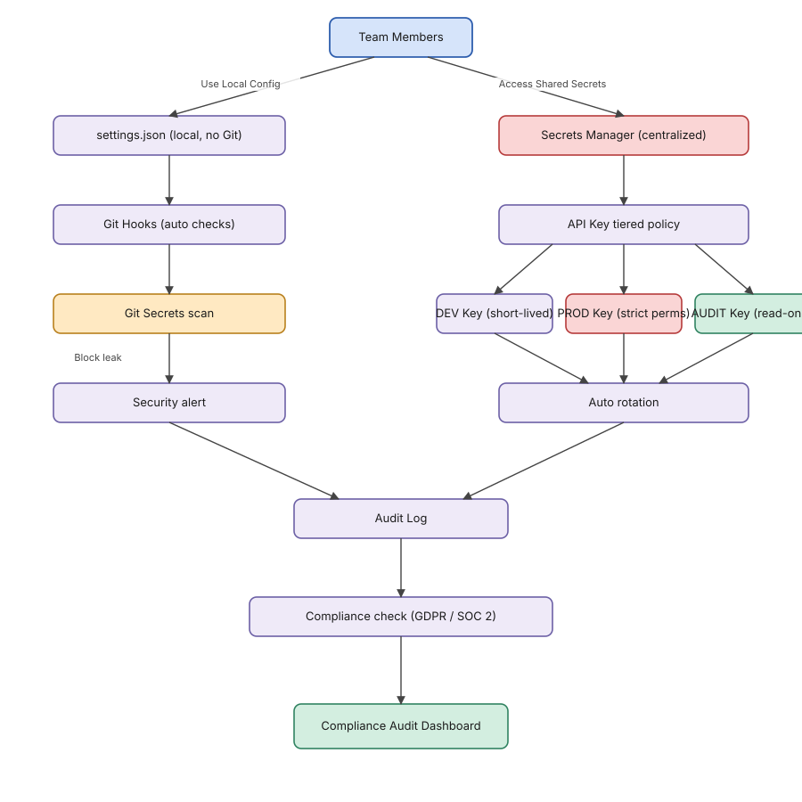
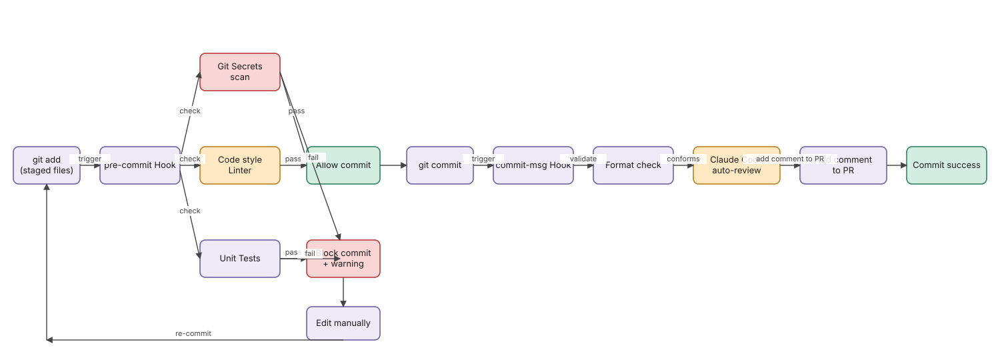
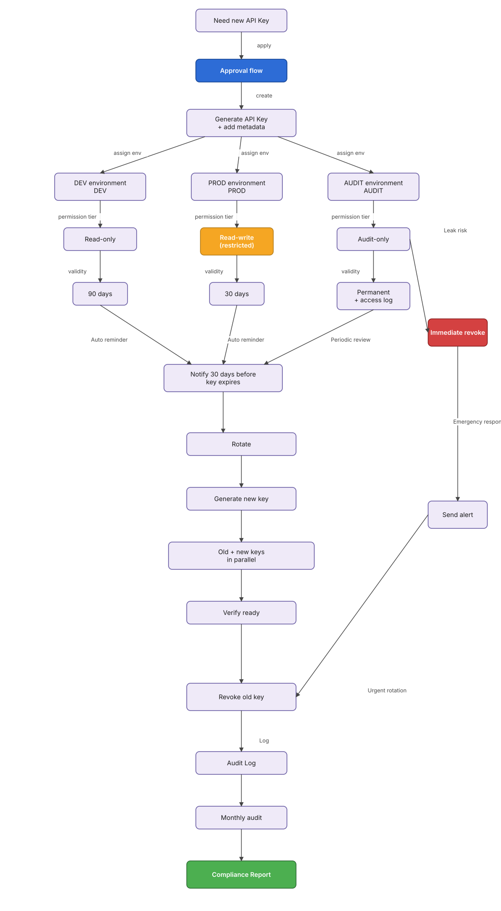

# Chapter 8: Enterprise Deep Waters — Secret Safety, Team Config, and Compliance Audit

> **Study notes format.** Chapter 8 is dense (config repos, scripts, GDPR/SOC 2). These notes summarize the chapter's structure, decisions, and patterns rather than reproduce every code block — much better for Obsidian use. Where the source includes long shell scripts (e.g., the install script, full pre-commit hook, monitoring Python), I describe the *shape* of the script and the key behaviors; copy the originals from the source `.md` if you need them verbatim.

## Chapter Security Architecture



---

## 1. Glossary

| Term            | Full name                          | Plain meaning                                       |
| --------------- | ---------------------------------- | --------------------------------------------------- |
| Secrets Manager | —                                  | Service for securely storing API keys, etc.         |
| Vault           | HashiCorp Vault                    | Enterprise secrets manager with rotation + audit    |
| Git Hooks       | —                                  | Git scripts that fire on commit/push                |
| ADR             | Architecture Decision Record       | Captures *why* a technical decision was made        |
| GDPR            | General Data Protection Regulation | EU data protection law                              |
| SOC 2           | Service Organization Control 2     | Audit standard for service organizations            |
| 2FA             | Two-Factor Authentication          | Second factor on top of password                    |
| RPM             | Requests Per Minute                | API rate-limit unit                                 |
| DPO             | Data Protection Officer            | Compliance role                                     |
| Bandit          | —                                  | Python security linter                              |
| Trivy           | —                                  | Container image security scanner                    |

---

## 2. Team Configuration Unification

### 2.1 Why Unify

Recurring chaos when teams don't unify configs:

- Per-developer `settings.json` divergence → style drift, PR conflicts.
- API keys in config files → leaked to Git history.
- Manual onboarding takes hours → error-prone.
- Config updates don't propagate → mixed-version chaos.
- No version control → rollback is painful.

Unifying configs solves all five at once.

### 2.2 Standard Config Repo Layout

A canonical `team-claude-config/` repo holds:

- **Top-level scripts** — `install.sh`, `install.ps1`, `update.sh`, `validate.sh`.
- **`.editorconfig`, `.env.example`** — base editor rules and env-var template (no real secrets).
- **`vscode/`, `cursor/`** — editor settings, keybindings, recommended extensions, snippets.
- **`claude/system-prompts/`** — shared prompt files (`code-review.md`, `refactor.md`, `testing.md`).
- **`claude/skills/team-standards/`** — the team-standards Skill (covered in §4).
- **`claude/hooks/`** — Git hook templates (`pre-commit`, `pre-push`, `commit-msg`).
- **`ci/github-actions/` and `ci/gitlab-ci/`** — pipeline files.
- **`docs/`** — `onboarding.md`, `troubleshooting.md`, `best-practices.md`.
- **`tests/test_config.py`** — config sanity tests for CI.

### 2.3 Five Principles

| # | Principle                       | Means                                                      |
| - | ------------------------------- | ---------------------------------------------------------- |
| 1 | Single Source of Truth          | Local config = symlink to the repo; nothing edited locally |
| 2 | Environment Variables First     | API keys / absolute paths via env vars only                |
| 3 | Platform Agnostic               | Scripts work on Linux/macOS/Windows; use relative paths    |
| 4 | Automated Validation            | Validate on every update; run in CI                        |
| 5 | Rollback Support                | Git tag stable versions; provide a one-click revert script |

### 2.4 One-Click Install Script — Shape, Not Verbatim

`install.sh` should:

1. **Detect OS** — set `OS=linux|macos|windows` from `$OSTYPE`.
2. **Backup existing config** — copy current VS Code (and other editor) configs to `~/.claude-config-backup-<timestamp>/`.
3. **Symlink or copy repo configs** into the editor's user directory (path differs per OS — `~/.config/Code/User`, `~/Library/Application Support/Code/User`, `%APPDATA%/Code/User`).
4. **Install Git hooks** by symlinking `claude/hooks/*` into `.git/hooks/` (mark executable).
5. **Verify** with `validate.sh` and exit with a clear success message.

Provide `install.ps1` for Windows users with the equivalent logic in PowerShell.

---

## 3. Git Hooks + Claude Integration



### 3.1 Why

Problems Git Hooks plus Claude solve: unformatted commits, messy commit messages, untested pushes, obvious bugs reaching reviewers, and stale docs.

### 3.2 Pre-commit Hook — Behavior Summary

The hook should, in order:

1. **List staged files** via `git diff --cached --name-only --diff-filter=ACM`.
2. **Format Python files** with Black, lint with Ruff, fail if Ruff errors; `git add` after format so the formatted bytes are what gets committed.
3. **(Optional) format JS/TS** with Prettier + ESLint analogously.
4. **Quick Claude review** on the staged diff using the **Haiku** model (cheap, fast). Prompt: *"Quickly review this diff. Only flag severe issues; otherwise reply OK."* If the response contains `severe`/`critical`/`security`, fail the commit and print the review.
5. **Exit 0** on success.

> Save the heavy review (Sonnet/Opus) for CI; locally just block disasters with Haiku.

### 3.3 Commit-msg Hook — Behavior Summary

- Read the proposed message from `$1`.
- Match against Conventional Commits regex: `^(feat|fix|docs|style|refactor|perf|test|chore|build|ci|revert)(\(.+\))?: .+`.
- If it fails, print the format and a real-world example, optionally call Claude with the staged diff stats to suggest a compliant message, then exit 1.

---

## 4. Team Knowledge Base

### 4.1 Layout

```
team-knowledge-base/
└── .claude/
    ├── skills/
    │   ├── team-standards/   # Coding standards
    │   ├── architecture/     # Architecture patterns
    │   └── testing/          # Test conventions
    └── memory/
        ├── common-patterns.json
        ├── team-decisions.json   # ADRs
        └── best-practices.json
```

### 4.2 Team Standards Skill (skeleton)

The `team-standards` SKILL.md should declare the team's defaults — language style (Python: Black + 88 cols + type hints + Google-style docstrings), JS/TS (ESLint + Prettier, prefer TypeScript, functional React + hooks, shared `fetch` wrapper), and API design (RESTful + plural resources, unified `{ code, message, data }` errors, version in URL `/api/v1/`, cursor-based pagination).

Dropping this in `.claude/skills/` makes day-one code from new hires automatically match team conventions.

---

## 5. CI/CD Deep Integration

Chapter 7 covered the basics of `anthropics/claude-code-action@v1`. Chapter 8 layers on:

- **`code-review` job** — only on PRs; pulls the diff against `github.base_ref`, calls the Anthropic Messages API directly (curl + jq), writes the result to `$GITHUB_STEP_SUMMARY` so reviewers see it in one click.
- **`quality-check` job** — runs Black, Ruff, and pytest with coverage; always runs.
- **`security-scan` job** — only on PRs; greps for hard-coded API key patterns (`sk-ant-api[0-9]{2}-[a-zA-Z0-9_-]{20,}`) across `.py/.js/.ts`; runs `safety check` for dependency CVEs.

(For GitLab equivalents, see the companion file **Chapter 07b**.)

---

## 6. Team Monitoring and Cross-Team Configuration

### 6.1 Usage Monitoring (Python script skeleton)

A small Python script that:

- Defines per-model pricing (Haiku, Sonnet, Opus) per 1M tokens.
- `log_api_call(user, model, prompt_tokens, completion_tokens)` computes cost and writes to SQLite.
- `generate_weekly_report()` aggregates by user, by model, exports a Markdown summary to Slack/Lark.

Discipline: Haiku for everyday coding assist, Sonnet for review, Opus only for complex architecture. Strict model tiering saves 60%+.

### 6.2 Multi-Team Config Inheritance

For large orgs, layer configs:

```
company-claude-config/          # company-wide base
  └── claude/skills/company-standards/   # red lines

team-frontend-config/           # inherits company-claude-config
  └── claude/skills/react-patterns/      # team specifics

team-backend-config/            # inherits company-claude-config
  └── claude/skills/api-patterns/
```

Company level sets the floor (security, style minimums); team level adds stack-specific best practices.

---

## 7. API Key Security (the most important section)



### 7.1 Disaster Scenarios

Real-world fallout examples from leaked keys:

| Incident                              | Outcome                            | Loss             |
| ------------------------------------- | ---------------------------------- | ---------------- |
| Key committed to a public GitHub repo | Scanners find it in minutes, abuse | ~$15,000         |
| Hard-coded in frontend code           | Exposed to every user              | Unlimited abuse  |
| Plaintext in a config file            | Server breach exposes it           | ~$8,000          |
| Shared with an ex-employee, not revoked | Malicious use                    | Legal action     |

### 7.2 Tiered Key Management

Three tiers, enforced separately:

- **Production master key** — held by only the CEO/CTO; used for rotation/emergency recovery; access requires 2FA + hardware key.
- **Production service keys** — one key per service (API gateway, backend, batch). Each scoped with its own RPM cap.
- **Developer keys** — per environment (dev/test); low RPM caps; bound to individual users.

### 7.3 Storage Options Compared

**Forbidden patterns:** hard-coding in source, committing `.env`, plaintext config files, keys in frontend code.

**Acceptable storage options** (pick by team size and budget):

| Option                         | Best for                          | Notes                                  |
| ------------------------------ | --------------------------------- | -------------------------------------- |
| OS keychain (macOS Keychain, Win Credential Manager) | Solo devs                | Free; per-user only                    |
| 1Password CLI / Bitwarden CLI  | Small teams                       | Easy onboarding; shared vaults         |
| AWS Secrets Manager / GCP Secret Manager / Azure Key Vault | Companies on a cloud      | IAM-integrated; audit logging built in |
| HashiCorp Vault                | Multi-cloud / regulated workloads | Self-hosted; rotation primitives       |
| SOPS + KMS                     | Repo-friendly secrets             | Encrypted files in Git, decrypted on use |

### 7.4 Rotation Automation

A rotation script should:

1. Generate a new key via the provider's API.
2. Publish the new key to the secrets store under a new version tag.
3. Trigger a rolling deploy so services read the new version.
4. Wait a defined grace window with both keys valid.
5. Revoke the old key; alert on any access attempts to the revoked key.
6. Log the entire rotation in an audit trail.

Cadence: production every 30–90 days, developer keys monthly, master keys on incident or staff change.

---

## 8. Code Scanning and Log Hygiene

### 8.1 Git Secrets Scanning

Two layers:

- **Pre-commit** — `detect-secrets` or `gitleaks` runs locally and blocks commits with suspected secrets.
- **CI** — `gitleaks` or `trufflehog` scans the full diff on every PR; fail the build on any high-confidence finding.

For the historical sweep (legacy repos): run a full-history scan once, rotate any keys it finds, and rewrite history only if the leak is recent and uncached.

### 8.2 Log Redaction

Anywhere you log API responses or request bodies:

- Redact known sensitive fields (`api_key`, `token`, `authorization`, `password`, `email`, `phone`, `id_number`) with a regex middleware before writing to disk.
- Mask the value (`sk-ant-***`) — keep prefix for debuggability, drop the rest.
- Truncate long values to a reasonable cap (e.g., 128 chars) to avoid leaking embeddings/payloads.
- Apply the same filter to Claude verbose logs (`--verbose` output is text — easy to grep, easy to leak).

---

## 9. Compliance

### 9.1 GDPR Essentials (for teams handling EU user data via Claude)

- **Lawful basis** — record the basis for sending user data to a model (consent, contract, legitimate interest).
- **Data minimization** — strip PII from prompts; if a user record must be sent, redact name/email/phone before the call.
- **Right to erasure** — keep a deletion pipeline that purges logs containing a user's data on request.
- **Cross-border transfers** — confirm Anthropic's data processing addendum is in place and that the region of processing matches your DPA.
- **Retention** — set explicit retention on every Claude log store (60–180 days typical).
- **Records of Processing Activities** — document Claude as a processor in the company RoPA.

### 9.2 SOC 2 Considerations

Map controls relevant to Claude usage:

- **CC6 (Logical access)** — API key tiering, 2FA on the Anthropic Console, revocation on offboarding.
- **CC7 (System operations)** — anomaly alerts on spend, rate-limit breaches, repeated permission denies.
- **CC8 (Change management)** — Claude config changes go through PR review; production prompts are versioned.
- **Availability** — fallback strategy if Anthropic API is degraded (queue + retry, or human review path).
- **Confidentiality** — encrypted-at-rest log stores; redaction pipeline (§8.2) running before persistence.

---

## 10. Integrated Security Playbook

### 10.1 Comprehensive Security Scan Checklist

Run these as a single command (script under `scripts/security-scan.sh`) before any release:

- Code scan — `gitleaks detect` against the working tree.
- Dependency scan — `npm audit --production` / `pip-audit` / `safety check`.
- Container scan — `trivy image <image>` if you ship containers.
- Static code analysis — `bandit -r .` (Python), `semgrep --config auto`.
- Claude prompt scan — grep prompt files for hard-coded customer data, internal hostnames, ticket IDs.
- License scan — `license-checker` or `pip-licenses` to catch incompatible licenses pulled in by transitive deps.
- IaC scan — `tfsec` or `checkov` if you ship Terraform.

### 10.2 API Leak Incident Response Plan

When a key leaks, run these steps in this order:

1. **T+0:00 — Revoke** the leaked key on the Anthropic Console immediately.
2. **T+0:05 — Issue a replacement** in the appropriate tier (§7.2) and push it to the secrets store.
3. **T+0:10 — Rolling restart** affected services so they pick up the new key.
4. **T+0:30 — Audit logs**: pull Anthropic usage logs for the leaked key. Note timestamps, IPs, and request shapes that don't match your own traffic.
5. **T+1:00 — Damage assessment** — total tokens consumed under the leaked key during exposure window; flag for billing dispute if abuse is clear.
6. **T+2:00 — Postmortem write-up** — root cause (how it leaked: commit / log / screenshot / 3rd party); blast radius; corrective actions.
7. **T+24:00 — Preventive controls** — add the leak pattern to gitleaks rules; add the affected scope to the audit alert list; if a developer's key, rotate that developer's other credentials too.

Keep this runbook in `docs/runbooks/api-key-leak.md` so it's findable when stress is high.

---

## Summary

What this chapter takes you through:

1. **Team config unification** — one repo, one install script, validation in CI, rollback via git tags.
2. **Git Hooks + Claude** — local quick-checks (Haiku) at commit time; full checks (Sonnet/Opus) at CI.
3. **Knowledge base** — bake team standards into shared Skills so day-one code matches conventions.
4. **CI/CD deep integration** — three-job pattern (review + quality + security scan).
5. **Secret safety** — tiered keys, vault-backed storage, automated rotation, leak response plan.
6. **Compliance** — GDPR minimum bar, SOC 2 mappings, redaction pipelines, retention discipline.

If Chapter 7 made Claude Code work for a team, Chapter 8 makes it survive an enterprise security review.

---

### Note on the long scripts

Long shell scripts in this chapter (`install.sh`, `pre-commit`, the monitoring Python) are summarized by behavior rather than pasted verbatim — that keeps these notes Obsidian-friendly. The originals live in `Claude Code实战指南.md` if you want to copy them directly.
