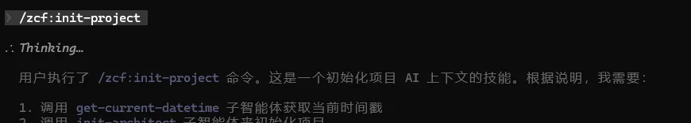
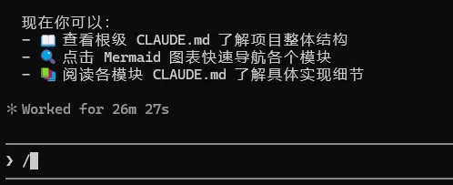
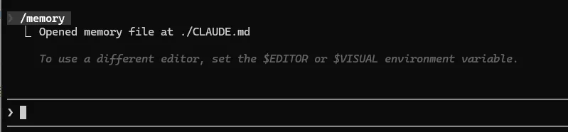

# 第二章：30+命令與快捷鍵，程式設計效率直接翻倍

## 1. 術語表（小白必讀）

| 術語              | 英文全稱               | 通俗解釋                          | 生活類比                           |
| ----------------- | ---------------------- | --------------------------------- | ---------------------------------- |
| CLI               | Command Line Interface | 命令列介面，透過打字操作電腦      | 發簡訊指揮別人幹活                 |
| 互動模式          | Interactive Mode       | 可以連續對話的模式，AI 記住上下文 | 打電話聊天，可以連續說很多輪       |
| REPL              | Read-Eval-Print-Loop   | 讀取-執行-列印-迴圈               | 你說一句 AI 回一句，不停迴圈       |
| 列印模式          | Print Mode             | 只輸出結果，沒有額外格式          | 只給答案，不說廢話                 |
| Slash 命令        | Slash Commands         | 以 `/` 開頭的特殊命令             | 快捷觸發預設功能        |
| Token             | -                      | AI 處理文字的計費單位             | 打計程車按公里計費，AI 按 Token 計費 |
| Checkpoint        | -                      | 程式碼和對話的存檔點                | 遊戲存檔，隨時可以讀檔重來         |
| Rewind            | -                      | 回退到之前的檢查點                | 遊戲讀檔                           |
| Compact           | -                      | 壓縮對話歷史，節省 Token          | 整理房間，扔掉不重要的東西         |
| Extended Thinking | -                      | 擴充套件思考模式，讓 AI 深度分析      | 讓 AI 寫解題過程，不只是答案       |
| MCP               | Model Context Protocol | 讓 Claude 連線外部工具的外掛系統  | 手機安裝 App，擴充套件功能             |

------

## 2. 第一次使用 Claude Code

> 前置條件：請確保已完成[第一章](https://xn--01:,10ai-4g0mr1c1go9cm3oqrb5r0459bvgk9jby92q4shl92bl0k0uk.md/)的環境準備和安裝步驟。

### 2.1 啟動與第一次對話

開啟終端（Windows `Win+R` → `powershell`；macOS `Cmd+Space` → `Terminal`；Linux `Ctrl+Alt+T`），進入專案目錄後啟動：

```Bash
cd ~/你的專案路徑    # 沒有專案可以先 mkdir test-claude && cd test-claude
claude
```

看到 `You: █` 游標閃爍就是啟動成功。試著輸入第一句話：

```avrasm
You: 你好，介紹一下你自己
```

Claude 會回覆自我介紹並列出它能做的事（編寫程式碼、修復 Bug、搜尋檔案等）。能正常收到回覆，說明一切就緒。

### 2.2 驗證與退出

**快速驗證**：讓 Claude 建立一個檔案，確認它能正常讀寫：

```avrasm
You: 建立一個hello.py檔案，內容是列印"Hello Claude Code"
```

Claude 會請求確認 → 按回車 → 檔案建立成功。用 `cat hello.py` 驗證內容。

**退出方式**：輸入 `/exit`，或按 `Ctrl+D`（macOS/Linux）/ `Ctrl+Z` 回車（Windows）。

### 2.3 初始化專案（強烈推薦！）

> ⚠️ **關鍵**：新專案必須初始化。更關鍵的是：**每次專案有重大變化時，也可以重新執行 `/init` 或 `/zcf:init-project` 來更新 Claude 的上下文！**

#### 為什麼要初始化？

讓 Claude 自動理解專案結構、技術棧、編碼規範和目標，後續對話都會自動應用這些資訊。

#### 兩種初始化方式

**標準初始化**：

```bash
You: /init
```

自動掃描專案 → 生成/更新 `CLAUDE.md` → 後續對話自動帶上上下文

#### 核心建議：每次迭代都可以更新

不要把 `/init` 只看作一次性操作！專案演進時，隨時可以重新初始化：

| 場景                  | 建議             |
| --------------------- | ---------------- |
| 🆕 新專案第一次使用    | **必須** `/init` |
| 🔄 調整了專案結構/目錄 | 重新 `/init`     |
| 🏗️ 新增新的大型模組    | 重新 `/init`     |
| 📝 更新了編碼規範      | 重新 `/init`     |
| 🛠️ 改用新框架/技術棧   | 重新 `/init`     |
| 💻 僅改動程式碼邏輯      | 無需 `/init`     |

#### 典型工作流

```bash
# Day 1：初始化
You: /init  # 第一次完整掃描

# 開發迭代，完成認證模組
You: 實現使用者登入功能

# Day 2：專案更新
You: /init  # 重新掃描，更新上下文（新增了新的 API 服務層）

# 現在 Claude 知道新的 API 層規範
You: 在新 API 層實現資料快取

# Day 3：規範升級
You: /init  # 重新同步最新規範

# AI 按新規範生成程式碼
You: 重構認證模組
```

#### 驗證初始化

```bash
You: /memory
# 檢視生成的 CLAUDE.md，確認專案資訊已正確載入
```

------

#### 相關截圖



 

## 3. 互動模式與啟動選項

互動模式（REPL）是 Claude Code 的核心方式：你說一句，AI 回一句，始終記住上下文，迴圈往復。

啟動時可以附加引數控制行為：

```Bash
claude                                  # 預設啟動
claude --project /path/to/project       # 指定專案目錄，不需要先 cd
```

| 選項             | 簡寫 | 作用             | 適用場景         |
| ---------------- | ---- | ---------------- | ---------------- |
| `--verbose`      | 無   | 顯示詳細日誌     | 除錯排查問題     |
| `--model <name>` | `-m` | 指定 AI 模型     | 切換到特定模型   |
| `--continue`     | `-c` | 恢復最近一次會話 | 繼續昨天的工作   |
| `--resume <id>`  | `-r` | 恢復指定會話     | 恢復某次特定對話 |

> 基礎啟動引數（`--dangerously-skip-permissions`、`-p`、`--headless`）見[第一章 2.3.1](https://xn--01:,10ai-4g0mr1c1go9cm3oqrb5r0459bvgk9jby92q4shl92bl0k0uk.md/#231-啟動引數速查)。

### 3.1 三種操作模式

Claude Code 有三種操作模式，**按 `Shift + Tab` 迴圈切換**，右上角狀態列實時顯示當前模式：

| 模式         | 狀態列顯示  | 行為                                                    | 適用場景                               |
| ------------ | ----------- | ------------------------------------------------------- | -------------------------------------- |
| 預設模式     | （無標記）  | 每次檔案修改、執行命令都會暫停詢問你確認                | 新手、陌生專案、敏感操作               |
| 自動接受編輯 | `Auto-edit` | 檔案讀寫自動確認，Bash 命令仍需手動確認                 | 熟悉專案、大量程式碼修改時               |
| 規劃模式     | `Plan mode` | Claude 只分析和規劃，不執行任何操作，輸出"我打算做什麼" | 複雜任務拆解、評估風險後再決定是否執行 |

**切換方法**：

- 鍵盤：`Shift + Tab`（迴圈切換，預設 → 自動接受編輯 → 規劃模式 → 預設）
- 滑鼠：點選輸入框左下角的模式狀態標籤

> **新手建議**：前期保持預設模式，每次操作都看一眼 Claude 要做什麼再確認。熟悉後再切到自動接受編輯提升速度；遇到複雜任務先用規劃模式摸清思路，確認無誤再切回執行。

------

## 4. 輸入技巧

### 4.1 快捷輸入符號

| 字首 | 作用                                 | 示例                     |
| ---- | ------------------------------------ | ------------------------ |
| `#`  | 新增內容到記憶檔案（CLAUDE.md）      | `# 本專案使用TypeScript` |
| `@`  | 檔案路徑自動補全，讓 AI 關注特定檔案 | `@src/app.js`            |
| `!`  | 直接執行 Bash 命令                   | `!npm test`              |

### 4.2 多行輸入

| 方法       | 快捷鍵         | 說明                        |
| ---------- | -------------- | --------------------------- |
| 反斜槓換行 | `\` + Enter    | 所有終端通用                |
| macOS 預設 | Option + Enter | macOS 終端                  |
| 終端配置後 | Shift + Enter  | 執行 `/terminal-setup` 配置 |
| 控制序列   | Ctrl + J       | 換行符                      |
| 直接貼上   | 貼上程式碼塊     | 自動識別多行                |

------

## 5. 對話管理技巧

| 命令       | 效果     | 保留內容          | Token 節省 | 適用場景                           |
| ---------- | -------- | ----------------- | ---------- | ---------------------------------- |
| `/clear`   | 完全清空 | 僅 CLAUDE.md 配置 | 100%       | 切換到完全不同的新任務             |
| `/compact` | 壓縮歷史 | 關鍵資訊摘要      | 40-60%     | 同一任務內響應變慢、Token 接近上限 |

> **一句話原則**：換任務用 `/clear`，覺得慢了用 `/compact`。

------

## 6. Slash 命令大全

> 所有 Slash 命令都必須在互動模式中使用（輸入 `claude` 進入後才能用）。

### 6.1 命令速查總表

**基礎控制**

| 命令       | 作用             | 備註                                |
| ---------- | ---------------- | ----------------------------------- |
| `/help`    | 顯示所有可用命令 | 忘記命令時隨時查                    |
| `/exit`    | 退出 Claude Code | 也可用 `Ctrl+D`                     |
| `/clear`   | 清空對話歷史     | CLAUDE.md 配置不會丟失              |
| `/compact` | 壓縮對話歷史     | 可帶指令：`/compact 保留資料庫討論` |

**上下文與費用**

| 命令       | 作用                                |
| ---------- | ----------------------------------- |
| `/context` | 視覺化 Token 使用情況（彩色進度條） |
| `/cost`    | 顯示當前會話的 Token 用量和費用     |
| `/usage`   | 顯示賬戶整體用量和限額（訂閱使用者）  |

**模型與會話**

| 命令      | 作用           | 備註                                       |
| --------- | -------------- | ------------------------------------------ |
| `/model`  | 切換 AI 模型   | 也可直接 `/model claude-opus-4-5-20251101` |
| `/resume` | 恢復之前的會話 | 列出最近會話供選擇                         |
| `/export` | 匯出對話記錄   | 支援 Markdown / JSON / HTML                |
| `/rename` | 重新命名當前會話 | 方便後續查詢                               |

**專案配置**

| 命令           | 作用                          |
| -------------- | ----------------------------- |
| `/init`        | 分析專案並建立 CLAUDE.md 配置 |
| `/memory`      | 開啟編輯器修改 CLAUDE.md      |
| `/permissions` | 檢視和修改 Claude 的許可權設定  |

**開發輔助**

| 命令      | 作用                     |
| --------- | ------------------------ |
| `/review` | 審查未提交的程式碼變更     |
| `/todos`  | 列出對話中追蹤的 TODO 項 |
| `/agents` | 檢視活躍的子代理狀態     |

**診斷與狀態**

| 命令      | 作用                                      |
| --------- | ----------------------------------------- |
| `/doctor` | 系統健康檢查（Node.js、API 連線、MCP 等） |
| `/status` | 顯示版本、模型、賬戶等完整狀態            |

**MCP 與外掛**

| 命令      | 作用                      |
| --------- | ------------------------- |
| `/mcp`    | 檢視和管理 MCP 伺服器連線 |
| `/plugin` | 安裝、啟用、禁用外掛      |
| `/hooks`  | 配置事件觸發的自動化指令碼  |

**其他**

| 命令              | 作用                                 |
| ----------------- | ------------------------------------ |
| `/stats`          | 使用習慣統計（會話數、訊息數、費用） |
| `/vim`            | 啟用 Vim 模式編輯                    |
| `/release-notes`  | 檢視最新版本更新日誌                 |
| `/bug`            | 向 Anthropic 提交 Bug 報告           |
| `/terminal-setup` | 配置終端以支援 Shift+Enter 換行      |

------

### 6.2 上下文與費用管理

`/context` 會用彩色進度條顯示 Token 使用佔比，幫助你判斷是否需要 `/compact`：

```mathematica
████████████░░░░░░░░  60% (120K / 200K tokens)
```

`/cost` 顯示當前會話的實際費用，適合按量付費的使用者隨時關注開銷。

### 6.3 模型切換

```bash
/model                              # 互動選擇模型
/model claude-opus-4-5-20251101     # 直接指定
```

快捷鍵：macOS `Option+P` / Windows `Alt+P`

| 模型   | 速度 | 能力 | 成本 | 適用場景           |
| ------ | ---- | ---- | ---- | ------------------ |
| Haiku  | 最快 | 基礎 | 最低 | 簡單任務、快速查詢 |
| Sonnet | 中等 | 強大 | 中等 | 日常開發（推薦）   |
| Opus   | 較慢 | 最強 | 最高 | 複雜任務、關鍵決策 |

### 6.4 Checkpoint 與 Rewind（回退功能）

Checkpoint（檢查點）= 遊戲存檔，Rewind（回退）= 讀檔。Claude Code 在每次檔案修改時自動建立檢查點，讓你大膽實驗、隨時回退。

**觸發方式**：

- 快速按兩次 `Esc` 鍵（最快）
- 輸入 `/rewind` 命令

**三種恢復選項**：

| 選項       | 效果                         | 適用場景                  |
| ---------- | ---------------------------- | ------------------------- |
| 僅恢復對話 | 保留程式碼改動，重置 AI 上下文 | AI 理解錯了，但程式碼改對了 |
| 僅恢復程式碼 | 保留對話歷史，回退檔案修改   | 程式碼改錯了，但討論有價值  |
| 同時恢復   | 程式碼和對話都回到之前狀態     | 完全走錯方向，從頭來      |

> **重要限制**：Checkpoint 只追蹤 Claude 的檔案編輯工具（Write、Edit），**不追蹤 Bash 命令的修改**（如 `!mv`、`!rm`）。重要操作儘量讓 Claude 用檔案工具修改，並配合 Git 使用。

### 6.5 會話管理

```Bash
# 命令列快速恢復
claude -c                    # 恢復最近一次會話
claude -r ses_abc123         # 恢復指定會話

# 互動模式中恢復
/resume                      # 列出最近會話供選擇
```

匯出對話：

```elm
/export                      # 預設 Markdown 格式
/export --clipboard          # 匯出到剪貼簿
/export --format json        # 指定 JSON 格式
```

給會話命名（方便後續查詢）：

```clean
/rename auth-module-implementation
```

### 6.6 專案配置

- `/init`：自動分析專案結構並生成 CLAUDE.md，讓 Claude 理解你的專案（詳見第一章）
- `/memory`：開啟編輯器修改 CLAUDE.md，也可以用 `# 字首` 快速新增記憶
- `/permissions`：檢視當前許可權設定（檔案讀寫、Bash 命令等），按需調整

### 6.7 開發輔助

- `/review`：審查未提交的程式碼變更，Claude 會分析安全問題、效能隱患和程式碼風格
- `/todos`：列出對話中追蹤的 TODO 項及完成狀態
- `/agents`：檢視正在執行的子代理（用於複雜任務分解時）

### 6.8 診斷與狀態

遇到問題時優先用這兩個命令排查：

- `/doctor`：全面健康檢查（Node.js 版本、API 連線、MCP 狀態等），類似"體檢報告"
- `/status`：顯示當前版本、模型、賬戶、MCP 連線等完整狀態資訊

### 6.9 MCP 與外掛

- `/mcp`：檢視已連線的 MCP 伺服器及其提供的工具列表
- `/plugin`：管理已安裝的外掛（啟用/禁用）
- `/hooks`：檢視已配置的事件鉤子（如寫檔案前自動 lint、提交後通知等）

> MCP、Plugins、Hooks 的詳細配置分別在第04、07、05章展開。

### 6.10 其他命令

- `/stats`：檢視使用習慣統計（會話數、訊息數、費用趨勢）
- `/vim`：啟用 Vim 模式編輯輸入框（`h/j/k/l` 移動，`i` 插入，`Esc` 普通模式）
- `/release-notes`：檢視最新版本更新日誌
- `/bug`：向 Anthropic 提交 Bug 報告（引導式描述問題）
- `/terminal-setup`：配置終端支援 Shift+Enter 換行輸入

------

## 7. 快捷鍵速查

### 7.1 通用控制

| 快捷鍵                   | 作用                   | 備註                                                         |
| ------------------------ | ---------------------- | ------------------------------------------------------------ |
| `Ctrl + C`               | 取消當前輸入或中斷生成 | 標準中斷訊號                                                 |
| `Ctrl + D`               | 退出 Claude Code       | EOF 訊號                                                     |
| `Ctrl + L`               | 清除終端螢幕           | 對話歷史不受影響                                             |
| `Ctrl + O`               | 切換詳細輸出           | 顯示/隱藏工具呼叫細節                                        |
| `Ctrl + R`               | 反向搜尋歷史命令       | 詳見 7.2 |
| `Esc + Esc`              | 開啟 Rewind 選單       | 回退程式碼/對話，詳見 6.4 |
| `Tab`                    | 切換 Extended Thinking | 開/關擴充套件思考模式                                            |
| `Shift + Tab`            | 切換許可權模式           | 自動/計劃/普通                                               |
| `↑` / `↓`                | 瀏覽歷史命令           | 快速複用之前的輸入                                           |
| `Option + P` / `Alt + P` | 切換 AI 模型           | macOS 用 Option，Windows/Linux 用 Alt                        |
| `Ctrl + V` / `Alt + V`   | 貼上圖片               | macOS/Linux 用 `Ctrl+V`，Windows 用 `Alt+V`                  |

> 多行輸入快捷鍵見 4.2 多行輸入。

### 7.2 歷史搜尋（Ctrl+R）

1. 按 `Ctrl + R` 進入搜尋模式
2. 輸入關鍵詞，自動匹配歷史命令
3. 再按 `Ctrl + R` 瀏覽更早的匹配
4. `Tab` 或 `Esc` 接受當前匹配，`Enter` 直接執行，`Ctrl + C` 取消

### 7.3 後臺執行

| 操作                 | 方式                     |
| -------------------- | ------------------------ |
| 提示 Claude 後臺執行 | 在提示詞中說"在後臺執行" |
| 手動轉後臺           | `Ctrl + B`               |
| tmux 使用者            | 按兩次 `Ctrl + B`        |

適合後臺的任務：構建工具（[Webpack](https://www.mianshiya.com/bank/1831174878121283585)、vite）、測試執行器（jest、pytest）、開發伺服器等。

### 7.4 Vim 模式

輸入 `/vim` 啟用後，輸入框支援 Vim 風格編輯：

| 操作         | 按鍵              | 說明                       |
| ------------ | ----------------- | -------------------------- |
| 進入普通模式 | `Esc`             | 退出插入模式               |
| 插入         | `i` / `a` / `o`   | 游標前 / 游標後 / 下方新行 |
| 移動         | `h` `j` `k` `l`   | 左 / 下 / 上 / 右          |
| 按詞移動     | `w` / `b`         | 下一個詞 / 上一個詞        |
| 行首/行尾    | `0` / `$`         |                            |
| 刪除         | `x` / `dd` / `dw` | 刪字元 / 刪整行 / 刪單詞   |
| 修改整行     | `cc`              | 清空當前行並進入插入模式   |
| 重複上次操作 | `.`               |                            |

------

## 8. 最佳實踐

### 8.1 日常工作流程

推薦的每日流程：

```Bash
$ claude -c                          # 1. 恢復昨天的會話
You: /status                         # 2. 檢查狀態
You: 我今天要完成使用者認證模組          # 3. 開始工作
You: /context                        # 4. 工作中定期檢查 Token 使用
You: /compact                        # 5. Token 超過 60% 時壓縮
You: /export ~/docs/auth.md          # 6. 完成重要功能後匯出對話
You: /rename auth-module-day2        # 7. 下班前重新命名會話
```

### 8.2 省錢技巧

**Token 最佳化**：

| 技巧                                         | 節省比例 |
| -------------------------------------------- | -------- |
| 簡單問題關閉 Extended Thinking（`Tab` 切換） | ~70%     |
| 定期使用 `/compact`                          | 40-60%   |
| 完成任務後 `/clear`                          | 100%     |
| 使用 Sonnet 而非 Opus                        | ~80%     |
| 簡潔描述需求，避免冗餘上下文                 | ~30%     |

**模型選擇策略**：

```undefined
簡單查詢（函式解釋、格式轉換）  → Haiku（最便宜）
日常開發（編碼、重構、除錯）    → Sonnet（價效比最高）
關鍵決策（架構設計、複雜分析）  → Opus（最強）
```

### 8.3 配置別名提高效率

**macOS / Linux**（新增到 `~/.bashrc` 或 `~/.zshrc`）：

```Bash
alias cc="claude --dangerously-skip-permissions"   # 快速啟動
alias cr="claude -c"                               # 恢復會話
alias ccv="claude --verbose"                        # 除錯模式
alias cco="claude --model claude-opus-4-5-20251101" # 使用 Opus
```

**Windows PowerShell**（新增到 `$PROFILE`）：

```PowerShell
function cc { claude --dangerously-skip-permissions }
function cr { claude -c }
function ccv { claude --verbose }
```

### 8.4 善用 Checkpoint 大膽實驗

Checkpoint 讓你可以放心嘗試激進方案：

```avrasm
You: 幫我用新架構重構這個模組     # 嘗試方案 A（自動建立檢查點）
[Esc + Esc → 回退]                # 不滿意？回退
You: 換工廠模式重構               # 嘗試方案 B
[Esc + Esc → 回退]                # 還不滿意？繼續回退
You: 用策略模式試試               # 嘗試方案 C，直到找到滿意的
```

### 8.5 團隊協作

**分享會話**：

```elm
/export --format html shared/auth-discussion.html
```

**建立可複用的團隊命令**：

```Bash
mkdir -p .claude/commands
echo "Review this code for security and performance issues:" > .claude/commands/security-review.md
```

提交到 Git 後，團隊成員都可以用 `/security-review` 觸發統一的程式碼審查流程。

------

## 附錄：完整命令速查表

**CLI 啟動選項**

| 選項                             | 簡寫 | 作用                   |
| -------------------------------- | ---- | ---------------------- |
| `--version`                      | `-v` | 顯示版本               |
| `--help`                         | `-h` | 顯示幫助               |
| `--print`                        | `-p` | 列印模式（回答後退出） |
| `--model <name>`                 | `-m` | 指定模型               |
| `--continue`                     | `-c` | 恢復最近會話           |
| `--resume <id>`                  | `-r` | 恢復指定會話           |
| `--project <path>`               | 無   | 指定專案目錄           |
| `--verbose`                      | 無   | 詳細輸出               |
| `--dangerously-skip-permissions` | 無   | 跳過許可權確認           |

**Slash 命令**

| 命令       | 作用            |      | 命令             | 作用       |
| ---------- | --------------- | ---- | ---------------- | ---------- |
| `/help`    | 顯示幫助        |      | `/init`          | 初始化專案 |
| `/exit`    | 退出            |      | `/memory`        | 編輯記憶   |
| `/clear`   | 清空對話        |      | `/permissions`   | 管理許可權   |
| `/compact` | 壓縮對話        |      | `/review`        | 程式碼審查   |
| `/context` | 檢視 Token 使用 |      | `/todos`         | 檢視待辦   |
| `/cost`    | 檢視費用        |      | `/rewind`        | 回退功能   |
| `/model`   | 切換模型        |      | `/mcp`           | 管理 MCP   |
| `/status`  | 檢視狀態        |      | `/plugin`        | 管理外掛   |
| `/doctor`  | 系統診斷        |      | `/hooks`         | 管理 Hooks |
| `/resume`  | 恢復會話        |      | `/vim`           | Vim 模式   |
| `/export`  | 匯出對話        |      | `/stats`         | 使用統計   |
| `/rename`  | 重新命名會話      |      | `/usage`         | 使用量     |
|            |                 |      | `/release-notes` | 更新日誌   |
|            |                 |      | `/bug`           | 報告 Bug   |

**快捷鍵**

| 快捷鍵   | 作用         |      | 快捷鍵         | 作用                   |
| -------- | ------------ | ---- | -------------- | ---------------------- |
| `Ctrl+C` | 取消/中斷    |      | `Esc+Esc`      | Rewind 選單            |
| `Ctrl+D` | 退出         |      | `Tab`          | 切換 Extended Thinking |
| `Ctrl+L` | 清屏         |      | `Shift+Tab`    | 切換許可權模式           |
| `Ctrl+O` | 切換詳細輸出 |      | `Option/Alt+P` | 切換模型               |
| `Ctrl+R` | 搜尋歷史     |      | `Ctrl/Alt+V`   | 貼上圖片               |
| `Ctrl+B` | 轉後臺執行   |      | `↑` / `↓`      | 瀏覽歷史命令           |

------

## 總結

本章你已掌握：

1. **互動模式**：REPL 核心工作方式
2. **30+ Slash 命令**：從基礎控制到 MCP 管理
3. **Checkpoint/Rewind**：大膽實驗、隨時回退
4. **快捷鍵操作**：高效控制、後臺執行、Vim 模式
5. **最佳實踐**：省錢技巧、別名配置、團隊協作
