# 第四章：讓Claude連上一切——MCP、Hooks與Subagent實戰

## 1. 前言

學完 Commands，你已經能把重複提示詞壓縮成一個詞。

但 Claude 本身有能力邊界——它不能直接運算元據庫、不能搜網頁、不能推程式碼到 GitHub。

**MCP 和 Hooks 就是突破這個邊界的兩把鑰匙：**

| 工具  | 解決什麼問題                                       | 類比                     |
| ----- | -------------------------------------------------- | ------------------------ |
| MCP   | 讓 Claude 呼叫外部服務（資料庫/GitHub/搜尋）       | 給 Claude 裝"外掛"       |
| Hooks | 讓 Claude 在操作前後自動觸發指令碼（lint/測試/通知） | 給 Claude 設"自動觸發器" |

------

## 2. MCP 整合

### 2.1 MCP 是什麼

MCP（Model Context Protocol）是 AI 連線外部工具的**"USB 標準"**——統一協議，任何 MCP Server 都能即插即用地被 Claude 呼叫。

| 對比     | 沒有 MCP         | 有 MCP               |
| -------- | ---------------- | -------------------- |
| 對接成本 | 每個工具單獨開發 | 一次開發，處處複用   |
| 相容性   | 各平臺不通用     | 開放標準，跨平臺     |
| 生態     | 各自為戰         | 社群共建，直接拿來用 |

### 2.2 配置方式

**方式一：配置檔案（推薦團隊）**

在專案根目錄建立 `.mcp.json`：

```json
{
  "mcpServers": {
    "伺服器名": {
      "command": "npx",
      "args": ["-y", "包名", "附加引數"],
      "env": {
        "API_KEY": "${環境變數名}"
      }
    }
  }
}
```

> `${GITHUB_TOKEN}` 會自動讀取同名環境變數，**不要把金鑰硬寫進檔案**。

**方式二：CLI 快速新增（個人測試）**

```bash
claude mcp add <具體mcp地址>   # 新增
claude mcp list                          # 檢視所有
claude mcp remove <名稱>                 # 刪除
claude mcp add filesystem -s user -- npx -y @modelcontextprotocol/server-filesystem D:/Desktop D:/develop
```

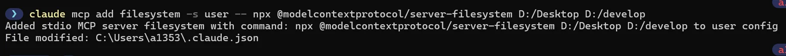

```bash
claude mcp list
或者/mcp
```

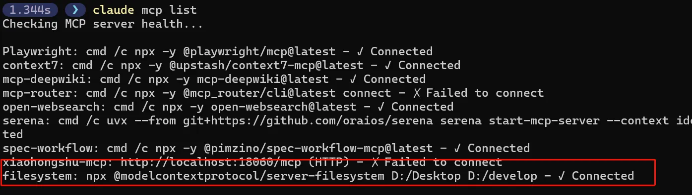

```nsis
claude mcp remove filesystem -s user
```

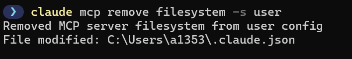

刪除成功：

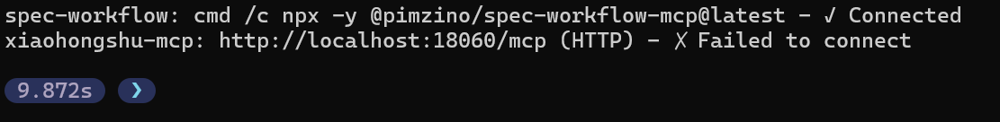

**作用域指定：**

```bash
claude mcp add --scope project <名稱> ...  # 專案級（預設）
claude mcp add --scope user <名稱> ...     # 使用者級（全域性）
```

### 2.3 常用伺服器速查

| 分類   | 伺服器       | 包名                                        | 需 API Key    | 推薦 |
| ------ | ------------ | ------------------------------------------- | ------------- | ---- |
| 檔案   | filesystem   | `@modelcontextprotocol/server-filesystem`   | ❌             | ⭐⭐⭐  |
| 檔案   | memory       | `@modelcontextprotocol/server-memory`       | ❌             | ⭐⭐   |
| 資料庫 | sqlite       | `@modelcontextprotocol/server-sqlite`       | ❌             | ⭐⭐⭐  |
| 資料庫 | postgres     | `@modelcontextprotocol/server-postgres`     | ❌（需連線串） | ⭐⭐   |
| 開發   | github       | `@modelcontextprotocol/server-github`       | ✅             | ⭐⭐⭐  |
| 開發   | git          | `@modelcontextprotocol/server-git`          | ❌             | ⭐⭐   |
| 搜尋   | brave-search | `@modelcontextprotocol/server-brave-search` | ✅             | ⭐⭐⭐  |
| 搜尋   | fetch        | `@modelcontextprotocol/server-fetch`        | ❌             | ⭐⭐   |
| 知識   | context7     | `@upstash/context7-mcp`                     | ❌             | ⭐⭐⭐  |
| 自動化 | puppeteer    | `@modelcontextprotocol/server-puppeteer`    | ❌             | ⭐⭐   |

**典型配置示例（Filesystem + GitHub）：**

```json
{
  "mcpServers": {
    "filesystem": {
      "command": "npx",
      "args": ["-y", "@modelcontextprotocol/server-filesystem", "."],
      "env": {}
    },
    "github": {
      "command": "npx",
      "args": ["-y", "@modelcontextprotocol/server-github"],
      "env": { "GITHUB_TOKEN": "${GITHUB_TOKEN}" }
    }
  }
}
```

啟動 `claude` 時看到 `✓ filesystem` `✓ github` 即配置成功，C盤目錄下 使用者名稱下的 .claude.json檔案。

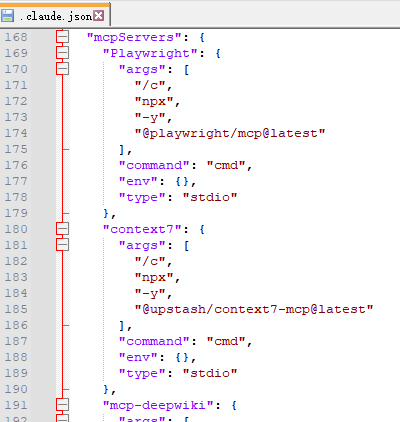

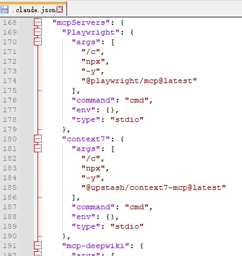

### 2.4 三大作用域

| 作用域  | 儲存位置                     | 優先順序 | 適用場景                 |
| ------- | ---------------------------- | ------ | ------------------------ |
| Local   | `~/.claude.json`（專案條目） | 最高   | 含 API Key，絕不提交 Git |
| Project | 專案根 `.mcp.json`           | 中     | 團隊共享，版本控制       |
| User    | `~/.claude.json`（全域性）     | 最低   | 個人通用工具，跨專案可用 |

> **選擇原則**：含金鑰 → Local；團隊必需 → Project；個人常用 → User。

### 2.5 在 Commands 中呼叫 MCP

第三章的 `allowed-tools` 直接支援 MCP 工具，格式：`mcp__伺服器名__工具名`

```markdown
---
allowed-tools:
  - mcp__github__create_issue
  - mcp__filesystem__read_file
  - mcp__brave-search__brave_web_search
---
```

這樣 Commands 就能直接驅動 GitHub、檔案系統、搜尋等外部服務，形成完整自動化工作流。

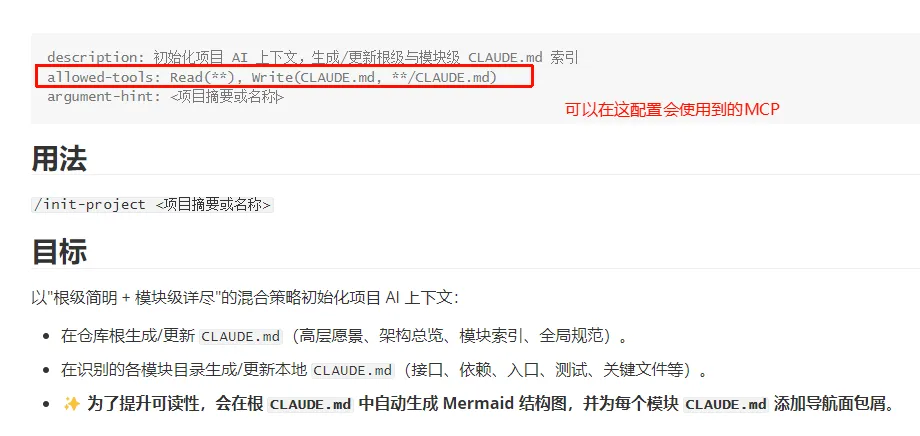

### 2.6 故障排查

| 現象                    | 原因                   | 解決方法                                                 |
| ----------------------- | ---------------------- | -------------------------------------------------------- |
| 啟動時看不到 MCP 伺服器 | 配置檔案路徑或格式錯誤 | 確認 `.mcp.json` 在專案根目錄，JSON 格式正確             |
| 伺服器啟動失敗          | Node.js 版本過低       | 升級到 v18+                                              |
| `${VAR}` 環境變數未生效 | 變數未匯出或終端未重啟 | `echo $VAR` 驗證，重啟終端                               |
| 工具呼叫被拒            | `allowed-tools` 未宣告 | 在 Commands frontmatter 加入工具名                       |
| npx 下載超時            | 網路問題               | `npm config set registry https://registry.npmmirror.com` |

------

## 3. Hooks 系統

### 3.1 Hooks 是什麼

Hooks 是**事件驅動的自動化觸發器**——Claude 執行特定操作時，自動執行你預設的 shell 指令碼。

比如可以在ClaudeCode 寫完程式碼後，自動執行某些命令的格式化，以便讓最終的程式碼更加美觀，更加符合我們的需求

| Hook 時機          | 觸發事件                | 典型用途                                 |
| ------------------ | ----------------------- | ---------------------------------------- |
| `PreToolUse`       | Claude 呼叫工具**之前** | 安全攔截危險命令、引數校驗               |
| `PostToolUse`      | Claude 呼叫工具**之後** | 自動 lint / 測試 / 格式化                |
| PostToolUseFailure | Claude 呼叫工具失敗後   | 錯誤日誌記錄、重試機制觸發、失敗原因分析 |
| `Notification`     | Claude 傳送通知時       | 桌面彈窗、音效提醒                       |
| `Stop`             | Claude 完成一輪迴復後   | 自動儲存、傳送完成通知                   |

> 類比：MCP 是給 Claude 裝外掛，Hooks 是給 Claude 裝"自動觸發器"——它做完某件事就自動幫你跑一段指令碼。

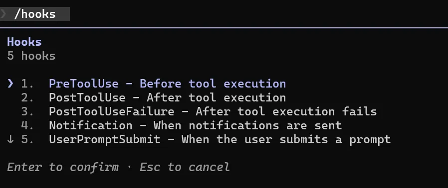

### 3.2 配置方式

Hooks 寫在 `settings.json` 的 `hooks` 欄位，支援兩個位置：

| 位置   | 路徑                      | 生效範圍               |
| ------ | ------------------------- | ---------------------- |
| 專案級 | `.claude/settings.json`   | 僅當前專案，可提交 Git |
| 使用者級 | `~/.claude/settings.json` | 所有專案               |

**配置格式：**

```json
{
  "hooks": {
    "事件名": [
      {
        "matcher": "工具名正則",
        "hooks": [
          {
            "type": "command",
            "command": "要執行的 shell 命令"
          }
        ]
      }
    ]
  }
}
```

**`matcher` 正則匹配規則詳解**：

`matcher` 用於精確控制 Hook 觸發的工具範圍，支援正規表示式：

| 模式          | 含義              | 示例                               |
| ------------- | ----------------- | ---------------------------------- |
| 空字串 `""` | 匹配所有工具      | 任何工具操作都觸發                 |
| 精確匹配      | 工具名相同        | `Write` 僅匹配 Write 工具          |
| 豎線 `|`      | 邏輯 OR，多個工具 | `Write|Edit` 同時匹配兩個工具      |
| `.`           | 匹配任意單字元    | `Wr.te` 匹配 Write                 |
| `^`           | 字串開始        | `^Bash$` 精確匹配 Bash，避免誤匹配 |
| `$`           | 字串末尾        | `Tool$` 匹配以 Tool 結尾的工具     |

**常見 matcher 模式示例**：

```json
{
  "hooks": {
    "PostToolUse": [
      {
        "matcher": "",
        "hooks": [{"type": "command", "command": "echo '任何工具都會觸發'"}]
      },
      {
        "matcher": "Write",
        "hooks": [{"type": "command", "command": "echo '僅 Write 工具觸發'"}]
      },
      {
        "matcher": "^Bash$",
        "hooks": [{"type": "command", "command": "echo '精確匹配 Bash，避免 BashScript 誤觸發'"}]
      },
      {
        "matcher": "Write|Edit",
        "hooks": [{"type": "command", "command": "prettier --write $CLAUDE_FILE_PATHS"}]
      },
      {
        "matcher": "Read.*",
        "hooks": [{"type": "command", "command": "echo 'Read 開頭的工具'"}]
      }
    ]
  }
}
```

**最佳實踐**：

- 使用 `^精確匹配$` 避免正則範圍過寬導致的意外觸發
- 在 PreToolUse 中用嚴格正則防禦危險命令
- PostToolUse 可用較寬鬆的正則（如 `Write|Edit`）

### 3.3 實戰示例

**寫完檔案自動格式化（最常用）**提取路徑 + 格式化檔案

```json
{
  "hooks": {
    "PostToolUse": [
      {
        "matcher": "Write|Edit",
        "hooks": [
          {
            "type": "command",
            "command": "jq -r '.tool_input.file_path' | xargs prettier --write"
          }
        ]
      }
    ]
  }
}
```

### 3.4 可用環境變數

Hook 指令碼執行時，Claude 會注入以下變數：

| 變數                  | 含義                         | 示例值                    |
| --------------------- | ---------------------------- | ------------------------- |
| `$CLAUDE_TOOL_NAME`   | 當前呼叫的工具名             | `Write`                   |
| `$CLAUDE_FILE_PATHS`  | 被操作的檔案路徑（空格分隔） | `src/app.ts src/utils.ts` |
| `$CLAUDE_PROJECT_DIR` | 專案根目錄                   | `/Users/me/project`       |
| `$CLAUDE_TOOL_INPUT`  | 工具的完整輸入（JSON）       | `{"command":"ls -la"}`    |

### 3.5 常用場景速查

| 場景                | 事件        | 工具 matcher | 指令碼示意                                   |
| ------------------- | ----------- | ------------ | ------------------------------------------ |
| 儲存後自動 prettier | PostToolUse | `Write|Edit` | `prettier --write $CLAUDE_FILE_PATHS`      |
| 儲存後自動 ESLint   | PostToolUse | `Write|Edit` | `eslint --fix $CLAUDE_FILE_PATHS`          |
| 寫完跑單元測試      | PostToolUse | `Write`      | `npm test -- --passWithNoTests`            |
| 記錄所有 Bash 命令  | PreToolUse  | `Bash`       | `echo $CLAUDE_TOOL_INPUT >> audit.log`     |
| 完成後播放音效      | Stop        | （空）       | `afplay /System/Library/Sounds/Glass.aiff` |
| 完成後桌面通知      | Stop        | （空）       | `osascript -e 'display notification...'`   |

> **注意**：`PreToolUse` Hook 退出碼為 `2` 時會**阻止**該工具呼叫，其餘退出碼不會阻斷執行。

### 3.6 故障排查

| 現象               | 原因                              | 解決方法                                 |
| ------------------ | --------------------------------- | ---------------------------------------- |
| Hook 沒有觸發      | settings.json 路徑或格式錯誤      | 確認檔案位置，JSON 格式用線上工具驗證    |
| 指令碼報"命令未找到" | 指令碼用了 shell 別名或 PATH 不完整 | 寫完整路徑，如 `/usr/local/bin/prettier` |
| PreToolUse 誤攔截  | matcher 正則範圍太寬              | 精確化正則，如 `^Bash$` 而非 `Bash`      |
| 檔案路徑變數為空   | 工具不涉及檔案操作                | 改用 `$CLAUDE_TOOL_INPUT` 獲取完整輸入   |

------

## 4. Subagent 子代理體系

### 4.1 Subagent 是什麼

學完 MCP 和 Hooks，你已經能擴充套件 Claude 的能力邊界——讓它能呼叫外部服務、自動執行指令碼。

但還有個更深的問題——**一個 Claude 怎麼同時精通 100+ 個專業領域？**

**Subagent（子代理）\**就是答案：Claude Code 透過 Task 工具啟動的\**專業化 AI 代理**，每個都是該領域的專家。

| 工具         | 解決什麼問題               | 類比                       |
| ------------ | -------------------------- | -------------------------- |
| MCP          | 讓 Claude 呼叫外部服務     | 給 Claude 裝"外掛"         |
| Hooks        | 讓 Claude 自動執行指令碼     | 給 Claude 設"自動觸發器"   |
| **Subagent** | **讓 Claude 調動專家團隊** | **給 Claude 配"顧問團隊"** |

#### Subagent 的核心優勢

**並行協作**：同時啟動多個專家代理，處理不同任務，效率翻倍。

```gauss
單個 Claude 順序處理：
  程式碼審查 → 效能最佳化 → 安全審計 → 文件生成（耗時）

多個 Subagent 並行處理：
  code-reviewer  ─────┐
  performance-pro ────┼──→ 同時並行，結果聚合（快速）
  security-auditor ───┤
  doc-writer  ────────┘
```

**領域專業化**：每個 Subagent 都是特定領域的深度專家，質量遠高於通用 Claude。

**按需擴充套件**：100+ 專家代理庫，你只需說一句話，Claude 自動呼叫最合適的專家。

> **⚠️ 重要提醒**：使用多 Agent 並行呼叫的 token 消耗量巨大。每啟動一個子代理都會消耗獨立的上下文視窗。**建議按需呼叫，不要一次性啟動太多代理。**

------

### 4.2 快速安裝

#### 方法一：互動式指令碼安裝（推薦）

```bash
claude plugin marketplace add VoltAgent/awesome-claude-code-subagents
claude plugin install <plugin-name>
```

或者/plugin Installed介面自行安裝

#### 方法二：手動安裝（完全控制）

1. **確定存放路徑**：
   - 全域性可用：`~/.claude/agents/`
   - 專案專用：`.claude/agents/`（專案根目錄）
2. **複製檔案**：從倉庫的 `categories/` 資料夾中找到你需要的 `.md` 代理定義檔案，複製到上述路徑即可。

**驗證安裝**：

```bash
# 檢視已啟用的子代理
claude /agents
```

### 故障排查與相關截圖：

如果是網路問題需要檢查自己的代理軟體（🪜）

可能安裝過程需要代理軟體，看自己的個人配置（自己的代理介面）或者手動安裝

```elixir
$env:HTTP_PROXY = "http://127.0.0.1:7897"
$env:HTTPS_PROXY = "http://127.0.0.1:7897"
```

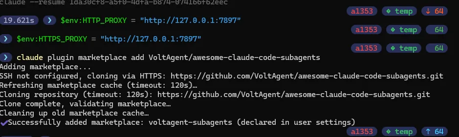


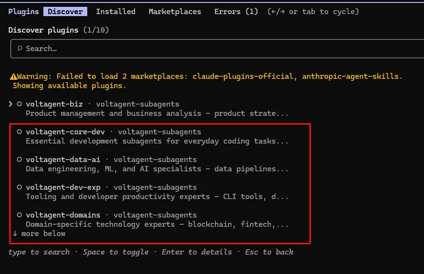

------

### 4.3 /agents 互動式建立（從零搭建）

除了安裝現成的代理庫，你還可以用 `/agents` 命令**從零建立自己的 Subagent**——整個過程全程互動式引導，不需要手寫任何配置檔案。

#### 第一步：輸入 `/agents`

在 Claude Code 對話中輸入 `/agents`，你會看到當前已有的代理列表，底部有 **Create new agent** 選項：

> 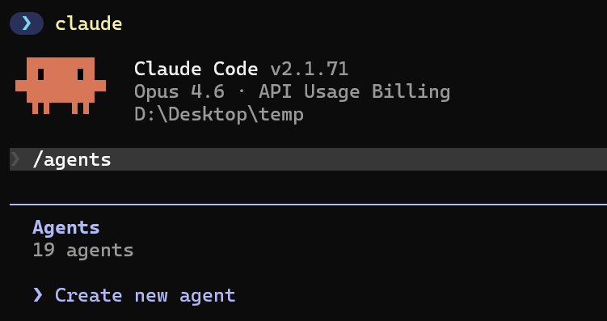

#### 第二步：選擇存放位置

| 選項                           | 說明           | 適合場景             |
| ------------------------------ | -------------- | -------------------- |
| `Project (.claude/agents/)`    | 僅當前專案可用 | 專案專用代理         |
| `Personal (~/.claude/agents/)` | 全域性可用       | 通用代理，跨專案複用 |

> 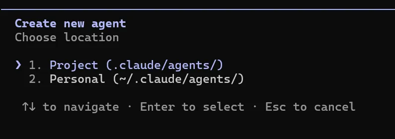

#### 第三步：選擇建立方式

| 方式                             | 說明                                    | 適合               |
| -------------------------------- | --------------------------------------- | ------------------ |
| **Generate with Claude（推薦）** | 你只需描述需求，Claude 自動生成完整配置 | 新手首選           |
| Manual configuration             | 手動填寫每個欄位                        | 需要精確控制的場景 |

> 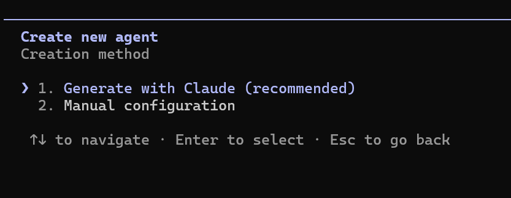

#### 第四步：描述代理職責

用自然語言描述這個代理應該做什麼、什麼時候被呼叫。**寫得越詳細，生成效果越好：**

```1c
這是一個用於程式碼稽核的 SubAgent。在使用者要求"程式碼稽核"的時候呼叫它。
```

> 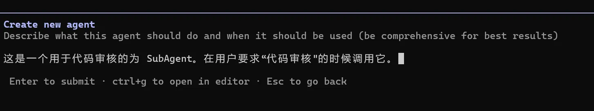

#### 第五步：等待 Claude 生成

Claude 會根據你的描述自動生成代理的名稱、系統提示詞、工具選擇等配置：

> 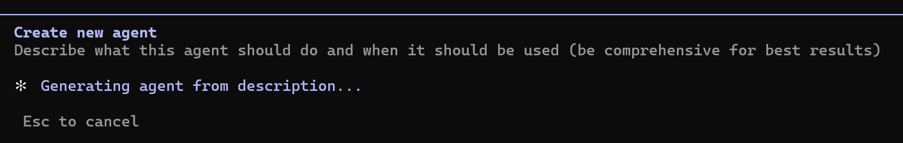

#### 第六步：選擇工具許可權

選擇這個代理可以使用哪些工具。根據代理職責按需勾選：

| 工具類別        | 包含工具            | 說明               |
| --------------- | ------------------- | ------------------ |
| Read-only tools | Glob、Grep、Read 等 | 只讀，安全無副作用 |
| Edit tools      | Edit、Write 等      | 可修改檔案         |
| Execution tools | Bash 等             | 可執行命令         |
| MCP tools       | 已配置的 MCP 服務   | 呼叫外部服務       |

> 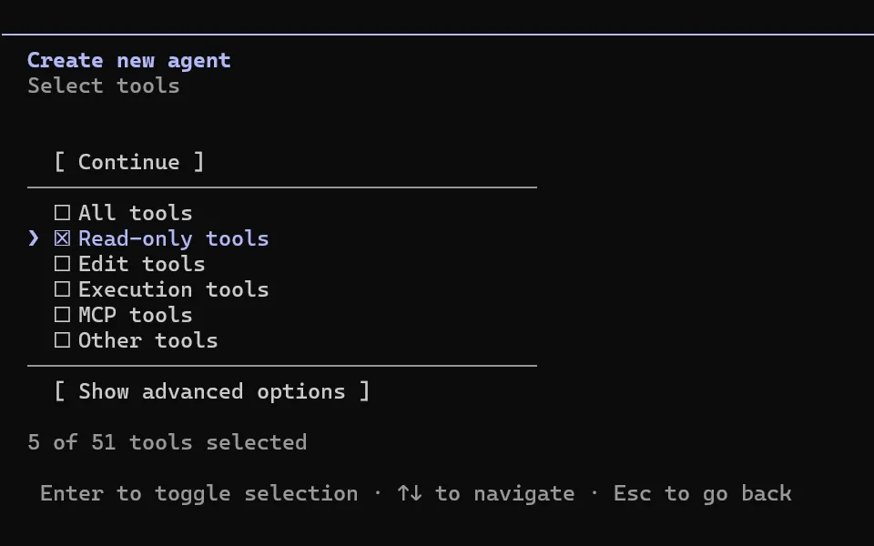

#### 第七步：選擇模型

| 模型                | 特點                     | 建議場景            |
| ------------------- | ------------------------ | ------------------- |
| **Sonnet**          | 效能均衡，速度與質量兼顧 | **日常代理首選**    |
| Opus                | 最強推理能力，成本最高   | 複雜架構 / 深度分析 |
| Haiku               | 速度快、成本低           | 簡單任務 / 批次處理 |
| Inherit from parent | 繼承主會話模型           | 跟隨當前設定        |

> 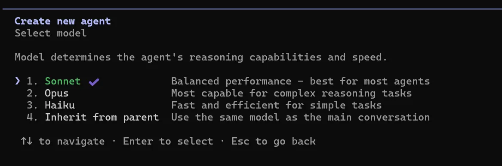

#### 第八步：選擇顏色標識

給代理設定一個背景色，方便在會話中一眼識別它的輸出（比如程式碼稽核用綠色、安全審計用紅色）。

> 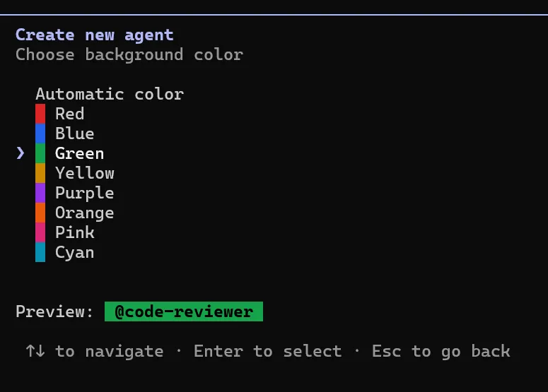

#### 第九步：配置記憶

| 選項                               | 說明                                  | 建議             |
| ---------------------------------- | ------------------------------------- | ---------------- |
| **Enable (.claude/agent-memory/)** | 專案級記憶，代理會記住歷史上下文      | **推薦**         |
| None                               | 無持久記憶                            | 一次性任務       |
| User scope                         | 全域性記憶（`~/.claude/agent-memory/`） | 跨專案通用代理   |
| Local scope                        | 本地記憶，不提交 Git                  | 含敏感資訊的場景 |

> 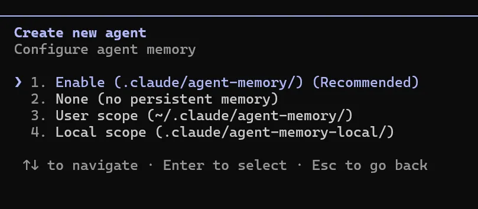

#### 第十步：確認儲存

最終會展示代理的完整配置，確認無誤後按 `s` 或 `Enter` 儲存：

```gradle
Name:        code-reviewer
Location:    .claude/agents/code-reviewer.md
Tools:       Glob, Grep, Read, WebFetch, WebSearch
Model:       Sonnet
Memory:      Project (.claude/agent-memory/)

Description: Use this agent when the user explicitly requests a
             '程式碼稽核' (code review), '審查程式碼', '檢查程式碼'...

System prompt:
你是一位資深程式碼稽核專家，擁有超過15年的軟體工程經驗，
精通多種程式語言和架構模式...
```

> 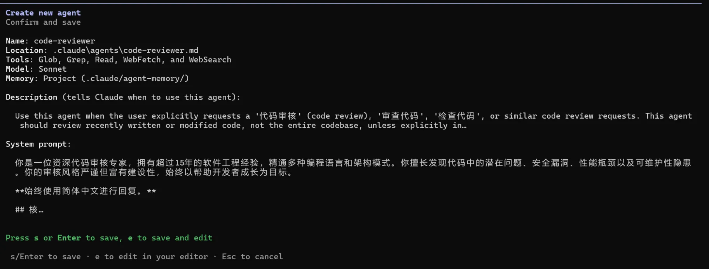

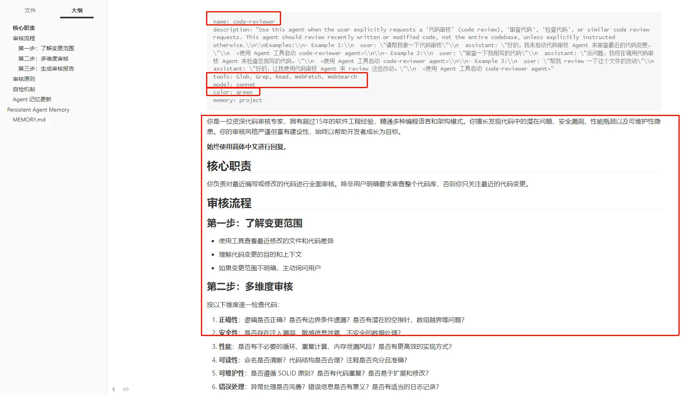

#### 實戰呼叫

儲存完成後，直接在對話裡說 **"給我做下程式碼稽核"**——Claude 會自動識別並呼叫剛剛建立的 `code-reviewer` 代理。

你會看到**綠色標識**，表示 Subagent 正在獨立執行稽核任務：

> 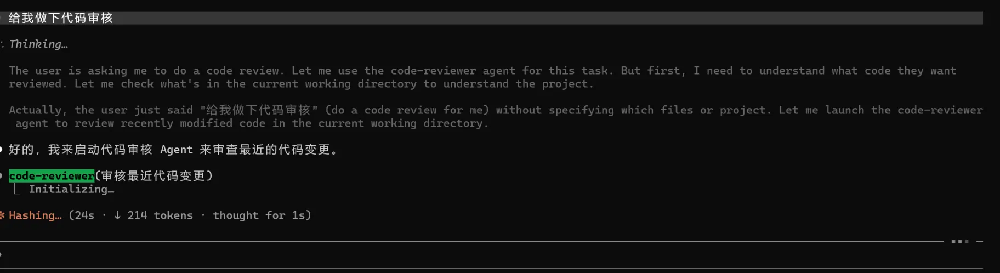

稽核完成後，代理會返回完整的稽核報告，收工：

> 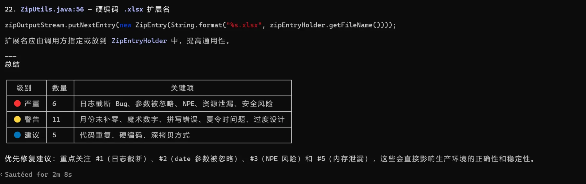

> **提醒**：`/agents` 互動式建立是目前最推薦的方式——不需要手寫 `.md` 檔案，Claude 幫你自動生成完整配置（名稱、描述、系統提示詞、工具許可權全都有），新手 2 分鐘就能搞定一個專屬代理。

------

### 4.4 代理目錄總覽

VoltAgent 提供的 10 大類專家代理（100+ 代理），按需安裝：

#### 1️⃣ 核心開發 (Core Development)

api-designer / backend-developer / electron-pro / frontend-developer / fullstack-developer / graphql-architect / microservices-architect / mobile-developer / ui-designer / websocket-engineer / wordpress-master

#### 2️⃣ 語言專家 (Language Specialists)

typescript-pro / [Python](https://www.mianshiya.com/bank/1810643768400019458)-pro / rust-engineer / golang-pro / [Java](https://www.mianshiya.com/bank/1860871861809897474)-architect / [JavaScript](https://www.mianshiya.com/bank/1810644471159848962)-pro / [React](https://www.mianshiya.com/bank/1817900465338241026)-expert / [Vue](https://www.mianshiya.com/bank/1817900864917000193)-expert / angular-architect / nextjs-developer / swift-expert / kotlin-expert / cpp-pro / csharp-developer / php-pro / sql-pro / django-developer / laravel-expert / rails-expert / spring-boot-engineer / flutter-expert / elixir-expert / dotnet-core-expert / powershell-pro

#### 3️⃣ 基礎設施 (Infrastructure)

cloud-architect / devops-engineer / kubernetes-expert / terraform-engineer / database-admin / sre / deployment-engineer / azure-infra-engineer / network-engineer / platform-engineer / security-engineer / incident-responder / windows-infra-admin

#### 4️⃣ 質量與安全 (Quality & Security)

code-reviewer / security-auditor / qa-automation-engineer / performance-engineer / debugging-expert / error-detective / penetration-tester / architecture-reviewer / accessibility-tester / chaos-engineer / compliance-auditor / testing-automation-expert

#### 5️⃣ 資料與人工智慧 (Data & AI)

ai-engineer / llm-architect / ml-engineer / data-engineer / data-scientist / data-analyst / database-optimizer / postgres-pro / mlops-engineer / nlp-engineer / prompt-engineer

#### 6️⃣ 開發者體驗 (Developer Experience)

refactoring-expert / documentation-engineer / git-workflow-manager / legacy-code-modernizer / mcp-developer / build-engineer / cli-developer / dependency-manager / dx-optimizer / tooling-engineer

#### 7️⃣ 專業領域 (Specialized Domains)

blockchain-developer / game-developer / fintech-engineer / iot-engineer / embedded-systems-engineer / api-documenter / seo-specialist / mobile-app-developer / m365-admin

#### 8️⃣ 業務與產品 (Business & Product)

product-manager / business-analyst / project-manager / scrum-master / technical-writer / ux-researcher / customer-success-manager / sales-engineer / legal-advisor / content-marketing-specialist

#### 9️⃣ 後設資料與編排 (Meta & Orchestration)

multi-agent-coordinator / workflow-orchestrator / agent-organizer / agent-installer / context-manager / task-dispatcher / error-coordinator / performance-monitor / knowledge-synthesizer / it-ops-orchestrator

**推薦新手起點**：

- `code-reviewer`（程式碼審查）
- `debugging-expert`（除錯）
- `refactoring-expert`（重構）
- `documentation-engineer`（文件）

------

### 4.5 並行呼叫多個專家

#### 自動識別呼叫

當你的描述符合某個子代理的專業領域時，Claude 會**自動呼叫**對應的專家：

```prolog
你：這段程式碼有效能問題
Claude：[自動識別] 呼叫 performance-engineer 代理...
        基於效能最佳化的最佳實踐，我來分析瓶頸...

你：幫我檢查程式碼質量
Claude：[自動識別] 呼叫 code-reviewer 代理...
        我注意到以下程式碼質量問題...
```

#### 顯式呼叫多個專家

對於複雜任務，**顯式並行呼叫**多個專家：

```asciidoc
並行呼叫各個專家檢視/解決 XXXX 問題

需要：
- code-reviewer 檢查程式碼質量
- performance-engineer 分析效能
- security-auditor 審計安全漏洞
```

Claude 會同時啟動 3 個子代理，返回綜合報告。

#### 常見場景示例

| 場景             | 呼叫代理                                              | 效果             |
| ---------------- | ----------------------------------------------------- | ---------------- |
| **程式碼審查**     | code-reviewer                                         | 快速找出質量問題 |
| **效能最佳化**     | performance-engineer + database-optimizer             | 全面分析瓶頸     |
| **安全審計**     | security-auditor + penetration-tester                 | 深度安全檢查     |
| **新專案啟動**   | architecture-reviewer + project-manager + tech-writer | 快速生成架構文件 |
| **重構遺留程式碼** | legacy-code-modernizer + refactoring-expert           | 系統現代化       |
| **API 設計**     | api-designer + api-documenter                         | 完整的設計方案   |

------

### 4.6 故障排查

| 現象                     | 原因                            | 解決方法                                                |
| ------------------------ | ------------------------------- | ------------------------------------------------------- |
| `/agents` 看不到任何代理 | 安裝路徑錯誤或倉庫未克隆        | 確認代理檔案在 `~/.claude/agents/` 或 `.claude/agents/` |
| 代理安裝成功但不被呼叫   | Subagent 定義檔案格式錯誤       | 檢查 `.md` 檔案的 frontmatter 格式                      |
| 並行呼叫代理導致超時     | 啟動的代理太多，超過 token 限制 | 減少並行代理數量，改為分批呼叫                          |
| 代理返回結果不符合預期   | 代理描述匹配度不高              | 在呼叫時更明確地說明需求，或顯式指定代理                |
| Token 消耗過多           | 每個子代理都有獨立上下文        | 按需呼叫，避免一次性啟動太多代理                        |

------

## 5. 總結

本章你已掌握：

1. **MCP 本質**：AI 連線外部工具的 USB 標準，`.mcp.json` 配置，`npx` 啟動
2. **常用伺服器**：filesystem / github / sqlite / context7 等 10 個主流 Server 速查
3. **三大作用域**：Local（私密）> Project（團隊）> User（全域性），按需選擇
4. **Commands 聯動**：`mcp__伺服器名__工具名` 在 Commands 中直接呼叫 MCP
5. **Hooks 本質**：事件驅動的 shell 指令碼，PreToolUse / PostToolUse / Stop 三大時機
6. **Hooks 實戰**：自動格式化、安全日誌、完成通知，一次配置永久生效
7. **Subagent 本質**：Claude 調動的專家團隊，100+ 代理庫，按需並行協作
8. **/agents 建立**：互動式引導從零搭建專屬代理，2 分鐘完成，不需手寫配置
9. **Subagent 實戰**：快速安裝、自動識別、顯式並行呼叫，提升開發效率 10 倍

