# 第五章：Skills定製——給Claude裝上專屬能力包

## 1. 前言

學完 Commands，你已經能把重複提示詞壓縮成一個命令。

但有個更深的問題——**Commands 是一次性觸發，沒有記憶，不能積累知識**。每次換個專案、換個場景，還得從零教 Claude。

**Skills 就是突破這個邊界的答案：**

| 對比     | Commands             | Skills              |
| -------- | -------------------- | ------------------- |
| 定位     | 觸發器（按鈕）       | 能力包（APP）       |
| 知識容量 | 幾百到幾千字         | 可達數萬字          |
| 觸發方式 | 必須顯式輸入 `/命令` | 自動識別 + 顯式呼叫 |
| 指令碼整合 | 有限                 | 支援 Python/JS 指令碼 |
| 可維護性 | 簡單直接             | 模組化分層          |

> 類比：Commands 是快捷鍵，Skills 是手機裡的 APP——裝上之後，Claude 瞬間變成該領域專家。

------

## 2. Skills 核心概念

### 2.1 Skills 是什麼

Skills 是 Claude Code 的**"能力 APP"**——把特定領域的知識、規則、工具打包成可複用的模組。

**沒有 Skills 的困境**：

```jboss-cli
你：幫我寫一篇電子報文章
Claude：好的，請問什麼風格？字數多少？有什麼特殊要求？

...下次對話...

你：再幫我寫一篇
Claude：好的，請問什麼風格？（又從零開始）
```

**有了 Skills 之後**：

```prolog
你：幫我寫一篇電子報文章
Claude：[自動載入電子報寫作 Skill，讀取風格規範、爆款公式]
       好的！基於你的寫作規範，我來幫你...
```

Skills 的核心價值：

| 場景       | 效果                         |
| ---------- | ---------------------------- |
| 領域專業化 | 預置大量領域知識，即用即專業 |
| 團隊協作   | 一次配置，全員共享標準       |
| 知識積累   | 集中管理，版本可控           |
| 質量一致   | 標準化流程，輸出穩定         |

### 2.2 Skills vs Commands

**一句話區分**：Commands 是"入口"，Skills 是"能力"，兩者通常配合使用。

| 對比維度 | Commands（斜槓命令） | Skills（能力包） |
| -------- | -------------------- | ---------------- |
| 檔案結構 | 單個 `.md` 檔案      | 多檔案目錄       |
| 觸發方式 | 必須輸入 `/命令名`   | 關鍵詞自動識別   |
| 狀態管理 | 無狀態               | 可維護配置和狀態 |
| 工具整合 | 寫在 `.md` 裡        | 可呼叫外部指令碼   |
| 適用場景 | 單一任務             | 複雜工作流       |

**協作關係**：

```applescript
使用者輸入
   │
   ├──→ Commands（觸發層）：/write 電子報文章
   │          │
   │          ▼
   └──→ Skills（能力層）：自動載入寫作規範、呼叫指令碼
```

最佳實踐：

- 簡單任務 → 直接用 Command
- 複雜工作流 → Command 作入口 + Skill 提供能力

### 2.3 漸進式披露原理

Skills 採用**按需載入**設計，核心思想：只在使用者需要時才展示覆雜功能，避免記憶體浪費。

| 層級           | 內容                                        | 何時載入     | 記憶體佔用         |
| -------------- | ------------------------------------------- | ------------ | ---------------- |
| 第一層：後設資料 | YAML Frontmatter 的 `name` 和 `description` | 始終常駐     | 極小（<100位元組） |
| 第二層：指令   | SKILL.md 的 Markdown Body                   | Skill 啟用時 | 按需載入         |
| 第三層：資源   | `scripts/`、`templates/`、`config/`         | 呼叫時才讀取 | 用完即釋放       |

> 這就是為什麼有幾十個 Skills 也不會拖慢 Claude——後設資料極小，詳細內容按需載入。

------

## 3. 準備工作

### 3.1 賬號要求

| 賬戶型別          | Skills 支援 | 說明             |
| ----------------- | ----------- | ---------------- |
| Claude Pro        | ✅ 支援      | 推薦，功能最完整 |
| Claude Teams      | ✅ 支援      | 企業使用者推薦     |
| Claude Enterprise | ✅ 支援      | 企業級，功能最強 |
| 免費版            | ❌ 不支援    | 暫無此功能       |

### 3.2 環境要求

**必需工具**：

- **Claude Desktop**（網頁版或桌面版均可）

  - 下載地址：https://www.anthropic.com/claude-desktop
  - 最低版本：2.0+（推薦最新版）

- **Claude Code CLI**（用於本地開發）

  ```bash
  # 驗證安裝
  claude --version
  
  # 如未安裝，按第一章步驟重新安裝
  ```

- **Python 3.8+**（如需使用指令碼）

  ```bash
  python --version
  ```

------

## 4. 官方 Skills 速查

Anthropic 官方提供的核心技能包：

> **官方資源**：
>
> - [Anthropic 官方 Claude Plugins 倉庫](https://github.com/anthropics/claude-plugins-official)
> - [SkillsMP - Skills 市場](https://skillsmp.com/zh)
> - [ComposioHQ - Awesome Claude Skills 合集](https://github.com/ComposioHQ/awesome-claude-skills)
> - [sickn33 - Antigravity Awesome Skills](https://github.com/sickn33/antigravity-awesome-skills)

| 技能包                  | 功能         | 核心能力                                    | 適用場景                         |
| ----------------------- | ------------ | ------------------------------------------- | -------------------------------- |
| **document-skills**     | 文件處理     | 解析 Excel/Word/PPT/PDF，提取資料，生成報告 | 資料分析、報告自動生成、內容提取 |
| **example-skills**      | 技能開發示例 | Skill 建立模板、MCP 構建示例                | 學習如何開發自定義 Skill         |
| **planning-with-files** | 檔案規劃     | 專案文件整理、任務分解、甘特圖生成          | 專案管理、任務規劃               |
| **frontend-design**     | 前端設計     | UI/UX 設計指導、程式碼生成、元件庫推薦        | 前端開發、設計稿轉程式碼           |

**推薦使用順序**：

1. 先裝 `example-skills` 學習 Skill 開發
2. 根據需求裝 `document-skills`（文件處理最常用）
3. 按場景選裝其他技能包

------

## 5. 安裝 Skills

### 5.1 官方/第三方 Skills 安裝

**方式一：網頁版/桌面版安裝（最簡單）**

```jboss-cli
1. 開啟 Claude 官網或桌面版
2. 進入"設定" → "功能" → "Skills"
3. 找到要啟用的官方技能，點選開關啟用
4. 或點選"上傳技能"，選擇 .skill 檔案上傳第三方技能
```

**方式二：Claude Code CLI 安裝（推薦開發者）**

Step 1：新增官方技能市場 或者透過skills查詢網站進行搜尋自己需要的 自行安裝

[Agent Skills 市場 - Claude、Codex 和 ChatGPT Skills | SkillsMP](https://skillsmp.com/zh)

```bash
/plugin marketplace add anthropics/skills
```

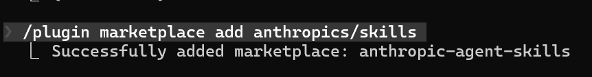

或者透過原空間安裝

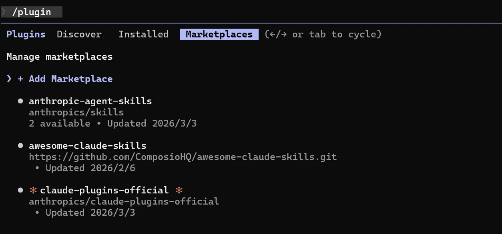

Step 2：安裝官方技能包（可選多個）

```bash
# 文件處理技能（Excel、Word、PPT、PDF 等）
/plugin install document-skills@anthropic-agent-skills

# 示例技能包（學習自定義 Skill 開發的好素材）
/plugin install example-skills@anthropic-agent-skills
```

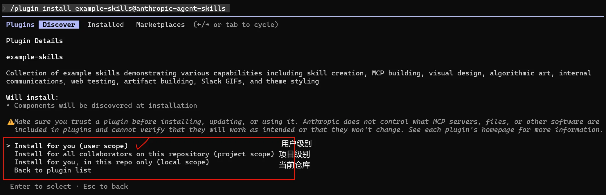

| 選項                                                         | 通俗解釋                                                     | 適用場景                                                 |
| ------------------------------------------------------------ | ------------------------------------------------------------ | -------------------------------------------------------- |
| Install for you (user scope)                                 | **使用者級安裝**：外掛僅對你當前的賬號生效，不管你開啟哪個倉庫 / 專案，都能使用這個外掛 | 個人使用、想在所有專案中用這個示例外掛學習               |
| Install for all collaborators on this repository (project scope) | **專案級安裝**：外掛僅對當前這個程式碼倉庫生效，且倉庫的所有協作者都能看到 / 使用這個外掛 | 團隊協作、僅需要在特定專案中測試示例技能                 |
| Install for you, in this repo only (local scope)             | **本地倉庫級安裝**：外掛僅對你自己生效，且僅在當前這個倉庫中可用 | 只想在某個專案中測試，不想影響其他專案，也不想讓團隊看到 |
| Back to plugin list                                          | 放棄安裝，返回外掛列表                                       | 暫時不想裝這個外掛                                       |

或者在安裝了元空間的 倉庫下 /plugin Discover 選擇自己需要安裝的外掛skills

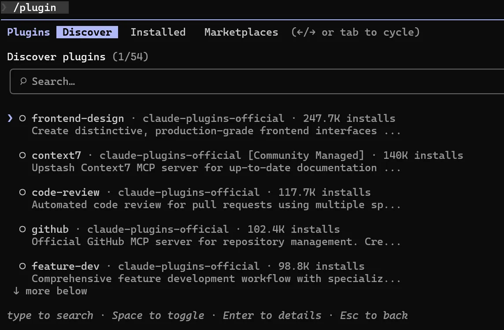

Step 3：重啟 Claude Code 完成啟用

```bash
# 退出並重新啟動
claude
```

**方式三：手動安裝（進階使用者）**

將 Skill 資料夾放置在以下任一位置，Claude 會自動識別：

官方安裝的會在plugins/marketplaces/官方/skills 下

```awk
# 個人級（所有專案可用）
~/.claude/skills/your-skill-name/

# 專案級（僅當前專案可用）
/path/to/project/.claude/skills/your-skill-name/
```

### 5.2 手動安裝skills 實戰

```nix
# 建立外掛目錄（建議放在使用者目錄下，方便查詢）
mkdir -p ~/claude-plugins/connect-apps-plugin
# 進入該目錄
cd ~/claude-plugins/connect-apps-plugin
# 克隆外掛倉庫（如果沒有git，先安裝：brew install git / apt install git）
git clone https://github.com/ComposioHQ/awesome-claude-skills.git .
# cmd 命令複製到 .claude\skills\ 目錄下
xcopy "%USERPROFILE%\claude-plugins\connect-apps-plugin" "%USERPROFILE%\.claude\skills\" /E /H /Y
# 檢查是否安裝
claude
/skills
```

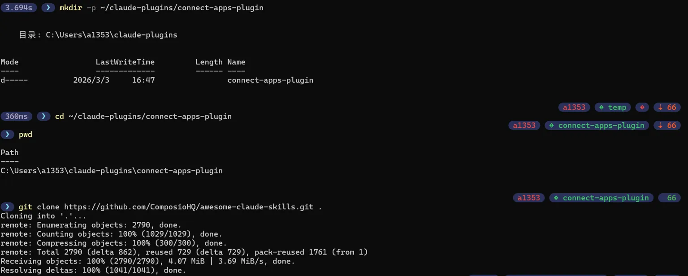

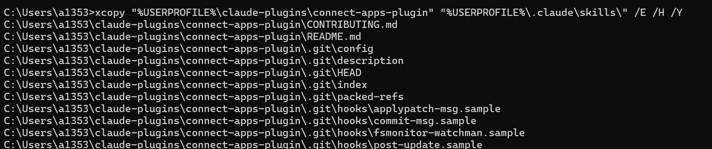

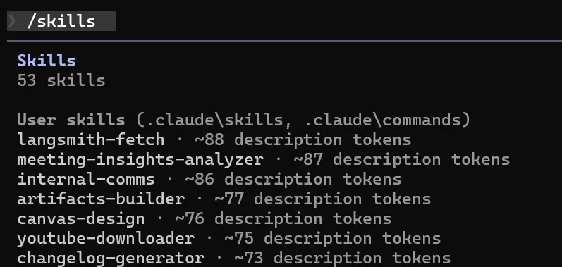

**powershell**

```nix
# 1. 確保目標目錄存在（不存在則建立）
New-Item -Path "~\.claude\skills" -ItemType Directory -Force

# 2. 複製源目錄下的所有檔案/子資料夾到目標目錄（關鍵：末尾加 \*）
Copy-Item -Path "~\claude-plugins\connect-apps-plugin\*" -Destination "~\.claude\skills" -Recurse -Force
```

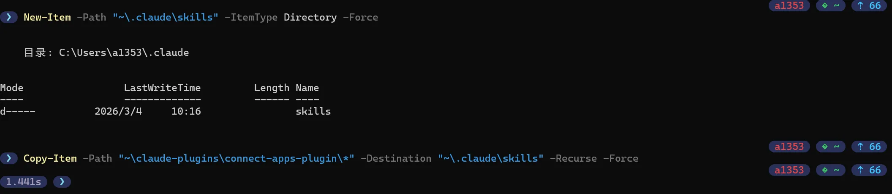

### 5.3 自定義 Skill 開發（本地安裝）

一旦你建立了自定義 Skill，可以透過以下方式安裝：

**放入標準目錄**

```bash
# macOS/Linux
mkdir -p ~/.claude/skills/my-skill
cp -r ./my-skill/* ~/.claude/skills/my-skill/

# Windows PowerShell
New-Item -ItemType Directory -Path "$env:USERPROFILE\.claude\skills\my-skill" -Force
Copy-Item -Recurse ".\my-skill\*" "$env:USERPROFILE\.claude\skills\my-skill\" -Force
```

------

## 6. 建立第一個自定義 Skill

### 6.1 目錄結構

每個 Skill 是 `.claude/skills/` 下的獨立目錄：

```nix
.claude/skills/[skill-name]/
├── SKILL.md          # [必需] 核心定義檔案（YAML後設資料 + Markdown指令）
├── scripts/          # [可選] 工具指令碼（Python/JS）
├── templates/        # [可選] 輸出模板
├── config/           # [可選] 配置檔案
└── data/             # [可選] 靜態資料
```

| 檔案/目錄    | 是否必需 | 用途                    |
| ------------ | -------- | ----------------------- |
| `SKILL.md`   | ✅ 必需   | Skill 的身份證 + 說明書 |
| `scripts/`   | 可選     | 可執行的自動化指令碼      |
| `templates/` | 可選     | 輸出格式模板            |
| `config/`    | 可選     | 執行時配置引數          |

> **命名規範**：目錄名只能用小寫字母、數字、連字元（`-`），不能有空格或下劃線。

### 6.2 SKILL.md 配置詳解

`SKILL.md` 由兩部分組成：**YAML Frontmatter**（機器讀）+ **Markdown Body**（AI 讀）。

**YAML Frontmatter 欄位表**（必填欄位只有 2 個）：

| 欄位          | 型別   | 是否必填 | 說明                                      |
| ------------- | ------ | -------- | ----------------------------------------- |
| `name`        | string | ✅        | Skill 名稱，必須與目錄名一致              |
| `description` | string | ✅        | 觸發場景描述，Claude 用此判斷是否自動啟用 |
| `version`     | string | 可選     | 版本號（如 1.0.0）                        |
| `author`      | string | 可選     | 作者名稱                                  |

**最小配置示例**：

```markdown
---
name: code-commenter
description: 當使用者要求"新增註釋"、"程式碼註釋"或"註釋程式碼"時啟用
---

# 程式碼註釋生成器

## 角色定義
你是一位程式碼審查專家，擅長編寫清晰的中文註釋。

## 註釋原則
- 解釋"為什麼"而不是"是什麼"
- 使用簡潔的中文
- 專業術語保持英文（如 API、JWT）
```

**description 寫法對比**：

| 寫法                                       | 效果                     |
| ------------------------------------------ | ------------------------ |
| ✅ `當使用者要求"新增註釋"或"程式碼註釋"時啟用` | 明確觸發詞，自動識別準確 |
| ❌ `程式碼註釋工具`                           | 太模糊，自動啟用不準     |

**Markdown Body 推薦結構**：

```markdown
# Skill 名稱

## 一、角色定義
[AI 扮演的角色和專業背景]

## 二、核心能力
[列出 3-5 個核心能力]

## 三、工作流程
### 步驟1：[名稱]
[詳細說明]

## 四、規則約束
[必須遵守的規則]

## 五、輸出格式
[輸出結構定義]
```

### 6.3 實戰：5分鐘建立程式碼註釋 Skill

**Step 1：建目錄**

```bash
# macOS / Linux
mkdir -p .claude/skills/code-commenter

# Windows PowerShell
New-Item -ItemType Directory -Path ".claude\skills\code-commenter" -Force
```

**Step 2：建立 SKILL.md**

建立檔案 `.claude/skills/code-commenter/SKILL.md`：

~~~markdown
---
name: code-commenter
description: 當使用者要求"新增註釋"、"給程式碼加註釋"或"註釋程式碼"時，自動為程式碼新增清晰的中文註釋
---

# 程式碼註釋生成器

## 角色定義
你是一位經驗豐富的程式碼審查專家，擅長編寫清晰、準確、有價值的程式碼註釋。

## 何時啟用
當使用者說以下內容時啟用本 Skill：
- "幫我新增註釋"
- "給這段程式碼加註釋"
- "comment this code"

## 註釋原則

### 1. 解釋"為什麼"而不是"是什麼"
```python
# ❌ 差：迴圈遍歷列表
for item in items:
    process(item)

# ✅ 好：過濾已過期訂單，避免重複發貨
for item in items:
    process(item)
~~~

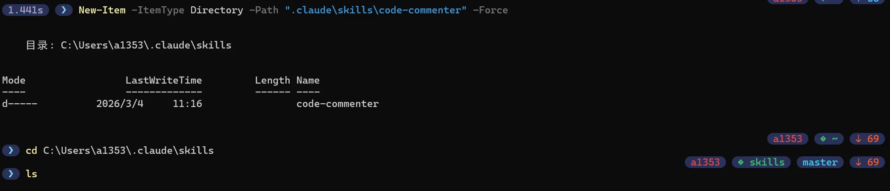

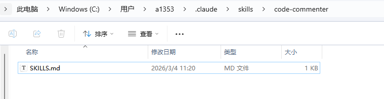

### 2. 註釋格式規範

- **函式/方法**：說明功能、引數、返回值
- **複雜邏輯**：解釋業務背景
- **魔法數字**：說明數值含義（如 86400 = 24小時）

### 3. 語言要求

- 使用簡潔中文
- 專業術語保持英文（如 API、JWT、JSON）

### 6.4 測試 Skill

**Step 1：啟動 Claude Code**

```bash
claude
```

**Step 2：測試觸發**

在對話中輸入：

```kotlin
幫我給這段程式碼新增註釋

def calculate_discount(price, user_level):
    if user_level == "vip":
        return price * 0.8
    elif user_level == "svip":
        return price * 0.7
    else:
        return price
```

**Step 3：驗證預期響應**

Claude 應該自動啟用 `code-commenter` Skill，並返回帶詳細中文註釋的程式碼：

```python
def calculate_discount(price, user_level):
    """
    根據使用者等級計算折扣後的價格

    Args:
        price: 原始價格
        user_level: 使用者等級（vip/svip/普通）

    Returns:
        折扣後的價格
    """
    # VIP使用者享受8折優惠
    if user_level == "vip":
        return price * 0.8
    # SVIP使用者享受7折優惠
    elif user_level == "svip":
        return price * 0.7
    # 普通使用者無折扣
    else:
        return price
```

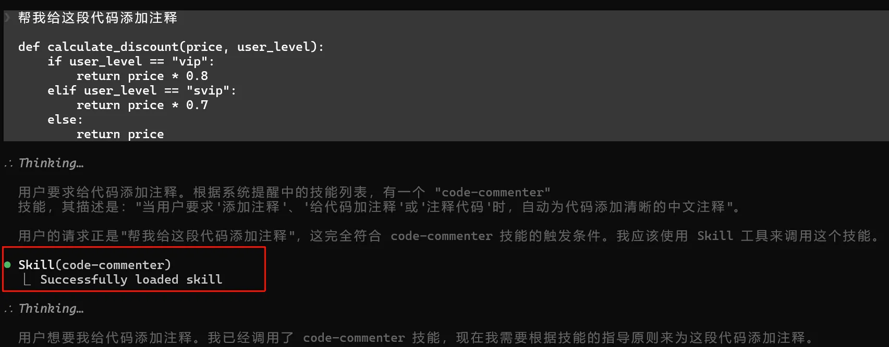

**🎯 Hot Reloading 體驗**

修改 `SKILL.md` 後，**無需重啟 Claude Code**，下次對話時修改會自動生效！

嘗試：

1. 編輯 `.claude/skills/code-commenter/SKILL.md`，修改註釋原則
2. 回到 Claude Code，繼續對話（不用重啟）
3. 觀察新的規則是否立即應用

------

## 7. Skills 使用方法

### 7.1 自動啟用 vs 手動觸發

**自動啟用（推薦）**：

Claude 自動識別使用者輸入中的觸發關鍵詞，啟用對應的 Skill：

```armasm
使用者：幫我給這段程式碼新增註釋
Claude：[自動識別"新增註釋" → 啟用 code-commenter Skill]
```

關鍵是寫好 `description` 欄位，列舉明確的觸發詞：

```yaml
---
name: code-commenter
description: 當使用者要求"新增註釋"、"給程式碼加註釋"或"程式碼註釋"時啟用
---
```

**手動觸發**：

使用者顯式在開始時宣告使用某個 Skill：

```ruby
我需要用 code-commenter Skill，幫我給這段程式碼新增註釋
def calculate():
    ...
```

### 7.2 Skill 互動模式

| 模式         | 使用場景             | 示例                                       |
| ------------ | -------------------- | ------------------------------------------ |
| **單詞觸發** | 一句話啟用，繼續對話 | "幫我新增註釋" → 輸入程式碼 → 自動應用       |
| **鏈式呼叫** | 多個 Skill 協作      | 先用 title-generator → 再用 content-writer |
| **反覆迭代** | 同一 Skill 多次使用  | 生成標題 → 使用者反饋 → 再生成               |

### 7.3 與 Commands 的配合

**最佳實踐**：Command 作為入口，Skill 提供能力

```gauss
命令層：/write 《標題》
   ↓
Skill 層：自動載入 title-generator 和 content-writer
   ↓
輸出：完整文章
```

在 Commands 的 `.md` 中呼叫 Skill：

```markdown
# /write 命令

幫我寫一篇關於「{topic}」的電子報文章。

> 使用 Skill：title-generator + gongzhonghao-writer
```

------

## 8. 進階使用

### 8.1 提示片語織技巧

本節目的：掌握在 SKILL.md 中組織提示詞的最佳實踐。

> **2.10+ 重大變化**：所有提示詞內容統一寫在 SKILL.md 的 Markdown Body 中，無需單獨的 `prompts/` 資料夾。

#### 8.1.1 提示片語織方式

推薦**按功能分章節**組織，保持清晰的層次：

```markdown
# [Skill名稱]

## 一、角色定義
[AI扮演的角色]

## 二、核心能力
[3-5個核心能力列表]

## 三、工作流程
### 步驟1：...
### 步驟2：...

## 四、規則約束
[必須遵守的規則]

## 五、示例展示
[好/壞示例對比]

## 六、輸出格式
[輸出結構定義]
```

#### 8.1.2 章節命名規範

| 命名模式        | 示例                    | 說明       |
| --------------- | ----------------------- | ---------- |
| `## 一、xxx`    | `## 一、角色定義`       | 主要章節   |
| `## {功能}規範` | `## 標題生成規範`       | 功能說明   |
| `### {子功能}`  | `### 公式1：工具推薦型` | 子功能細節 |

**最佳實踐**：保持 3 級以內的層次，使用清晰中文標題。

#### 8.1.3 提示詞結構模板

```markdown
---
name: skill-name
description: 當使用者[具體場景]時啟用
version: 1.0.0
---

# Skill 名稱

## 一、角色定義
你是一位[專業背景]的專家...

## 二、核心能力
1. [能力1]
2. [能力2]
3. [能力3]

## 三、工作流程
### 步驟1：[分析/準備]
### 步驟2：[執行]
### 步驟3：[驗證]

## 四、規則約束
- 必須遵守的規則1
- 必須遵守的規則2

## 五、示例展示
✅ **好的示例**
❌ **差的示例**
```

#### 8.1.4 提示詞版本管理

在 SKILL.md 開頭記錄版本歷史：

```markdown
---
name: my-skill
version: 2.0.0
---

## 版本歷史
### V2.0.0 (2025-01)
- 新增：XXX
- 最佳化：YYY

### V1.0.0 (2024-12)
- 初版釋出
```

#### 8.1.5 提示詞最佳化技巧

**1. 用程式碼塊強調公式**

```markdown
### 標題公式
[品牌詞] + [數字] + [推薦詞]
```

**2. 用表格對比版本**

| 版本 | 改進點   |
| ---- | -------- |
| V1.0 | 基礎功能 |
| V2.0 | 新增XXX  |

**3. 用強指令替代建議**

- ❌ "建議使用中文"
- ✅ "必須使用簡潔中文"

### 8.2 Python 指令碼整合

**什麼時候需要指令碼？**

| 任務型別   | Claude 原生 | 指令碼增強      |
| ---------- | ----------- | ------------- |
| 文字分析   | 模糊判斷    | 精確 NLP 分析 |
| 數字計算   | 可能出錯    | 100% 準確     |
| 檔案批處理 | 效率低      | 高效批次處理  |
| 複雜校驗   | 難以一致    | 確定性校驗    |

**標準指令碼模板**（放入 `scripts/` 目錄）：

```python
#!/usr/bin/env <a href="https://www.mianshiya.com/bank/1810643768400019458" class="keyword-highlight" target="_blank" rel="noopener noreferrer">Python</a>3
# -*- coding: utf-8 -*-
"""指令碼功能簡述"""
import sys
import json

def process(input_data: str) -> dict:
    """核心處理邏輯"""
    # 在這裡實現具體功能
    return {
        "success": True,
        "data": {"result": input_data},
        "message": "處理成功"
    }

if __name__ == "__main__":
    if len(sys.argv) < 2:
        print(json.dumps({"success": False, "message": "缺少引數"}))
        sys.exit(1)

    result = process(sys.argv[1])
    print(json.dumps(result, ensure_ascii=False, indent=2))
    sys.exit(0 if result["success"] else 1)
```

**在 SKILL.md 中呼叫指令碼**：

```markdown
## 工具呼叫
- 質量檢測：`python scripts/quality_detector.py "文章內容" --json`
- 標題生成：`python scripts/title_generator.py "主題關鍵詞"`
```

**引數傳遞方式速查**：

| 方式       | 適用場景 | 示例                                 |
| ---------- | -------- | ------------------------------------ |
| 命令列引數 | 簡單引數 | `python script.py "topic"`           |
| 標準輸入   | 大量文字 | `echo "content" | python script.py`  |
| 檔案傳遞   | 複雜資料 | `python script.py --input file.json` |

### 8.3 多步驟工作流

在 SKILL.md 的 Markdown Body 中用自然語言描述完整工作流：

```markdown
## 工作流程

### 步驟1：選題過濾
判斷三個維度：時效性、爆款潛力、是否值得寫
- 不值得寫 → 直接給出建議，結束流程
- 值得寫 → 繼續下一步

### 步驟2：資訊收集（按需）
如果主題需要最新資料：
- 使用 WebSearch 搜尋"主題 最新資訊 2025"
- 整理關鍵資料和觀點

### 步驟3：創作文章
應用寫作風格規範，控制字數 1500-2000 字

### 步驟4：質量檢測
呼叫 `scripts/quality_detector.py` 檢測 AI 腔、自然度
- 檢測透過 → 儲存文章
- 檢測失敗 → 按建議修改後重新檢測
```

> Commands 可作為工作流入口，Skill 提供底層能力：`/write 主題` → 觸發 Command → Command 呼叫電子報寫作 Skill。

------

## 9. 故障排查

| 現象                     | 原因                       | 解決方法                                                     |
| ------------------------ | -------------------------- | ------------------------------------------------------------ |
| Skill 未自動啟用         | `description` 描述不清晰   | 在 description 中明確列出觸發關鍵詞，如"當使用者提到"或"當使用者要求" |
| AI 回覆不符合規範        | Markdown Body 指令太模糊   | 用 `必須`、`禁止` 等強指令替代 `建議`，提高執行一致性        |
| 官方 Skill 安裝失敗      | 網路問題或賬戶許可權不足     | 檢查網路連線、確認是付費賬戶，嘗試重啟 Claude Code           |
| 指令碼執行失敗             | Python 路徑或許可權問題      | `python --version` 驗證，macOS/Linux 加 `chmod +x` 執行許可權  |
| YAML 解析報錯            | 冒號後無空格或 `---` 缺失  | 檢查格式：`name: skill-name`，注意冒號後有空格               |
| 檔案路徑問題             | 目錄名與 `name` 欄位不一致 | 確認目錄名和 YAML 中的 `name` 欄位完全一致                   |

**YAML 格式快速驗證**：

```bash
# 用 Python 驗證 SKILL.md 的 YAML 部分
python3 -c "
import yaml
with open('.claude/skills/你的skill/SKILL.md', 'r', encoding='utf-8') as f:
    content = f.read()
# 提取 --- 包裹的 YAML 部分
parts = content.split('---')
yaml.safe_load(parts[1])
print('✅ YAML 格式正確')
"
```
