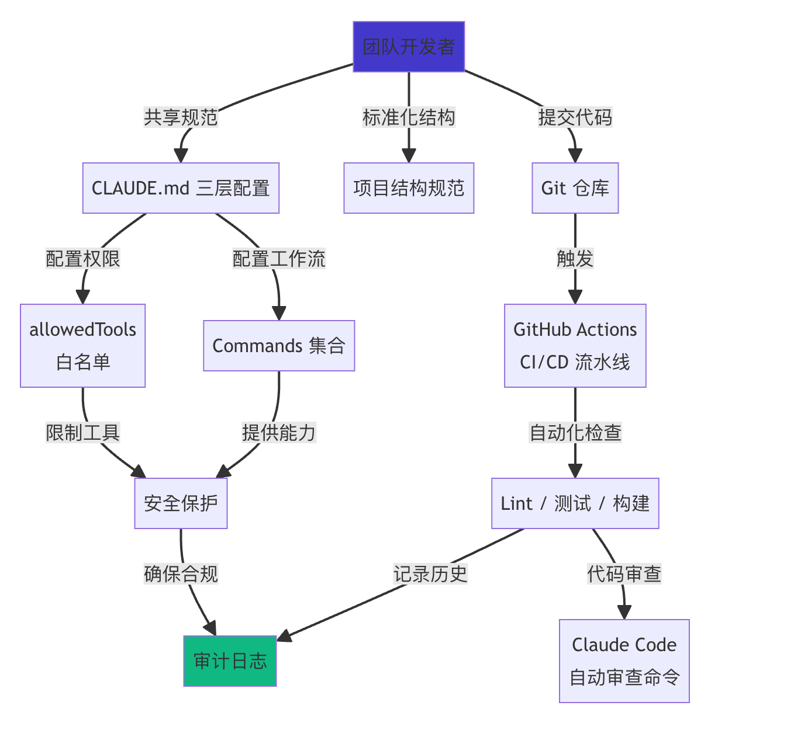
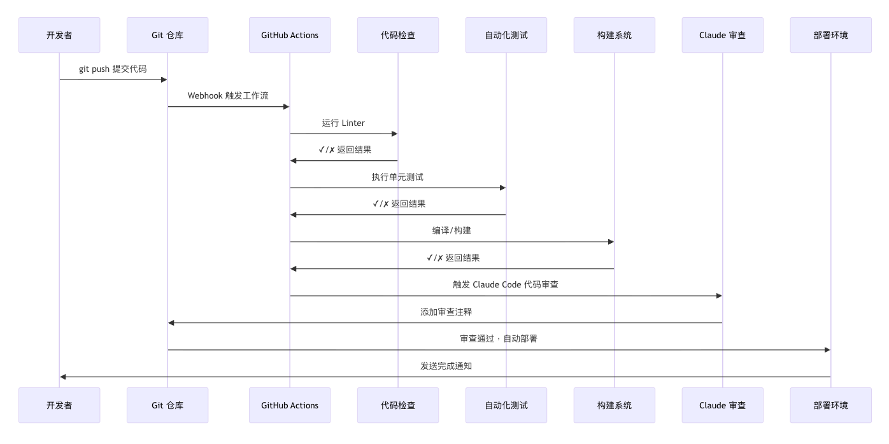

# 第七章：從單兵到團隊——企業級協作規範、[CI/CD](https://www.codefather.cn/course/1793910103252721665) 與安全合規實戰

## 1. 前言

學完前六章，你已經能把 Claude Code 玩得很溜——Commands 定製、MCP 擴充套件、Plugins 一鍵裝、Skills 打包複用，個人工作流基本滿足了。

但問題來了：**換個角色，從個人開發者變成帶 5 人、10 人團隊的技術負責人，Claude Code 怎麼用？**

典型的團隊混亂場景，你可能中槍過：

| 混亂現象                     | 根因           | 後果                        |
| ---------------------------- | -------------- | --------------------------- |
| 每人的 CLAUDE.md 各不相同    | 沒有統一規範   | AI 產出的程式碼風格亂成一鍋粥 |
| 敏感金鑰被 AI 意外提交到倉庫 | 沒有許可權限制   | 安全事故，老闆找你談話      |
| 程式碼審查全靠人工盯           | 沒接入 CI/CD   | 效率低，問題漏網            |
| 換個專案所有配置從頭再來     | 沒有標準化結構 | 重複勞動，新人懵圈          |
| 團隊月賬單翻倍超預期         | 沒有成本管控   | 財務部門找過來了            |

**本章解決的就是這些問題。**

從團隊規範到 CI/CD 整合，從安全合規到成本控制，一章講完企業級 Claude Code 部署的全部要點。3 人團隊能用，100 人團隊也能用。

### 本章架構總覽



------

## 2. 團隊協作規範

### 2.1 為什麼需要團隊規範

3 人以下團隊，靠溝通湊合；超過 5 人，沒有規範就是災難的開始。

規範要解決三個核心問題：

| 問題              | 解決方案                              |
| ----------------- | ------------------------------------- |
| AI 產出質量不一致 | 統一 CLAUDE.md，全員共享同一套規則    |
| 配置無法傳承      | 配置檔案入庫，隨程式碼一起版本管理      |
| 新人上手慢        | 標準化目錄結構 + 入職清單，1 天內跑通 |

### 2.2 專案結構標準化

**推薦的企業級目錄結構：**

```nix
project-root/
├── .claude/                      # Claude Code 專用配置（全部入庫）
│   ├── settings.json             # 團隊統一許可權與工具配置
│   ├── settings.local.json       # 個人本地覆蓋（禁止入庫！）
│   ├── commands/                 # 團隊共享 Slash 命令
│   │   ├── code-review.md        # 程式碼審查命令
│   │   ├── security-check.md     # 安全檢查命令
│   │   └── deploy.md             # 部署命令
│   └── skills/                   # 專案專屬 Skill
│       └── project-skill/
│           └── SKILL.md
├── .github/
│   └── workflows/
│       └── claude-review.yml     # CI/CD 自動審查
├── docs/
│   └── ai-context/               # 給 AI 看的專案說明書
│       ├── project-structure.md
│       ├── coding-standards.md
│       └── architecture.md
├── src/
├── tests/
├── CLAUDE.md                     # 專案主配置（入庫）
├── .mcp.json                     # MCP 伺服器配置（入庫）
└── .gitignore
```

**什麼該入庫，什麼不該入庫——一張表說清楚：**

| 檔案/目錄                     | 入庫策略               | 原因                     |
| ----------------------------- | ---------------------- | ------------------------ |
| `.claude/settings.json`       | ✅ 必須入庫             | 團隊統一許可權配置         |
| `.claude/settings.local.json` | ❌ 禁止入庫             | 個人偏好，可能含本地路徑 |
| `.claude/commands/`           | ✅ 必須入庫             | 團隊共享命令             |
| `.claude/skills/`             | ✅ 必須入庫             | 專案專屬能力             |
| `CLAUDE.md`                   | ✅ 必須入庫             | 團隊共享專案規範         |
| `.mcp.json`                   | ✅ 必須入庫（不含金鑰） | 團隊共享 MCP 配置        |
| `.env` / `.env.local`         | ❌ 禁止入庫             | 含金鑰等敏感資訊         |

**在 `.gitignore` 中明確寫出來，不要靠記憶：**

```gitignore
# 禁止入庫
.claude/settings.local.json
.env
.env.local
.env.*.local

# 確保這些不被其他規則誤排除
!.claude/settings.json
!.claude/commands/
!.claude/skills/
!CLAUDE.md
!.mcp.json
```

**`docs/ai-context/` 是幹嘛的？**

這個目錄專門存放給 AI 看的專案上下文，不是給人看的 README，而是幫助 Claude 快速理解專案的「說明書」：

```markdown
# docs/ai-context/project-structure.md 示例

## 技術棧
- 前端：React 18 + TypeScript + Vite
- 後端：Node.js 20 + Fastify
- 資料庫：PostgreSQL + Prisma ORM

## 核心模組
### 使用者模組 (src/modules/user/)
負責註冊、登入、許可權管理，依賴 JWT + bcrypt

### 訂單模組 (src/modules/order/)
負責下單、支付、狀態管理，依賴使用者模組和支付閘道器

## 程式碼約定
- 所有 API 響應格式：{ data, error, meta }
- 資料庫操作必須使用 Prisma Client
- 日期時間統一 UTC
```

把詳細內容放這裡，CLAUDE.md 只寫「詳見 docs/ai-context/」，既讓 AI 能找到，又不撐爆主配置檔案的 token。

### 2.3 CLAUDE.md 三層配置體系

Claude Code 支援三層 CLAUDE.md，優先順序從低到高：

| 層級     | 檔案位置               | 作用範圍       | 入庫建議         |
| -------- | ---------------------- | -------------- | ---------------- |
| 全域性配置 | `~/.claude/CLAUDE.md`  | 所有專案       | 個人檔案，不入庫 |
| 專案配置 | 專案根 `CLAUDE.md`     | 當前專案全團隊 | ✅ 必須入庫       |
| 模組配置 | `src/legacy/CLAUDE.md` | 特定子目錄     | ✅ 按需入庫       |

**專案 CLAUDE.md 模板（精簡版，控制在 1000 tokens 以內）：**

```markdown
# [專案名] - Claude Code 配置

## 1. 專案概覽
- **技術棧**：React 18 + Node.js 20 + PostgreSQL
- **當前階段**：開發中
- **詳細上下文**：見 docs/ai-context/

## 2. 程式碼規範
- 語言：TypeScript，禁止使用 any（特殊情況需註釋說明）
- 命名：檔案 kebab-case，類 PascalCase，變數 camelCase，常量 UPPER_SNAKE_CASE
- 函式 ≤50 行，類 ≤300 行
- 所有公共 API 必須有 JSDoc 註釋，註釋使用中文

## 3. 安全規則
- 禁止硬編碼 API 金鑰、密碼等敏感資訊
- 禁止提交 .env 檔案
- 資料庫查詢必須引數化，禁止字串拼接

## 4. 測試要求
- 新功能必須有單元測試，核心邏輯覆蓋率 >80%
- 整合測試必須覆蓋主要使用者流程

## 5. Git 規範
提交格式：`<type>(<scope>): <description>`
型別：feat / fix / docs / refactor / test / chore

## 6. 專案特殊注意
[此處填寫專案特有的規則，如遺留程式碼處理方式、禁用的第三方庫等]
```

> **精簡原則**：CLAUDE.md 目標控制在 <1,000 tokens。超長的配置檔案每次請求都會消耗大量 token，得不償失。詳細內容一律放進 `docs/ai-context/`。

**全域性 CLAUDE.md 模板（`~/.claude/CLAUDE.md`）：**

```markdown
# 全域性 Claude Code 配置

## 個人偏好
- 使用中文回覆
- 程式碼註釋使用中文
- 偏好簡潔直接的程式碼風格

## 安全底線（所有專案通用）
- 永遠不在程式碼中包含真實的 API 金鑰
- 不自動執行 rm -rf、DROP TABLE 等危險命令，執行前必須確認
- 不強制推送到 main/master 分支
```

### 2.4 程式碼審查命令

把程式碼審查流程標準化，建立團隊共享命令 `.claude/commands/code-review.md`：

```markdown
對當前程式碼變更進行全面審查。

引數：$ARGUMENTS（可選，指定檔案路徑；不填則審查 git diff 的所有變更）

## 審查維度

### 1. 程式碼質量
- 命名是否表意，是否有重複程式碼
- 函式/類是否超出長度限制

### 2. 安全性
- 是否有 SQL 注入、XSS 風險
- 是否有硬編碼的敏感資訊
- 敏感資料處理是否安全

### 3. 效能
- 是否有 N+1 查詢
- 是否有迴圈內的不必要計算

### 4. 測試
- 新增功能是否有對應測試
- 邊界情況是否覆蓋

## 輸出格式

### 必須修改（Blocking）
- 問題描述 + 程式碼位置 + 修復建議

### 建議修改（Suggestion）
- 問題描述 + 改進建議

### 做得好的地方（Praise）
- 值得保留的優秀實踐
```

使用方式：

```bash
/code-review              # 審查所有最近變更
/code-review src/auth/    # 只審查指定目錄
```

### 2.5 新成員入職清單

```markdown
## Claude Code 新成員入職清單

### 第1步：環境準備
- [ ] 安裝 Claude Code CLI（參考第一章）
- [ ] 配置全域性 ~/.claude/CLAUDE.md（寫入個人偏好）
- [ ] 獲取 API 金鑰並配置到環境變數

### 第2步：專案配置
- [ ] 克隆專案倉庫
- [ ] 進入專案目錄，執行 `claude` 初始化
- [ ] 輸入 `/mcp` 確認 MCP 伺服器正常連線
- [ ] 建立個人 .claude/settings.local.json（覆蓋個人偏好，不入庫）

### 第3步：熟悉規範
- [ ] 閱讀專案 CLAUDE.md 和 docs/ai-context/
- [ ] 輸入 `/help` 檢視團隊自定義命令列表
- [ ] 執行一次 `/code-review` 體驗審查流程

### 第4步：驗證配置
- [ ] 提交一個測試 PR，確認 CI 自動審查觸發正常
- [ ] 檢查許可權配置：嘗試執行一條危險命令驗證是否被攔截
```

------

## 3. CI/CD 整合

**CI/CD 流程全景圖**：



### 3.1 GitHub Actions 基礎配置

Anthropic 提供了官方 GitHub Action：`anthropics/claude-code-action`，直接在 PR 上觸發 Claude Code 審查，零程式碼配置。

**準備工作——先在 GitHub 倉庫新增 Secret：**

1. 進入倉庫 **Settings → Secrets and variables → Actions**
2. 點選 **New repository secret**
3. 名稱：`ANTHROPIC_API_KEY`，值：你的 API Key

**最簡配置**（`.github/workflows/claude-review.yml`）：

```yaml
name: Claude Code Review

on:
  pull_request:
    types: [opened, synchronize, reopened]
  issue_comment:
    types: [created]

permissions:
  contents: read
  pull-requests: write
  issues: write

jobs:
  claude-review:
    if: |
      github.event_name == 'pull_request' ||
      (github.event_name == 'issue_comment' &&
       contains(github.event.comment.body, '@claude'))
    runs-on: ubuntu-latest

    steps:
      - uses: actions/checkout@v4
        with:
          fetch-depth: 0   # 獲取完整歷史，用於 diff 比較

      - name: Run Claude Code Review
        uses: anthropics/claude-code-action@v1
        with:
          anthropic_api_key: ${{ secrets.ANTHROPIC_API_KEY }}
          model: claude-sonnet-4-6-20250929
          max_tokens: 4096
          timeout: 300
```

配置完成後：

- 每次提 PR，Claude 自動審查並在 PR 下方留評論
- 在 PR 或 Issue 評論中 `@claude xxx`，Claude 響應互動式指令

### 3.2 多場景工作流

一個完整的團隊工作流通常需要三類並行 Job：

| Job             | 觸發時機         | 功能           |
| --------------- | ---------------- | -------------- |
| `review`        | PR 建立/更新     | 程式碼質量審查   |
| `security-scan` | PR 建立/更新     | 安全漏洞掃描   |
| `interactive`   | 評論含 `@claude` | 響應互動式指令 |

```yaml
name: Claude Code CI

on:
  pull_request:
    types: [opened, synchronize, reopened]
  issue_comment:
    types: [created]

permissions:
  contents: read
  pull-requests: write
  issues: write

env:
  CLAUDE_MODEL: claude-sonnet-4-6-20250929

jobs:
  # ===== 程式碼審查 =====
  review:
    name: Code Review
    if: github.event_name == 'pull_request'
    runs-on: ubuntu-latest
    steps:
      - uses: actions/checkout@v4
        with:
          fetch-depth: 0

      - name: Claude Code Review
        uses: anthropics/claude-code-action@v1
        with:
          anthropic_api_key: ${{ secrets.ANTHROPIC_API_KEY }}
          model: ${{ env.CLAUDE_MODEL }}
          max_tokens: 4096
          prompt: |
            請審查這次 PR 的程式碼變更，重點關注：
            1. 程式碼質量和可維護性
            2. 潛在的 bug 和安全問題
            3. 效能考量
            4. 測試覆蓋建議
            請用中文回覆，按「必須修改 / 建議修改 / 優點」三部分輸出。

  # ===== 安全掃描 =====
  security-scan:
    name: Security Scan
    if: github.event_name == 'pull_request'
    runs-on: ubuntu-latest
    steps:
      - uses: actions/checkout@v4

      - name: Claude Security Scan
        uses: anthropics/claude-code-action@v1
        with:
          anthropic_api_key: ${{ secrets.ANTHROPIC_API_KEY }}
          model: ${{ env.CLAUDE_MODEL }}
          max_tokens: 2048
          prompt: |
            請對本次 PR 進行安全掃描，檢查：
            1. 硬編碼的敏感資訊（API Key、密碼、token 等）
            2. SQL 注入、XSS、命令注入風險
            3. 不安全的依賴版本
            4. 許可權配置問題
            發現高危問題請在開頭標註 [SECURITY-CRITICAL]。

  # ===== 互動式指令 =====
  interactive:
    name: Interactive Commands
    if: |
      github.event_name == 'issue_comment' &&
      contains(github.event.comment.body, '@claude')
    runs-on: ubuntu-latest
    steps:
      - uses: actions/checkout@v4

      - name: Process Command
        uses: anthropics/claude-code-action@v1
        with:
          anthropic_api_key: ${{ secrets.ANTHROPIC_API_KEY }}
          model: ${{ env.CLAUDE_MODEL }}
          prompt: ${{ github.event.comment.body }}
```

**互動式指令使用示例（在評論中）：**

```less
@claude 幫我分析這段程式碼的效能瓶頸
@claude 生成這個模組的單元測試
@claude /code-review src/payment/
```

### 3.3 完整流水線示例

加上 lint、測試、構建、部署的完整 6 階段流水線：

```yaml
name: Full CI/CD Pipeline

on:
  push:
    branches: [main, develop]
  pull_request:
    branches: [main]

jobs:
  lint:
    name: Lint & Format
    runs-on: ubuntu-latest
    steps:
      - uses: actions/checkout@v4
      - uses: actions/setup-node@v4
        with:
          node-version: '20'
      - run: npm ci && npm run lint && npm run format:check

  test:
    name: Unit Tests
    needs: lint
    runs-on: ubuntu-latest
    steps:
      - uses: actions/checkout@v4
      - uses: actions/setup-node@v4
        with:
          node-version: '20'
      - run: npm ci && npm test -- --coverage

  claude-review:
    name: Claude Review
    if: github.event_name == 'pull_request'
    needs: test
    runs-on: ubuntu-latest
    steps:
      - uses: actions/checkout@v4
        with:
          fetch-depth: 0
      - uses: anthropics/claude-code-action@v1
        with:
          anthropic_api_key: ${{ secrets.ANTHROPIC_API_KEY }}
          model: claude-sonnet-4-6-20250929
          max_tokens: 4096
          prompt: 請審查 PR 程式碼變更，輸出質量評估、安全檢查、改進建議三部分結果（中文）。

  build:
    name: Build
    needs: [test]
    runs-on: ubuntu-latest
    steps:
      - uses: actions/checkout@v4
      - uses: actions/setup-node@v4
        with:
          node-version: '20'
      - run: npm ci && npm run build
      - uses: actions/upload-artifact@v4
        with:
          name: build-output
          path: dist/

  deploy-staging:
    name: Deploy Staging
    if: github.ref == 'refs/heads/develop'
    needs: build
    runs-on: ubuntu-latest
    environment: staging
    steps:
      - uses: actions/download-artifact@v4
        with:
          name: build-output
      - run: echo "部署到 Staging 環境..."

  deploy-production:
    name: Deploy Production
    if: github.ref == 'refs/heads/main'
    needs: build
    runs-on: ubuntu-latest
    environment: production
    steps:
      - uses: actions/download-artifact@v4
        with:
          name: build-output
      - run: echo "部署到 Production 環境..."
```

> **注意**：`claude-review` Job 只在 PR 事件時觸發，push 到 main/develop 時不觸發，避免浪費 token。

------

## 4. 安全與合規

### 4.1 許可權系統配置

Claude Code 採用 **allow / deny 雙列表**許可權模型：

| 級別        | 行為               | 適用操作                       |
| ----------- | ------------------ | ------------------------------ |
| Allow       | 直接執行，無需確認 | 低風險高頻操作（讀檔案、搜尋） |
| Ask（預設） | 執行前彈出確認框   | 有一定影響的操作（編輯檔案）   |
| Deny        | 完全拒絕，無法繞過 | 高危操作（刪除、強推、sudo）   |

**`.claude/settings.json` 許可權配置示例：**

```json
{
  "permissions": {
    "allow": [
      "Read",
      "Glob",
      "Grep",
      "WebFetch",
      "WebSearch",
      "Bash(npm test *)",
      "Bash(git diff *)",
      "Bash(git log *)",
      "Bash(git status)"
    ],
    "deny": [
      "Bash(rm -rf /)",
      "Bash(rm -rf ~)",
      "Bash(git push --force)",
      "Bash(git reset --hard)",
      "Bash(sudo *)",
      "Bash(curl * | bash)",
      "Read(./.env)",
      "Read(./secrets/**)"
    ]
  }
}
```

> **規則說明**：未出現在任一列表中的工具和命令預設走 ask（彈出確認）。deny 優先順序高於 allow，支援萬用字元匹配。

### 4.2 allowedTools 白名單

比 permissions 更細粒度的工具控制，支援路徑限制：

```json
{
  "allowedTools": [
    "Read",
    "Glob",
    "Grep",
    "Edit(src/**)",
    "Write(src/**)",
    "Write(tests/**)",
    "Bash(npm *)",
    "Bash(git status)",
    "Bash(git diff *)",
    "Bash(git add *)",
    "Bash(git commit *)",
    "mcp__context7__*",
    "mcp__github__*"
  ],
  "disallowedTools": [
    "Bash(rm -rf *)",
    "Bash(sudo *)",
    "Write(.env*)",
    "Write(**/secrets/*)"
  ]
}
```

**白名單匹配規則速查：**

| 寫法                 | 含義               | 示例                        |
| -------------------- | ------------------ | --------------------------- |
| `"Read"`             | 精確匹配工具名     | 只允許 Read 工具            |
| `"Bash(npm *)"`      | 萬用字元匹配命令引數 | 允許所有 npm 子命令         |
| `"Edit(src/**)"`     | 路徑萬用字元         | 只允許編輯 src 目錄下的檔案 |
| `"mcp__context7__*"` | MCP 工具萬用字元     | 允許 context7 的所有功能    |

**分環境配置建議：**

| 環境     | 策略                      | 說明         |
| -------- | ------------------------- | ------------ |
| 開發環境 | 寬鬆，但保留危險命令 deny | 便於迭代     |
| Staging  | 中等，限制 Write 範圍     | 模擬生產     |
| CI/CD    | 嚴格，只保留必要工具      | 最小許可權原則 |

### 4.3 審計日誌

**啟用審計日誌配置（`.claude/settings.json`）：**

```json
{
  "audit": {
    "enabled": true,
    "logPath": "./logs/claude-audit/",
    "retention": "90d",
    "events": [
      "tool_use",
      "file_access",
      "command_execution",
      "permission_change",
      "error"
    ]
  }
}
```

**審計日誌格式示例：**

```json
{
  "entries": [
    {
      "timestamp": "2026-01-15T10:30:45.123Z",
      "userId": "dev@company.com",
      "event": "tool_use",
      "tool": "Bash",
      "command": "npm test",
      "status": "success",
      "duration": 5432
    },
    {
      "timestamp": "2026-01-15T10:31:00.456Z",
      "userId": "dev@company.com",
      "event": "permission_denied",
      "tool": "Read",
      "path": ".env.production",
      "reason": "Path in denied list",
      "status": "blocked"
    }
  ]
}
```

**企業合規檢查清單：**

| 合規項       | 檢查內容                  | 透過條件                  |
| ------------ | ------------------------- | ------------------------- |
| 金鑰安全     | API 金鑰透過環境變數傳入  | 程式碼中無硬編碼金鑰        |
| 敏感檔案保護 | .env 類檔案在 deny 列表中 | AI 無法讀取               |
| 危險命令攔截 | rm -rf / sudo 被明確禁止  | deny 列表覆蓋             |
| 審計追蹤     | 所有工具呼叫有完整日誌    | `audit.enabled = true`    |
| 日誌保留     | 保留期符合公司/行業政策   | `retention >= 90d`        |
| 許可權最小化   | 每個角色只有必要許可權      | allowedTools 明確限定範圍 |

------

## 5. 效能與成本最佳化

### 5.1 上下文管理

**上下文視窗的構成（以 Claude Sonnet 4.6 為例，上限 200K tokens）：**

| 組成部分     | 典型大小           | 最佳化優先順序    |
| ------------ | ------------------ | ------------- |
| 系統提示詞   | ~2,000 tokens      | 無法最佳化      |
| CLAUDE.md    | 1,000–5,000 tokens | ⭐⭐⭐ 重點最佳化  |
| 對話歷史     | 動態增長           | ⭐⭐⭐ 定期清理  |
| 工具返回結果 | 動態增長           | ⭐⭐ 控制讀取量 |
| 當前訊息     | 使用者輸入           | ⭐ 精簡描述    |

**三個實用最佳化策略：**

**策略一：精簡 CLAUDE.md**

```markdown
# ❌ 冗長寫法（每次浪費幾千 token）
我們的團隊使用以下程式碼規範。首先，所有程式碼必須使用 TypeScript 編寫。
其次，我們要求所有函式都有 JSDoc 註釋。另外，變數命名必須遵循
camelCase 規範……（繼續 500 字）

# ✅ 精簡寫法（同樣資訊量）
## 程式碼規範
- 語言：TypeScript，禁用 any
- 註釋：JSDoc 必需（中文）
- 命名：變數 camelCase，類 PascalCase
- 行數：函式 ≤50，類 ≤300
```

**策略二：大任務分步拆解**

```1c
# ❌ 一次性大任務（容易超限，Claude 也容易出錯）
"重構整個專案的使用者模組、訂單模組、支付模組..."

# ✅ 分步驟執行
步驟1：分析使用者模組現狀
步驟2：提出重構方案
步驟3：執行使用者模組重構，驗證結果
步驟4：繼續訂單模組
```

**策略三：分層 CLAUDE.md**

```nix
專案根/CLAUDE.md           # 全域性規則（目標 <1,000 tokens）
├── src/CLAUDE.md          # 原始碼特定規則（<500 tokens）
├── tests/CLAUDE.md        # 測試規則（<300 tokens）
└── src/legacy/CLAUDE.md   # 遺留程式碼專用規則（<300 tokens）
```

**常用對話管理命令：**

| 命令            | 時機                     | 效果                       |
| --------------- | ------------------------ | -------------------------- |
| `/clear`        | 任務完成後，切換新任務前 | 清空對話歷史，釋放上下文   |
| `/compact`      | 對話過長但需要保留上下文 | 壓縮歷史為摘要，節省 token |
| `Shift + Enter` | 需要輸入多行指令時       | 換行不傳送，整理好再提交   |

### 5.2 成本控制

**各模型價格參考（2026 年）：**

| 模型              | 輸入    | 輸出    | 推薦場景                       |
| ----------------- | ------- | ------- | ------------------------------ |
| Claude Haiku 4.5  | $0.25/M | $1.25/M | 簡單程式碼生成、批次檔案處理     |
| Claude Sonnet 4.6 | $3/M    | $15/M   | 日常開發、程式碼審查（預設推薦） |
| Claude Opus 4.5   | $15/M   | $75/M   | 架構設計、複雜推理任務         |

**單次對話成本估算：**

```asciidoc
成本 = (輸入 tokens / 1M × 輸入價格) + (輸出 tokens / 1M × 輸出價格)

示例（Sonnet 4.6，10K 輸入 + 2K 輸出）：
= (10,000 / 1M × 3) + (2,000 / 1M × 15)
= $0.03 + $0.03 = $0.06/次
```

**成本控制配置（`.claude/settings.json`）：**

```json
{
  "costControl": {
    "dailyLimit": 10.0,
    "monthlyLimit": 200.0,
    "alertThreshold": 0.8,
    "actions": {
      "onDailyLimitReached": "warn",
      "onMonthlyLimitReached": "block"
    }
  }
}
```

**五條省錢建議：**

| 建議                                     | 效果                   |
| ---------------------------------------- | ---------------------- |
| 簡單任務用 Haiku，複雜任務用 Opus        | 成本最多降低 80%       |
| 批次處理：一次審查多個檔案而不是逐個審查 | 減少重複初始化開銷     |
| 用 `/compact` 壓縮長對話                 | 降低歷史 token 累積    |
| 精簡 CLAUDE.md（控制在 1K tokens）       | 減少每次請求的固定成本 |
| CI 中設定 `max_tokens` 上限              | 防止單次超支           |

### 5.3 verbose 除錯

開啟 verbose 模式，能看到每次請求的完整 token 消耗和工具呼叫過程，是定位效能瓶頸最直接的工具：

```bash
# 單次開啟
claude --verbose

# 持久開啟（寫入配置）
# .claude/settings.json
{
  "verbose": true
}
```

**關鍵日誌資訊解讀：**

```routeros
[DEBUG] CLAUDE.md tokens: 1,234          → CLAUDE.md 佔用了多少 token
[DEBUG] Context size: 8,432 tokens       → 當前上下文總大小
[DEBUG] Available context: 191,568 tokens → 還剩多少可用空間
[DEBUG] Tool call: Glob → 12 files found  → 某次工具呼叫的結果
[DEBUG] Input tokens: 8,011              → 本次請求傳送了多少 token
[DEBUG] Output tokens: 1,234            → 本次響應返回了多少 token
[DEBUG] Latency: 5,000ms                → 介面響應延遲
[DEBUG] Cost: $0.0234                    → 本次呼叫花了多少錢
```

**常見效能問題速查：**

| 症狀              | 可能原因           | 解決方案                          |
| ----------------- | ------------------ | --------------------------------- |
| 響應慢（>10s）    | 上下文過大         | `/clear` 清空對話，精簡 CLAUDE.md |
| 頻繁超 token 限制 | 單次任務過大       | 分解成多個步驟執行                |
| 成本快速上漲      | 無效迭代多         | 最佳化提示詞，減少來回修改次數      |
| 工具呼叫失敗      | MCP 伺服器連線問題 | 檢查 `.mcp.json` 配置和網路連通性 |

------

## 6. 故障排查

### 6.1 團隊協作問題

| 現象                                 | 原因                             | 解決方法                                                     |
| ------------------------------------ | -------------------------------- | ------------------------------------------------------------ |
| 不同成員 AI 產出風格差異大           | CLAUDE.md 未統一                 | 確認 `CLAUDE.md` 和 `settings.json` 已入庫，團隊成員拉取最新版本 |
| CI 自動審查未觸發                    | Secrets 未配置或 Action 版本太舊 | 檢查 GitHub Secrets 中的 `ANTHROPIC_API_KEY`，升級 Action 到最新版 |
| `settings.local.json` 被意外入庫     | `.gitignore` 缺失對應規則        | 補充 `.gitignore`，並從倉庫歷史中清除                        |
| 團隊成員的 `/code-review` 命令找不到 | commands/ 目錄未入庫             | 確認 `.gitignore` 沒有錯誤排除 `.claude/commands/`           |

### 6.2 安全許可權問題

| 現象                        | 原因                        | 解決方法                                                |
| --------------------------- | --------------------------- | ------------------------------------------------------- |
| 危險命令沒有被攔截          | deny 列表未配置             | 在 `settings.json` 的 `permissions.deny` 中補充高危命令 |
| allowedTools 設定不生效     | JSON 格式錯誤（多餘逗號等） | 用 JSON 線上驗證工具檢查格式                            |
| 審計日誌目錄不存在報錯      | 目錄未預先建立              | `mkdir -p ./logs/claude-audit/`                         |
| CI 中安全掃描漏掉了高危問題 | prompt 描述不夠具體         | 在 prompt 中明確列出要檢查的安全類別                    |

### 6.3 效能與成本問題

| 現象                                   | 原因                           | 解決方法                                              |
| -------------------------------------- | ------------------------------ | ----------------------------------------------------- |
| 月賬單遠超預期                         | 沒有成本上限配置               | 配置 `costControl.monthlyLimit` 並設定告警            |
| CLAUDE.md 載入慢，每次響應都慢         | 配置檔案過大                   | 精簡到 <1,000 tokens，詳情移到 `docs/ai-context/`     |
| CI 中 Claude 呼叫偶發超時              | 沒有設定 timeout 和 max_tokens | 在 Action 中配置 `timeout: 300` 和 `max_tokens: 4096` |
| verbose 日誌看到 CLAUDE.md tokens 很高 | CLAUDE.md 內容過多             | 審查 CLAUDE.md，刪除冗餘內容，提取到 ai-context 目錄  |

------

## 7. 總結

本章你已掌握：

1. **團隊規範**：標準化目錄結構、CLAUDE.md 三層配置體系、配置入庫策略、新成員入職 SOP
2. **CI/CD 整合**：GitHub Actions 自動審查（`anthropics/claude-code-action`）、多場景工作流（程式碼審查 + 安全掃描 + 互動指令）、完整 6 階段流水線
3. **安全合規**：allow/deny 許可權模型、allowedTools 白名單精細控制、審計日誌配置與合規檢查清單
4. **效能最佳化**：上下文管理三策略、verbose 模式 token 分析、常見效能瓶頸定位
5. **成本控制**：按場景選模型、批次處理、成本預警配置、五條省錢建議

**一句話總結**：個人用 Claude Code 靠感覺，團隊用 Claude Code 靠規範。把本章的配置落地到你的專案裡，10 人團隊也能用得既高效又安全。
