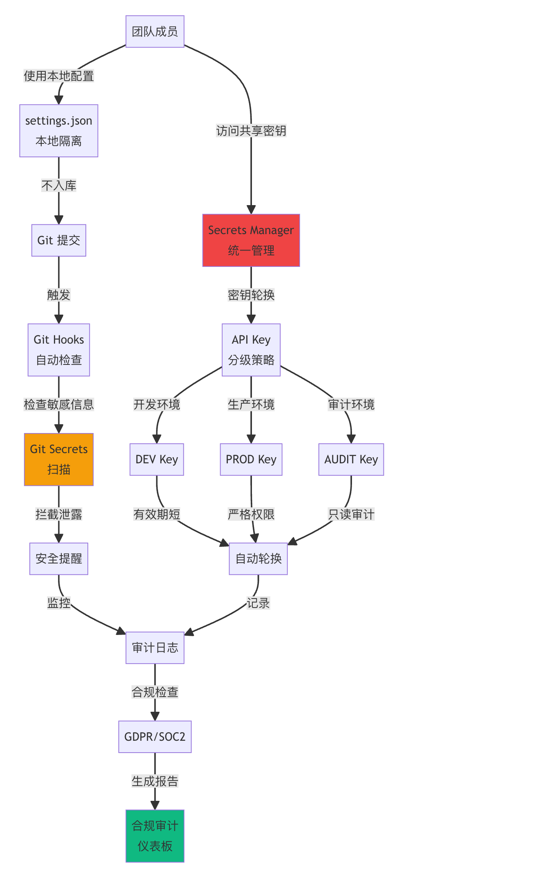
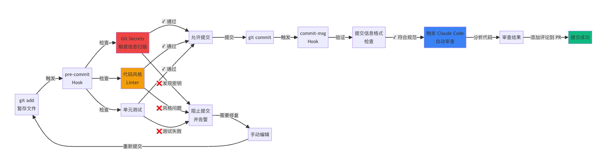
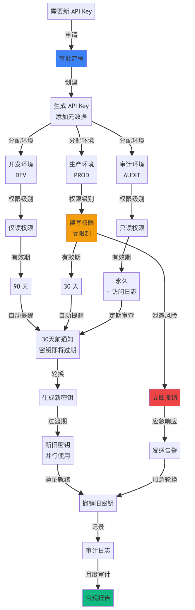

# 第八章：企業深水區——金鑰安全、團隊配置與合規審計全攻略

## 本章安全架構總覽



------

## 1. 術語速查表

先把企業級關鍵術語拉出來，後面用到的時候直接對照：

| 術語            | 英文全稱                           | 通俗解釋                                   |
| --------------- | ---------------------------------- | ------------------------------------------ |
| Secrets Manager | -                                  | 金鑰管理服務，安全儲存 API Key 等敏感資訊  |
| Vault           | HashiCorp Vault                    | 企業級金鑰管理工具，支援金鑰輪換和訪問審計 |
| Git Hooks       | -                                  | Git 的鉤子指令碼，在提交/推送前自動執行檢查  |
| ADR             | Architecture Decision Record       | 架構決策記錄，記錄技術選型的原因和上下文   |
| GDPR            | General Data Protection Regulation | 歐盟通用資料保護條例                       |
| SOC 2           | Service Organization Control 2     | 服務組織控制審計標準                       |
| 2FA             | Two-Factor Authentication          | 雙因素認證，增強賬戶安全                   |
| RPM             | Requests Per Minute                | 每分鐘請求數，API 速率限制單位             |
| DPO             | Data Protection Officer            | 資料保護官，負責合規的角色                 |
| Bandit          | -                                  | Python 安全程式碼掃描工具                    |
| Trivy           | -                                  | 容器映象安全掃描工具                       |

------

## 2. 團隊配置統一化

### 2.1 為什麼要統一配置

見過太多團隊踩這個坑了：

| 問題                        | 後果                  | 發生機率 |
| --------------------------- | --------------------- | -------- |
| 每個人 `settings.json` 不同 | 程式碼風格混亂，PR 衝突 | 95%      |
| API Key 直接寫在配置檔案    | 洩露到 Git 倉庫       | 80%      |
| 新人手動配置需要 2 小時     | 效率低下，容易出錯    | 100%     |
| 配置更新無法同步            | 部分成員用舊配置      | 70%      |
| 沒有版本控制                | 回滾困難              | 60%      |

**統一配置能一次性解決以上所有問題。**

### 2.2 標準配置倉庫結構

推薦的團隊配置倉庫長這樣：

```nix
team-claude-config/
├── README.md                    # 配置說明文件
├── .editorconfig                # EditorConfig 通用規則
├── .env.example                 # 環境變數模板（絕對不放真實金鑰！）
├── install.sh                   # 一鍵安裝指令碼（Linux/macOS）
├── install.ps1                  # 一鍵安裝指令碼（Windows）
├── update.sh                    # 配置更新指令碼
├── validate.sh                  # 配置驗證指令碼
├── vscode/                      # VS Code 配置
│   ├── settings.json
│   ├── keybindings.json
│   ├── extensions.json          # 推薦擴充套件列表
│   └── snippets/
│       ├── python.json
│       └── javascript.json
├── cursor/                      # Cursor 配置
│   ├── settings.json
│   └── keybindings.json
├── claude/                      # Claude Code 專用配置
│   ├── system-prompts/          # 系統提示詞
│   │   ├── code-review.md
│   │   ├── refactor.md
│   │   └── testing.md
│   ├── skills/                  # 團隊技能包
│   │   └── team-standards/
│   │       ├── SKILL.md
│   │       └── prompts/
│   └── hooks/                   # Git hooks 模板
│       ├── pre-commit
│       ├── pre-push
│       └── commit-msg
├── ci/                          # CI/CD 配置
│   ├── github-actions/
│   │   ├── claude-review.yml
│   │   └── quality-check.yml
│   └── gitlab-ci/
│       └── .gitlab-ci.yml
├── docs/                        # 文件目錄
│   ├── onboarding.md            # 新人上手指南
│   ├── troubleshooting.md
│   └── best-practices.md
├── scripts/                     # 工具指令碼
│   ├── sync-config.sh
│   ├── check-updates.sh
│   └── backup-config.sh
└── tests/                       # 配置測試
    └── test_config.py
```

### 2.3 配置統一五條原則

| #    | 原則                            | 要求                                                         |
| ---- | ------------------------------- | ------------------------------------------------------------ |
| 1    | **Single Source of Truth**      | 所有配置在 Git 倉庫，本地配置 = 倉庫的符號連結               |
| 2    | **Environment Variables First** | 敏感資訊（API Key）**必須**用環境變數，絕對路徑也用環境變數替換 |
| 3    | **Platform Agnostic**           | 指令碼支援 Windows/Linux/macOS，路徑用相對路徑                 |
| 4    | **Automated Validation**        | 每次更新自動驗證配置正確性，CI 流水線中執行驗證測試          |
| 5    | **Rollback Support**            | 用 Git tag 標記穩定版本，提供一鍵回滾指令碼                    |

### 2.4 一鍵安裝指令碼

核心安裝指令碼結構（`install.sh`）：

```bash
#!/bin/bash
# install.sh - 團隊 Claude 配置一鍵安裝指令碼
set -e

# ==================== 顏色定義 ====================
RED='\033[0;31m'
GREEN='\033[0;32m'
YELLOW='\033[1;33m'
BLUE='\033[0;34m'
NC='\033[0m'

log_info()    { echo -e "${GREEN}[INFO]${NC} $1"; }
log_warn()    { echo -e "${YELLOW}[WARN]${NC} $1"; }
log_error()   { echo -e "${RED}[ERROR]${NC} $1"; }
log_success() { echo -e "${BLUE}[SUCCESS]${NC} $1"; }

# ==================== 檢測作業系統 ====================
detect_os() {
    if [[ "$OSTYPE" == "linux-gnu"* ]]; then
        OS="linux"
    elif [[ "$OSTYPE" == "darwin"* ]]; then
        OS="macos"
    elif [[ "$OSTYPE" == "msys" || "$OSTYPE" == "cygwin" ]]; then
        OS="windows"
    else
        log_error "不支援的作業系統: $OSTYPE"
        exit 1
    fi
    log_info "檢測到作業系統: $OS"
}

# ==================== 備份現有配置 ====================
backup_existing_config() {
    log_info "備份現有配置..."
    BACKUP_DIR="$HOME/.claude-config-backup-$(date +%Y%m%d-%H%M%S)"
    mkdir -p "$BACKUP_DIR"

    case "$OS" in
        linux)   VSCODE_DIR="$HOME/.config/Code/User" ;;
        macos)   VSCODE_DIR="$HOME/Library/Application Support/Code/User" ;;
        windows) VSCODE_DIR="$APPDATA/Code/User" ;;
    esac

    if [[ -d "$VSCODE_DIR" ]]; then
        cp -r "$VSCODE_DIR" "$BACKUP_DIR/vscode-user"
        log_info "VS Code 配置已備份到: $BACKUP_DIR/vscode-user"
    fi

    log_success "備份完成: $BACKUP_DIR"
}

# ==================== 主函式 ====================
main() {
    echo "================================================"
    echo "  團隊 Claude 配置一鍵安裝指令碼"
    echo "================================================"
    detect_os
    backup_existing_config
    # ... 後續安裝步驟（連結配置檔案、安裝 hooks 等）
    log_success "安裝完成！請重啟編輯器使配置生效。"
}

main
```

> 提醒：完整指令碼建議放在團隊配置倉庫裡維護，這裡展示核心結構。Windows 使用者對應寫 `install.ps1`。

------

## 3. Git Hooks + Claude Code 深度整合

**Git Hooks 工作流程**：



### 3.1 為什麼需要 Git Hooks

| 問題               | 後果                 | Git Hook 解決方案            |
| ------------------ | -------------------- | ---------------------------- |
| 程式碼未格式化就提交 | PR 衝突，難以 review | `pre-commit` hook 自動格式化 |
| 提交資訊混亂       | Git 歷史難以追蹤     | `commit-msg` hook 規範化     |
| 未執行測試就 push  | 破壞主分支           | `pre-push` hook 強制測試     |
| 程式碼有明顯 bug     | 浪費 reviewer 時間   | Claude 自動程式碼審查          |
| 文件未更新         | 文件與程式碼不一致     | Claude 自動檢測提醒          |

**Git Hooks + Claude Code = 自動化程式碼質量守門員。**

### 3.2 Pre-commit Hook：提交前自動檢查

```bash
#!/bin/bash
# .git/hooks/pre-commit - 提交前檢查指令碼
# 整合 Claude Code 進行自動程式碼審查
set -e

# ==================== 獲取暫存檔案 ====================
get_staged_files() {
    git diff --cached --name-only --diff-filter=ACM
}

# ==================== Python 程式碼格式化 ====================
format_python() {
    echo "[INFO] 格式化 Python 程式碼..."
    PYTHON_FILES=$(get_staged_files | grep '\.py$' || true)
    if [[ -z "$PYTHON_FILES" ]]; then
        return 0
    fi

    # 使用 Black 格式化
    if command -v black &> /dev/null; then
        echo "$PYTHON_FILES" | xargs black --quiet
        echo "[INFO] Black 格式化完成"
    fi

    # 使用 Ruff 檢查
    if command -v ruff &> /dev/null; then
        if ! echo "$PYTHON_FILES" | xargs ruff check; then
            echo "[ERROR] Ruff 檢查失敗，請修復錯誤後再提交"
            exit 1
        fi
    fi

    # 重新新增格式化後的檔案
    echo "$PYTHON_FILES" | xargs git add
}

# ==================== Claude 程式碼審查 ====================
claude_code_review() {
    echo "[INFO] 執行 Claude Code 審查..."
    DIFF=$(git diff --cached)
    if [[ -z "$DIFF" ]]; then
        return 0
    fi

    # 呼叫 Claude API 進行程式碼審查
    REVIEW_RESULT=$(curl -s https://api.anthropic.com/v1/messages \
      -H "x-api-key: ${ANTHROPIC_API_KEY}" \
      -H "anthropic-version: 2023-06-01" \
      -H "content-type: application/json" \
      -d "{
        \"model\": \"claude-haiku-4-5-20251001\",
        \"max_tokens\": 2048,
        \"messages\": [{
          \"role\": \"user\",
          \"content\": \"請快速審查以下程式碼變更，僅報告嚴重問題。如果沒有嚴重問題，回覆'透過'。\\n\\n${DIFF}\"
        }]
      }" | jq -r '.content[0].text')

    # 檢查是否有嚴重問題
    if echo "$REVIEW_RESULT" | grep -qi "嚴重\|critical\|security"; then
        echo "[ERROR] Claude 發現嚴重問題，提交被拒絕："
        echo "$REVIEW_RESULT"
        exit 1
    fi

    echo "[INFO] Claude 程式碼審查透過"
}

# ==================== 主函式 ====================
main() {
    echo "[INFO] 開始 pre-commit 檢查..."
    format_python
    claude_code_review
    echo "[INFO] 所有檢查透過，允許提交"
}

main
```

> 建議：`pre-commit` 呼叫 Claude 審查時用 **Haiku 模型**（速度快、成本低），只攔截嚴重問題。詳細審查交給 CI/CD 階段的 Sonnet/Opus。

### 3.3 Commit-msg Hook：規範提交資訊

```bash
#!/bin/bash
# .git/hooks/commit-msg - 提交資訊規範化指令碼

COMMIT_MSG_FILE=$1
COMMIT_MSG=$(cat "$COMMIT_MSG_FILE")

# Conventional Commits 規範檢查
TYPES="feat|fix|docs|style|refactor|perf|test|chore|build|ci|revert"
if ! echo "$COMMIT_MSG" | grep -qE "^($TYPES)(\(.+\))?: .+"; then
    echo "[WARN] 提交資訊不符合 Conventional Commits 規範"
    echo "[WARN] 格式：type(scope): description"
    echo "[WARN] 示例：feat(auth): 新增 OAuth 登入功能"

    # 可選：呼叫 Claude 自動生成
    if [[ -n "$ANTHROPIC_API_KEY" ]]; then
        DIFF=$(git diff --cached --stat)
        echo "[INFO] 正在用 Claude 生成規範提交資訊..."
        # ... 呼叫 Claude API 生成 commit message
    fi

    exit 1
fi

echo "[INFO] 提交資訊格式檢查透過"
```

------

## 4. 團隊知識庫建設

### 4.1 知識庫系統架構

把團隊的編碼標準、架構模式、最佳實踐都沉澱到 Claude 可讀的知識庫裡：

```nix
team-knowledge-base/
├── .claude/
│   ├── skills/
│   │   ├── team-standards/        # 團隊編碼標準
│   │   │   ├── SKILL.md
│   │   │   └── prompts/
│   │   │       ├── python-style.md
│   │   │       ├── javascript-style.md
│   │   │       └── api-design.md
│   │   ├── architecture/          # 架構模式
│   │   │   ├── SKILL.md
│   │   │   └── prompts/
│   │   │       ├── microservices.md
│   │   │       └── database-design.md
│   │   └── testing/               # 測試規範
│   │       ├── SKILL.md
│   │       └── prompts/
│   │           ├── unit-test.md
│   │           └── integration-test.md
│   └── memory/
│       ├── common-patterns.json   # 常見程式碼模式
│       ├── team-decisions.json    # 技術決策記錄（ADR）
│       └── best-practices.json    # 最佳實踐
├── docs/
│   ├── architecture/              # 架構文件
│   ├── api/                       # API 文件
│   └── guides/                    # 開發指南
└── README.md
```

### 4.2 團隊編碼標準 Skill

在 `SKILL.md` 裡定義團隊編碼標準：

```markdown
---
name: team-standards
description: 團隊編碼標準和最佳實踐
---

# 團隊編碼標準

## Python 程式碼規範
- 使用 Black 格式化，行寬 88
- 型別註解覆蓋所有公開函式
- Docstring 使用 Google 風格
- 匯入順序：標準庫 → 第三方 → 本地

## JavaScript/TypeScript 規範
- 使用 ESLint + Prettier
- 優先使用 TypeScript
- React 元件使用函式式 + Hooks
- API 呼叫統一使用 fetch wrapper

## API 設計規範
- RESTful 命名，資源用複數
- 統一錯誤響應格式 { code, message, data }
- 版本號放在 URL 路徑中 /api/v1/
- 分頁用 cursor-based pagination
```

> 提醒：把這個 Skill 放在專案 `.claude/skills/` 下，Claude Code 寫程式碼時就會自動遵守團隊規範。新人入職第一天就能寫出符合團隊標準的程式碼。

------

## 5. [CI/CD](https://www.codefather.cn/course/1793910103252721665) 深度整合

### 5.1 GitHub Actions 完整配置

第七章已經介紹了 `anthropics/claude-code-action@v1` 的基礎用法，這裡給一個更完整的企業級配置：

```yaml
# .github/workflows/claude-ci.yml
name: Claude Code CI

on:
  pull_request:
    branches: [main, develop]
  push:
    branches: [main, develop]

env:
  ANTHROPIC_API_KEY: ${{ secrets.ANTHROPIC_API_KEY }}

jobs:
  # ===== 程式碼審查 =====
  code-review:
    name: Claude 程式碼審查
    if: github.event_name == 'pull_request'
    runs-on: ubuntu-latest
    steps:
      - uses: actions/checkout@v4
        with:
          fetch-depth: 0

      - name: 獲取變更檔案
        id: changed-files
        uses: tj-actions/changed-files@v39

      - name: Claude 程式碼審查
        if: steps.changed-files.outputs.any_changed == 'true'
        run: |
          DIFF=$(git diff origin/${{ github.base_ref }}...HEAD)
          REVIEW=$(curl -s https://api.anthropic.com/v1/messages \
            -H "x-api-key: $ANTHROPIC_API_KEY" \
            -H "anthropic-version: 2023-06-01" \
            -H "content-type: application/json" \
            -d "{
              \"model\": \"claude-sonnet-4-6\",
              \"max_tokens\": 4096,
              \"messages\": [{
                \"role\": \"user\",
                \"content\": \"請審查以下 PR 的程式碼變更，按【必須修改】【建議修改】【優點】三部分輸出。\\n\\n${DIFF}\"
              }]
            }" | jq -r '.content[0].text')

          echo "## Claude 程式碼審查結果" >> $GITHUB_STEP_SUMMARY
          echo "$REVIEW" >> $GITHUB_STEP_SUMMARY

  # ===== 程式碼質量檢查 =====
  quality-check:
    name: 程式碼質量檢查
    runs-on: ubuntu-latest
    steps:
      - uses: actions/checkout@v4
      - uses: actions/setup-python@v4
        with:
          python-version: '3.11'
      - run: pip install black ruff pytest pytest-cov
      - run: black --check .
      - run: ruff check .
      - run: pytest --cov --cov-report=xml

  # ===== 安全掃描 =====
  security-scan:
    name: 安全掃描
    if: github.event_name == 'pull_request'
    runs-on: ubuntu-latest
    steps:
      - uses: actions/checkout@v4

      - name: 掃描硬編碼金鑰
        run: |
          # 檢查是否有 API Key 洩露
          if grep -rE "sk-ant-api[0-9]{2}-[a-zA-Z0-9_-]{20,}" --include="*.py" --include="*.js" --include="*.ts" .; then
            echo "::error::發現硬編碼的 API Key！"
            exit 1
          fi

      - name: 依賴漏洞掃描
        run: |
          pip install safety
          safety check --full-report || true
```

------

## 6. 團隊監控與跨團隊協作

### 6.1 Claude 使用情況監控

跟蹤團隊成員的 Claude API 呼叫和成本，避免失控：

```python
#!/usr/bin/env python3
"""Claude 使用情況監控指令碼"""

import sqlite3
from datetime import datetime, timedelta

# 模型定價（每 1M tokens）
MODEL_PRICING = {
    "claude-haiku-4-5-20251001":  {"input": 0.80,  "output": 4.00},
    "claude-sonnet-4-6":         {"input": 3.00,  "output": 15.00},
    "claude-opus-4-6":           {"input": 15.00, "output": 75.00},
}

def log_api_call(user, model, prompt_tokens, completion_tokens):
    """記錄一次 API 呼叫"""
    pricing = MODEL_PRICING.get(model, MODEL_PRICING["claude-sonnet-4-6"])
    cost = (prompt_tokens * pricing["input"] + completion_tokens * pricing["output"]) / 1_000_000
    # 儲存到 SQLite / 傳送到監控平臺
    print(f"[{user}] {model} | tokens: {prompt_tokens}+{completion_tokens} | cost: ${cost:.4f}")

def generate_weekly_report():
    """生成周度使用報告"""
    # 統計：總呼叫次數、總成本、按使用者拆分、按模型拆分
    # 輸出 Markdown 表格 → 傳送到 Slack/飛書
    pass
```

> 建議：用 Haiku 做日常編碼輔助（成本最低），Sonnet 做程式碼審查，Opus 只在複雜架構設計時使用。嚴格按模型分級能省 60%+ 成本。

### 6.2 多團隊共享配置

大公司多團隊使用 Claude Code 時，用**配置繼承**避免重複：

```nix
company-claude-config/           # 公司級配置（基礎）
├── .editorconfig
├── claude/
│   └── skills/
│       └── company-standards/   # 公司編碼標準（全員遵守）
│
team-frontend-config/            # 前端團隊配置（繼承 + 擴充套件）
├── 繼承: company-claude-config
└── claude/
    └── skills/
        └── react-patterns/      # React 專用模式
│
team-backend-config/             # 後端團隊配置（繼承 + 擴充套件）
├── 繼承: company-claude-config
└── claude/
    └── skills/
        └── api-patterns/        # API 專用模式
```

核心思路：公司級定「紅線」（安全規範、程式碼風格底線），團隊級加「特色」（技術棧相關的最佳實踐）。

------

## 7. API Key 安全管理

**這是本章最重要的部分，必須單獨重點講。**

**API Key 全生命週期管理流程**：



<svg id="bytemd-mermaid-1779586117987-2" width="100%" xmlns="http://www.w3.org/2000/svg" xmlns:xlink="http://www.w3.org/1999/xlink" style="max-width: 463.5px;" viewBox="-8 -8 463.5 1558" role="graphics-document document" aria-roledescription="flowchart-v2"><g><marker id="bytemd-mermaid-1779586117987-2_flowchart-pointEnd" class="marker flowchart" viewBox="0 0 10 10" refX="6" refY="5" markerUnits="userSpaceOnUse" markerWidth="12" markerHeight="12" orient="auto"><path d="M 0 0 L 10 5 L 0 10 z" class="arrowMarkerPath" style="stroke-width: 1; stroke-dasharray: 1, 0;"></path></marker><marker id="bytemd-mermaid-1779586117987-2_flowchart-pointStart" class="marker flowchart" viewBox="0 0 10 10" refX="4.5" refY="5" markerUnits="userSpaceOnUse" markerWidth="12" markerHeight="12" orient="auto"><path d="M 0 5 L 10 10 L 10 0 z" class="arrowMarkerPath" style="stroke-width: 1; stroke-dasharray: 1, 0;"></path></marker><marker id="bytemd-mermaid-1779586117987-2_flowchart-circleEnd" class="marker flowchart" viewBox="0 0 10 10" refX="11" refY="5" markerUnits="userSpaceOnUse" markerWidth="11" markerHeight="11" orient="auto"><circle cx="5" cy="5" r="5" class="arrowMarkerPath" style="stroke-width: 1; stroke-dasharray: 1, 0;"></circle></marker><marker id="bytemd-mermaid-1779586117987-2_flowchart-circleStart" class="marker flowchart" viewBox="0 0 10 10" refX="-1" refY="5" markerUnits="userSpaceOnUse" markerWidth="11" markerHeight="11" orient="auto"><circle cx="5" cy="5" r="5" class="arrowMarkerPath" style="stroke-width: 1; stroke-dasharray: 1, 0;"></circle></marker><marker id="bytemd-mermaid-1779586117987-2_flowchart-crossEnd" class="marker cross flowchart" viewBox="0 0 11 11" refX="12" refY="5.2" markerUnits="userSpaceOnUse" markerWidth="11" markerHeight="11" orient="auto"><path d="M 1,1 l 9,9 M 10,1 l -9,9" class="arrowMarkerPath" style="stroke-width: 2; stroke-dasharray: 1, 0;"></path></marker><marker id="bytemd-mermaid-1779586117987-2_flowchart-crossStart" class="marker cross flowchart" viewBox="0 0 11 11" refX="-1" refY="5.2" markerUnits="userSpaceOnUse" markerWidth="11" markerHeight="11" orient="auto"><path d="M 1,1 l 9,9 M 10,1 l -9,9" class="arrowMarkerPath" style="stroke-width: 2; stroke-dasharray: 1, 0;"></path></marker><g class="root"><g class="clusters"></g><g class="edgePaths"><path d="M168.5,43L168.5,49.5C168.5,56,168.5,69,168.5,81.117C168.5,93.233,168.5,104.467,168.5,110.083L168.5,115.7" id="L-A-B-0" class="edge-thickness-normal edge-pattern-solid flowchart-link LS-A LE-B" style="fill:none;" marker-end="url(#bytemd-mermaid-1779586117987-2_flowchart-pointEnd)"></path><path d="M168.5,164L168.5,170.5C168.5,177,168.5,190,168.5,202.117C168.5,214.233,168.5,225.467,168.5,231.083L168.5,236.7" id="L-B-C-0" class="edge-thickness-normal edge-pattern-solid flowchart-link LS-B LE-C" style="fill:none;" marker-end="url(#bytemd-mermaid-1779586117987-2_flowchart-pointEnd)"></path><path d="M116.109,307.757L103.341,315.131C90.573,322.504,65.036,337.252,52.268,350.243C39.5,363.233,39.5,374.467,39.5,380.083L39.5,385.7" id="L-C-D-0" class="edge-thickness-normal edge-pattern-solid flowchart-link LS-C LE-D" style="fill:none;" marker-end="url(#bytemd-mermaid-1779586117987-2_flowchart-pointEnd)"></path><path d="M181.128,313L183.44,319.5C185.752,326,190.376,339,192.688,351.117C195,363.233,195,374.467,195,380.083L195,385.7" id="L-C-E-0" class="edge-thickness-normal edge-pattern-solid flowchart-link LS-C LE-E" style="fill:none;" marker-end="url(#bytemd-mermaid-1779586117987-2_flowchart-pointEnd)"></path><path d="M220.891,302.6L238.076,310.834C255.26,319.067,289.63,335.533,306.815,349.383C324,363.233,324,374.467,324,380.083L324,385.7" id="L-C-F-0" class="edge-thickness-normal edge-pattern-solid flowchart-link LS-C LE-F" style="fill:none;" marker-end="url(#bytemd-mermaid-1779586117987-2_flowchart-pointEnd)"></path><path d="M39.5,462L39.5,468.5C39.5,475,39.5,488,39.5,502.45C39.5,516.9,39.5,532.8,39.5,540.75L39.5,548.7" id="L-D-G-0" class="edge-thickness-normal edge-pattern-solid flowchart-link LS-D LE-G" style="fill:none;" marker-end="url(#bytemd-mermaid-1779586117987-2_flowchart-pointEnd)"></path><path d="M195,462L195,468.5C195,475,195,488,195,500.117C195,512.233,195,523.467,195,529.083L195,534.7" id="L-E-H-0" class="edge-thickness-normal edge-pattern-solid flowchart-link LS-E LE-H" style="fill:none;" marker-end="url(#bytemd-mermaid-1779586117987-2_flowchart-pointEnd)"></path><path d="M324,462L324,468.5C324,475,324,488,324,502.45C324,516.9,324,532.8,324,540.75L324,548.7" id="L-F-I-0" class="edge-thickness-normal edge-pattern-solid flowchart-link LS-F LE-I" style="fill:none;" marker-end="url(#bytemd-mermaid-1779586117987-2_flowchart-pointEnd)"></path><path d="M39.5,597L39.5,605.833C39.5,614.667,39.5,632.333,39.5,649.117C39.5,665.9,39.5,681.8,39.5,689.75L39.5,697.7" id="L-G-J-0" class="edge-thickness-normal edge-pattern-solid flowchart-link LS-G LE-J" style="fill:none;" marker-end="url(#bytemd-mermaid-1779586117987-2_flowchart-pointEnd)"></path><path d="M182.372,611L180.06,617.5C177.748,624,173.124,637,170.812,651.45C168.5,665.9,168.5,681.8,168.5,689.75L168.5,697.7" id="L-H-K-0" class="edge-thickness-normal edge-pattern-solid flowchart-link LS-H LE-K" style="fill:none;" marker-end="url(#bytemd-mermaid-1779586117987-2_flowchart-pointEnd)"></path><path d="M316.352,597L313.21,605.833C310.068,614.667,303.784,632.333,300.642,646.783C297.5,661.233,297.5,672.467,297.5,678.083L297.5,683.7" id="L-I-L-0" class="edge-thickness-normal edge-pattern-solid flowchart-link LS-I LE-L" style="fill:none;" marker-end="url(#bytemd-mermaid-1779586117987-2_flowchart-pointEnd)"></path><path d="M39.5,746L39.5,754.833C39.5,763.667,39.5,781.333,47.034,796.119C54.568,810.905,69.637,822.81,77.171,828.762L84.705,834.714" id="L-J-M-0" class="edge-thickness-normal edge-pattern-solid flowchart-link LS-J LE-M" style="fill:none;" marker-end="url(#bytemd-mermaid-1779586117987-2_flowchart-pointEnd)"></path><path d="M168.5,746L168.5,754.833C168.5,763.667,168.5,781.333,165.845,795.866C163.19,810.399,157.881,821.797,155.226,827.496L152.571,833.196" id="L-K-M-0" class="edge-thickness-normal edge-pattern-solid flowchart-link LS-K LE-M" style="fill:none;" marker-end="url(#bytemd-mermaid-1779586117987-2_flowchart-pointEnd)"></path><path d="M297.5,760L297.5,766.5C297.5,773,297.5,786,280.27,800.341C263.04,814.682,228.581,830.365,211.351,838.206L194.121,846.047" id="L-L-M-0" class="edge-thickness-normal edge-pattern-solid flowchart-link LS-L LE-M" style="fill:none;" marker-end="url(#bytemd-mermaid-1779586117987-2_flowchart-pointEnd)"></path><path d="M133.797,909L133.797,915.5C133.797,922,133.797,935,133.797,947.117C133.797,959.233,133.797,970.467,133.797,976.083L133.797,981.7" id="L-M-N-0" class="edge-thickness-normal edge-pattern-solid flowchart-link LS-M LE-N" style="fill:none;" marker-end="url(#bytemd-mermaid-1779586117987-2_flowchart-pointEnd)"></path><path d="M133.797,1030L133.797,1036.5C133.797,1043,133.797,1056,133.797,1068.117C133.797,1080.233,133.797,1091.467,133.797,1097.083L133.797,1102.7" id="L-N-O-0" class="edge-thickness-normal edge-pattern-solid flowchart-link LS-N LE-O" style="fill:none;" marker-end="url(#bytemd-mermaid-1779586117987-2_flowchart-pointEnd)"></path><path d="M133.797,1179L133.797,1185.5C133.797,1192,133.797,1205,144.123,1217.553C154.449,1230.107,175.1,1242.213,185.426,1248.266L195.752,1254.32" id="L-O-P-0" class="edge-thickness-normal edge-pattern-solid flowchart-link LS-O LE-P" style="fill:none;" marker-end="url(#bytemd-mermaid-1779586117987-2_flowchart-pointEnd)"></path><path d="M237,1300L237,1306.5C237,1313,237,1326,237,1338.117C237,1350.233,237,1361.467,237,1367.083L237,1372.7" id="L-P-Q-0" class="edge-thickness-normal edge-pattern-solid flowchart-link LS-P LE-Q" style="fill:none;" marker-end="url(#bytemd-mermaid-1779586117987-2_flowchart-pointEnd)"></path><path d="M234.5,589.316L263.417,599.43C292.333,609.544,350.167,629.772,379.083,652.303C408,674.833,408,699.667,408,724.5C408,749.333,408,774.167,408,799C408,823.833,408,848.667,408,873.5C408,898.333,408,923.167,408,941.2C408,959.233,408,970.467,408,976.083L408,981.7" id="L-H-R-0" class="edge-thickness-normal edge-pattern-solid flowchart-link LS-H LE-R" style="fill:none;" marker-end="url(#bytemd-mermaid-1779586117987-2_flowchart-pointEnd)"></path><path d="M408,1030L408,1036.5C408,1043,408,1056,408,1070.45C408,1084.9,408,1100.8,408,1108.75L408,1116.7" id="L-R-S-0" class="edge-thickness-normal edge-pattern-solid flowchart-link LS-R LE-S" style="fill:none;" marker-end="url(#bytemd-mermaid-1779586117987-2_flowchart-pointEnd)"></path><path d="M408,1165L408,1173.833C408,1182.667,408,1200.333,388.249,1216.154C368.499,1231.976,328.998,1245.951,309.247,1252.939L289.496,1259.927" id="L-S-P-0" class="edge-thickness-normal edge-pattern-solid flowchart-link LS-S LE-P" style="fill:none;" marker-end="url(#bytemd-mermaid-1779586117987-2_flowchart-pointEnd)"></path><path d="M237,1421L237,1427.5C237,1434,237,1447,237,1459.117C237,1471.233,237,1482.467,237,1488.083L237,1493.7" id="L-Q-T-0" class="edge-thickness-normal edge-pattern-solid flowchart-link LS-Q LE-T" style="fill:none;" marker-end="url(#bytemd-mermaid-1779586117987-2_flowchart-pointEnd)"></path></g><g class="edgeLabels"><g class="edgeLabel" transform="translate(168.5, 82)"><g class="label" transform="translate(-16, -14)"><foreignObject width="32" height="28"><div xmlns="http://www.w3.org/1999/xhtml" bis_skin_checked="1" style="--tw-border-spacing-x: 0; --tw-border-spacing-y: 0; --tw-translate-x: 0; --tw-translate-y: 0; --tw-rotate: 0; --tw-skew-x: 0; --tw-skew-y: 0; --tw-scale-x: 1; --tw-scale-y: 1; --tw-pan-x: ; --tw-pan-y: ; --tw-pinch-zoom: ; --tw-scroll-snap-strictness: proximity; --tw-gradient-from-position: ; --tw-gradient-via-position: ; --tw-gradient-to-position: ; --tw-ordinal: ; --tw-slashed-zero: ; --tw-numeric-figure: ; --tw-numeric-spacing: ; --tw-numeric-fraction: ; --tw-ring-inset: ; --tw-ring-offset-width: 0px; --tw-ring-offset-color: #fff; --tw-ring-color: rgba(59,130,246,.5); --tw-ring-offset-shadow: 0 0 #0000; --tw-ring-shadow: 0 0 #0000; --tw-shadow: 0 0 #0000; --tw-shadow-colored: 0 0 #0000; --tw-blur: ; --tw-brightness: ; --tw-contrast: ; --tw-grayscale: ; --tw-hue-rotate: ; --tw-invert: ; --tw-saturate: ; --tw-sepia: ; --tw-drop-shadow: ; --tw-backdrop-blur: ; --tw-backdrop-brightness: ; --tw-backdrop-contrast: ; --tw-backdrop-grayscale: ; --tw-backdrop-hue-rotate: ; --tw-backdrop-invert: ; --tw-backdrop-opacity: ; --tw-backdrop-saturate: ; --tw-backdrop-sepia: ; --tw-contain-size: ; --tw-contain-layout: ; --tw-contain-paint: ; --tw-contain-style: ; box-sizing: border-box; border: 0px solid rgb(240, 241, 242); scrollbar-color: auto; scrollbar-width: auto; outline: transparent solid 2px; outline-offset: 2px; line-height: 1.75; display: inline-block; white-space: nowrap;"><span class="edgeLabel" style="--tw-border-spacing-x: 0; --tw-border-spacing-y: 0; --tw-translate-x: 0; --tw-translate-y: 0; --tw-rotate: 0; --tw-skew-x: 0; --tw-skew-y: 0; --tw-scale-x: 1; --tw-scale-y: 1; --tw-pan-x: ; --tw-pan-y: ; --tw-pinch-zoom: ; --tw-scroll-snap-strictness: proximity; --tw-gradient-from-position: ; --tw-gradient-via-position: ; --tw-gradient-to-position: ; --tw-ordinal: ; --tw-slashed-zero: ; --tw-numeric-figure: ; --tw-numeric-spacing: ; --tw-numeric-fraction: ; --tw-ring-inset: ; --tw-ring-offset-width: 0px; --tw-ring-offset-color: #fff; --tw-ring-color: rgba(59,130,246,.5); --tw-ring-offset-shadow: 0 0 #0000; --tw-ring-shadow: 0 0 #0000; --tw-shadow: 0 0 #0000; --tw-shadow-colored: 0 0 #0000; --tw-blur: ; --tw-brightness: ; --tw-contrast: ; --tw-grayscale: ; --tw-hue-rotate: ; --tw-invert: ; --tw-saturate: ; --tw-sepia: ; --tw-drop-shadow: ; --tw-backdrop-blur: ; --tw-backdrop-brightness: ; --tw-backdrop-contrast: ; --tw-backdrop-grayscale: ; --tw-backdrop-hue-rotate: ; --tw-backdrop-invert: ; --tw-backdrop-opacity: ; --tw-backdrop-saturate: ; --tw-backdrop-sepia: ; --tw-contain-size: ; --tw-contain-layout: ; --tw-contain-paint: ; --tw-contain-style: ; box-sizing: border-box; border: 0px solid rgb(240, 241, 242); scrollbar-color: auto; scrollbar-width: auto; outline: transparent solid 2px; outline-offset: 2px; line-height: 1.75; fill: rgb(51, 51, 51); color: rgb(51, 51, 51); background-color: rgb(232, 232, 232); text-align: center;">申請</span></div></foreignObject></g></g><g class="edgeLabel" transform="translate(168.5, 203)"><g class="label" transform="translate(-16, -14)"><foreignObject width="32" height="28"><div xmlns="http://www.w3.org/1999/xhtml" bis_skin_checked="1" style="--tw-border-spacing-x: 0; --tw-border-spacing-y: 0; --tw-translate-x: 0; --tw-translate-y: 0; --tw-rotate: 0; --tw-skew-x: 0; --tw-skew-y: 0; --tw-scale-x: 1; --tw-scale-y: 1; --tw-pan-x: ; --tw-pan-y: ; --tw-pinch-zoom: ; --tw-scroll-snap-strictness: proximity; --tw-gradient-from-position: ; --tw-gradient-via-position: ; --tw-gradient-to-position: ; --tw-ordinal: ; --tw-slashed-zero: ; --tw-numeric-figure: ; --tw-numeric-spacing: ; --tw-numeric-fraction: ; --tw-ring-inset: ; --tw-ring-offset-width: 0px; --tw-ring-offset-color: #fff; --tw-ring-color: rgba(59,130,246,.5); --tw-ring-offset-shadow: 0 0 #0000; --tw-ring-shadow: 0 0 #0000; --tw-shadow: 0 0 #0000; --tw-shadow-colored: 0 0 #0000; --tw-blur: ; --tw-brightness: ; --tw-contrast: ; --tw-grayscale: ; --tw-hue-rotate: ; --tw-invert: ; --tw-saturate: ; --tw-sepia: ; --tw-drop-shadow: ; --tw-backdrop-blur: ; --tw-backdrop-brightness: ; --tw-backdrop-contrast: ; --tw-backdrop-grayscale: ; --tw-backdrop-hue-rotate: ; --tw-backdrop-invert: ; --tw-backdrop-opacity: ; --tw-backdrop-saturate: ; --tw-backdrop-sepia: ; --tw-contain-size: ; --tw-contain-layout: ; --tw-contain-paint: ; --tw-contain-style: ; box-sizing: border-box; border: 0px solid rgb(240, 241, 242); scrollbar-color: auto; scrollbar-width: auto; outline: transparent solid 2px; outline-offset: 2px; line-height: 1.75; display: inline-block; white-space: nowrap;"><span class="edgeLabel" style="--tw-border-spacing-x: 0; --tw-border-spacing-y: 0; --tw-translate-x: 0; --tw-translate-y: 0; --tw-rotate: 0; --tw-skew-x: 0; --tw-skew-y: 0; --tw-scale-x: 1; --tw-scale-y: 1; --tw-pan-x: ; --tw-pan-y: ; --tw-pinch-zoom: ; --tw-scroll-snap-strictness: proximity; --tw-gradient-from-position: ; --tw-gradient-via-position: ; --tw-gradient-to-position: ; --tw-ordinal: ; --tw-slashed-zero: ; --tw-numeric-figure: ; --tw-numeric-spacing: ; --tw-numeric-fraction: ; --tw-ring-inset: ; --tw-ring-offset-width: 0px; --tw-ring-offset-color: #fff; --tw-ring-color: rgba(59,130,246,.5); --tw-ring-offset-shadow: 0 0 #0000; --tw-ring-shadow: 0 0 #0000; --tw-shadow: 0 0 #0000; --tw-shadow-colored: 0 0 #0000; --tw-blur: ; --tw-brightness: ; --tw-contrast: ; --tw-grayscale: ; --tw-hue-rotate: ; --tw-invert: ; --tw-saturate: ; --tw-sepia: ; --tw-drop-shadow: ; --tw-backdrop-blur: ; --tw-backdrop-brightness: ; --tw-backdrop-contrast: ; --tw-backdrop-grayscale: ; --tw-backdrop-hue-rotate: ; --tw-backdrop-invert: ; --tw-backdrop-opacity: ; --tw-backdrop-saturate: ; --tw-backdrop-sepia: ; --tw-contain-size: ; --tw-contain-layout: ; --tw-contain-paint: ; --tw-contain-style: ; box-sizing: border-box; border: 0px solid rgb(240, 241, 242); scrollbar-color: auto; scrollbar-width: auto; outline: transparent solid 2px; outline-offset: 2px; line-height: 1.75; fill: rgb(51, 51, 51); color: rgb(51, 51, 51); background-color: rgb(232, 232, 232); text-align: center;">建立</span></div></foreignObject></g></g><g class="edgeLabel" transform="translate(39.5, 352)"><g class="label" transform="translate(-32, -14)"><foreignObject width="64" height="28"><div xmlns="http://www.w3.org/1999/xhtml" bis_skin_checked="1" style="--tw-border-spacing-x: 0; --tw-border-spacing-y: 0; --tw-translate-x: 0; --tw-translate-y: 0; --tw-rotate: 0; --tw-skew-x: 0; --tw-skew-y: 0; --tw-scale-x: 1; --tw-scale-y: 1; --tw-pan-x: ; --tw-pan-y: ; --tw-pinch-zoom: ; --tw-scroll-snap-strictness: proximity; --tw-gradient-from-position: ; --tw-gradient-via-position: ; --tw-gradient-to-position: ; --tw-ordinal: ; --tw-slashed-zero: ; --tw-numeric-figure: ; --tw-numeric-spacing: ; --tw-numeric-fraction: ; --tw-ring-inset: ; --tw-ring-offset-width: 0px; --tw-ring-offset-color: #fff; --tw-ring-color: rgba(59,130,246,.5); --tw-ring-offset-shadow: 0 0 #0000; --tw-ring-shadow: 0 0 #0000; --tw-shadow: 0 0 #0000; --tw-shadow-colored: 0 0 #0000; --tw-blur: ; --tw-brightness: ; --tw-contrast: ; --tw-grayscale: ; --tw-hue-rotate: ; --tw-invert: ; --tw-saturate: ; --tw-sepia: ; --tw-drop-shadow: ; --tw-backdrop-blur: ; --tw-backdrop-brightness: ; --tw-backdrop-contrast: ; --tw-backdrop-grayscale: ; --tw-backdrop-hue-rotate: ; --tw-backdrop-invert: ; --tw-backdrop-opacity: ; --tw-backdrop-saturate: ; --tw-backdrop-sepia: ; --tw-contain-size: ; --tw-contain-layout: ; --tw-contain-paint: ; --tw-contain-style: ; box-sizing: border-box; border: 0px solid rgb(240, 241, 242); scrollbar-color: auto; scrollbar-width: auto; outline: transparent solid 2px; outline-offset: 2px; line-height: 1.75; display: inline-block; white-space: nowrap;"><span class="edgeLabel" style="--tw-border-spacing-x: 0; --tw-border-spacing-y: 0; --tw-translate-x: 0; --tw-translate-y: 0; --tw-rotate: 0; --tw-skew-x: 0; --tw-skew-y: 0; --tw-scale-x: 1; --tw-scale-y: 1; --tw-pan-x: ; --tw-pan-y: ; --tw-pinch-zoom: ; --tw-scroll-snap-strictness: proximity; --tw-gradient-from-position: ; --tw-gradient-via-position: ; --tw-gradient-to-position: ; --tw-ordinal: ; --tw-slashed-zero: ; --tw-numeric-figure: ; --tw-numeric-spacing: ; --tw-numeric-fraction: ; --tw-ring-inset: ; --tw-ring-offset-width: 0px; --tw-ring-offset-color: #fff; --tw-ring-color: rgba(59,130,246,.5); --tw-ring-offset-shadow: 0 0 #0000; --tw-ring-shadow: 0 0 #0000; --tw-shadow: 0 0 #0000; --tw-shadow-colored: 0 0 #0000; --tw-blur: ; --tw-brightness: ; --tw-contrast: ; --tw-grayscale: ; --tw-hue-rotate: ; --tw-invert: ; --tw-saturate: ; --tw-sepia: ; --tw-drop-shadow: ; --tw-backdrop-blur: ; --tw-backdrop-brightness: ; --tw-backdrop-contrast: ; --tw-backdrop-grayscale: ; --tw-backdrop-hue-rotate: ; --tw-backdrop-invert: ; --tw-backdrop-opacity: ; --tw-backdrop-saturate: ; --tw-backdrop-sepia: ; --tw-contain-size: ; --tw-contain-layout: ; --tw-contain-paint: ; --tw-contain-style: ; box-sizing: border-box; border: 0px solid rgb(240, 241, 242); scrollbar-color: auto; scrollbar-width: auto; outline: transparent solid 2px; outline-offset: 2px; line-height: 1.75; fill: rgb(51, 51, 51); color: rgb(51, 51, 51); background-color: rgb(232, 232, 232); text-align: center;">分配環境</span></div></foreignObject></g></g><g class="edgeLabel" transform="translate(195, 352)"><g class="label" transform="translate(-32, -14)"><foreignObject width="64" height="28"><div xmlns="http://www.w3.org/1999/xhtml" bis_skin_checked="1" style="--tw-border-spacing-x: 0; --tw-border-spacing-y: 0; --tw-translate-x: 0; --tw-translate-y: 0; --tw-rotate: 0; --tw-skew-x: 0; --tw-skew-y: 0; --tw-scale-x: 1; --tw-scale-y: 1; --tw-pan-x: ; --tw-pan-y: ; --tw-pinch-zoom: ; --tw-scroll-snap-strictness: proximity; --tw-gradient-from-position: ; --tw-gradient-via-position: ; --tw-gradient-to-position: ; --tw-ordinal: ; --tw-slashed-zero: ; --tw-numeric-figure: ; --tw-numeric-spacing: ; --tw-numeric-fraction: ; --tw-ring-inset: ; --tw-ring-offset-width: 0px; --tw-ring-offset-color: #fff; --tw-ring-color: rgba(59,130,246,.5); --tw-ring-offset-shadow: 0 0 #0000; --tw-ring-shadow: 0 0 #0000; --tw-shadow: 0 0 #0000; --tw-shadow-colored: 0 0 #0000; --tw-blur: ; --tw-brightness: ; --tw-contrast: ; --tw-grayscale: ; --tw-hue-rotate: ; --tw-invert: ; --tw-saturate: ; --tw-sepia: ; --tw-drop-shadow: ; --tw-backdrop-blur: ; --tw-backdrop-brightness: ; --tw-backdrop-contrast: ; --tw-backdrop-grayscale: ; --tw-backdrop-hue-rotate: ; --tw-backdrop-invert: ; --tw-backdrop-opacity: ; --tw-backdrop-saturate: ; --tw-backdrop-sepia: ; --tw-contain-size: ; --tw-contain-layout: ; --tw-contain-paint: ; --tw-contain-style: ; box-sizing: border-box; border: 0px solid rgb(240, 241, 242); scrollbar-color: auto; scrollbar-width: auto; outline: transparent solid 2px; outline-offset: 2px; line-height: 1.75; display: inline-block; white-space: nowrap;"><span class="edgeLabel" style="--tw-border-spacing-x: 0; --tw-border-spacing-y: 0; --tw-translate-x: 0; --tw-translate-y: 0; --tw-rotate: 0; --tw-skew-x: 0; --tw-skew-y: 0; --tw-scale-x: 1; --tw-scale-y: 1; --tw-pan-x: ; --tw-pan-y: ; --tw-pinch-zoom: ; --tw-scroll-snap-strictness: proximity; --tw-gradient-from-position: ; --tw-gradient-via-position: ; --tw-gradient-to-position: ; --tw-ordinal: ; --tw-slashed-zero: ; --tw-numeric-figure: ; --tw-numeric-spacing: ; --tw-numeric-fraction: ; --tw-ring-inset: ; --tw-ring-offset-width: 0px; --tw-ring-offset-color: #fff; --tw-ring-color: rgba(59,130,246,.5); --tw-ring-offset-shadow: 0 0 #0000; --tw-ring-shadow: 0 0 #0000; --tw-shadow: 0 0 #0000; --tw-shadow-colored: 0 0 #0000; --tw-blur: ; --tw-brightness: ; --tw-contrast: ; --tw-grayscale: ; --tw-hue-rotate: ; --tw-invert: ; --tw-saturate: ; --tw-sepia: ; --tw-drop-shadow: ; --tw-backdrop-blur: ; --tw-backdrop-brightness: ; --tw-backdrop-contrast: ; --tw-backdrop-grayscale: ; --tw-backdrop-hue-rotate: ; --tw-backdrop-invert: ; --tw-backdrop-opacity: ; --tw-backdrop-saturate: ; --tw-backdrop-sepia: ; --tw-contain-size: ; --tw-contain-layout: ; --tw-contain-paint: ; --tw-contain-style: ; box-sizing: border-box; border: 0px solid rgb(240, 241, 242); scrollbar-color: auto; scrollbar-width: auto; outline: transparent solid 2px; outline-offset: 2px; line-height: 1.75; fill: rgb(51, 51, 51); color: rgb(51, 51, 51); background-color: rgb(232, 232, 232); text-align: center;">分配環境</span></div></foreignObject></g></g><g class="edgeLabel" transform="translate(324, 352)"><g class="label" transform="translate(-32, -14)"><foreignObject width="64" height="28"><div xmlns="http://www.w3.org/1999/xhtml" bis_skin_checked="1" style="--tw-border-spacing-x: 0; --tw-border-spacing-y: 0; --tw-translate-x: 0; --tw-translate-y: 0; --tw-rotate: 0; --tw-skew-x: 0; --tw-skew-y: 0; --tw-scale-x: 1; --tw-scale-y: 1; --tw-pan-x: ; --tw-pan-y: ; --tw-pinch-zoom: ; --tw-scroll-snap-strictness: proximity; --tw-gradient-from-position: ; --tw-gradient-via-position: ; --tw-gradient-to-position: ; --tw-ordinal: ; --tw-slashed-zero: ; --tw-numeric-figure: ; --tw-numeric-spacing: ; --tw-numeric-fraction: ; --tw-ring-inset: ; --tw-ring-offset-width: 0px; --tw-ring-offset-color: #fff; --tw-ring-color: rgba(59,130,246,.5); --tw-ring-offset-shadow: 0 0 #0000; --tw-ring-shadow: 0 0 #0000; --tw-shadow: 0 0 #0000; --tw-shadow-colored: 0 0 #0000; --tw-blur: ; --tw-brightness: ; --tw-contrast: ; --tw-grayscale: ; --tw-hue-rotate: ; --tw-invert: ; --tw-saturate: ; --tw-sepia: ; --tw-drop-shadow: ; --tw-backdrop-blur: ; --tw-backdrop-brightness: ; --tw-backdrop-contrast: ; --tw-backdrop-grayscale: ; --tw-backdrop-hue-rotate: ; --tw-backdrop-invert: ; --tw-backdrop-opacity: ; --tw-backdrop-saturate: ; --tw-backdrop-sepia: ; --tw-contain-size: ; --tw-contain-layout: ; --tw-contain-paint: ; --tw-contain-style: ; box-sizing: border-box; border: 0px solid rgb(240, 241, 242); scrollbar-color: auto; scrollbar-width: auto; outline: transparent solid 2px; outline-offset: 2px; line-height: 1.75; display: inline-block; white-space: nowrap;"><span class="edgeLabel" style="--tw-border-spacing-x: 0; --tw-border-spacing-y: 0; --tw-translate-x: 0; --tw-translate-y: 0; --tw-rotate: 0; --tw-skew-x: 0; --tw-skew-y: 0; --tw-scale-x: 1; --tw-scale-y: 1; --tw-pan-x: ; --tw-pan-y: ; --tw-pinch-zoom: ; --tw-scroll-snap-strictness: proximity; --tw-gradient-from-position: ; --tw-gradient-via-position: ; --tw-gradient-to-position: ; --tw-ordinal: ; --tw-slashed-zero: ; --tw-numeric-figure: ; --tw-numeric-spacing: ; --tw-numeric-fraction: ; --tw-ring-inset: ; --tw-ring-offset-width: 0px; --tw-ring-offset-color: #fff; --tw-ring-color: rgba(59,130,246,.5); --tw-ring-offset-shadow: 0 0 #0000; --tw-ring-shadow: 0 0 #0000; --tw-shadow: 0 0 #0000; --tw-shadow-colored: 0 0 #0000; --tw-blur: ; --tw-brightness: ; --tw-contrast: ; --tw-grayscale: ; --tw-hue-rotate: ; --tw-invert: ; --tw-saturate: ; --tw-sepia: ; --tw-drop-shadow: ; --tw-backdrop-blur: ; --tw-backdrop-brightness: ; --tw-backdrop-contrast: ; --tw-backdrop-grayscale: ; --tw-backdrop-hue-rotate: ; --tw-backdrop-invert: ; --tw-backdrop-opacity: ; --tw-backdrop-saturate: ; --tw-backdrop-sepia: ; --tw-contain-size: ; --tw-contain-layout: ; --tw-contain-paint: ; --tw-contain-style: ; box-sizing: border-box; border: 0px solid rgb(240, 241, 242); scrollbar-color: auto; scrollbar-width: auto; outline: transparent solid 2px; outline-offset: 2px; line-height: 1.75; fill: rgb(51, 51, 51); color: rgb(51, 51, 51); background-color: rgb(232, 232, 232); text-align: center;">分配環境</span></div></foreignObject></g></g><g class="edgeLabel" transform="translate(39.5, 501)"><g class="label" transform="translate(-32, -14)"><foreignObject width="64" height="28"><div xmlns="http://www.w3.org/1999/xhtml" bis_skin_checked="1" style="--tw-border-spacing-x: 0; --tw-border-spacing-y: 0; --tw-translate-x: 0; --tw-translate-y: 0; --tw-rotate: 0; --tw-skew-x: 0; --tw-skew-y: 0; --tw-scale-x: 1; --tw-scale-y: 1; --tw-pan-x: ; --tw-pan-y: ; --tw-pinch-zoom: ; --tw-scroll-snap-strictness: proximity; --tw-gradient-from-position: ; --tw-gradient-via-position: ; --tw-gradient-to-position: ; --tw-ordinal: ; --tw-slashed-zero: ; --tw-numeric-figure: ; --tw-numeric-spacing: ; --tw-numeric-fraction: ; --tw-ring-inset: ; --tw-ring-offset-width: 0px; --tw-ring-offset-color: #fff; --tw-ring-color: rgba(59,130,246,.5); --tw-ring-offset-shadow: 0 0 #0000; --tw-ring-shadow: 0 0 #0000; --tw-shadow: 0 0 #0000; --tw-shadow-colored: 0 0 #0000; --tw-blur: ; --tw-brightness: ; --tw-contrast: ; --tw-grayscale: ; --tw-hue-rotate: ; --tw-invert: ; --tw-saturate: ; --tw-sepia: ; --tw-drop-shadow: ; --tw-backdrop-blur: ; --tw-backdrop-brightness: ; --tw-backdrop-contrast: ; --tw-backdrop-grayscale: ; --tw-backdrop-hue-rotate: ; --tw-backdrop-invert: ; --tw-backdrop-opacity: ; --tw-backdrop-saturate: ; --tw-backdrop-sepia: ; --tw-contain-size: ; --tw-contain-layout: ; --tw-contain-paint: ; --tw-contain-style: ; box-sizing: border-box; border: 0px solid rgb(240, 241, 242); scrollbar-color: auto; scrollbar-width: auto; outline: transparent solid 2px; outline-offset: 2px; line-height: 1.75; display: inline-block; white-space: nowrap;"><span class="edgeLabel" style="--tw-border-spacing-x: 0; --tw-border-spacing-y: 0; --tw-translate-x: 0; --tw-translate-y: 0; --tw-rotate: 0; --tw-skew-x: 0; --tw-skew-y: 0; --tw-scale-x: 1; --tw-scale-y: 1; --tw-pan-x: ; --tw-pan-y: ; --tw-pinch-zoom: ; --tw-scroll-snap-strictness: proximity; --tw-gradient-from-position: ; --tw-gradient-via-position: ; --tw-gradient-to-position: ; --tw-ordinal: ; --tw-slashed-zero: ; --tw-numeric-figure: ; --tw-numeric-spacing: ; --tw-numeric-fraction: ; --tw-ring-inset: ; --tw-ring-offset-width: 0px; --tw-ring-offset-color: #fff; --tw-ring-color: rgba(59,130,246,.5); --tw-ring-offset-shadow: 0 0 #0000; --tw-ring-shadow: 0 0 #0000; --tw-shadow: 0 0 #0000; --tw-shadow-colored: 0 0 #0000; --tw-blur: ; --tw-brightness: ; --tw-contrast: ; --tw-grayscale: ; --tw-hue-rotate: ; --tw-invert: ; --tw-saturate: ; --tw-sepia: ; --tw-drop-shadow: ; --tw-backdrop-blur: ; --tw-backdrop-brightness: ; --tw-backdrop-contrast: ; --tw-backdrop-grayscale: ; --tw-backdrop-hue-rotate: ; --tw-backdrop-invert: ; --tw-backdrop-opacity: ; --tw-backdrop-saturate: ; --tw-backdrop-sepia: ; --tw-contain-size: ; --tw-contain-layout: ; --tw-contain-paint: ; --tw-contain-style: ; box-sizing: border-box; border: 0px solid rgb(240, 241, 242); scrollbar-color: auto; scrollbar-width: auto; outline: transparent solid 2px; outline-offset: 2px; line-height: 1.75; fill: rgb(51, 51, 51); color: rgb(51, 51, 51); background-color: rgb(232, 232, 232); text-align: center;">許可權級別</span></div></foreignObject></g></g><g class="edgeLabel" transform="translate(195, 501)"><g class="label" transform="translate(-32, -14)"><foreignObject width="64" height="28"><div xmlns="http://www.w3.org/1999/xhtml" bis_skin_checked="1" style="--tw-border-spacing-x: 0; --tw-border-spacing-y: 0; --tw-translate-x: 0; --tw-translate-y: 0; --tw-rotate: 0; --tw-skew-x: 0; --tw-skew-y: 0; --tw-scale-x: 1; --tw-scale-y: 1; --tw-pan-x: ; --tw-pan-y: ; --tw-pinch-zoom: ; --tw-scroll-snap-strictness: proximity; --tw-gradient-from-position: ; --tw-gradient-via-position: ; --tw-gradient-to-position: ; --tw-ordinal: ; --tw-slashed-zero: ; --tw-numeric-figure: ; --tw-numeric-spacing: ; --tw-numeric-fraction: ; --tw-ring-inset: ; --tw-ring-offset-width: 0px; --tw-ring-offset-color: #fff; --tw-ring-color: rgba(59,130,246,.5); --tw-ring-offset-shadow: 0 0 #0000; --tw-ring-shadow: 0 0 #0000; --tw-shadow: 0 0 #0000; --tw-shadow-colored: 0 0 #0000; --tw-blur: ; --tw-brightness: ; --tw-contrast: ; --tw-grayscale: ; --tw-hue-rotate: ; --tw-invert: ; --tw-saturate: ; --tw-sepia: ; --tw-drop-shadow: ; --tw-backdrop-blur: ; --tw-backdrop-brightness: ; --tw-backdrop-contrast: ; --tw-backdrop-grayscale: ; --tw-backdrop-hue-rotate: ; --tw-backdrop-invert: ; --tw-backdrop-opacity: ; --tw-backdrop-saturate: ; --tw-backdrop-sepia: ; --tw-contain-size: ; --tw-contain-layout: ; --tw-contain-paint: ; --tw-contain-style: ; box-sizing: border-box; border: 0px solid rgb(240, 241, 242); scrollbar-color: auto; scrollbar-width: auto; outline: transparent solid 2px; outline-offset: 2px; line-height: 1.75; display: inline-block; white-space: nowrap;"><span class="edgeLabel" style="--tw-border-spacing-x: 0; --tw-border-spacing-y: 0; --tw-translate-x: 0; --tw-translate-y: 0; --tw-rotate: 0; --tw-skew-x: 0; --tw-skew-y: 0; --tw-scale-x: 1; --tw-scale-y: 1; --tw-pan-x: ; --tw-pan-y: ; --tw-pinch-zoom: ; --tw-scroll-snap-strictness: proximity; --tw-gradient-from-position: ; --tw-gradient-via-position: ; --tw-gradient-to-position: ; --tw-ordinal: ; --tw-slashed-zero: ; --tw-numeric-figure: ; --tw-numeric-spacing: ; --tw-numeric-fraction: ; --tw-ring-inset: ; --tw-ring-offset-width: 0px; --tw-ring-offset-color: #fff; --tw-ring-color: rgba(59,130,246,.5); --tw-ring-offset-shadow: 0 0 #0000; --tw-ring-shadow: 0 0 #0000; --tw-shadow: 0 0 #0000; --tw-shadow-colored: 0 0 #0000; --tw-blur: ; --tw-brightness: ; --tw-contrast: ; --tw-grayscale: ; --tw-hue-rotate: ; --tw-invert: ; --tw-saturate: ; --tw-sepia: ; --tw-drop-shadow: ; --tw-backdrop-blur: ; --tw-backdrop-brightness: ; --tw-backdrop-contrast: ; --tw-backdrop-grayscale: ; --tw-backdrop-hue-rotate: ; --tw-backdrop-invert: ; --tw-backdrop-opacity: ; --tw-backdrop-saturate: ; --tw-backdrop-sepia: ; --tw-contain-size: ; --tw-contain-layout: ; --tw-contain-paint: ; --tw-contain-style: ; box-sizing: border-box; border: 0px solid rgb(240, 241, 242); scrollbar-color: auto; scrollbar-width: auto; outline: transparent solid 2px; outline-offset: 2px; line-height: 1.75; fill: rgb(51, 51, 51); color: rgb(51, 51, 51); background-color: rgb(232, 232, 232); text-align: center;">許可權級別</span></div></foreignObject></g></g><g class="edgeLabel" transform="translate(324, 501)"><g class="label" transform="translate(-32, -14)"><foreignObject width="64" height="28"><div xmlns="http://www.w3.org/1999/xhtml" bis_skin_checked="1" style="--tw-border-spacing-x: 0; --tw-border-spacing-y: 0; --tw-translate-x: 0; --tw-translate-y: 0; --tw-rotate: 0; --tw-skew-x: 0; --tw-skew-y: 0; --tw-scale-x: 1; --tw-scale-y: 1; --tw-pan-x: ; --tw-pan-y: ; --tw-pinch-zoom: ; --tw-scroll-snap-strictness: proximity; --tw-gradient-from-position: ; --tw-gradient-via-position: ; --tw-gradient-to-position: ; --tw-ordinal: ; --tw-slashed-zero: ; --tw-numeric-figure: ; --tw-numeric-spacing: ; --tw-numeric-fraction: ; --tw-ring-inset: ; --tw-ring-offset-width: 0px; --tw-ring-offset-color: #fff; --tw-ring-color: rgba(59,130,246,.5); --tw-ring-offset-shadow: 0 0 #0000; --tw-ring-shadow: 0 0 #0000; --tw-shadow: 0 0 #0000; --tw-shadow-colored: 0 0 #0000; --tw-blur: ; --tw-brightness: ; --tw-contrast: ; --tw-grayscale: ; --tw-hue-rotate: ; --tw-invert: ; --tw-saturate: ; --tw-sepia: ; --tw-drop-shadow: ; --tw-backdrop-blur: ; --tw-backdrop-brightness: ; --tw-backdrop-contrast: ; --tw-backdrop-grayscale: ; --tw-backdrop-hue-rotate: ; --tw-backdrop-invert: ; --tw-backdrop-opacity: ; --tw-backdrop-saturate: ; --tw-backdrop-sepia: ; --tw-contain-size: ; --tw-contain-layout: ; --tw-contain-paint: ; --tw-contain-style: ; box-sizing: border-box; border: 0px solid rgb(240, 241, 242); scrollbar-color: auto; scrollbar-width: auto; outline: transparent solid 2px; outline-offset: 2px; line-height: 1.75; display: inline-block; white-space: nowrap;"><span class="edgeLabel" style="--tw-border-spacing-x: 0; --tw-border-spacing-y: 0; --tw-translate-x: 0; --tw-translate-y: 0; --tw-rotate: 0; --tw-skew-x: 0; --tw-skew-y: 0; --tw-scale-x: 1; --tw-scale-y: 1; --tw-pan-x: ; --tw-pan-y: ; --tw-pinch-zoom: ; --tw-scroll-snap-strictness: proximity; --tw-gradient-from-position: ; --tw-gradient-via-position: ; --tw-gradient-to-position: ; --tw-ordinal: ; --tw-slashed-zero: ; --tw-numeric-figure: ; --tw-numeric-spacing: ; --tw-numeric-fraction: ; --tw-ring-inset: ; --tw-ring-offset-width: 0px; --tw-ring-offset-color: #fff; --tw-ring-color: rgba(59,130,246,.5); --tw-ring-offset-shadow: 0 0 #0000; --tw-ring-shadow: 0 0 #0000; --tw-shadow: 0 0 #0000; --tw-shadow-colored: 0 0 #0000; --tw-blur: ; --tw-brightness: ; --tw-contrast: ; --tw-grayscale: ; --tw-hue-rotate: ; --tw-invert: ; --tw-saturate: ; --tw-sepia: ; --tw-drop-shadow: ; --tw-backdrop-blur: ; --tw-backdrop-brightness: ; --tw-backdrop-contrast: ; --tw-backdrop-grayscale: ; --tw-backdrop-hue-rotate: ; --tw-backdrop-invert: ; --tw-backdrop-opacity: ; --tw-backdrop-saturate: ; --tw-backdrop-sepia: ; --tw-contain-size: ; --tw-contain-layout: ; --tw-contain-paint: ; --tw-contain-style: ; box-sizing: border-box; border: 0px solid rgb(240, 241, 242); scrollbar-color: auto; scrollbar-width: auto; outline: transparent solid 2px; outline-offset: 2px; line-height: 1.75; fill: rgb(51, 51, 51); color: rgb(51, 51, 51); background-color: rgb(232, 232, 232); text-align: center;">許可權級別</span></div></foreignObject></g></g><g class="edgeLabel" transform="translate(39.5, 650)"><g class="label" transform="translate(-24, -14)"><foreignObject width="48" height="28"><div xmlns="http://www.w3.org/1999/xhtml" bis_skin_checked="1" style="--tw-border-spacing-x: 0; --tw-border-spacing-y: 0; --tw-translate-x: 0; --tw-translate-y: 0; --tw-rotate: 0; --tw-skew-x: 0; --tw-skew-y: 0; --tw-scale-x: 1; --tw-scale-y: 1; --tw-pan-x: ; --tw-pan-y: ; --tw-pinch-zoom: ; --tw-scroll-snap-strictness: proximity; --tw-gradient-from-position: ; --tw-gradient-via-position: ; --tw-gradient-to-position: ; --tw-ordinal: ; --tw-slashed-zero: ; --tw-numeric-figure: ; --tw-numeric-spacing: ; --tw-numeric-fraction: ; --tw-ring-inset: ; --tw-ring-offset-width: 0px; --tw-ring-offset-color: #fff; --tw-ring-color: rgba(59,130,246,.5); --tw-ring-offset-shadow: 0 0 #0000; --tw-ring-shadow: 0 0 #0000; --tw-shadow: 0 0 #0000; --tw-shadow-colored: 0 0 #0000; --tw-blur: ; --tw-brightness: ; --tw-contrast: ; --tw-grayscale: ; --tw-hue-rotate: ; --tw-invert: ; --tw-saturate: ; --tw-sepia: ; --tw-drop-shadow: ; --tw-backdrop-blur: ; --tw-backdrop-brightness: ; --tw-backdrop-contrast: ; --tw-backdrop-grayscale: ; --tw-backdrop-hue-rotate: ; --tw-backdrop-invert: ; --tw-backdrop-opacity: ; --tw-backdrop-saturate: ; --tw-backdrop-sepia: ; --tw-contain-size: ; --tw-contain-layout: ; --tw-contain-paint: ; --tw-contain-style: ; box-sizing: border-box; border: 0px solid rgb(240, 241, 242); scrollbar-color: auto; scrollbar-width: auto; outline: transparent solid 2px; outline-offset: 2px; line-height: 1.75; display: inline-block; white-space: nowrap;"><span class="edgeLabel" style="--tw-border-spacing-x: 0; --tw-border-spacing-y: 0; --tw-translate-x: 0; --tw-translate-y: 0; --tw-rotate: 0; --tw-skew-x: 0; --tw-skew-y: 0; --tw-scale-x: 1; --tw-scale-y: 1; --tw-pan-x: ; --tw-pan-y: ; --tw-pinch-zoom: ; --tw-scroll-snap-strictness: proximity; --tw-gradient-from-position: ; --tw-gradient-via-position: ; --tw-gradient-to-position: ; --tw-ordinal: ; --tw-slashed-zero: ; --tw-numeric-figure: ; --tw-numeric-spacing: ; --tw-numeric-fraction: ; --tw-ring-inset: ; --tw-ring-offset-width: 0px; --tw-ring-offset-color: #fff; --tw-ring-color: rgba(59,130,246,.5); --tw-ring-offset-shadow: 0 0 #0000; --tw-ring-shadow: 0 0 #0000; --tw-shadow: 0 0 #0000; --tw-shadow-colored: 0 0 #0000; --tw-blur: ; --tw-brightness: ; --tw-contrast: ; --tw-grayscale: ; --tw-hue-rotate: ; --tw-invert: ; --tw-saturate: ; --tw-sepia: ; --tw-drop-shadow: ; --tw-backdrop-blur: ; --tw-backdrop-brightness: ; --tw-backdrop-contrast: ; --tw-backdrop-grayscale: ; --tw-backdrop-hue-rotate: ; --tw-backdrop-invert: ; --tw-backdrop-opacity: ; --tw-backdrop-saturate: ; --tw-backdrop-sepia: ; --tw-contain-size: ; --tw-contain-layout: ; --tw-contain-paint: ; --tw-contain-style: ; box-sizing: border-box; border: 0px solid rgb(240, 241, 242); scrollbar-color: auto; scrollbar-width: auto; outline: transparent solid 2px; outline-offset: 2px; line-height: 1.75; fill: rgb(51, 51, 51); color: rgb(51, 51, 51); background-color: rgb(232, 232, 232); text-align: center;">有效期</span></div></foreignObject></g></g><g class="edgeLabel" transform="translate(168.5, 650)"><g class="label" transform="translate(-24, -14)"><foreignObject width="48" height="28"><div xmlns="http://www.w3.org/1999/xhtml" bis_skin_checked="1" style="--tw-border-spacing-x: 0; --tw-border-spacing-y: 0; --tw-translate-x: 0; --tw-translate-y: 0; --tw-rotate: 0; --tw-skew-x: 0; --tw-skew-y: 0; --tw-scale-x: 1; --tw-scale-y: 1; --tw-pan-x: ; --tw-pan-y: ; --tw-pinch-zoom: ; --tw-scroll-snap-strictness: proximity; --tw-gradient-from-position: ; --tw-gradient-via-position: ; --tw-gradient-to-position: ; --tw-ordinal: ; --tw-slashed-zero: ; --tw-numeric-figure: ; --tw-numeric-spacing: ; --tw-numeric-fraction: ; --tw-ring-inset: ; --tw-ring-offset-width: 0px; --tw-ring-offset-color: #fff; --tw-ring-color: rgba(59,130,246,.5); --tw-ring-offset-shadow: 0 0 #0000; --tw-ring-shadow: 0 0 #0000; --tw-shadow: 0 0 #0000; --tw-shadow-colored: 0 0 #0000; --tw-blur: ; --tw-brightness: ; --tw-contrast: ; --tw-grayscale: ; --tw-hue-rotate: ; --tw-invert: ; --tw-saturate: ; --tw-sepia: ; --tw-drop-shadow: ; --tw-backdrop-blur: ; --tw-backdrop-brightness: ; --tw-backdrop-contrast: ; --tw-backdrop-grayscale: ; --tw-backdrop-hue-rotate: ; --tw-backdrop-invert: ; --tw-backdrop-opacity: ; --tw-backdrop-saturate: ; --tw-backdrop-sepia: ; --tw-contain-size: ; --tw-contain-layout: ; --tw-contain-paint: ; --tw-contain-style: ; box-sizing: border-box; border: 0px solid rgb(240, 241, 242); scrollbar-color: auto; scrollbar-width: auto; outline: transparent solid 2px; outline-offset: 2px; line-height: 1.75; display: inline-block; white-space: nowrap;"><span class="edgeLabel" style="--tw-border-spacing-x: 0; --tw-border-spacing-y: 0; --tw-translate-x: 0; --tw-translate-y: 0; --tw-rotate: 0; --tw-skew-x: 0; --tw-skew-y: 0; --tw-scale-x: 1; --tw-scale-y: 1; --tw-pan-x: ; --tw-pan-y: ; --tw-pinch-zoom: ; --tw-scroll-snap-strictness: proximity; --tw-gradient-from-position: ; --tw-gradient-via-position: ; --tw-gradient-to-position: ; --tw-ordinal: ; --tw-slashed-zero: ; --tw-numeric-figure: ; --tw-numeric-spacing: ; --tw-numeric-fraction: ; --tw-ring-inset: ; --tw-ring-offset-width: 0px; --tw-ring-offset-color: #fff; --tw-ring-color: rgba(59,130,246,.5); --tw-ring-offset-shadow: 0 0 #0000; --tw-ring-shadow: 0 0 #0000; --tw-shadow: 0 0 #0000; --tw-shadow-colored: 0 0 #0000; --tw-blur: ; --tw-brightness: ; --tw-contrast: ; --tw-grayscale: ; --tw-hue-rotate: ; --tw-invert: ; --tw-saturate: ; --tw-sepia: ; --tw-drop-shadow: ; --tw-backdrop-blur: ; --tw-backdrop-brightness: ; --tw-backdrop-contrast: ; --tw-backdrop-grayscale: ; --tw-backdrop-hue-rotate: ; --tw-backdrop-invert: ; --tw-backdrop-opacity: ; --tw-backdrop-saturate: ; --tw-backdrop-sepia: ; --tw-contain-size: ; --tw-contain-layout: ; --tw-contain-paint: ; --tw-contain-style: ; box-sizing: border-box; border: 0px solid rgb(240, 241, 242); scrollbar-color: auto; scrollbar-width: auto; outline: transparent solid 2px; outline-offset: 2px; line-height: 1.75; fill: rgb(51, 51, 51); color: rgb(51, 51, 51); background-color: rgb(232, 232, 232); text-align: center;">有效期</span></div></foreignObject></g></g><g class="edgeLabel" transform="translate(297.5, 650)"><g class="label" transform="translate(-24, -14)"><foreignObject width="48" height="28"><div xmlns="http://www.w3.org/1999/xhtml" bis_skin_checked="1" style="--tw-border-spacing-x: 0; --tw-border-spacing-y: 0; --tw-translate-x: 0; --tw-translate-y: 0; --tw-rotate: 0; --tw-skew-x: 0; --tw-skew-y: 0; --tw-scale-x: 1; --tw-scale-y: 1; --tw-pan-x: ; --tw-pan-y: ; --tw-pinch-zoom: ; --tw-scroll-snap-strictness: proximity; --tw-gradient-from-position: ; --tw-gradient-via-position: ; --tw-gradient-to-position: ; --tw-ordinal: ; --tw-slashed-zero: ; --tw-numeric-figure: ; --tw-numeric-spacing: ; --tw-numeric-fraction: ; --tw-ring-inset: ; --tw-ring-offset-width: 0px; --tw-ring-offset-color: #fff; --tw-ring-color: rgba(59,130,246,.5); --tw-ring-offset-shadow: 0 0 #0000; --tw-ring-shadow: 0 0 #0000; --tw-shadow: 0 0 #0000; --tw-shadow-colored: 0 0 #0000; --tw-blur: ; --tw-brightness: ; --tw-contrast: ; --tw-grayscale: ; --tw-hue-rotate: ; --tw-invert: ; --tw-saturate: ; --tw-sepia: ; --tw-drop-shadow: ; --tw-backdrop-blur: ; --tw-backdrop-brightness: ; --tw-backdrop-contrast: ; --tw-backdrop-grayscale: ; --tw-backdrop-hue-rotate: ; --tw-backdrop-invert: ; --tw-backdrop-opacity: ; --tw-backdrop-saturate: ; --tw-backdrop-sepia: ; --tw-contain-size: ; --tw-contain-layout: ; --tw-contain-paint: ; --tw-contain-style: ; box-sizing: border-box; border: 0px solid rgb(240, 241, 242); scrollbar-color: auto; scrollbar-width: auto; outline: transparent solid 2px; outline-offset: 2px; line-height: 1.75; display: inline-block; white-space: nowrap;"><span class="edgeLabel" style="--tw-border-spacing-x: 0; --tw-border-spacing-y: 0; --tw-translate-x: 0; --tw-translate-y: 0; --tw-rotate: 0; --tw-skew-x: 0; --tw-skew-y: 0; --tw-scale-x: 1; --tw-scale-y: 1; --tw-pan-x: ; --tw-pan-y: ; --tw-pinch-zoom: ; --tw-scroll-snap-strictness: proximity; --tw-gradient-from-position: ; --tw-gradient-via-position: ; --tw-gradient-to-position: ; --tw-ordinal: ; --tw-slashed-zero: ; --tw-numeric-figure: ; --tw-numeric-spacing: ; --tw-numeric-fraction: ; --tw-ring-inset: ; --tw-ring-offset-width: 0px; --tw-ring-offset-color: #fff; --tw-ring-color: rgba(59,130,246,.5); --tw-ring-offset-shadow: 0 0 #0000; --tw-ring-shadow: 0 0 #0000; --tw-shadow: 0 0 #0000; --tw-shadow-colored: 0 0 #0000; --tw-blur: ; --tw-brightness: ; --tw-contrast: ; --tw-grayscale: ; --tw-hue-rotate: ; --tw-invert: ; --tw-saturate: ; --tw-sepia: ; --tw-drop-shadow: ; --tw-backdrop-blur: ; --tw-backdrop-brightness: ; --tw-backdrop-contrast: ; --tw-backdrop-grayscale: ; --tw-backdrop-hue-rotate: ; --tw-backdrop-invert: ; --tw-backdrop-opacity: ; --tw-backdrop-saturate: ; --tw-backdrop-sepia: ; --tw-contain-size: ; --tw-contain-layout: ; --tw-contain-paint: ; --tw-contain-style: ; box-sizing: border-box; border: 0px solid rgb(240, 241, 242); scrollbar-color: auto; scrollbar-width: auto; outline: transparent solid 2px; outline-offset: 2px; line-height: 1.75; fill: rgb(51, 51, 51); color: rgb(51, 51, 51); background-color: rgb(232, 232, 232); text-align: center;">有效期</span></div></foreignObject></g></g><g class="edgeLabel" transform="translate(39.5, 799)"><g class="label" transform="translate(-32, -14)"><foreignObject width="64" height="28"><div xmlns="http://www.w3.org/1999/xhtml" bis_skin_checked="1" style="--tw-border-spacing-x: 0; --tw-border-spacing-y: 0; --tw-translate-x: 0; --tw-translate-y: 0; --tw-rotate: 0; --tw-skew-x: 0; --tw-skew-y: 0; --tw-scale-x: 1; --tw-scale-y: 1; --tw-pan-x: ; --tw-pan-y: ; --tw-pinch-zoom: ; --tw-scroll-snap-strictness: proximity; --tw-gradient-from-position: ; --tw-gradient-via-position: ; --tw-gradient-to-position: ; --tw-ordinal: ; --tw-slashed-zero: ; --tw-numeric-figure: ; --tw-numeric-spacing: ; --tw-numeric-fraction: ; --tw-ring-inset: ; --tw-ring-offset-width: 0px; --tw-ring-offset-color: #fff; --tw-ring-color: rgba(59,130,246,.5); --tw-ring-offset-shadow: 0 0 #0000; --tw-ring-shadow: 0 0 #0000; --tw-shadow: 0 0 #0000; --tw-shadow-colored: 0 0 #0000; --tw-blur: ; --tw-brightness: ; --tw-contrast: ; --tw-grayscale: ; --tw-hue-rotate: ; --tw-invert: ; --tw-saturate: ; --tw-sepia: ; --tw-drop-shadow: ; --tw-backdrop-blur: ; --tw-backdrop-brightness: ; --tw-backdrop-contrast: ; --tw-backdrop-grayscale: ; --tw-backdrop-hue-rotate: ; --tw-backdrop-invert: ; --tw-backdrop-opacity: ; --tw-backdrop-saturate: ; --tw-backdrop-sepia: ; --tw-contain-size: ; --tw-contain-layout: ; --tw-contain-paint: ; --tw-contain-style: ; box-sizing: border-box; border: 0px solid rgb(240, 241, 242); scrollbar-color: auto; scrollbar-width: auto; outline: transparent solid 2px; outline-offset: 2px; line-height: 1.75; display: inline-block; white-space: nowrap;"><span class="edgeLabel" style="--tw-border-spacing-x: 0; --tw-border-spacing-y: 0; --tw-translate-x: 0; --tw-translate-y: 0; --tw-rotate: 0; --tw-skew-x: 0; --tw-skew-y: 0; --tw-scale-x: 1; --tw-scale-y: 1; --tw-pan-x: ; --tw-pan-y: ; --tw-pinch-zoom: ; --tw-scroll-snap-strictness: proximity; --tw-gradient-from-position: ; --tw-gradient-via-position: ; --tw-gradient-to-position: ; --tw-ordinal: ; --tw-slashed-zero: ; --tw-numeric-figure: ; --tw-numeric-spacing: ; --tw-numeric-fraction: ; --tw-ring-inset: ; --tw-ring-offset-width: 0px; --tw-ring-offset-color: #fff; --tw-ring-color: rgba(59,130,246,.5); --tw-ring-offset-shadow: 0 0 #0000; --tw-ring-shadow: 0 0 #0000; --tw-shadow: 0 0 #0000; --tw-shadow-colored: 0 0 #0000; --tw-blur: ; --tw-brightness: ; --tw-contrast: ; --tw-grayscale: ; --tw-hue-rotate: ; --tw-invert: ; --tw-saturate: ; --tw-sepia: ; --tw-drop-shadow: ; --tw-backdrop-blur: ; --tw-backdrop-brightness: ; --tw-backdrop-contrast: ; --tw-backdrop-grayscale: ; --tw-backdrop-hue-rotate: ; --tw-backdrop-invert: ; --tw-backdrop-opacity: ; --tw-backdrop-saturate: ; --tw-backdrop-sepia: ; --tw-contain-size: ; --tw-contain-layout: ; --tw-contain-paint: ; --tw-contain-style: ; box-sizing: border-box; border: 0px solid rgb(240, 241, 242); scrollbar-color: auto; scrollbar-width: auto; outline: transparent solid 2px; outline-offset: 2px; line-height: 1.75; fill: rgb(51, 51, 51); color: rgb(51, 51, 51); background-color: rgb(232, 232, 232); text-align: center;">自動提醒</span></div></foreignObject></g></g><g class="edgeLabel" transform="translate(168.5, 799)"><g class="label" transform="translate(-32, -14)"><foreignObject width="64" height="28"><div xmlns="http://www.w3.org/1999/xhtml" bis_skin_checked="1" style="--tw-border-spacing-x: 0; --tw-border-spacing-y: 0; --tw-translate-x: 0; --tw-translate-y: 0; --tw-rotate: 0; --tw-skew-x: 0; --tw-skew-y: 0; --tw-scale-x: 1; --tw-scale-y: 1; --tw-pan-x: ; --tw-pan-y: ; --tw-pinch-zoom: ; --tw-scroll-snap-strictness: proximity; --tw-gradient-from-position: ; --tw-gradient-via-position: ; --tw-gradient-to-position: ; --tw-ordinal: ; --tw-slashed-zero: ; --tw-numeric-figure: ; --tw-numeric-spacing: ; --tw-numeric-fraction: ; --tw-ring-inset: ; --tw-ring-offset-width: 0px; --tw-ring-offset-color: #fff; --tw-ring-color: rgba(59,130,246,.5); --tw-ring-offset-shadow: 0 0 #0000; --tw-ring-shadow: 0 0 #0000; --tw-shadow: 0 0 #0000; --tw-shadow-colored: 0 0 #0000; --tw-blur: ; --tw-brightness: ; --tw-contrast: ; --tw-grayscale: ; --tw-hue-rotate: ; --tw-invert: ; --tw-saturate: ; --tw-sepia: ; --tw-drop-shadow: ; --tw-backdrop-blur: ; --tw-backdrop-brightness: ; --tw-backdrop-contrast: ; --tw-backdrop-grayscale: ; --tw-backdrop-hue-rotate: ; --tw-backdrop-invert: ; --tw-backdrop-opacity: ; --tw-backdrop-saturate: ; --tw-backdrop-sepia: ; --tw-contain-size: ; --tw-contain-layout: ; --tw-contain-paint: ; --tw-contain-style: ; box-sizing: border-box; border: 0px solid rgb(240, 241, 242); scrollbar-color: auto; scrollbar-width: auto; outline: transparent solid 2px; outline-offset: 2px; line-height: 1.75; display: inline-block; white-space: nowrap;"><span class="edgeLabel" style="--tw-border-spacing-x: 0; --tw-border-spacing-y: 0; --tw-translate-x: 0; --tw-translate-y: 0; --tw-rotate: 0; --tw-skew-x: 0; --tw-skew-y: 0; --tw-scale-x: 1; --tw-scale-y: 1; --tw-pan-x: ; --tw-pan-y: ; --tw-pinch-zoom: ; --tw-scroll-snap-strictness: proximity; --tw-gradient-from-position: ; --tw-gradient-via-position: ; --tw-gradient-to-position: ; --tw-ordinal: ; --tw-slashed-zero: ; --tw-numeric-figure: ; --tw-numeric-spacing: ; --tw-numeric-fraction: ; --tw-ring-inset: ; --tw-ring-offset-width: 0px; --tw-ring-offset-color: #fff; --tw-ring-color: rgba(59,130,246,.5); --tw-ring-offset-shadow: 0 0 #0000; --tw-ring-shadow: 0 0 #0000; --tw-shadow: 0 0 #0000; --tw-shadow-colored: 0 0 #0000; --tw-blur: ; --tw-brightness: ; --tw-contrast: ; --tw-grayscale: ; --tw-hue-rotate: ; --tw-invert: ; --tw-saturate: ; --tw-sepia: ; --tw-drop-shadow: ; --tw-backdrop-blur: ; --tw-backdrop-brightness: ; --tw-backdrop-contrast: ; --tw-backdrop-grayscale: ; --tw-backdrop-hue-rotate: ; --tw-backdrop-invert: ; --tw-backdrop-opacity: ; --tw-backdrop-saturate: ; --tw-backdrop-sepia: ; --tw-contain-size: ; --tw-contain-layout: ; --tw-contain-paint: ; --tw-contain-style: ; box-sizing: border-box; border: 0px solid rgb(240, 241, 242); scrollbar-color: auto; scrollbar-width: auto; outline: transparent solid 2px; outline-offset: 2px; line-height: 1.75; fill: rgb(51, 51, 51); color: rgb(51, 51, 51); background-color: rgb(232, 232, 232); text-align: center;">自動提醒</span></div></foreignObject></g></g><g class="edgeLabel" transform="translate(297.5, 799)"><g class="label" transform="translate(-32, -14)"><foreignObject width="64" height="28"><div xmlns="http://www.w3.org/1999/xhtml" bis_skin_checked="1" style="--tw-border-spacing-x: 0; --tw-border-spacing-y: 0; --tw-translate-x: 0; --tw-translate-y: 0; --tw-rotate: 0; --tw-skew-x: 0; --tw-skew-y: 0; --tw-scale-x: 1; --tw-scale-y: 1; --tw-pan-x: ; --tw-pan-y: ; --tw-pinch-zoom: ; --tw-scroll-snap-strictness: proximity; --tw-gradient-from-position: ; --tw-gradient-via-position: ; --tw-gradient-to-position: ; --tw-ordinal: ; --tw-slashed-zero: ; --tw-numeric-figure: ; --tw-numeric-spacing: ; --tw-numeric-fraction: ; --tw-ring-inset: ; --tw-ring-offset-width: 0px; --tw-ring-offset-color: #fff; --tw-ring-color: rgba(59,130,246,.5); --tw-ring-offset-shadow: 0 0 #0000; --tw-ring-shadow: 0 0 #0000; --tw-shadow: 0 0 #0000; --tw-shadow-colored: 0 0 #0000; --tw-blur: ; --tw-brightness: ; --tw-contrast: ; --tw-grayscale: ; --tw-hue-rotate: ; --tw-invert: ; --tw-saturate: ; --tw-sepia: ; --tw-drop-shadow: ; --tw-backdrop-blur: ; --tw-backdrop-brightness: ; --tw-backdrop-contrast: ; --tw-backdrop-grayscale: ; --tw-backdrop-hue-rotate: ; --tw-backdrop-invert: ; --tw-backdrop-opacity: ; --tw-backdrop-saturate: ; --tw-backdrop-sepia: ; --tw-contain-size: ; --tw-contain-layout: ; --tw-contain-paint: ; --tw-contain-style: ; box-sizing: border-box; border: 0px solid rgb(240, 241, 242); scrollbar-color: auto; scrollbar-width: auto; outline: transparent solid 2px; outline-offset: 2px; line-height: 1.75; display: inline-block; white-space: nowrap;"><span class="edgeLabel" style="--tw-border-spacing-x: 0; --tw-border-spacing-y: 0; --tw-translate-x: 0; --tw-translate-y: 0; --tw-rotate: 0; --tw-skew-x: 0; --tw-skew-y: 0; --tw-scale-x: 1; --tw-scale-y: 1; --tw-pan-x: ; --tw-pan-y: ; --tw-pinch-zoom: ; --tw-scroll-snap-strictness: proximity; --tw-gradient-from-position: ; --tw-gradient-via-position: ; --tw-gradient-to-position: ; --tw-ordinal: ; --tw-slashed-zero: ; --tw-numeric-figure: ; --tw-numeric-spacing: ; --tw-numeric-fraction: ; --tw-ring-inset: ; --tw-ring-offset-width: 0px; --tw-ring-offset-color: #fff; --tw-ring-color: rgba(59,130,246,.5); --tw-ring-offset-shadow: 0 0 #0000; --tw-ring-shadow: 0 0 #0000; --tw-shadow: 0 0 #0000; --tw-shadow-colored: 0 0 #0000; --tw-blur: ; --tw-brightness: ; --tw-contrast: ; --tw-grayscale: ; --tw-hue-rotate: ; --tw-invert: ; --tw-saturate: ; --tw-sepia: ; --tw-drop-shadow: ; --tw-backdrop-blur: ; --tw-backdrop-brightness: ; --tw-backdrop-contrast: ; --tw-backdrop-grayscale: ; --tw-backdrop-hue-rotate: ; --tw-backdrop-invert: ; --tw-backdrop-opacity: ; --tw-backdrop-saturate: ; --tw-backdrop-sepia: ; --tw-contain-size: ; --tw-contain-layout: ; --tw-contain-paint: ; --tw-contain-style: ; box-sizing: border-box; border: 0px solid rgb(240, 241, 242); scrollbar-color: auto; scrollbar-width: auto; outline: transparent solid 2px; outline-offset: 2px; line-height: 1.75; fill: rgb(51, 51, 51); color: rgb(51, 51, 51); background-color: rgb(232, 232, 232); text-align: center;">定期審查</span></div></foreignObject></g></g><g class="edgeLabel" transform="translate(133.796875, 948)"><g class="label" transform="translate(-16, -14)"><foreignObject width="32" height="28"><div xmlns="http://www.w3.org/1999/xhtml" bis_skin_checked="1" style="--tw-border-spacing-x: 0; --tw-border-spacing-y: 0; --tw-translate-x: 0; --tw-translate-y: 0; --tw-rotate: 0; --tw-skew-x: 0; --tw-skew-y: 0; --tw-scale-x: 1; --tw-scale-y: 1; --tw-pan-x: ; --tw-pan-y: ; --tw-pinch-zoom: ; --tw-scroll-snap-strictness: proximity; --tw-gradient-from-position: ; --tw-gradient-via-position: ; --tw-gradient-to-position: ; --tw-ordinal: ; --tw-slashed-zero: ; --tw-numeric-figure: ; --tw-numeric-spacing: ; --tw-numeric-fraction: ; --tw-ring-inset: ; --tw-ring-offset-width: 0px; --tw-ring-offset-color: #fff; --tw-ring-color: rgba(59,130,246,.5); --tw-ring-offset-shadow: 0 0 #0000; --tw-ring-shadow: 0 0 #0000; --tw-shadow: 0 0 #0000; --tw-shadow-colored: 0 0 #0000; --tw-blur: ; --tw-brightness: ; --tw-contrast: ; --tw-grayscale: ; --tw-hue-rotate: ; --tw-invert: ; --tw-saturate: ; --tw-sepia: ; --tw-drop-shadow: ; --tw-backdrop-blur: ; --tw-backdrop-brightness: ; --tw-backdrop-contrast: ; --tw-backdrop-grayscale: ; --tw-backdrop-hue-rotate: ; --tw-backdrop-invert: ; --tw-backdrop-opacity: ; --tw-backdrop-saturate: ; --tw-backdrop-sepia: ; --tw-contain-size: ; --tw-contain-layout: ; --tw-contain-paint: ; --tw-contain-style: ; box-sizing: border-box; border: 0px solid rgb(240, 241, 242); scrollbar-color: auto; scrollbar-width: auto; outline: transparent solid 2px; outline-offset: 2px; line-height: 1.75; display: inline-block; white-space: nowrap;"><span class="edgeLabel" style="--tw-border-spacing-x: 0; --tw-border-spacing-y: 0; --tw-translate-x: 0; --tw-translate-y: 0; --tw-rotate: 0; --tw-skew-x: 0; --tw-skew-y: 0; --tw-scale-x: 1; --tw-scale-y: 1; --tw-pan-x: ; --tw-pan-y: ; --tw-pinch-zoom: ; --tw-scroll-snap-strictness: proximity; --tw-gradient-from-position: ; --tw-gradient-via-position: ; --tw-gradient-to-position: ; --tw-ordinal: ; --tw-slashed-zero: ; --tw-numeric-figure: ; --tw-numeric-spacing: ; --tw-numeric-fraction: ; --tw-ring-inset: ; --tw-ring-offset-width: 0px; --tw-ring-offset-color: #fff; --tw-ring-color: rgba(59,130,246,.5); --tw-ring-offset-shadow: 0 0 #0000; --tw-ring-shadow: 0 0 #0000; --tw-shadow: 0 0 #0000; --tw-shadow-colored: 0 0 #0000; --tw-blur: ; --tw-brightness: ; --tw-contrast: ; --tw-grayscale: ; --tw-hue-rotate: ; --tw-invert: ; --tw-saturate: ; --tw-sepia: ; --tw-drop-shadow: ; --tw-backdrop-blur: ; --tw-backdrop-brightness: ; --tw-backdrop-contrast: ; --tw-backdrop-grayscale: ; --tw-backdrop-hue-rotate: ; --tw-backdrop-invert: ; --tw-backdrop-opacity: ; --tw-backdrop-saturate: ; --tw-backdrop-sepia: ; --tw-contain-size: ; --tw-contain-layout: ; --tw-contain-paint: ; --tw-contain-style: ; box-sizing: border-box; border: 0px solid rgb(240, 241, 242); scrollbar-color: auto; scrollbar-width: auto; outline: transparent solid 2px; outline-offset: 2px; line-height: 1.75; fill: rgb(51, 51, 51); color: rgb(51, 51, 51); background-color: rgb(232, 232, 232); text-align: center;">輪換</span></div></foreignObject></g></g><g class="edgeLabel" transform="translate(133.796875, 1069)"><g class="label" transform="translate(-24, -14)"><foreignObject width="48" height="28"><div xmlns="http://www.w3.org/1999/xhtml" bis_skin_checked="1" style="--tw-border-spacing-x: 0; --tw-border-spacing-y: 0; --tw-translate-x: 0; --tw-translate-y: 0; --tw-rotate: 0; --tw-skew-x: 0; --tw-skew-y: 0; --tw-scale-x: 1; --tw-scale-y: 1; --tw-pan-x: ; --tw-pan-y: ; --tw-pinch-zoom: ; --tw-scroll-snap-strictness: proximity; --tw-gradient-from-position: ; --tw-gradient-via-position: ; --tw-gradient-to-position: ; --tw-ordinal: ; --tw-slashed-zero: ; --tw-numeric-figure: ; --tw-numeric-spacing: ; --tw-numeric-fraction: ; --tw-ring-inset: ; --tw-ring-offset-width: 0px; --tw-ring-offset-color: #fff; --tw-ring-color: rgba(59,130,246,.5); --tw-ring-offset-shadow: 0 0 #0000; --tw-ring-shadow: 0 0 #0000; --tw-shadow: 0 0 #0000; --tw-shadow-colored: 0 0 #0000; --tw-blur: ; --tw-brightness: ; --tw-contrast: ; --tw-grayscale: ; --tw-hue-rotate: ; --tw-invert: ; --tw-saturate: ; --tw-sepia: ; --tw-drop-shadow: ; --tw-backdrop-blur: ; --tw-backdrop-brightness: ; --tw-backdrop-contrast: ; --tw-backdrop-grayscale: ; --tw-backdrop-hue-rotate: ; --tw-backdrop-invert: ; --tw-backdrop-opacity: ; --tw-backdrop-saturate: ; --tw-backdrop-sepia: ; --tw-contain-size: ; --tw-contain-layout: ; --tw-contain-paint: ; --tw-contain-style: ; box-sizing: border-box; border: 0px solid rgb(240, 241, 242); scrollbar-color: auto; scrollbar-width: auto; outline: transparent solid 2px; outline-offset: 2px; line-height: 1.75; display: inline-block; white-space: nowrap;"><span class="edgeLabel" style="--tw-border-spacing-x: 0; --tw-border-spacing-y: 0; --tw-translate-x: 0; --tw-translate-y: 0; --tw-rotate: 0; --tw-skew-x: 0; --tw-skew-y: 0; --tw-scale-x: 1; --tw-scale-y: 1; --tw-pan-x: ; --tw-pan-y: ; --tw-pinch-zoom: ; --tw-scroll-snap-strictness: proximity; --tw-gradient-from-position: ; --tw-gradient-via-position: ; --tw-gradient-to-position: ; --tw-ordinal: ; --tw-slashed-zero: ; --tw-numeric-figure: ; --tw-numeric-spacing: ; --tw-numeric-fraction: ; --tw-ring-inset: ; --tw-ring-offset-width: 0px; --tw-ring-offset-color: #fff; --tw-ring-color: rgba(59,130,246,.5); --tw-ring-offset-shadow: 0 0 #0000; --tw-ring-shadow: 0 0 #0000; --tw-shadow: 0 0 #0000; --tw-shadow-colored: 0 0 #0000; --tw-blur: ; --tw-brightness: ; --tw-contrast: ; --tw-grayscale: ; --tw-hue-rotate: ; --tw-invert: ; --tw-saturate: ; --tw-sepia: ; --tw-drop-shadow: ; --tw-backdrop-blur: ; --tw-backdrop-brightness: ; --tw-backdrop-contrast: ; --tw-backdrop-grayscale: ; --tw-backdrop-hue-rotate: ; --tw-backdrop-invert: ; --tw-backdrop-opacity: ; --tw-backdrop-saturate: ; --tw-backdrop-sepia: ; --tw-contain-size: ; --tw-contain-layout: ; --tw-contain-paint: ; --tw-contain-style: ; box-sizing: border-box; border: 0px solid rgb(240, 241, 242); scrollbar-color: auto; scrollbar-width: auto; outline: transparent solid 2px; outline-offset: 2px; line-height: 1.75; fill: rgb(51, 51, 51); color: rgb(51, 51, 51); background-color: rgb(232, 232, 232); text-align: center;">過渡期</span></div></foreignObject></g></g><g class="edgeLabel" transform="translate(133.796875, 1218)"><g class="label" transform="translate(-32, -14)"><foreignObject width="64" height="28"><div xmlns="http://www.w3.org/1999/xhtml" bis_skin_checked="1" style="--tw-border-spacing-x: 0; --tw-border-spacing-y: 0; --tw-translate-x: 0; --tw-translate-y: 0; --tw-rotate: 0; --tw-skew-x: 0; --tw-skew-y: 0; --tw-scale-x: 1; --tw-scale-y: 1; --tw-pan-x: ; --tw-pan-y: ; --tw-pinch-zoom: ; --tw-scroll-snap-strictness: proximity; --tw-gradient-from-position: ; --tw-gradient-via-position: ; --tw-gradient-to-position: ; --tw-ordinal: ; --tw-slashed-zero: ; --tw-numeric-figure: ; --tw-numeric-spacing: ; --tw-numeric-fraction: ; --tw-ring-inset: ; --tw-ring-offset-width: 0px; --tw-ring-offset-color: #fff; --tw-ring-color: rgba(59,130,246,.5); --tw-ring-offset-shadow: 0 0 #0000; --tw-ring-shadow: 0 0 #0000; --tw-shadow: 0 0 #0000; --tw-shadow-colored: 0 0 #0000; --tw-blur: ; --tw-brightness: ; --tw-contrast: ; --tw-grayscale: ; --tw-hue-rotate: ; --tw-invert: ; --tw-saturate: ; --tw-sepia: ; --tw-drop-shadow: ; --tw-backdrop-blur: ; --tw-backdrop-brightness: ; --tw-backdrop-contrast: ; --tw-backdrop-grayscale: ; --tw-backdrop-hue-rotate: ; --tw-backdrop-invert: ; --tw-backdrop-opacity: ; --tw-backdrop-saturate: ; --tw-backdrop-sepia: ; --tw-contain-size: ; --tw-contain-layout: ; --tw-contain-paint: ; --tw-contain-style: ; box-sizing: border-box; border: 0px solid rgb(240, 241, 242); scrollbar-color: auto; scrollbar-width: auto; outline: transparent solid 2px; outline-offset: 2px; line-height: 1.75; display: inline-block; white-space: nowrap;"><span class="edgeLabel" style="--tw-border-spacing-x: 0; --tw-border-spacing-y: 0; --tw-translate-x: 0; --tw-translate-y: 0; --tw-rotate: 0; --tw-skew-x: 0; --tw-skew-y: 0; --tw-scale-x: 1; --tw-scale-y: 1; --tw-pan-x: ; --tw-pan-y: ; --tw-pinch-zoom: ; --tw-scroll-snap-strictness: proximity; --tw-gradient-from-position: ; --tw-gradient-via-position: ; --tw-gradient-to-position: ; --tw-ordinal: ; --tw-slashed-zero: ; --tw-numeric-figure: ; --tw-numeric-spacing: ; --tw-numeric-fraction: ; --tw-ring-inset: ; --tw-ring-offset-width: 0px; --tw-ring-offset-color: #fff; --tw-ring-color: rgba(59,130,246,.5); --tw-ring-offset-shadow: 0 0 #0000; --tw-ring-shadow: 0 0 #0000; --tw-shadow: 0 0 #0000; --tw-shadow-colored: 0 0 #0000; --tw-blur: ; --tw-brightness: ; --tw-contrast: ; --tw-grayscale: ; --tw-hue-rotate: ; --tw-invert: ; --tw-saturate: ; --tw-sepia: ; --tw-drop-shadow: ; --tw-backdrop-blur: ; --tw-backdrop-brightness: ; --tw-backdrop-contrast: ; --tw-backdrop-grayscale: ; --tw-backdrop-hue-rotate: ; --tw-backdrop-invert: ; --tw-backdrop-opacity: ; --tw-backdrop-saturate: ; --tw-backdrop-sepia: ; --tw-contain-size: ; --tw-contain-layout: ; --tw-contain-paint: ; --tw-contain-style: ; box-sizing: border-box; border: 0px solid rgb(240, 241, 242); scrollbar-color: auto; scrollbar-width: auto; outline: transparent solid 2px; outline-offset: 2px; line-height: 1.75; fill: rgb(51, 51, 51); color: rgb(51, 51, 51); background-color: rgb(232, 232, 232); text-align: center;">驗證就緒</span></div></foreignObject></g></g><g class="edgeLabel" transform="translate(237, 1339)"><g class="label" transform="translate(-16, -14)"><foreignObject width="32" height="28"><div xmlns="http://www.w3.org/1999/xhtml" bis_skin_checked="1" style="--tw-border-spacing-x: 0; --tw-border-spacing-y: 0; --tw-translate-x: 0; --tw-translate-y: 0; --tw-rotate: 0; --tw-skew-x: 0; --tw-skew-y: 0; --tw-scale-x: 1; --tw-scale-y: 1; --tw-pan-x: ; --tw-pan-y: ; --tw-pinch-zoom: ; --tw-scroll-snap-strictness: proximity; --tw-gradient-from-position: ; --tw-gradient-via-position: ; --tw-gradient-to-position: ; --tw-ordinal: ; --tw-slashed-zero: ; --tw-numeric-figure: ; --tw-numeric-spacing: ; --tw-numeric-fraction: ; --tw-ring-inset: ; --tw-ring-offset-width: 0px; --tw-ring-offset-color: #fff; --tw-ring-color: rgba(59,130,246,.5); --tw-ring-offset-shadow: 0 0 #0000; --tw-ring-shadow: 0 0 #0000; --tw-shadow: 0 0 #0000; --tw-shadow-colored: 0 0 #0000; --tw-blur: ; --tw-brightness: ; --tw-contrast: ; --tw-grayscale: ; --tw-hue-rotate: ; --tw-invert: ; --tw-saturate: ; --tw-sepia: ; --tw-drop-shadow: ; --tw-backdrop-blur: ; --tw-backdrop-brightness: ; --tw-backdrop-contrast: ; --tw-backdrop-grayscale: ; --tw-backdrop-hue-rotate: ; --tw-backdrop-invert: ; --tw-backdrop-opacity: ; --tw-backdrop-saturate: ; --tw-backdrop-sepia: ; --tw-contain-size: ; --tw-contain-layout: ; --tw-contain-paint: ; --tw-contain-style: ; box-sizing: border-box; border: 0px solid rgb(240, 241, 242); scrollbar-color: auto; scrollbar-width: auto; outline: transparent solid 2px; outline-offset: 2px; line-height: 1.75; display: inline-block; white-space: nowrap;"><span class="edgeLabel" style="--tw-border-spacing-x: 0; --tw-border-spacing-y: 0; --tw-translate-x: 0; --tw-translate-y: 0; --tw-rotate: 0; --tw-skew-x: 0; --tw-skew-y: 0; --tw-scale-x: 1; --tw-scale-y: 1; --tw-pan-x: ; --tw-pan-y: ; --tw-pinch-zoom: ; --tw-scroll-snap-strictness: proximity; --tw-gradient-from-position: ; --tw-gradient-via-position: ; --tw-gradient-to-position: ; --tw-ordinal: ; --tw-slashed-zero: ; --tw-numeric-figure: ; --tw-numeric-spacing: ; --tw-numeric-fraction: ; --tw-ring-inset: ; --tw-ring-offset-width: 0px; --tw-ring-offset-color: #fff; --tw-ring-color: rgba(59,130,246,.5); --tw-ring-offset-shadow: 0 0 #0000; --tw-ring-shadow: 0 0 #0000; --tw-shadow: 0 0 #0000; --tw-shadow-colored: 0 0 #0000; --tw-blur: ; --tw-brightness: ; --tw-contrast: ; --tw-grayscale: ; --tw-hue-rotate: ; --tw-invert: ; --tw-saturate: ; --tw-sepia: ; --tw-drop-shadow: ; --tw-backdrop-blur: ; --tw-backdrop-brightness: ; --tw-backdrop-contrast: ; --tw-backdrop-grayscale: ; --tw-backdrop-hue-rotate: ; --tw-backdrop-invert: ; --tw-backdrop-opacity: ; --tw-backdrop-saturate: ; --tw-backdrop-sepia: ; --tw-contain-size: ; --tw-contain-layout: ; --tw-contain-paint: ; --tw-contain-style: ; box-sizing: border-box; border: 0px solid rgb(240, 241, 242); scrollbar-color: auto; scrollbar-width: auto; outline: transparent solid 2px; outline-offset: 2px; line-height: 1.75; fill: rgb(51, 51, 51); color: rgb(51, 51, 51); background-color: rgb(232, 232, 232); text-align: center;">記錄</span></div></foreignObject></g></g><g class="edgeLabel" transform="translate(408, 799)"><g class="label" transform="translate(-32, -14)"><foreignObject width="64" height="28"><div xmlns="http://www.w3.org/1999/xhtml" bis_skin_checked="1" style="--tw-border-spacing-x: 0; --tw-border-spacing-y: 0; --tw-translate-x: 0; --tw-translate-y: 0; --tw-rotate: 0; --tw-skew-x: 0; --tw-skew-y: 0; --tw-scale-x: 1; --tw-scale-y: 1; --tw-pan-x: ; --tw-pan-y: ; --tw-pinch-zoom: ; --tw-scroll-snap-strictness: proximity; --tw-gradient-from-position: ; --tw-gradient-via-position: ; --tw-gradient-to-position: ; --tw-ordinal: ; --tw-slashed-zero: ; --tw-numeric-figure: ; --tw-numeric-spacing: ; --tw-numeric-fraction: ; --tw-ring-inset: ; --tw-ring-offset-width: 0px; --tw-ring-offset-color: #fff; --tw-ring-color: rgba(59,130,246,.5); --tw-ring-offset-shadow: 0 0 #0000; --tw-ring-shadow: 0 0 #0000; --tw-shadow: 0 0 #0000; --tw-shadow-colored: 0 0 #0000; --tw-blur: ; --tw-brightness: ; --tw-contrast: ; --tw-grayscale: ; --tw-hue-rotate: ; --tw-invert: ; --tw-saturate: ; --tw-sepia: ; --tw-drop-shadow: ; --tw-backdrop-blur: ; --tw-backdrop-brightness: ; --tw-backdrop-contrast: ; --tw-backdrop-grayscale: ; --tw-backdrop-hue-rotate: ; --tw-backdrop-invert: ; --tw-backdrop-opacity: ; --tw-backdrop-saturate: ; --tw-backdrop-sepia: ; --tw-contain-size: ; --tw-contain-layout: ; --tw-contain-paint: ; --tw-contain-style: ; box-sizing: border-box; border: 0px solid rgb(240, 241, 242); scrollbar-color: auto; scrollbar-width: auto; outline: transparent solid 2px; outline-offset: 2px; line-height: 1.75; display: inline-block; white-space: nowrap;"><span class="edgeLabel" style="--tw-border-spacing-x: 0; --tw-border-spacing-y: 0; --tw-translate-x: 0; --tw-translate-y: 0; --tw-rotate: 0; --tw-skew-x: 0; --tw-skew-y: 0; --tw-scale-x: 1; --tw-scale-y: 1; --tw-pan-x: ; --tw-pan-y: ; --tw-pinch-zoom: ; --tw-scroll-snap-strictness: proximity; --tw-gradient-from-position: ; --tw-gradient-via-position: ; --tw-gradient-to-position: ; --tw-ordinal: ; --tw-slashed-zero: ; --tw-numeric-figure: ; --tw-numeric-spacing: ; --tw-numeric-fraction: ; --tw-ring-inset: ; --tw-ring-offset-width: 0px; --tw-ring-offset-color: #fff; --tw-ring-color: rgba(59,130,246,.5); --tw-ring-offset-shadow: 0 0 #0000; --tw-ring-shadow: 0 0 #0000; --tw-shadow: 0 0 #0000; --tw-shadow-colored: 0 0 #0000; --tw-blur: ; --tw-brightness: ; --tw-contrast: ; --tw-grayscale: ; --tw-hue-rotate: ; --tw-invert: ; --tw-saturate: ; --tw-sepia: ; --tw-drop-shadow: ; --tw-backdrop-blur: ; --tw-backdrop-brightness: ; --tw-backdrop-contrast: ; --tw-backdrop-grayscale: ; --tw-backdrop-hue-rotate: ; --tw-backdrop-invert: ; --tw-backdrop-opacity: ; --tw-backdrop-saturate: ; --tw-backdrop-sepia: ; --tw-contain-size: ; --tw-contain-layout: ; --tw-contain-paint: ; --tw-contain-style: ; box-sizing: border-box; border: 0px solid rgb(240, 241, 242); scrollbar-color: auto; scrollbar-width: auto; outline: transparent solid 2px; outline-offset: 2px; line-height: 1.75; fill: rgb(51, 51, 51); color: rgb(51, 51, 51); background-color: rgb(232, 232, 232); text-align: center;">洩露風險</span></div></foreignObject></g></g><g class="edgeLabel" transform="translate(408, 1069)"><g class="label" transform="translate(-32, -14)"><foreignObject width="64" height="28"><div xmlns="http://www.w3.org/1999/xhtml" bis_skin_checked="1" style="--tw-border-spacing-x: 0; --tw-border-spacing-y: 0; --tw-translate-x: 0; --tw-translate-y: 0; --tw-rotate: 0; --tw-skew-x: 0; --tw-skew-y: 0; --tw-scale-x: 1; --tw-scale-y: 1; --tw-pan-x: ; --tw-pan-y: ; --tw-pinch-zoom: ; --tw-scroll-snap-strictness: proximity; --tw-gradient-from-position: ; --tw-gradient-via-position: ; --tw-gradient-to-position: ; --tw-ordinal: ; --tw-slashed-zero: ; --tw-numeric-figure: ; --tw-numeric-spacing: ; --tw-numeric-fraction: ; --tw-ring-inset: ; --tw-ring-offset-width: 0px; --tw-ring-offset-color: #fff; --tw-ring-color: rgba(59,130,246,.5); --tw-ring-offset-shadow: 0 0 #0000; --tw-ring-shadow: 0 0 #0000; --tw-shadow: 0 0 #0000; --tw-shadow-colored: 0 0 #0000; --tw-blur: ; --tw-brightness: ; --tw-contrast: ; --tw-grayscale: ; --tw-hue-rotate: ; --tw-invert: ; --tw-saturate: ; --tw-sepia: ; --tw-drop-shadow: ; --tw-backdrop-blur: ; --tw-backdrop-brightness: ; --tw-backdrop-contrast: ; --tw-backdrop-grayscale: ; --tw-backdrop-hue-rotate: ; --tw-backdrop-invert: ; --tw-backdrop-opacity: ; --tw-backdrop-saturate: ; --tw-backdrop-sepia: ; --tw-contain-size: ; --tw-contain-layout: ; --tw-contain-paint: ; --tw-contain-style: ; box-sizing: border-box; border: 0px solid rgb(240, 241, 242); scrollbar-color: auto; scrollbar-width: auto; outline: transparent solid 2px; outline-offset: 2px; line-height: 1.75; display: inline-block; white-space: nowrap;"><span class="edgeLabel" style="--tw-border-spacing-x: 0; --tw-border-spacing-y: 0; --tw-translate-x: 0; --tw-translate-y: 0; --tw-rotate: 0; --tw-skew-x: 0; --tw-skew-y: 0; --tw-scale-x: 1; --tw-scale-y: 1; --tw-pan-x: ; --tw-pan-y: ; --tw-pinch-zoom: ; --tw-scroll-snap-strictness: proximity; --tw-gradient-from-position: ; --tw-gradient-via-position: ; --tw-gradient-to-position: ; --tw-ordinal: ; --tw-slashed-zero: ; --tw-numeric-figure: ; --tw-numeric-spacing: ; --tw-numeric-fraction: ; --tw-ring-inset: ; --tw-ring-offset-width: 0px; --tw-ring-offset-color: #fff; --tw-ring-color: rgba(59,130,246,.5); --tw-ring-offset-shadow: 0 0 #0000; --tw-ring-shadow: 0 0 #0000; --tw-shadow: 0 0 #0000; --tw-shadow-colored: 0 0 #0000; --tw-blur: ; --tw-brightness: ; --tw-contrast: ; --tw-grayscale: ; --tw-hue-rotate: ; --tw-invert: ; --tw-saturate: ; --tw-sepia: ; --tw-drop-shadow: ; --tw-backdrop-blur: ; --tw-backdrop-brightness: ; --tw-backdrop-contrast: ; --tw-backdrop-grayscale: ; --tw-backdrop-hue-rotate: ; --tw-backdrop-invert: ; --tw-backdrop-opacity: ; --tw-backdrop-saturate: ; --tw-backdrop-sepia: ; --tw-contain-size: ; --tw-contain-layout: ; --tw-contain-paint: ; --tw-contain-style: ; box-sizing: border-box; border: 0px solid rgb(240, 241, 242); scrollbar-color: auto; scrollbar-width: auto; outline: transparent solid 2px; outline-offset: 2px; line-height: 1.75; fill: rgb(51, 51, 51); color: rgb(51, 51, 51); background-color: rgb(232, 232, 232); text-align: center;">應急響應</span></div></foreignObject></g></g><g class="edgeLabel" transform="translate(408, 1218)"><g class="label" transform="translate(-32, -14)"><foreignObject width="64" height="28"><div xmlns="http://www.w3.org/1999/xhtml" bis_skin_checked="1" style="--tw-border-spacing-x: 0; --tw-border-spacing-y: 0; --tw-translate-x: 0; --tw-translate-y: 0; --tw-rotate: 0; --tw-skew-x: 0; --tw-skew-y: 0; --tw-scale-x: 1; --tw-scale-y: 1; --tw-pan-x: ; --tw-pan-y: ; --tw-pinch-zoom: ; --tw-scroll-snap-strictness: proximity; --tw-gradient-from-position: ; --tw-gradient-via-position: ; --tw-gradient-to-position: ; --tw-ordinal: ; --tw-slashed-zero: ; --tw-numeric-figure: ; --tw-numeric-spacing: ; --tw-numeric-fraction: ; --tw-ring-inset: ; --tw-ring-offset-width: 0px; --tw-ring-offset-color: #fff; --tw-ring-color: rgba(59,130,246,.5); --tw-ring-offset-shadow: 0 0 #0000; --tw-ring-shadow: 0 0 #0000; --tw-shadow: 0 0 #0000; --tw-shadow-colored: 0 0 #0000; --tw-blur: ; --tw-brightness: ; --tw-contrast: ; --tw-grayscale: ; --tw-hue-rotate: ; --tw-invert: ; --tw-saturate: ; --tw-sepia: ; --tw-drop-shadow: ; --tw-backdrop-blur: ; --tw-backdrop-brightness: ; --tw-backdrop-contrast: ; --tw-backdrop-grayscale: ; --tw-backdrop-hue-rotate: ; --tw-backdrop-invert: ; --tw-backdrop-opacity: ; --tw-backdrop-saturate: ; --tw-backdrop-sepia: ; --tw-contain-size: ; --tw-contain-layout: ; --tw-contain-paint: ; --tw-contain-style: ; box-sizing: border-box; border: 0px solid rgb(240, 241, 242); scrollbar-color: auto; scrollbar-width: auto; outline: transparent solid 2px; outline-offset: 2px; line-height: 1.75; display: inline-block; white-space: nowrap;"><span class="edgeLabel" style="--tw-border-spacing-x: 0; --tw-border-spacing-y: 0; --tw-translate-x: 0; --tw-translate-y: 0; --tw-rotate: 0; --tw-skew-x: 0; --tw-skew-y: 0; --tw-scale-x: 1; --tw-scale-y: 1; --tw-pan-x: ; --tw-pan-y: ; --tw-pinch-zoom: ; --tw-scroll-snap-strictness: proximity; --tw-gradient-from-position: ; --tw-gradient-via-position: ; --tw-gradient-to-position: ; --tw-ordinal: ; --tw-slashed-zero: ; --tw-numeric-figure: ; --tw-numeric-spacing: ; --tw-numeric-fraction: ; --tw-ring-inset: ; --tw-ring-offset-width: 0px; --tw-ring-offset-color: #fff; --tw-ring-color: rgba(59,130,246,.5); --tw-ring-offset-shadow: 0 0 #0000; --tw-ring-shadow: 0 0 #0000; --tw-shadow: 0 0 #0000; --tw-shadow-colored: 0 0 #0000; --tw-blur: ; --tw-brightness: ; --tw-contrast: ; --tw-grayscale: ; --tw-hue-rotate: ; --tw-invert: ; --tw-saturate: ; --tw-sepia: ; --tw-drop-shadow: ; --tw-backdrop-blur: ; --tw-backdrop-brightness: ; --tw-backdrop-contrast: ; --tw-backdrop-grayscale: ; --tw-backdrop-hue-rotate: ; --tw-backdrop-invert: ; --tw-backdrop-opacity: ; --tw-backdrop-saturate: ; --tw-backdrop-sepia: ; --tw-contain-size: ; --tw-contain-layout: ; --tw-contain-paint: ; --tw-contain-style: ; box-sizing: border-box; border: 0px solid rgb(240, 241, 242); scrollbar-color: auto; scrollbar-width: auto; outline: transparent solid 2px; outline-offset: 2px; line-height: 1.75; fill: rgb(51, 51, 51); color: rgb(51, 51, 51); background-color: rgb(232, 232, 232); text-align: center;">加急輪換</span></div></foreignObject></g></g><g class="edgeLabel" transform="translate(237, 1460)"><g class="label" transform="translate(-32, -14)"><foreignObject width="64" height="28"><div xmlns="http://www.w3.org/1999/xhtml" bis_skin_checked="1" style="--tw-border-spacing-x: 0; --tw-border-spacing-y: 0; --tw-translate-x: 0; --tw-translate-y: 0; --tw-rotate: 0; --tw-skew-x: 0; --tw-skew-y: 0; --tw-scale-x: 1; --tw-scale-y: 1; --tw-pan-x: ; --tw-pan-y: ; --tw-pinch-zoom: ; --tw-scroll-snap-strictness: proximity; --tw-gradient-from-position: ; --tw-gradient-via-position: ; --tw-gradient-to-position: ; --tw-ordinal: ; --tw-slashed-zero: ; --tw-numeric-figure: ; --tw-numeric-spacing: ; --tw-numeric-fraction: ; --tw-ring-inset: ; --tw-ring-offset-width: 0px; --tw-ring-offset-color: #fff; --tw-ring-color: rgba(59,130,246,.5); --tw-ring-offset-shadow: 0 0 #0000; --tw-ring-shadow: 0 0 #0000; --tw-shadow: 0 0 #0000; --tw-shadow-colored: 0 0 #0000; --tw-blur: ; --tw-brightness: ; --tw-contrast: ; --tw-grayscale: ; --tw-hue-rotate: ; --tw-invert: ; --tw-saturate: ; --tw-sepia: ; --tw-drop-shadow: ; --tw-backdrop-blur: ; --tw-backdrop-brightness: ; --tw-backdrop-contrast: ; --tw-backdrop-grayscale: ; --tw-backdrop-hue-rotate: ; --tw-backdrop-invert: ; --tw-backdrop-opacity: ; --tw-backdrop-saturate: ; --tw-backdrop-sepia: ; --tw-contain-size: ; --tw-contain-layout: ; --tw-contain-paint: ; --tw-contain-style: ; box-sizing: border-box; border: 0px solid rgb(240, 241, 242); scrollbar-color: auto; scrollbar-width: auto; outline: transparent solid 2px; outline-offset: 2px; line-height: 1.75; display: inline-block; white-space: nowrap;"><span class="edgeLabel" style="--tw-border-spacing-x: 0; --tw-border-spacing-y: 0; --tw-translate-x: 0; --tw-translate-y: 0; --tw-rotate: 0; --tw-skew-x: 0; --tw-skew-y: 0; --tw-scale-x: 1; --tw-scale-y: 1; --tw-pan-x: ; --tw-pan-y: ; --tw-pinch-zoom: ; --tw-scroll-snap-strictness: proximity; --tw-gradient-from-position: ; --tw-gradient-via-position: ; --tw-gradient-to-position: ; --tw-ordinal: ; --tw-slashed-zero: ; --tw-numeric-figure: ; --tw-numeric-spacing: ; --tw-numeric-fraction: ; --tw-ring-inset: ; --tw-ring-offset-width: 0px; --tw-ring-offset-color: #fff; --tw-ring-color: rgba(59,130,246,.5); --tw-ring-offset-shadow: 0 0 #0000; --tw-ring-shadow: 0 0 #0000; --tw-shadow: 0 0 #0000; --tw-shadow-colored: 0 0 #0000; --tw-blur: ; --tw-brightness: ; --tw-contrast: ; --tw-grayscale: ; --tw-hue-rotate: ; --tw-invert: ; --tw-saturate: ; --tw-sepia: ; --tw-drop-shadow: ; --tw-backdrop-blur: ; --tw-backdrop-brightness: ; --tw-backdrop-contrast: ; --tw-backdrop-grayscale: ; --tw-backdrop-hue-rotate: ; --tw-backdrop-invert: ; --tw-backdrop-opacity: ; --tw-backdrop-saturate: ; --tw-backdrop-sepia: ; --tw-contain-size: ; --tw-contain-layout: ; --tw-contain-paint: ; --tw-contain-style: ; box-sizing: border-box; border: 0px solid rgb(240, 241, 242); scrollbar-color: auto; scrollbar-width: auto; outline: transparent solid 2px; outline-offset: 2px; line-height: 1.75; fill: rgb(51, 51, 51); color: rgb(51, 51, 51); background-color: rgb(232, 232, 232); text-align: center;">月度審計</span></div></foreignObject></g></g></g><g class="nodes"><g class="node default default flowchart-label" id="flowchart-A-452" data-node="true" data-id="A" transform="translate(168.5, 21.5)"><rect class="basic label-container" style="" rx="0" ry="0" x="-60.390625" y="-21.5" width="120.78125" height="43"></rect><g class="label" style="" transform="translate(-52.890625, -14)"><rect></rect><foreignObject width="105.78125" height="28"><div xmlns="http://www.w3.org/1999/xhtml" bis_skin_checked="1" style="--tw-border-spacing-x: 0; --tw-border-spacing-y: 0; --tw-translate-x: 0; --tw-translate-y: 0; --tw-rotate: 0; --tw-skew-x: 0; --tw-skew-y: 0; --tw-scale-x: 1; --tw-scale-y: 1; --tw-pan-x: ; --tw-pan-y: ; --tw-pinch-zoom: ; --tw-scroll-snap-strictness: proximity; --tw-gradient-from-position: ; --tw-gradient-via-position: ; --tw-gradient-to-position: ; --tw-ordinal: ; --tw-slashed-zero: ; --tw-numeric-figure: ; --tw-numeric-spacing: ; --tw-numeric-fraction: ; --tw-ring-inset: ; --tw-ring-offset-width: 0px; --tw-ring-offset-color: #fff; --tw-ring-color: rgba(59,130,246,.5); --tw-ring-offset-shadow: 0 0 #0000; --tw-ring-shadow: 0 0 #0000; --tw-shadow: 0 0 #0000; --tw-shadow-colored: 0 0 #0000; --tw-blur: ; --tw-brightness: ; --tw-contrast: ; --tw-grayscale: ; --tw-hue-rotate: ; --tw-invert: ; --tw-saturate: ; --tw-sepia: ; --tw-drop-shadow: ; --tw-backdrop-blur: ; --tw-backdrop-brightness: ; --tw-backdrop-contrast: ; --tw-backdrop-grayscale: ; --tw-backdrop-hue-rotate: ; --tw-backdrop-invert: ; --tw-backdrop-opacity: ; --tw-backdrop-saturate: ; --tw-backdrop-sepia: ; --tw-contain-size: ; --tw-contain-layout: ; --tw-contain-paint: ; --tw-contain-style: ; box-sizing: border-box; border: 0px solid rgb(240, 241, 242); scrollbar-color: auto; scrollbar-width: auto; outline: transparent solid 2px; outline-offset: 2px; line-height: 1.75; display: inline-block; white-space: nowrap;"><span class="nodeLabel" style="--tw-border-spacing-x: 0; --tw-border-spacing-y: 0; --tw-translate-x: 0; --tw-translate-y: 0; --tw-rotate: 0; --tw-skew-x: 0; --tw-skew-y: 0; --tw-scale-x: 1; --tw-scale-y: 1; --tw-pan-x: ; --tw-pan-y: ; --tw-pinch-zoom: ; --tw-scroll-snap-strictness: proximity; --tw-gradient-from-position: ; --tw-gradient-via-position: ; --tw-gradient-to-position: ; --tw-ordinal: ; --tw-slashed-zero: ; --tw-numeric-figure: ; --tw-numeric-spacing: ; --tw-numeric-fraction: ; --tw-ring-inset: ; --tw-ring-offset-width: 0px; --tw-ring-offset-color: #fff; --tw-ring-color: rgba(59,130,246,.5); --tw-ring-offset-shadow: 0 0 #0000; --tw-ring-shadow: 0 0 #0000; --tw-shadow: 0 0 #0000; --tw-shadow-colored: 0 0 #0000; --tw-blur: ; --tw-brightness: ; --tw-contrast: ; --tw-grayscale: ; --tw-hue-rotate: ; --tw-invert: ; --tw-saturate: ; --tw-sepia: ; --tw-drop-shadow: ; --tw-backdrop-blur: ; --tw-backdrop-brightness: ; --tw-backdrop-contrast: ; --tw-backdrop-grayscale: ; --tw-backdrop-hue-rotate: ; --tw-backdrop-invert: ; --tw-backdrop-opacity: ; --tw-backdrop-saturate: ; --tw-backdrop-sepia: ; --tw-contain-size: ; --tw-contain-layout: ; --tw-contain-paint: ; --tw-contain-style: ; box-sizing: border-box; border: 0px solid rgb(240, 241, 242); scrollbar-color: auto; scrollbar-width: auto; outline: transparent solid 2px; outline-offset: 2px; line-height: 1.75; fill: rgb(51, 51, 51); color: rgb(51, 51, 51);">需要新 API Key</span></div></foreignObject></g></g><g class="node default default flowchart-label" id="flowchart-B-453" data-node="true" data-id="B" transform="translate(168.5, 142.5)"><rect class="basic label-container" style="fill:#3b82f6;" rx="0" ry="0" x="-39.5" y="-21.5" width="79" height="43"></rect><g class="label" style="" transform="translate(-32, -14)"><rect></rect><foreignObject width="64" height="28"><div xmlns="http://www.w3.org/1999/xhtml" bis_skin_checked="1" style="--tw-border-spacing-x: 0; --tw-border-spacing-y: 0; --tw-translate-x: 0; --tw-translate-y: 0; --tw-rotate: 0; --tw-skew-x: 0; --tw-skew-y: 0; --tw-scale-x: 1; --tw-scale-y: 1; --tw-pan-x: ; --tw-pan-y: ; --tw-pinch-zoom: ; --tw-scroll-snap-strictness: proximity; --tw-gradient-from-position: ; --tw-gradient-via-position: ; --tw-gradient-to-position: ; --tw-ordinal: ; --tw-slashed-zero: ; --tw-numeric-figure: ; --tw-numeric-spacing: ; --tw-numeric-fraction: ; --tw-ring-inset: ; --tw-ring-offset-width: 0px; --tw-ring-offset-color: #fff; --tw-ring-color: rgba(59,130,246,.5); --tw-ring-offset-shadow: 0 0 #0000; --tw-ring-shadow: 0 0 #0000; --tw-shadow: 0 0 #0000; --tw-shadow-colored: 0 0 #0000; --tw-blur: ; --tw-brightness: ; --tw-contrast: ; --tw-grayscale: ; --tw-hue-rotate: ; --tw-invert: ; --tw-saturate: ; --tw-sepia: ; --tw-drop-shadow: ; --tw-backdrop-blur: ; --tw-backdrop-brightness: ; --tw-backdrop-contrast: ; --tw-backdrop-grayscale: ; --tw-backdrop-hue-rotate: ; --tw-backdrop-invert: ; --tw-backdrop-opacity: ; --tw-backdrop-saturate: ; --tw-backdrop-sepia: ; --tw-contain-size: ; --tw-contain-layout: ; --tw-contain-paint: ; --tw-contain-style: ; box-sizing: border-box; border: 0px solid rgb(240, 241, 242); scrollbar-color: auto; scrollbar-width: auto; outline: transparent solid 2px; outline-offset: 2px; line-height: 1.75; display: inline-block; white-space: nowrap;"><span class="nodeLabel" style="--tw-border-spacing-x: 0; --tw-border-spacing-y: 0; --tw-translate-x: 0; --tw-translate-y: 0; --tw-rotate: 0; --tw-skew-x: 0; --tw-skew-y: 0; --tw-scale-x: 1; --tw-scale-y: 1; --tw-pan-x: ; --tw-pan-y: ; --tw-pinch-zoom: ; --tw-scroll-snap-strictness: proximity; --tw-gradient-from-position: ; --tw-gradient-via-position: ; --tw-gradient-to-position: ; --tw-ordinal: ; --tw-slashed-zero: ; --tw-numeric-figure: ; --tw-numeric-spacing: ; --tw-numeric-fraction: ; --tw-ring-inset: ; --tw-ring-offset-width: 0px; --tw-ring-offset-color: #fff; --tw-ring-color: rgba(59,130,246,.5); --tw-ring-offset-shadow: 0 0 #0000; --tw-ring-shadow: 0 0 #0000; --tw-shadow: 0 0 #0000; --tw-shadow-colored: 0 0 #0000; --tw-blur: ; --tw-brightness: ; --tw-contrast: ; --tw-grayscale: ; --tw-hue-rotate: ; --tw-invert: ; --tw-saturate: ; --tw-sepia: ; --tw-drop-shadow: ; --tw-backdrop-blur: ; --tw-backdrop-brightness: ; --tw-backdrop-contrast: ; --tw-backdrop-grayscale: ; --tw-backdrop-hue-rotate: ; --tw-backdrop-invert: ; --tw-backdrop-opacity: ; --tw-backdrop-saturate: ; --tw-backdrop-sepia: ; --tw-contain-size: ; --tw-contain-layout: ; --tw-contain-paint: ; --tw-contain-style: ; box-sizing: border-box; border: 0px solid rgb(240, 241, 242); scrollbar-color: auto; scrollbar-width: auto; outline: transparent solid 2px; outline-offset: 2px; line-height: 1.75; fill: rgb(51, 51, 51); color: rgb(51, 51, 51);">審批流程</span></div></foreignObject></g></g><g class="node default default flowchart-label" id="flowchart-C-455" data-node="true" data-id="C" transform="translate(168.5, 277.5)"><rect class="basic label-container" style="" rx="0" ry="0" x="-52.390625" y="-35.5" width="104.78125" height="71"></rect><g class="label" style="" transform="translate(-44.890625, -28)"><rect></rect><foreignObject width="89.78125" height="56"><div xmlns="http://www.w3.org/1999/xhtml" bis_skin_checked="1" style="--tw-border-spacing-x: 0; --tw-border-spacing-y: 0; --tw-translate-x: 0; --tw-translate-y: 0; --tw-rotate: 0; --tw-skew-x: 0; --tw-skew-y: 0; --tw-scale-x: 1; --tw-scale-y: 1; --tw-pan-x: ; --tw-pan-y: ; --tw-pinch-zoom: ; --tw-scroll-snap-strictness: proximity; --tw-gradient-from-position: ; --tw-gradient-via-position: ; --tw-gradient-to-position: ; --tw-ordinal: ; --tw-slashed-zero: ; --tw-numeric-figure: ; --tw-numeric-spacing: ; --tw-numeric-fraction: ; --tw-ring-inset: ; --tw-ring-offset-width: 0px; --tw-ring-offset-color: #fff; --tw-ring-color: rgba(59,130,246,.5); --tw-ring-offset-shadow: 0 0 #0000; --tw-ring-shadow: 0 0 #0000; --tw-shadow: 0 0 #0000; --tw-shadow-colored: 0 0 #0000; --tw-blur: ; --tw-brightness: ; --tw-contrast: ; --tw-grayscale: ; --tw-hue-rotate: ; --tw-invert: ; --tw-saturate: ; --tw-sepia: ; --tw-drop-shadow: ; --tw-backdrop-blur: ; --tw-backdrop-brightness: ; --tw-backdrop-contrast: ; --tw-backdrop-grayscale: ; --tw-backdrop-hue-rotate: ; --tw-backdrop-invert: ; --tw-backdrop-opacity: ; --tw-backdrop-saturate: ; --tw-backdrop-sepia: ; --tw-contain-size: ; --tw-contain-layout: ; --tw-contain-paint: ; --tw-contain-style: ; box-sizing: border-box; border: 0px solid rgb(240, 241, 242); scrollbar-color: auto; scrollbar-width: auto; outline: transparent solid 2px; outline-offset: 2px; line-height: 1.75; display: inline-block; white-space: nowrap;"><span class="nodeLabel" style="--tw-border-spacing-x: 0; --tw-border-spacing-y: 0; --tw-translate-x: 0; --tw-translate-y: 0; --tw-rotate: 0; --tw-skew-x: 0; --tw-skew-y: 0; --tw-scale-x: 1; --tw-scale-y: 1; --tw-pan-x: ; --tw-pan-y: ; --tw-pinch-zoom: ; --tw-scroll-snap-strictness: proximity; --tw-gradient-from-position: ; --tw-gradient-via-position: ; --tw-gradient-to-position: ; --tw-ordinal: ; --tw-slashed-zero: ; --tw-numeric-figure: ; --tw-numeric-spacing: ; --tw-numeric-fraction: ; --tw-ring-inset: ; --tw-ring-offset-width: 0px; --tw-ring-offset-color: #fff; --tw-ring-color: rgba(59,130,246,.5); --tw-ring-offset-shadow: 0 0 #0000; --tw-ring-shadow: 0 0 #0000; --tw-shadow: 0 0 #0000; --tw-shadow-colored: 0 0 #0000; --tw-blur: ; --tw-brightness: ; --tw-contrast: ; --tw-grayscale: ; --tw-hue-rotate: ; --tw-invert: ; --tw-saturate: ; --tw-sepia: ; --tw-drop-shadow: ; --tw-backdrop-blur: ; --tw-backdrop-brightness: ; --tw-backdrop-contrast: ; --tw-backdrop-grayscale: ; --tw-backdrop-hue-rotate: ; --tw-backdrop-invert: ; --tw-backdrop-opacity: ; --tw-backdrop-saturate: ; --tw-backdrop-sepia: ; --tw-contain-size: ; --tw-contain-layout: ; --tw-contain-paint: ; --tw-contain-style: ; box-sizing: border-box; border: 0px solid rgb(240, 241, 242); scrollbar-color: auto; scrollbar-width: auto; outline: transparent solid 2px; outline-offset: 2px; line-height: 1.75; fill: rgb(51, 51, 51); color: rgb(51, 51, 51);">生成 API Key<br style="--tw-border-spacing-x: 0; --tw-border-spacing-y: 0; --tw-translate-x: 0; --tw-translate-y: 0; --tw-rotate: 0; --tw-skew-x: 0; --tw-skew-y: 0; --tw-scale-x: 1; --tw-scale-y: 1; --tw-pan-x: ; --tw-pan-y: ; --tw-pinch-zoom: ; --tw-scroll-snap-strictness: proximity; --tw-gradient-from-position: ; --tw-gradient-via-position: ; --tw-gradient-to-position: ; --tw-ordinal: ; --tw-slashed-zero: ; --tw-numeric-figure: ; --tw-numeric-spacing: ; --tw-numeric-fraction: ; --tw-ring-inset: ; --tw-ring-offset-width: 0px; --tw-ring-offset-color: #fff; --tw-ring-color: rgba(59,130,246,.5); --tw-ring-offset-shadow: 0 0 #0000; --tw-ring-shadow: 0 0 #0000; --tw-shadow: 0 0 #0000; --tw-shadow-colored: 0 0 #0000; --tw-blur: ; --tw-brightness: ; --tw-contrast: ; --tw-grayscale: ; --tw-hue-rotate: ; --tw-invert: ; --tw-saturate: ; --tw-sepia: ; --tw-drop-shadow: ; --tw-backdrop-blur: ; --tw-backdrop-brightness: ; --tw-backdrop-contrast: ; --tw-backdrop-grayscale: ; --tw-backdrop-hue-rotate: ; --tw-backdrop-invert: ; --tw-backdrop-opacity: ; --tw-backdrop-saturate: ; --tw-backdrop-sepia: ; --tw-contain-size: ; --tw-contain-layout: ; --tw-contain-paint: ; --tw-contain-style: ; box-sizing: border-box; border: 0px solid rgb(240, 241, 242); scrollbar-color: auto; scrollbar-width: auto; outline: transparent solid 2px; outline-offset: 2px;">新增後設資料</span></div></foreignObject></g></g><g class="node default default flowchart-label" id="flowchart-D-457" data-node="true" data-id="D" transform="translate(39.5, 426.5)"><rect class="basic label-container" style="" rx="0" ry="0" x="-39.5" y="-35.5" width="79" height="71"></rect><g class="label" style="" transform="translate(-32, -28)"><rect></rect><foreignObject width="64" height="56"><div xmlns="http://www.w3.org/1999/xhtml" bis_skin_checked="1" style="--tw-border-spacing-x: 0; --tw-border-spacing-y: 0; --tw-translate-x: 0; --tw-translate-y: 0; --tw-rotate: 0; --tw-skew-x: 0; --tw-skew-y: 0; --tw-scale-x: 1; --tw-scale-y: 1; --tw-pan-x: ; --tw-pan-y: ; --tw-pinch-zoom: ; --tw-scroll-snap-strictness: proximity; --tw-gradient-from-position: ; --tw-gradient-via-position: ; --tw-gradient-to-position: ; --tw-ordinal: ; --tw-slashed-zero: ; --tw-numeric-figure: ; --tw-numeric-spacing: ; --tw-numeric-fraction: ; --tw-ring-inset: ; --tw-ring-offset-width: 0px; --tw-ring-offset-color: #fff; --tw-ring-color: rgba(59,130,246,.5); --tw-ring-offset-shadow: 0 0 #0000; --tw-ring-shadow: 0 0 #0000; --tw-shadow: 0 0 #0000; --tw-shadow-colored: 0 0 #0000; --tw-blur: ; --tw-brightness: ; --tw-contrast: ; --tw-grayscale: ; --tw-hue-rotate: ; --tw-invert: ; --tw-saturate: ; --tw-sepia: ; --tw-drop-shadow: ; --tw-backdrop-blur: ; --tw-backdrop-brightness: ; --tw-backdrop-contrast: ; --tw-backdrop-grayscale: ; --tw-backdrop-hue-rotate: ; --tw-backdrop-invert: ; --tw-backdrop-opacity: ; --tw-backdrop-saturate: ; --tw-backdrop-sepia: ; --tw-contain-size: ; --tw-contain-layout: ; --tw-contain-paint: ; --tw-contain-style: ; box-sizing: border-box; border: 0px solid rgb(240, 241, 242); scrollbar-color: auto; scrollbar-width: auto; outline: transparent solid 2px; outline-offset: 2px; line-height: 1.75; display: inline-block; white-space: nowrap;"><span class="nodeLabel" style="--tw-border-spacing-x: 0; --tw-border-spacing-y: 0; --tw-translate-x: 0; --tw-translate-y: 0; --tw-rotate: 0; --tw-skew-x: 0; --tw-skew-y: 0; --tw-scale-x: 1; --tw-scale-y: 1; --tw-pan-x: ; --tw-pan-y: ; --tw-pinch-zoom: ; --tw-scroll-snap-strictness: proximity; --tw-gradient-from-position: ; --tw-gradient-via-position: ; --tw-gradient-to-position: ; --tw-ordinal: ; --tw-slashed-zero: ; --tw-numeric-figure: ; --tw-numeric-spacing: ; --tw-numeric-fraction: ; --tw-ring-inset: ; --tw-ring-offset-width: 0px; --tw-ring-offset-color: #fff; --tw-ring-color: rgba(59,130,246,.5); --tw-ring-offset-shadow: 0 0 #0000; --tw-ring-shadow: 0 0 #0000; --tw-shadow: 0 0 #0000; --tw-shadow-colored: 0 0 #0000; --tw-blur: ; --tw-brightness: ; --tw-contrast: ; --tw-grayscale: ; --tw-hue-rotate: ; --tw-invert: ; --tw-saturate: ; --tw-sepia: ; --tw-drop-shadow: ; --tw-backdrop-blur: ; --tw-backdrop-brightness: ; --tw-backdrop-contrast: ; --tw-backdrop-grayscale: ; --tw-backdrop-hue-rotate: ; --tw-backdrop-invert: ; --tw-backdrop-opacity: ; --tw-backdrop-saturate: ; --tw-backdrop-sepia: ; --tw-contain-size: ; --tw-contain-layout: ; --tw-contain-paint: ; --tw-contain-style: ; box-sizing: border-box; border: 0px solid rgb(240, 241, 242); scrollbar-color: auto; scrollbar-width: auto; outline: transparent solid 2px; outline-offset: 2px; line-height: 1.75; fill: rgb(51, 51, 51); color: rgb(51, 51, 51);">開發環境<br style="--tw-border-spacing-x: 0; --tw-border-spacing-y: 0; --tw-translate-x: 0; --tw-translate-y: 0; --tw-rotate: 0; --tw-skew-x: 0; --tw-skew-y: 0; --tw-scale-x: 1; --tw-scale-y: 1; --tw-pan-x: ; --tw-pan-y: ; --tw-pinch-zoom: ; --tw-scroll-snap-strictness: proximity; --tw-gradient-from-position: ; --tw-gradient-via-position: ; --tw-gradient-to-position: ; --tw-ordinal: ; --tw-slashed-zero: ; --tw-numeric-figure: ; --tw-numeric-spacing: ; --tw-numeric-fraction: ; --tw-ring-inset: ; --tw-ring-offset-width: 0px; --tw-ring-offset-color: #fff; --tw-ring-color: rgba(59,130,246,.5); --tw-ring-offset-shadow: 0 0 #0000; --tw-ring-shadow: 0 0 #0000; --tw-shadow: 0 0 #0000; --tw-shadow-colored: 0 0 #0000; --tw-blur: ; --tw-brightness: ; --tw-contrast: ; --tw-grayscale: ; --tw-hue-rotate: ; --tw-invert: ; --tw-saturate: ; --tw-sepia: ; --tw-drop-shadow: ; --tw-backdrop-blur: ; --tw-backdrop-brightness: ; --tw-backdrop-contrast: ; --tw-backdrop-grayscale: ; --tw-backdrop-hue-rotate: ; --tw-backdrop-invert: ; --tw-backdrop-opacity: ; --tw-backdrop-saturate: ; --tw-backdrop-sepia: ; --tw-contain-size: ; --tw-contain-layout: ; --tw-contain-paint: ; --tw-contain-style: ; box-sizing: border-box; border: 0px solid rgb(240, 241, 242); scrollbar-color: auto; scrollbar-width: auto; outline: transparent solid 2px; outline-offset: 2px;">DEV</span></div></foreignObject></g></g><g class="node default default flowchart-label" id="flowchart-E-459" data-node="true" data-id="E" transform="translate(195, 426.5)"><rect class="basic label-container" style="" rx="0" ry="0" x="-39.5" y="-35.5" width="79" height="71"></rect><g class="label" style="" transform="translate(-32, -28)"><rect></rect><foreignObject width="64" height="56"><div xmlns="http://www.w3.org/1999/xhtml" bis_skin_checked="1" style="--tw-border-spacing-x: 0; --tw-border-spacing-y: 0; --tw-translate-x: 0; --tw-translate-y: 0; --tw-rotate: 0; --tw-skew-x: 0; --tw-skew-y: 0; --tw-scale-x: 1; --tw-scale-y: 1; --tw-pan-x: ; --tw-pan-y: ; --tw-pinch-zoom: ; --tw-scroll-snap-strictness: proximity; --tw-gradient-from-position: ; --tw-gradient-via-position: ; --tw-gradient-to-position: ; --tw-ordinal: ; --tw-slashed-zero: ; --tw-numeric-figure: ; --tw-numeric-spacing: ; --tw-numeric-fraction: ; --tw-ring-inset: ; --tw-ring-offset-width: 0px; --tw-ring-offset-color: #fff; --tw-ring-color: rgba(59,130,246,.5); --tw-ring-offset-shadow: 0 0 #0000; --tw-ring-shadow: 0 0 #0000; --tw-shadow: 0 0 #0000; --tw-shadow-colored: 0 0 #0000; --tw-blur: ; --tw-brightness: ; --tw-contrast: ; --tw-grayscale: ; --tw-hue-rotate: ; --tw-invert: ; --tw-saturate: ; --tw-sepia: ; --tw-drop-shadow: ; --tw-backdrop-blur: ; --tw-backdrop-brightness: ; --tw-backdrop-contrast: ; --tw-backdrop-grayscale: ; --tw-backdrop-hue-rotate: ; --tw-backdrop-invert: ; --tw-backdrop-opacity: ; --tw-backdrop-saturate: ; --tw-backdrop-sepia: ; --tw-contain-size: ; --tw-contain-layout: ; --tw-contain-paint: ; --tw-contain-style: ; box-sizing: border-box; border: 0px solid rgb(240, 241, 242); scrollbar-color: auto; scrollbar-width: auto; outline: transparent solid 2px; outline-offset: 2px; line-height: 1.75; display: inline-block; white-space: nowrap;"><span class="nodeLabel" style="--tw-border-spacing-x: 0; --tw-border-spacing-y: 0; --tw-translate-x: 0; --tw-translate-y: 0; --tw-rotate: 0; --tw-skew-x: 0; --tw-skew-y: 0; --tw-scale-x: 1; --tw-scale-y: 1; --tw-pan-x: ; --tw-pan-y: ; --tw-pinch-zoom: ; --tw-scroll-snap-strictness: proximity; --tw-gradient-from-position: ; --tw-gradient-via-position: ; --tw-gradient-to-position: ; --tw-ordinal: ; --tw-slashed-zero: ; --tw-numeric-figure: ; --tw-numeric-spacing: ; --tw-numeric-fraction: ; --tw-ring-inset: ; --tw-ring-offset-width: 0px; --tw-ring-offset-color: #fff; --tw-ring-color: rgba(59,130,246,.5); --tw-ring-offset-shadow: 0 0 #0000; --tw-ring-shadow: 0 0 #0000; --tw-shadow: 0 0 #0000; --tw-shadow-colored: 0 0 #0000; --tw-blur: ; --tw-brightness: ; --tw-contrast: ; --tw-grayscale: ; --tw-hue-rotate: ; --tw-invert: ; --tw-saturate: ; --tw-sepia: ; --tw-drop-shadow: ; --tw-backdrop-blur: ; --tw-backdrop-brightness: ; --tw-backdrop-contrast: ; --tw-backdrop-grayscale: ; --tw-backdrop-hue-rotate: ; --tw-backdrop-invert: ; --tw-backdrop-opacity: ; --tw-backdrop-saturate: ; --tw-backdrop-sepia: ; --tw-contain-size: ; --tw-contain-layout: ; --tw-contain-paint: ; --tw-contain-style: ; box-sizing: border-box; border: 0px solid rgb(240, 241, 242); scrollbar-color: auto; scrollbar-width: auto; outline: transparent solid 2px; outline-offset: 2px; line-height: 1.75; fill: rgb(51, 51, 51); color: rgb(51, 51, 51);">生產環境<br style="--tw-border-spacing-x: 0; --tw-border-spacing-y: 0; --tw-translate-x: 0; --tw-translate-y: 0; --tw-rotate: 0; --tw-skew-x: 0; --tw-skew-y: 0; --tw-scale-x: 1; --tw-scale-y: 1; --tw-pan-x: ; --tw-pan-y: ; --tw-pinch-zoom: ; --tw-scroll-snap-strictness: proximity; --tw-gradient-from-position: ; --tw-gradient-via-position: ; --tw-gradient-to-position: ; --tw-ordinal: ; --tw-slashed-zero: ; --tw-numeric-figure: ; --tw-numeric-spacing: ; --tw-numeric-fraction: ; --tw-ring-inset: ; --tw-ring-offset-width: 0px; --tw-ring-offset-color: #fff; --tw-ring-color: rgba(59,130,246,.5); --tw-ring-offset-shadow: 0 0 #0000; --tw-ring-shadow: 0 0 #0000; --tw-shadow: 0 0 #0000; --tw-shadow-colored: 0 0 #0000; --tw-blur: ; --tw-brightness: ; --tw-contrast: ; --tw-grayscale: ; --tw-hue-rotate: ; --tw-invert: ; --tw-saturate: ; --tw-sepia: ; --tw-drop-shadow: ; --tw-backdrop-blur: ; --tw-backdrop-brightness: ; --tw-backdrop-contrast: ; --tw-backdrop-grayscale: ; --tw-backdrop-hue-rotate: ; --tw-backdrop-invert: ; --tw-backdrop-opacity: ; --tw-backdrop-saturate: ; --tw-backdrop-sepia: ; --tw-contain-size: ; --tw-contain-layout: ; --tw-contain-paint: ; --tw-contain-style: ; box-sizing: border-box; border: 0px solid rgb(240, 241, 242); scrollbar-color: auto; scrollbar-width: auto; outline: transparent solid 2px; outline-offset: 2px;">PROD</span></div></foreignObject></g></g><g class="node default default flowchart-label" id="flowchart-F-461" data-node="true" data-id="F" transform="translate(324, 426.5)"><rect class="basic label-container" style="" rx="0" ry="0" x="-39.5" y="-35.5" width="79" height="71"></rect><g class="label" style="" transform="translate(-32, -28)"><rect></rect><foreignObject width="64" height="56"><div xmlns="http://www.w3.org/1999/xhtml" bis_skin_checked="1" style="--tw-border-spacing-x: 0; --tw-border-spacing-y: 0; --tw-translate-x: 0; --tw-translate-y: 0; --tw-rotate: 0; --tw-skew-x: 0; --tw-skew-y: 0; --tw-scale-x: 1; --tw-scale-y: 1; --tw-pan-x: ; --tw-pan-y: ; --tw-pinch-zoom: ; --tw-scroll-snap-strictness: proximity; --tw-gradient-from-position: ; --tw-gradient-via-position: ; --tw-gradient-to-position: ; --tw-ordinal: ; --tw-slashed-zero: ; --tw-numeric-figure: ; --tw-numeric-spacing: ; --tw-numeric-fraction: ; --tw-ring-inset: ; --tw-ring-offset-width: 0px; --tw-ring-offset-color: #fff; --tw-ring-color: rgba(59,130,246,.5); --tw-ring-offset-shadow: 0 0 #0000; --tw-ring-shadow: 0 0 #0000; --tw-shadow: 0 0 #0000; --tw-shadow-colored: 0 0 #0000; --tw-blur: ; --tw-brightness: ; --tw-contrast: ; --tw-grayscale: ; --tw-hue-rotate: ; --tw-invert: ; --tw-saturate: ; --tw-sepia: ; --tw-drop-shadow: ; --tw-backdrop-blur: ; --tw-backdrop-brightness: ; --tw-backdrop-contrast: ; --tw-backdrop-grayscale: ; --tw-backdrop-hue-rotate: ; --tw-backdrop-invert: ; --tw-backdrop-opacity: ; --tw-backdrop-saturate: ; --tw-backdrop-sepia: ; --tw-contain-size: ; --tw-contain-layout: ; --tw-contain-paint: ; --tw-contain-style: ; box-sizing: border-box; border: 0px solid rgb(240, 241, 242); scrollbar-color: auto; scrollbar-width: auto; outline: transparent solid 2px; outline-offset: 2px; line-height: 1.75; display: inline-block; white-space: nowrap;"><span class="nodeLabel" style="--tw-border-spacing-x: 0; --tw-border-spacing-y: 0; --tw-translate-x: 0; --tw-translate-y: 0; --tw-rotate: 0; --tw-skew-x: 0; --tw-skew-y: 0; --tw-scale-x: 1; --tw-scale-y: 1; --tw-pan-x: ; --tw-pan-y: ; --tw-pinch-zoom: ; --tw-scroll-snap-strictness: proximity; --tw-gradient-from-position: ; --tw-gradient-via-position: ; --tw-gradient-to-position: ; --tw-ordinal: ; --tw-slashed-zero: ; --tw-numeric-figure: ; --tw-numeric-spacing: ; --tw-numeric-fraction: ; --tw-ring-inset: ; --tw-ring-offset-width: 0px; --tw-ring-offset-color: #fff; --tw-ring-color: rgba(59,130,246,.5); --tw-ring-offset-shadow: 0 0 #0000; --tw-ring-shadow: 0 0 #0000; --tw-shadow: 0 0 #0000; --tw-shadow-colored: 0 0 #0000; --tw-blur: ; --tw-brightness: ; --tw-contrast: ; --tw-grayscale: ; --tw-hue-rotate: ; --tw-invert: ; --tw-saturate: ; --tw-sepia: ; --tw-drop-shadow: ; --tw-backdrop-blur: ; --tw-backdrop-brightness: ; --tw-backdrop-contrast: ; --tw-backdrop-grayscale: ; --tw-backdrop-hue-rotate: ; --tw-backdrop-invert: ; --tw-backdrop-opacity: ; --tw-backdrop-saturate: ; --tw-backdrop-sepia: ; --tw-contain-size: ; --tw-contain-layout: ; --tw-contain-paint: ; --tw-contain-style: ; box-sizing: border-box; border: 0px solid rgb(240, 241, 242); scrollbar-color: auto; scrollbar-width: auto; outline: transparent solid 2px; outline-offset: 2px; line-height: 1.75; fill: rgb(51, 51, 51); color: rgb(51, 51, 51);">審計環境<br style="--tw-border-spacing-x: 0; --tw-border-spacing-y: 0; --tw-translate-x: 0; --tw-translate-y: 0; --tw-rotate: 0; --tw-skew-x: 0; --tw-skew-y: 0; --tw-scale-x: 1; --tw-scale-y: 1; --tw-pan-x: ; --tw-pan-y: ; --tw-pinch-zoom: ; --tw-scroll-snap-strictness: proximity; --tw-gradient-from-position: ; --tw-gradient-via-position: ; --tw-gradient-to-position: ; --tw-ordinal: ; --tw-slashed-zero: ; --tw-numeric-figure: ; --tw-numeric-spacing: ; --tw-numeric-fraction: ; --tw-ring-inset: ; --tw-ring-offset-width: 0px; --tw-ring-offset-color: #fff; --tw-ring-color: rgba(59,130,246,.5); --tw-ring-offset-shadow: 0 0 #0000; --tw-ring-shadow: 0 0 #0000; --tw-shadow: 0 0 #0000; --tw-shadow-colored: 0 0 #0000; --tw-blur: ; --tw-brightness: ; --tw-contrast: ; --tw-grayscale: ; --tw-hue-rotate: ; --tw-invert: ; --tw-saturate: ; --tw-sepia: ; --tw-drop-shadow: ; --tw-backdrop-blur: ; --tw-backdrop-brightness: ; --tw-backdrop-contrast: ; --tw-backdrop-grayscale: ; --tw-backdrop-hue-rotate: ; --tw-backdrop-invert: ; --tw-backdrop-opacity: ; --tw-backdrop-saturate: ; --tw-backdrop-sepia: ; --tw-contain-size: ; --tw-contain-layout: ; --tw-contain-paint: ; --tw-contain-style: ; box-sizing: border-box; border: 0px solid rgb(240, 241, 242); scrollbar-color: auto; scrollbar-width: auto; outline: transparent solid 2px; outline-offset: 2px;">AUDIT</span></div></foreignObject></g></g><g class="node default default flowchart-label" id="flowchart-G-463" data-node="true" data-id="G" transform="translate(39.5, 575.5)"><rect class="basic label-container" style="" rx="0" ry="0" x="-39.5" y="-21.5" width="79" height="43"></rect><g class="label" style="" transform="translate(-32, -14)"><rect></rect><foreignObject width="64" height="28"><div xmlns="http://www.w3.org/1999/xhtml" bis_skin_checked="1" style="--tw-border-spacing-x: 0; --tw-border-spacing-y: 0; --tw-translate-x: 0; --tw-translate-y: 0; --tw-rotate: 0; --tw-skew-x: 0; --tw-skew-y: 0; --tw-scale-x: 1; --tw-scale-y: 1; --tw-pan-x: ; --tw-pan-y: ; --tw-pinch-zoom: ; --tw-scroll-snap-strictness: proximity; --tw-gradient-from-position: ; --tw-gradient-via-position: ; --tw-gradient-to-position: ; --tw-ordinal: ; --tw-slashed-zero: ; --tw-numeric-figure: ; --tw-numeric-spacing: ; --tw-numeric-fraction: ; --tw-ring-inset: ; --tw-ring-offset-width: 0px; --tw-ring-offset-color: #fff; --tw-ring-color: rgba(59,130,246,.5); --tw-ring-offset-shadow: 0 0 #0000; --tw-ring-shadow: 0 0 #0000; --tw-shadow: 0 0 #0000; --tw-shadow-colored: 0 0 #0000; --tw-blur: ; --tw-brightness: ; --tw-contrast: ; --tw-grayscale: ; --tw-hue-rotate: ; --tw-invert: ; --tw-saturate: ; --tw-sepia: ; --tw-drop-shadow: ; --tw-backdrop-blur: ; --tw-backdrop-brightness: ; --tw-backdrop-contrast: ; --tw-backdrop-grayscale: ; --tw-backdrop-hue-rotate: ; --tw-backdrop-invert: ; --tw-backdrop-opacity: ; --tw-backdrop-saturate: ; --tw-backdrop-sepia: ; --tw-contain-size: ; --tw-contain-layout: ; --tw-contain-paint: ; --tw-contain-style: ; box-sizing: border-box; border: 0px solid rgb(240, 241, 242); scrollbar-color: auto; scrollbar-width: auto; outline: transparent solid 2px; outline-offset: 2px; line-height: 1.75; display: inline-block; white-space: nowrap;"><span class="nodeLabel" style="--tw-border-spacing-x: 0; --tw-border-spacing-y: 0; --tw-translate-x: 0; --tw-translate-y: 0; --tw-rotate: 0; --tw-skew-x: 0; --tw-skew-y: 0; --tw-scale-x: 1; --tw-scale-y: 1; --tw-pan-x: ; --tw-pan-y: ; --tw-pinch-zoom: ; --tw-scroll-snap-strictness: proximity; --tw-gradient-from-position: ; --tw-gradient-via-position: ; --tw-gradient-to-position: ; --tw-ordinal: ; --tw-slashed-zero: ; --tw-numeric-figure: ; --tw-numeric-spacing: ; --tw-numeric-fraction: ; --tw-ring-inset: ; --tw-ring-offset-width: 0px; --tw-ring-offset-color: #fff; --tw-ring-color: rgba(59,130,246,.5); --tw-ring-offset-shadow: 0 0 #0000; --tw-ring-shadow: 0 0 #0000; --tw-shadow: 0 0 #0000; --tw-shadow-colored: 0 0 #0000; --tw-blur: ; --tw-brightness: ; --tw-contrast: ; --tw-grayscale: ; --tw-hue-rotate: ; --tw-invert: ; --tw-saturate: ; --tw-sepia: ; --tw-drop-shadow: ; --tw-backdrop-blur: ; --tw-backdrop-brightness: ; --tw-backdrop-contrast: ; --tw-backdrop-grayscale: ; --tw-backdrop-hue-rotate: ; --tw-backdrop-invert: ; --tw-backdrop-opacity: ; --tw-backdrop-saturate: ; --tw-backdrop-sepia: ; --tw-contain-size: ; --tw-contain-layout: ; --tw-contain-paint: ; --tw-contain-style: ; box-sizing: border-box; border: 0px solid rgb(240, 241, 242); scrollbar-color: auto; scrollbar-width: auto; outline: transparent solid 2px; outline-offset: 2px; line-height: 1.75; fill: rgb(51, 51, 51); color: rgb(51, 51, 51);">僅讀許可權</span></div></foreignObject></g></g><g class="node default default flowchart-label" id="flowchart-H-465" data-node="true" data-id="H" transform="translate(195, 575.5)"><rect class="basic label-container" style="fill:#f59e0b;" rx="0" ry="0" x="-39.5" y="-35.5" width="79" height="71"></rect><g class="label" style="" transform="translate(-32, -28)"><rect></rect><foreignObject width="64" height="56"><div xmlns="http://www.w3.org/1999/xhtml" bis_skin_checked="1" style="--tw-border-spacing-x: 0; --tw-border-spacing-y: 0; --tw-translate-x: 0; --tw-translate-y: 0; --tw-rotate: 0; --tw-skew-x: 0; --tw-skew-y: 0; --tw-scale-x: 1; --tw-scale-y: 1; --tw-pan-x: ; --tw-pan-y: ; --tw-pinch-zoom: ; --tw-scroll-snap-strictness: proximity; --tw-gradient-from-position: ; --tw-gradient-via-position: ; --tw-gradient-to-position: ; --tw-ordinal: ; --tw-slashed-zero: ; --tw-numeric-figure: ; --tw-numeric-spacing: ; --tw-numeric-fraction: ; --tw-ring-inset: ; --tw-ring-offset-width: 0px; --tw-ring-offset-color: #fff; --tw-ring-color: rgba(59,130,246,.5); --tw-ring-offset-shadow: 0 0 #0000; --tw-ring-shadow: 0 0 #0000; --tw-shadow: 0 0 #0000; --tw-shadow-colored: 0 0 #0000; --tw-blur: ; --tw-brightness: ; --tw-contrast: ; --tw-grayscale: ; --tw-hue-rotate: ; --tw-invert: ; --tw-saturate: ; --tw-sepia: ; --tw-drop-shadow: ; --tw-backdrop-blur: ; --tw-backdrop-brightness: ; --tw-backdrop-contrast: ; --tw-backdrop-grayscale: ; --tw-backdrop-hue-rotate: ; --tw-backdrop-invert: ; --tw-backdrop-opacity: ; --tw-backdrop-saturate: ; --tw-backdrop-sepia: ; --tw-contain-size: ; --tw-contain-layout: ; --tw-contain-paint: ; --tw-contain-style: ; box-sizing: border-box; border: 0px solid rgb(240, 241, 242); scrollbar-color: auto; scrollbar-width: auto; outline: transparent solid 2px; outline-offset: 2px; line-height: 1.75; display: inline-block; white-space: nowrap;"><span class="nodeLabel" style="--tw-border-spacing-x: 0; --tw-border-spacing-y: 0; --tw-translate-x: 0; --tw-translate-y: 0; --tw-rotate: 0; --tw-skew-x: 0; --tw-skew-y: 0; --tw-scale-x: 1; --tw-scale-y: 1; --tw-pan-x: ; --tw-pan-y: ; --tw-pinch-zoom: ; --tw-scroll-snap-strictness: proximity; --tw-gradient-from-position: ; --tw-gradient-via-position: ; --tw-gradient-to-position: ; --tw-ordinal: ; --tw-slashed-zero: ; --tw-numeric-figure: ; --tw-numeric-spacing: ; --tw-numeric-fraction: ; --tw-ring-inset: ; --tw-ring-offset-width: 0px; --tw-ring-offset-color: #fff; --tw-ring-color: rgba(59,130,246,.5); --tw-ring-offset-shadow: 0 0 #0000; --tw-ring-shadow: 0 0 #0000; --tw-shadow: 0 0 #0000; --tw-shadow-colored: 0 0 #0000; --tw-blur: ; --tw-brightness: ; --tw-contrast: ; --tw-grayscale: ; --tw-hue-rotate: ; --tw-invert: ; --tw-saturate: ; --tw-sepia: ; --tw-drop-shadow: ; --tw-backdrop-blur: ; --tw-backdrop-brightness: ; --tw-backdrop-contrast: ; --tw-backdrop-grayscale: ; --tw-backdrop-hue-rotate: ; --tw-backdrop-invert: ; --tw-backdrop-opacity: ; --tw-backdrop-saturate: ; --tw-backdrop-sepia: ; --tw-contain-size: ; --tw-contain-layout: ; --tw-contain-paint: ; --tw-contain-style: ; box-sizing: border-box; border: 0px solid rgb(240, 241, 242); scrollbar-color: auto; scrollbar-width: auto; outline: transparent solid 2px; outline-offset: 2px; line-height: 1.75; fill: rgb(51, 51, 51); color: rgb(51, 51, 51);">讀寫許可權<br style="--tw-border-spacing-x: 0; --tw-border-spacing-y: 0; --tw-translate-x: 0; --tw-translate-y: 0; --tw-rotate: 0; --tw-skew-x: 0; --tw-skew-y: 0; --tw-scale-x: 1; --tw-scale-y: 1; --tw-pan-x: ; --tw-pan-y: ; --tw-pinch-zoom: ; --tw-scroll-snap-strictness: proximity; --tw-gradient-from-position: ; --tw-gradient-via-position: ; --tw-gradient-to-position: ; --tw-ordinal: ; --tw-slashed-zero: ; --tw-numeric-figure: ; --tw-numeric-spacing: ; --tw-numeric-fraction: ; --tw-ring-inset: ; --tw-ring-offset-width: 0px; --tw-ring-offset-color: #fff; --tw-ring-color: rgba(59,130,246,.5); --tw-ring-offset-shadow: 0 0 #0000; --tw-ring-shadow: 0 0 #0000; --tw-shadow: 0 0 #0000; --tw-shadow-colored: 0 0 #0000; --tw-blur: ; --tw-brightness: ; --tw-contrast: ; --tw-grayscale: ; --tw-hue-rotate: ; --tw-invert: ; --tw-saturate: ; --tw-sepia: ; --tw-drop-shadow: ; --tw-backdrop-blur: ; --tw-backdrop-brightness: ; --tw-backdrop-contrast: ; --tw-backdrop-grayscale: ; --tw-backdrop-hue-rotate: ; --tw-backdrop-invert: ; --tw-backdrop-opacity: ; --tw-backdrop-saturate: ; --tw-backdrop-sepia: ; --tw-contain-size: ; --tw-contain-layout: ; --tw-contain-paint: ; --tw-contain-style: ; box-sizing: border-box; border: 0px solid rgb(240, 241, 242); scrollbar-color: auto; scrollbar-width: auto; outline: transparent solid 2px; outline-offset: 2px;">受限制</span></div></foreignObject></g></g><g class="node default default flowchart-label" id="flowchart-I-467" data-node="true" data-id="I" transform="translate(324, 575.5)"><rect class="basic label-container" style="" rx="0" ry="0" x="-39.5" y="-21.5" width="79" height="43"></rect><g class="label" style="" transform="translate(-32, -14)"><rect></rect><foreignObject width="64" height="28"><div xmlns="http://www.w3.org/1999/xhtml" bis_skin_checked="1" style="--tw-border-spacing-x: 0; --tw-border-spacing-y: 0; --tw-translate-x: 0; --tw-translate-y: 0; --tw-rotate: 0; --tw-skew-x: 0; --tw-skew-y: 0; --tw-scale-x: 1; --tw-scale-y: 1; --tw-pan-x: ; --tw-pan-y: ; --tw-pinch-zoom: ; --tw-scroll-snap-strictness: proximity; --tw-gradient-from-position: ; --tw-gradient-via-position: ; --tw-gradient-to-position: ; --tw-ordinal: ; --tw-slashed-zero: ; --tw-numeric-figure: ; --tw-numeric-spacing: ; --tw-numeric-fraction: ; --tw-ring-inset: ; --tw-ring-offset-width: 0px; --tw-ring-offset-color: #fff; --tw-ring-color: rgba(59,130,246,.5); --tw-ring-offset-shadow: 0 0 #0000; --tw-ring-shadow: 0 0 #0000; --tw-shadow: 0 0 #0000; --tw-shadow-colored: 0 0 #0000; --tw-blur: ; --tw-brightness: ; --tw-contrast: ; --tw-grayscale: ; --tw-hue-rotate: ; --tw-invert: ; --tw-saturate: ; --tw-sepia: ; --tw-drop-shadow: ; --tw-backdrop-blur: ; --tw-backdrop-brightness: ; --tw-backdrop-contrast: ; --tw-backdrop-grayscale: ; --tw-backdrop-hue-rotate: ; --tw-backdrop-invert: ; --tw-backdrop-opacity: ; --tw-backdrop-saturate: ; --tw-backdrop-sepia: ; --tw-contain-size: ; --tw-contain-layout: ; --tw-contain-paint: ; --tw-contain-style: ; box-sizing: border-box; border: 0px solid rgb(240, 241, 242); scrollbar-color: auto; scrollbar-width: auto; outline: transparent solid 2px; outline-offset: 2px; line-height: 1.75; display: inline-block; white-space: nowrap;"><span class="nodeLabel" style="--tw-border-spacing-x: 0; --tw-border-spacing-y: 0; --tw-translate-x: 0; --tw-translate-y: 0; --tw-rotate: 0; --tw-skew-x: 0; --tw-skew-y: 0; --tw-scale-x: 1; --tw-scale-y: 1; --tw-pan-x: ; --tw-pan-y: ; --tw-pinch-zoom: ; --tw-scroll-snap-strictness: proximity; --tw-gradient-from-position: ; --tw-gradient-via-position: ; --tw-gradient-to-position: ; --tw-ordinal: ; --tw-slashed-zero: ; --tw-numeric-figure: ; --tw-numeric-spacing: ; --tw-numeric-fraction: ; --tw-ring-inset: ; --tw-ring-offset-width: 0px; --tw-ring-offset-color: #fff; --tw-ring-color: rgba(59,130,246,.5); --tw-ring-offset-shadow: 0 0 #0000; --tw-ring-shadow: 0 0 #0000; --tw-shadow: 0 0 #0000; --tw-shadow-colored: 0 0 #0000; --tw-blur: ; --tw-brightness: ; --tw-contrast: ; --tw-grayscale: ; --tw-hue-rotate: ; --tw-invert: ; --tw-saturate: ; --tw-sepia: ; --tw-drop-shadow: ; --tw-backdrop-blur: ; --tw-backdrop-brightness: ; --tw-backdrop-contrast: ; --tw-backdrop-grayscale: ; --tw-backdrop-hue-rotate: ; --tw-backdrop-invert: ; --tw-backdrop-opacity: ; --tw-backdrop-saturate: ; --tw-backdrop-sepia: ; --tw-contain-size: ; --tw-contain-layout: ; --tw-contain-paint: ; --tw-contain-style: ; box-sizing: border-box; border: 0px solid rgb(240, 241, 242); scrollbar-color: auto; scrollbar-width: auto; outline: transparent solid 2px; outline-offset: 2px; line-height: 1.75; fill: rgb(51, 51, 51); color: rgb(51, 51, 51);">只讀許可權</span></div></foreignObject></g></g><g class="node default default flowchart-label" id="flowchart-J-469" data-node="true" data-id="J" transform="translate(39.5, 724.5)"><rect class="basic label-container" style="" rx="0" ry="0" x="-26.30078125" y="-21.5" width="52.6015625" height="43"></rect><g class="label" style="" transform="translate(-18.80078125, -14)"><rect></rect><foreignObject width="37.6015625" height="28"><div xmlns="http://www.w3.org/1999/xhtml" bis_skin_checked="1" style="--tw-border-spacing-x: 0; --tw-border-spacing-y: 0; --tw-translate-x: 0; --tw-translate-y: 0; --tw-rotate: 0; --tw-skew-x: 0; --tw-skew-y: 0; --tw-scale-x: 1; --tw-scale-y: 1; --tw-pan-x: ; --tw-pan-y: ; --tw-pinch-zoom: ; --tw-scroll-snap-strictness: proximity; --tw-gradient-from-position: ; --tw-gradient-via-position: ; --tw-gradient-to-position: ; --tw-ordinal: ; --tw-slashed-zero: ; --tw-numeric-figure: ; --tw-numeric-spacing: ; --tw-numeric-fraction: ; --tw-ring-inset: ; --tw-ring-offset-width: 0px; --tw-ring-offset-color: #fff; --tw-ring-color: rgba(59,130,246,.5); --tw-ring-offset-shadow: 0 0 #0000; --tw-ring-shadow: 0 0 #0000; --tw-shadow: 0 0 #0000; --tw-shadow-colored: 0 0 #0000; --tw-blur: ; --tw-brightness: ; --tw-contrast: ; --tw-grayscale: ; --tw-hue-rotate: ; --tw-invert: ; --tw-saturate: ; --tw-sepia: ; --tw-drop-shadow: ; --tw-backdrop-blur: ; --tw-backdrop-brightness: ; --tw-backdrop-contrast: ; --tw-backdrop-grayscale: ; --tw-backdrop-hue-rotate: ; --tw-backdrop-invert: ; --tw-backdrop-opacity: ; --tw-backdrop-saturate: ; --tw-backdrop-sepia: ; --tw-contain-size: ; --tw-contain-layout: ; --tw-contain-paint: ; --tw-contain-style: ; box-sizing: border-box; border: 0px solid rgb(240, 241, 242); scrollbar-color: auto; scrollbar-width: auto; outline: transparent solid 2px; outline-offset: 2px; line-height: 1.75; display: inline-block; white-space: nowrap;"><span class="nodeLabel" style="--tw-border-spacing-x: 0; --tw-border-spacing-y: 0; --tw-translate-x: 0; --tw-translate-y: 0; --tw-rotate: 0; --tw-skew-x: 0; --tw-skew-y: 0; --tw-scale-x: 1; --tw-scale-y: 1; --tw-pan-x: ; --tw-pan-y: ; --tw-pinch-zoom: ; --tw-scroll-snap-strictness: proximity; --tw-gradient-from-position: ; --tw-gradient-via-position: ; --tw-gradient-to-position: ; --tw-ordinal: ; --tw-slashed-zero: ; --tw-numeric-figure: ; --tw-numeric-spacing: ; --tw-numeric-fraction: ; --tw-ring-inset: ; --tw-ring-offset-width: 0px; --tw-ring-offset-color: #fff; --tw-ring-color: rgba(59,130,246,.5); --tw-ring-offset-shadow: 0 0 #0000; --tw-ring-shadow: 0 0 #0000; --tw-shadow: 0 0 #0000; --tw-shadow-colored: 0 0 #0000; --tw-blur: ; --tw-brightness: ; --tw-contrast: ; --tw-grayscale: ; --tw-hue-rotate: ; --tw-invert: ; --tw-saturate: ; --tw-sepia: ; --tw-drop-shadow: ; --tw-backdrop-blur: ; --tw-backdrop-brightness: ; --tw-backdrop-contrast: ; --tw-backdrop-grayscale: ; --tw-backdrop-hue-rotate: ; --tw-backdrop-invert: ; --tw-backdrop-opacity: ; --tw-backdrop-saturate: ; --tw-backdrop-sepia: ; --tw-contain-size: ; --tw-contain-layout: ; --tw-contain-paint: ; --tw-contain-style: ; box-sizing: border-box; border: 0px solid rgb(240, 241, 242); scrollbar-color: auto; scrollbar-width: auto; outline: transparent solid 2px; outline-offset: 2px; line-height: 1.75; fill: rgb(51, 51, 51); color: rgb(51, 51, 51);">90 天</span></div></foreignObject></g></g><g class="node default default flowchart-label" id="flowchart-K-471" data-node="true" data-id="K" transform="translate(168.5, 724.5)"><rect class="basic label-container" style="" rx="0" ry="0" x="-26.30078125" y="-21.5" width="52.6015625" height="43"></rect><g class="label" style="" transform="translate(-18.80078125, -14)"><rect></rect><foreignObject width="37.6015625" height="28"><div xmlns="http://www.w3.org/1999/xhtml" bis_skin_checked="1" style="--tw-border-spacing-x: 0; --tw-border-spacing-y: 0; --tw-translate-x: 0; --tw-translate-y: 0; --tw-rotate: 0; --tw-skew-x: 0; --tw-skew-y: 0; --tw-scale-x: 1; --tw-scale-y: 1; --tw-pan-x: ; --tw-pan-y: ; --tw-pinch-zoom: ; --tw-scroll-snap-strictness: proximity; --tw-gradient-from-position: ; --tw-gradient-via-position: ; --tw-gradient-to-position: ; --tw-ordinal: ; --tw-slashed-zero: ; --tw-numeric-figure: ; --tw-numeric-spacing: ; --tw-numeric-fraction: ; --tw-ring-inset: ; --tw-ring-offset-width: 0px; --tw-ring-offset-color: #fff; --tw-ring-color: rgba(59,130,246,.5); --tw-ring-offset-shadow: 0 0 #0000; --tw-ring-shadow: 0 0 #0000; --tw-shadow: 0 0 #0000; --tw-shadow-colored: 0 0 #0000; --tw-blur: ; --tw-brightness: ; --tw-contrast: ; --tw-grayscale: ; --tw-hue-rotate: ; --tw-invert: ; --tw-saturate: ; --tw-sepia: ; --tw-drop-shadow: ; --tw-backdrop-blur: ; --tw-backdrop-brightness: ; --tw-backdrop-contrast: ; --tw-backdrop-grayscale: ; --tw-backdrop-hue-rotate: ; --tw-backdrop-invert: ; --tw-backdrop-opacity: ; --tw-backdrop-saturate: ; --tw-backdrop-sepia: ; --tw-contain-size: ; --tw-contain-layout: ; --tw-contain-paint: ; --tw-contain-style: ; box-sizing: border-box; border: 0px solid rgb(240, 241, 242); scrollbar-color: auto; scrollbar-width: auto; outline: transparent solid 2px; outline-offset: 2px; line-height: 1.75; display: inline-block; white-space: nowrap;"><span class="nodeLabel" style="--tw-border-spacing-x: 0; --tw-border-spacing-y: 0; --tw-translate-x: 0; --tw-translate-y: 0; --tw-rotate: 0; --tw-skew-x: 0; --tw-skew-y: 0; --tw-scale-x: 1; --tw-scale-y: 1; --tw-pan-x: ; --tw-pan-y: ; --tw-pinch-zoom: ; --tw-scroll-snap-strictness: proximity; --tw-gradient-from-position: ; --tw-gradient-via-position: ; --tw-gradient-to-position: ; --tw-ordinal: ; --tw-slashed-zero: ; --tw-numeric-figure: ; --tw-numeric-spacing: ; --tw-numeric-fraction: ; --tw-ring-inset: ; --tw-ring-offset-width: 0px; --tw-ring-offset-color: #fff; --tw-ring-color: rgba(59,130,246,.5); --tw-ring-offset-shadow: 0 0 #0000; --tw-ring-shadow: 0 0 #0000; --tw-shadow: 0 0 #0000; --tw-shadow-colored: 0 0 #0000; --tw-blur: ; --tw-brightness: ; --tw-contrast: ; --tw-grayscale: ; --tw-hue-rotate: ; --tw-invert: ; --tw-saturate: ; --tw-sepia: ; --tw-drop-shadow: ; --tw-backdrop-blur: ; --tw-backdrop-brightness: ; --tw-backdrop-contrast: ; --tw-backdrop-grayscale: ; --tw-backdrop-hue-rotate: ; --tw-backdrop-invert: ; --tw-backdrop-opacity: ; --tw-backdrop-saturate: ; --tw-backdrop-sepia: ; --tw-contain-size: ; --tw-contain-layout: ; --tw-contain-paint: ; --tw-contain-style: ; box-sizing: border-box; border: 0px solid rgb(240, 241, 242); scrollbar-color: auto; scrollbar-width: auto; outline: transparent solid 2px; outline-offset: 2px; line-height: 1.75; fill: rgb(51, 51, 51); color: rgb(51, 51, 51);">30 天</span></div></foreignObject></g></g><g class="node default default flowchart-label" id="flowchart-L-473" data-node="true" data-id="L" transform="translate(297.5, 724.5)"><rect class="basic label-container" style="" rx="0" ry="0" x="-46.10546875" y="-35.5" width="92.2109375" height="71"></rect><g class="label" style="" transform="translate(-38.60546875, -28)"><rect></rect><foreignObject width="77.2109375" height="56"><div xmlns="http://www.w3.org/1999/xhtml" bis_skin_checked="1" style="--tw-border-spacing-x: 0; --tw-border-spacing-y: 0; --tw-translate-x: 0; --tw-translate-y: 0; --tw-rotate: 0; --tw-skew-x: 0; --tw-skew-y: 0; --tw-scale-x: 1; --tw-scale-y: 1; --tw-pan-x: ; --tw-pan-y: ; --tw-pinch-zoom: ; --tw-scroll-snap-strictness: proximity; --tw-gradient-from-position: ; --tw-gradient-via-position: ; --tw-gradient-to-position: ; --tw-ordinal: ; --tw-slashed-zero: ; --tw-numeric-figure: ; --tw-numeric-spacing: ; --tw-numeric-fraction: ; --tw-ring-inset: ; --tw-ring-offset-width: 0px; --tw-ring-offset-color: #fff; --tw-ring-color: rgba(59,130,246,.5); --tw-ring-offset-shadow: 0 0 #0000; --tw-ring-shadow: 0 0 #0000; --tw-shadow: 0 0 #0000; --tw-shadow-colored: 0 0 #0000; --tw-blur: ; --tw-brightness: ; --tw-contrast: ; --tw-grayscale: ; --tw-hue-rotate: ; --tw-invert: ; --tw-saturate: ; --tw-sepia: ; --tw-drop-shadow: ; --tw-backdrop-blur: ; --tw-backdrop-brightness: ; --tw-backdrop-contrast: ; --tw-backdrop-grayscale: ; --tw-backdrop-hue-rotate: ; --tw-backdrop-invert: ; --tw-backdrop-opacity: ; --tw-backdrop-saturate: ; --tw-backdrop-sepia: ; --tw-contain-size: ; --tw-contain-layout: ; --tw-contain-paint: ; --tw-contain-style: ; box-sizing: border-box; border: 0px solid rgb(240, 241, 242); scrollbar-color: auto; scrollbar-width: auto; outline: transparent solid 2px; outline-offset: 2px; line-height: 1.75; display: inline-block; white-space: nowrap;"><span class="nodeLabel" style="--tw-border-spacing-x: 0; --tw-border-spacing-y: 0; --tw-translate-x: 0; --tw-translate-y: 0; --tw-rotate: 0; --tw-skew-x: 0; --tw-skew-y: 0; --tw-scale-x: 1; --tw-scale-y: 1; --tw-pan-x: ; --tw-pan-y: ; --tw-pinch-zoom: ; --tw-scroll-snap-strictness: proximity; --tw-gradient-from-position: ; --tw-gradient-via-position: ; --tw-gradient-to-position: ; --tw-ordinal: ; --tw-slashed-zero: ; --tw-numeric-figure: ; --tw-numeric-spacing: ; --tw-numeric-fraction: ; --tw-ring-inset: ; --tw-ring-offset-width: 0px; --tw-ring-offset-color: #fff; --tw-ring-color: rgba(59,130,246,.5); --tw-ring-offset-shadow: 0 0 #0000; --tw-ring-shadow: 0 0 #0000; --tw-shadow: 0 0 #0000; --tw-shadow-colored: 0 0 #0000; --tw-blur: ; --tw-brightness: ; --tw-contrast: ; --tw-grayscale: ; --tw-hue-rotate: ; --tw-invert: ; --tw-saturate: ; --tw-sepia: ; --tw-drop-shadow: ; --tw-backdrop-blur: ; --tw-backdrop-brightness: ; --tw-backdrop-contrast: ; --tw-backdrop-grayscale: ; --tw-backdrop-hue-rotate: ; --tw-backdrop-invert: ; --tw-backdrop-opacity: ; --tw-backdrop-saturate: ; --tw-backdrop-sepia: ; --tw-contain-size: ; --tw-contain-layout: ; --tw-contain-paint: ; --tw-contain-style: ; box-sizing: border-box; border: 0px solid rgb(240, 241, 242); scrollbar-color: auto; scrollbar-width: auto; outline: transparent solid 2px; outline-offset: 2px; line-height: 1.75; fill: rgb(51, 51, 51); color: rgb(51, 51, 51);">永久<br style="--tw-border-spacing-x: 0; --tw-border-spacing-y: 0; --tw-translate-x: 0; --tw-translate-y: 0; --tw-rotate: 0; --tw-skew-x: 0; --tw-skew-y: 0; --tw-scale-x: 1; --tw-scale-y: 1; --tw-pan-x: ; --tw-pan-y: ; --tw-pinch-zoom: ; --tw-scroll-snap-strictness: proximity; --tw-gradient-from-position: ; --tw-gradient-via-position: ; --tw-gradient-to-position: ; --tw-ordinal: ; --tw-slashed-zero: ; --tw-numeric-figure: ; --tw-numeric-spacing: ; --tw-numeric-fraction: ; --tw-ring-inset: ; --tw-ring-offset-width: 0px; --tw-ring-offset-color: #fff; --tw-ring-color: rgba(59,130,246,.5); --tw-ring-offset-shadow: 0 0 #0000; --tw-ring-shadow: 0 0 #0000; --tw-shadow: 0 0 #0000; --tw-shadow-colored: 0 0 #0000; --tw-blur: ; --tw-brightness: ; --tw-contrast: ; --tw-grayscale: ; --tw-hue-rotate: ; --tw-invert: ; --tw-saturate: ; --tw-sepia: ; --tw-drop-shadow: ; --tw-backdrop-blur: ; --tw-backdrop-brightness: ; --tw-backdrop-contrast: ; --tw-backdrop-grayscale: ; --tw-backdrop-hue-rotate: ; --tw-backdrop-invert: ; --tw-backdrop-opacity: ; --tw-backdrop-saturate: ; --tw-backdrop-sepia: ; --tw-contain-size: ; --tw-contain-layout: ; --tw-contain-paint: ; --tw-contain-style: ; box-sizing: border-box; border: 0px solid rgb(240, 241, 242); scrollbar-color: auto; scrollbar-width: auto; outline: transparent solid 2px; outline-offset: 2px;">+ 訪問日誌</span></div></foreignObject></g></g><g class="node default default flowchart-label" id="flowchart-M-475" data-node="true" data-id="M" transform="translate(133.796875, 873.5)"><rect class="basic label-container" style="" rx="0" ry="0" x="-55.5" y="-35.5" width="111" height="71"></rect><g class="label" style="" transform="translate(-48, -28)"><rect></rect><foreignObject width="96" height="56"><div xmlns="http://www.w3.org/1999/xhtml" bis_skin_checked="1" style="--tw-border-spacing-x: 0; --tw-border-spacing-y: 0; --tw-translate-x: 0; --tw-translate-y: 0; --tw-rotate: 0; --tw-skew-x: 0; --tw-skew-y: 0; --tw-scale-x: 1; --tw-scale-y: 1; --tw-pan-x: ; --tw-pan-y: ; --tw-pinch-zoom: ; --tw-scroll-snap-strictness: proximity; --tw-gradient-from-position: ; --tw-gradient-via-position: ; --tw-gradient-to-position: ; --tw-ordinal: ; --tw-slashed-zero: ; --tw-numeric-figure: ; --tw-numeric-spacing: ; --tw-numeric-fraction: ; --tw-ring-inset: ; --tw-ring-offset-width: 0px; --tw-ring-offset-color: #fff; --tw-ring-color: rgba(59,130,246,.5); --tw-ring-offset-shadow: 0 0 #0000; --tw-ring-shadow: 0 0 #0000; --tw-shadow: 0 0 #0000; --tw-shadow-colored: 0 0 #0000; --tw-blur: ; --tw-brightness: ; --tw-contrast: ; --tw-grayscale: ; --tw-hue-rotate: ; --tw-invert: ; --tw-saturate: ; --tw-sepia: ; --tw-drop-shadow: ; --tw-backdrop-blur: ; --tw-backdrop-brightness: ; --tw-backdrop-contrast: ; --tw-backdrop-grayscale: ; --tw-backdrop-hue-rotate: ; --tw-backdrop-invert: ; --tw-backdrop-opacity: ; --tw-backdrop-saturate: ; --tw-backdrop-sepia: ; --tw-contain-size: ; --tw-contain-layout: ; --tw-contain-paint: ; --tw-contain-style: ; box-sizing: border-box; border: 0px solid rgb(240, 241, 242); scrollbar-color: auto; scrollbar-width: auto; outline: transparent solid 2px; outline-offset: 2px; line-height: 1.75; display: inline-block; white-space: nowrap;"><span class="nodeLabel" style="--tw-border-spacing-x: 0; --tw-border-spacing-y: 0; --tw-translate-x: 0; --tw-translate-y: 0; --tw-rotate: 0; --tw-skew-x: 0; --tw-skew-y: 0; --tw-scale-x: 1; --tw-scale-y: 1; --tw-pan-x: ; --tw-pan-y: ; --tw-pinch-zoom: ; --tw-scroll-snap-strictness: proximity; --tw-gradient-from-position: ; --tw-gradient-via-position: ; --tw-gradient-to-position: ; --tw-ordinal: ; --tw-slashed-zero: ; --tw-numeric-figure: ; --tw-numeric-spacing: ; --tw-numeric-fraction: ; --tw-ring-inset: ; --tw-ring-offset-width: 0px; --tw-ring-offset-color: #fff; --tw-ring-color: rgba(59,130,246,.5); --tw-ring-offset-shadow: 0 0 #0000; --tw-ring-shadow: 0 0 #0000; --tw-shadow: 0 0 #0000; --tw-shadow-colored: 0 0 #0000; --tw-blur: ; --tw-brightness: ; --tw-contrast: ; --tw-grayscale: ; --tw-hue-rotate: ; --tw-invert: ; --tw-saturate: ; --tw-sepia: ; --tw-drop-shadow: ; --tw-backdrop-blur: ; --tw-backdrop-brightness: ; --tw-backdrop-contrast: ; --tw-backdrop-grayscale: ; --tw-backdrop-hue-rotate: ; --tw-backdrop-invert: ; --tw-backdrop-opacity: ; --tw-backdrop-saturate: ; --tw-backdrop-sepia: ; --tw-contain-size: ; --tw-contain-layout: ; --tw-contain-paint: ; --tw-contain-style: ; box-sizing: border-box; border: 0px solid rgb(240, 241, 242); scrollbar-color: auto; scrollbar-width: auto; outline: transparent solid 2px; outline-offset: 2px; line-height: 1.75; fill: rgb(51, 51, 51); color: rgb(51, 51, 51);">30天前通知<br style="--tw-border-spacing-x: 0; --tw-border-spacing-y: 0; --tw-translate-x: 0; --tw-translate-y: 0; --tw-rotate: 0; --tw-skew-x: 0; --tw-skew-y: 0; --tw-scale-x: 1; --tw-scale-y: 1; --tw-pan-x: ; --tw-pan-y: ; --tw-pinch-zoom: ; --tw-scroll-snap-strictness: proximity; --tw-gradient-from-position: ; --tw-gradient-via-position: ; --tw-gradient-to-position: ; --tw-ordinal: ; --tw-slashed-zero: ; --tw-numeric-figure: ; --tw-numeric-spacing: ; --tw-numeric-fraction: ; --tw-ring-inset: ; --tw-ring-offset-width: 0px; --tw-ring-offset-color: #fff; --tw-ring-color: rgba(59,130,246,.5); --tw-ring-offset-shadow: 0 0 #0000; --tw-ring-shadow: 0 0 #0000; --tw-shadow: 0 0 #0000; --tw-shadow-colored: 0 0 #0000; --tw-blur: ; --tw-brightness: ; --tw-contrast: ; --tw-grayscale: ; --tw-hue-rotate: ; --tw-invert: ; --tw-saturate: ; --tw-sepia: ; --tw-drop-shadow: ; --tw-backdrop-blur: ; --tw-backdrop-brightness: ; --tw-backdrop-contrast: ; --tw-backdrop-grayscale: ; --tw-backdrop-hue-rotate: ; --tw-backdrop-invert: ; --tw-backdrop-opacity: ; --tw-backdrop-saturate: ; --tw-backdrop-sepia: ; --tw-contain-size: ; --tw-contain-layout: ; --tw-contain-paint: ; --tw-contain-style: ; box-sizing: border-box; border: 0px solid rgb(240, 241, 242); scrollbar-color: auto; scrollbar-width: auto; outline: transparent solid 2px; outline-offset: 2px;">金鑰即將過期</span></div></foreignObject></g></g><g class="node default default flowchart-label" id="flowchart-N-481" data-node="true" data-id="N" transform="translate(133.796875, 1008.5)"><rect class="basic label-container" style="" rx="0" ry="0" x="-47.5" y="-21.5" width="95" height="43"></rect><g class="label" style="" transform="translate(-40, -14)"><rect></rect><foreignObject width="80" height="28"><div xmlns="http://www.w3.org/1999/xhtml" bis_skin_checked="1" style="--tw-border-spacing-x: 0; --tw-border-spacing-y: 0; --tw-translate-x: 0; --tw-translate-y: 0; --tw-rotate: 0; --tw-skew-x: 0; --tw-skew-y: 0; --tw-scale-x: 1; --tw-scale-y: 1; --tw-pan-x: ; --tw-pan-y: ; --tw-pinch-zoom: ; --tw-scroll-snap-strictness: proximity; --tw-gradient-from-position: ; --tw-gradient-via-position: ; --tw-gradient-to-position: ; --tw-ordinal: ; --tw-slashed-zero: ; --tw-numeric-figure: ; --tw-numeric-spacing: ; --tw-numeric-fraction: ; --tw-ring-inset: ; --tw-ring-offset-width: 0px; --tw-ring-offset-color: #fff; --tw-ring-color: rgba(59,130,246,.5); --tw-ring-offset-shadow: 0 0 #0000; --tw-ring-shadow: 0 0 #0000; --tw-shadow: 0 0 #0000; --tw-shadow-colored: 0 0 #0000; --tw-blur: ; --tw-brightness: ; --tw-contrast: ; --tw-grayscale: ; --tw-hue-rotate: ; --tw-invert: ; --tw-saturate: ; --tw-sepia: ; --tw-drop-shadow: ; --tw-backdrop-blur: ; --tw-backdrop-brightness: ; --tw-backdrop-contrast: ; --tw-backdrop-grayscale: ; --tw-backdrop-hue-rotate: ; --tw-backdrop-invert: ; --tw-backdrop-opacity: ; --tw-backdrop-saturate: ; --tw-backdrop-sepia: ; --tw-contain-size: ; --tw-contain-layout: ; --tw-contain-paint: ; --tw-contain-style: ; box-sizing: border-box; border: 0px solid rgb(240, 241, 242); scrollbar-color: auto; scrollbar-width: auto; outline: transparent solid 2px; outline-offset: 2px; line-height: 1.75; display: inline-block; white-space: nowrap;"><span class="nodeLabel" style="--tw-border-spacing-x: 0; --tw-border-spacing-y: 0; --tw-translate-x: 0; --tw-translate-y: 0; --tw-rotate: 0; --tw-skew-x: 0; --tw-skew-y: 0; --tw-scale-x: 1; --tw-scale-y: 1; --tw-pan-x: ; --tw-pan-y: ; --tw-pinch-zoom: ; --tw-scroll-snap-strictness: proximity; --tw-gradient-from-position: ; --tw-gradient-via-position: ; --tw-gradient-to-position: ; --tw-ordinal: ; --tw-slashed-zero: ; --tw-numeric-figure: ; --tw-numeric-spacing: ; --tw-numeric-fraction: ; --tw-ring-inset: ; --tw-ring-offset-width: 0px; --tw-ring-offset-color: #fff; --tw-ring-color: rgba(59,130,246,.5); --tw-ring-offset-shadow: 0 0 #0000; --tw-ring-shadow: 0 0 #0000; --tw-shadow: 0 0 #0000; --tw-shadow-colored: 0 0 #0000; --tw-blur: ; --tw-brightness: ; --tw-contrast: ; --tw-grayscale: ; --tw-hue-rotate: ; --tw-invert: ; --tw-saturate: ; --tw-sepia: ; --tw-drop-shadow: ; --tw-backdrop-blur: ; --tw-backdrop-brightness: ; --tw-backdrop-contrast: ; --tw-backdrop-grayscale: ; --tw-backdrop-hue-rotate: ; --tw-backdrop-invert: ; --tw-backdrop-opacity: ; --tw-backdrop-saturate: ; --tw-backdrop-sepia: ; --tw-contain-size: ; --tw-contain-layout: ; --tw-contain-paint: ; --tw-contain-style: ; box-sizing: border-box; border: 0px solid rgb(240, 241, 242); scrollbar-color: auto; scrollbar-width: auto; outline: transparent solid 2px; outline-offset: 2px; line-height: 1.75; fill: rgb(51, 51, 51); color: rgb(51, 51, 51);">生成新金鑰</span></div></foreignObject></g></g><g class="node default default flowchart-label" id="flowchart-O-483" data-node="true" data-id="O" transform="translate(133.796875, 1143.5)"><rect class="basic label-container" style="" rx="0" ry="0" x="-39.5" y="-35.5" width="79" height="71"></rect><g class="label" style="" transform="translate(-32, -28)"><rect></rect><foreignObject width="64" height="56"><div xmlns="http://www.w3.org/1999/xhtml" bis_skin_checked="1" style="--tw-border-spacing-x: 0; --tw-border-spacing-y: 0; --tw-translate-x: 0; --tw-translate-y: 0; --tw-rotate: 0; --tw-skew-x: 0; --tw-skew-y: 0; --tw-scale-x: 1; --tw-scale-y: 1; --tw-pan-x: ; --tw-pan-y: ; --tw-pinch-zoom: ; --tw-scroll-snap-strictness: proximity; --tw-gradient-from-position: ; --tw-gradient-via-position: ; --tw-gradient-to-position: ; --tw-ordinal: ; --tw-slashed-zero: ; --tw-numeric-figure: ; --tw-numeric-spacing: ; --tw-numeric-fraction: ; --tw-ring-inset: ; --tw-ring-offset-width: 0px; --tw-ring-offset-color: #fff; --tw-ring-color: rgba(59,130,246,.5); --tw-ring-offset-shadow: 0 0 #0000; --tw-ring-shadow: 0 0 #0000; --tw-shadow: 0 0 #0000; --tw-shadow-colored: 0 0 #0000; --tw-blur: ; --tw-brightness: ; --tw-contrast: ; --tw-grayscale: ; --tw-hue-rotate: ; --tw-invert: ; --tw-saturate: ; --tw-sepia: ; --tw-drop-shadow: ; --tw-backdrop-blur: ; --tw-backdrop-brightness: ; --tw-backdrop-contrast: ; --tw-backdrop-grayscale: ; --tw-backdrop-hue-rotate: ; --tw-backdrop-invert: ; --tw-backdrop-opacity: ; --tw-backdrop-saturate: ; --tw-backdrop-sepia: ; --tw-contain-size: ; --tw-contain-layout: ; --tw-contain-paint: ; --tw-contain-style: ; box-sizing: border-box; border: 0px solid rgb(240, 241, 242); scrollbar-color: auto; scrollbar-width: auto; outline: transparent solid 2px; outline-offset: 2px; line-height: 1.75; display: inline-block; white-space: nowrap;"><span class="nodeLabel" style="--tw-border-spacing-x: 0; --tw-border-spacing-y: 0; --tw-translate-x: 0; --tw-translate-y: 0; --tw-rotate: 0; --tw-skew-x: 0; --tw-skew-y: 0; --tw-scale-x: 1; --tw-scale-y: 1; --tw-pan-x: ; --tw-pan-y: ; --tw-pinch-zoom: ; --tw-scroll-snap-strictness: proximity; --tw-gradient-from-position: ; --tw-gradient-via-position: ; --tw-gradient-to-position: ; --tw-ordinal: ; --tw-slashed-zero: ; --tw-numeric-figure: ; --tw-numeric-spacing: ; --tw-numeric-fraction: ; --tw-ring-inset: ; --tw-ring-offset-width: 0px; --tw-ring-offset-color: #fff; --tw-ring-color: rgba(59,130,246,.5); --tw-ring-offset-shadow: 0 0 #0000; --tw-ring-shadow: 0 0 #0000; --tw-shadow: 0 0 #0000; --tw-shadow-colored: 0 0 #0000; --tw-blur: ; --tw-brightness: ; --tw-contrast: ; --tw-grayscale: ; --tw-hue-rotate: ; --tw-invert: ; --tw-saturate: ; --tw-sepia: ; --tw-drop-shadow: ; --tw-backdrop-blur: ; --tw-backdrop-brightness: ; --tw-backdrop-contrast: ; --tw-backdrop-grayscale: ; --tw-backdrop-hue-rotate: ; --tw-backdrop-invert: ; --tw-backdrop-opacity: ; --tw-backdrop-saturate: ; --tw-backdrop-sepia: ; --tw-contain-size: ; --tw-contain-layout: ; --tw-contain-paint: ; --tw-contain-style: ; box-sizing: border-box; border: 0px solid rgb(240, 241, 242); scrollbar-color: auto; scrollbar-width: auto; outline: transparent solid 2px; outline-offset: 2px; line-height: 1.75; fill: rgb(51, 51, 51); color: rgb(51, 51, 51);">新舊金鑰<br style="--tw-border-spacing-x: 0; --tw-border-spacing-y: 0; --tw-translate-x: 0; --tw-translate-y: 0; --tw-rotate: 0; --tw-skew-x: 0; --tw-skew-y: 0; --tw-scale-x: 1; --tw-scale-y: 1; --tw-pan-x: ; --tw-pan-y: ; --tw-pinch-zoom: ; --tw-scroll-snap-strictness: proximity; --tw-gradient-from-position: ; --tw-gradient-via-position: ; --tw-gradient-to-position: ; --tw-ordinal: ; --tw-slashed-zero: ; --tw-numeric-figure: ; --tw-numeric-spacing: ; --tw-numeric-fraction: ; --tw-ring-inset: ; --tw-ring-offset-width: 0px; --tw-ring-offset-color: #fff; --tw-ring-color: rgba(59,130,246,.5); --tw-ring-offset-shadow: 0 0 #0000; --tw-ring-shadow: 0 0 #0000; --tw-shadow: 0 0 #0000; --tw-shadow-colored: 0 0 #0000; --tw-blur: ; --tw-brightness: ; --tw-contrast: ; --tw-grayscale: ; --tw-hue-rotate: ; --tw-invert: ; --tw-saturate: ; --tw-sepia: ; --tw-drop-shadow: ; --tw-backdrop-blur: ; --tw-backdrop-brightness: ; --tw-backdrop-contrast: ; --tw-backdrop-grayscale: ; --tw-backdrop-hue-rotate: ; --tw-backdrop-invert: ; --tw-backdrop-opacity: ; --tw-backdrop-saturate: ; --tw-backdrop-sepia: ; --tw-contain-size: ; --tw-contain-layout: ; --tw-contain-paint: ; --tw-contain-style: ; box-sizing: border-box; border: 0px solid rgb(240, 241, 242); scrollbar-color: auto; scrollbar-width: auto; outline: transparent solid 2px; outline-offset: 2px;">並行使用</span></div></foreignObject></g></g><g class="node default default flowchart-label" id="flowchart-P-485" data-node="true" data-id="P" transform="translate(237, 1278.5)"><rect class="basic label-container" style="" rx="0" ry="0" x="-47.5" y="-21.5" width="95" height="43"></rect><g class="label" style="" transform="translate(-40, -14)"><rect></rect><foreignObject width="80" height="28"><div xmlns="http://www.w3.org/1999/xhtml" bis_skin_checked="1" style="--tw-border-spacing-x: 0; --tw-border-spacing-y: 0; --tw-translate-x: 0; --tw-translate-y: 0; --tw-rotate: 0; --tw-skew-x: 0; --tw-skew-y: 0; --tw-scale-x: 1; --tw-scale-y: 1; --tw-pan-x: ; --tw-pan-y: ; --tw-pinch-zoom: ; --tw-scroll-snap-strictness: proximity; --tw-gradient-from-position: ; --tw-gradient-via-position: ; --tw-gradient-to-position: ; --tw-ordinal: ; --tw-slashed-zero: ; --tw-numeric-figure: ; --tw-numeric-spacing: ; --tw-numeric-fraction: ; --tw-ring-inset: ; --tw-ring-offset-width: 0px; --tw-ring-offset-color: #fff; --tw-ring-color: rgba(59,130,246,.5); --tw-ring-offset-shadow: 0 0 #0000; --tw-ring-shadow: 0 0 #0000; --tw-shadow: 0 0 #0000; --tw-shadow-colored: 0 0 #0000; --tw-blur: ; --tw-brightness: ; --tw-contrast: ; --tw-grayscale: ; --tw-hue-rotate: ; --tw-invert: ; --tw-saturate: ; --tw-sepia: ; --tw-drop-shadow: ; --tw-backdrop-blur: ; --tw-backdrop-brightness: ; --tw-backdrop-contrast: ; --tw-backdrop-grayscale: ; --tw-backdrop-hue-rotate: ; --tw-backdrop-invert: ; --tw-backdrop-opacity: ; --tw-backdrop-saturate: ; --tw-backdrop-sepia: ; --tw-contain-size: ; --tw-contain-layout: ; --tw-contain-paint: ; --tw-contain-style: ; box-sizing: border-box; border: 0px solid rgb(240, 241, 242); scrollbar-color: auto; scrollbar-width: auto; outline: transparent solid 2px; outline-offset: 2px; line-height: 1.75; display: inline-block; white-space: nowrap;"><span class="nodeLabel" style="--tw-border-spacing-x: 0; --tw-border-spacing-y: 0; --tw-translate-x: 0; --tw-translate-y: 0; --tw-rotate: 0; --tw-skew-x: 0; --tw-skew-y: 0; --tw-scale-x: 1; --tw-scale-y: 1; --tw-pan-x: ; --tw-pan-y: ; --tw-pinch-zoom: ; --tw-scroll-snap-strictness: proximity; --tw-gradient-from-position: ; --tw-gradient-via-position: ; --tw-gradient-to-position: ; --tw-ordinal: ; --tw-slashed-zero: ; --tw-numeric-figure: ; --tw-numeric-spacing: ; --tw-numeric-fraction: ; --tw-ring-inset: ; --tw-ring-offset-width: 0px; --tw-ring-offset-color: #fff; --tw-ring-color: rgba(59,130,246,.5); --tw-ring-offset-shadow: 0 0 #0000; --tw-ring-shadow: 0 0 #0000; --tw-shadow: 0 0 #0000; --tw-shadow-colored: 0 0 #0000; --tw-blur: ; --tw-brightness: ; --tw-contrast: ; --tw-grayscale: ; --tw-hue-rotate: ; --tw-invert: ; --tw-saturate: ; --tw-sepia: ; --tw-drop-shadow: ; --tw-backdrop-blur: ; --tw-backdrop-brightness: ; --tw-backdrop-contrast: ; --tw-backdrop-grayscale: ; --tw-backdrop-hue-rotate: ; --tw-backdrop-invert: ; --tw-backdrop-opacity: ; --tw-backdrop-saturate: ; --tw-backdrop-sepia: ; --tw-contain-size: ; --tw-contain-layout: ; --tw-contain-paint: ; --tw-contain-style: ; box-sizing: border-box; border: 0px solid rgb(240, 241, 242); scrollbar-color: auto; scrollbar-width: auto; outline: transparent solid 2px; outline-offset: 2px; line-height: 1.75; fill: rgb(51, 51, 51); color: rgb(51, 51, 51);">撤銷舊金鑰</span></div></foreignObject></g></g><g class="node default default flowchart-label" id="flowchart-Q-487" data-node="true" data-id="Q" transform="translate(237, 1399.5)"><rect class="basic label-container" style="" rx="0" ry="0" x="-39.5" y="-21.5" width="79" height="43"></rect><g class="label" style="" transform="translate(-32, -14)"><rect></rect><foreignObject width="64" height="28"><div xmlns="http://www.w3.org/1999/xhtml" bis_skin_checked="1" style="--tw-border-spacing-x: 0; --tw-border-spacing-y: 0; --tw-translate-x: 0; --tw-translate-y: 0; --tw-rotate: 0; --tw-skew-x: 0; --tw-skew-y: 0; --tw-scale-x: 1; --tw-scale-y: 1; --tw-pan-x: ; --tw-pan-y: ; --tw-pinch-zoom: ; --tw-scroll-snap-strictness: proximity; --tw-gradient-from-position: ; --tw-gradient-via-position: ; --tw-gradient-to-position: ; --tw-ordinal: ; --tw-slashed-zero: ; --tw-numeric-figure: ; --tw-numeric-spacing: ; --tw-numeric-fraction: ; --tw-ring-inset: ; --tw-ring-offset-width: 0px; --tw-ring-offset-color: #fff; --tw-ring-color: rgba(59,130,246,.5); --tw-ring-offset-shadow: 0 0 #0000; --tw-ring-shadow: 0 0 #0000; --tw-shadow: 0 0 #0000; --tw-shadow-colored: 0 0 #0000; --tw-blur: ; --tw-brightness: ; --tw-contrast: ; --tw-grayscale: ; --tw-hue-rotate: ; --tw-invert: ; --tw-saturate: ; --tw-sepia: ; --tw-drop-shadow: ; --tw-backdrop-blur: ; --tw-backdrop-brightness: ; --tw-backdrop-contrast: ; --tw-backdrop-grayscale: ; --tw-backdrop-hue-rotate: ; --tw-backdrop-invert: ; --tw-backdrop-opacity: ; --tw-backdrop-saturate: ; --tw-backdrop-sepia: ; --tw-contain-size: ; --tw-contain-layout: ; --tw-contain-paint: ; --tw-contain-style: ; box-sizing: border-box; border: 0px solid rgb(240, 241, 242); scrollbar-color: auto; scrollbar-width: auto; outline: transparent solid 2px; outline-offset: 2px; line-height: 1.75; display: inline-block; white-space: nowrap;"><span class="nodeLabel" style="--tw-border-spacing-x: 0; --tw-border-spacing-y: 0; --tw-translate-x: 0; --tw-translate-y: 0; --tw-rotate: 0; --tw-skew-x: 0; --tw-skew-y: 0; --tw-scale-x: 1; --tw-scale-y: 1; --tw-pan-x: ; --tw-pan-y: ; --tw-pinch-zoom: ; --tw-scroll-snap-strictness: proximity; --tw-gradient-from-position: ; --tw-gradient-via-position: ; --tw-gradient-to-position: ; --tw-ordinal: ; --tw-slashed-zero: ; --tw-numeric-figure: ; --tw-numeric-spacing: ; --tw-numeric-fraction: ; --tw-ring-inset: ; --tw-ring-offset-width: 0px; --tw-ring-offset-color: #fff; --tw-ring-color: rgba(59,130,246,.5); --tw-ring-offset-shadow: 0 0 #0000; --tw-ring-shadow: 0 0 #0000; --tw-shadow: 0 0 #0000; --tw-shadow-colored: 0 0 #0000; --tw-blur: ; --tw-brightness: ; --tw-contrast: ; --tw-grayscale: ; --tw-hue-rotate: ; --tw-invert: ; --tw-saturate: ; --tw-sepia: ; --tw-drop-shadow: ; --tw-backdrop-blur: ; --tw-backdrop-brightness: ; --tw-backdrop-contrast: ; --tw-backdrop-grayscale: ; --tw-backdrop-hue-rotate: ; --tw-backdrop-invert: ; --tw-backdrop-opacity: ; --tw-backdrop-saturate: ; --tw-backdrop-sepia: ; --tw-contain-size: ; --tw-contain-layout: ; --tw-contain-paint: ; --tw-contain-style: ; box-sizing: border-box; border: 0px solid rgb(240, 241, 242); scrollbar-color: auto; scrollbar-width: auto; outline: transparent solid 2px; outline-offset: 2px; line-height: 1.75; fill: rgb(51, 51, 51); color: rgb(51, 51, 51);">審計日誌</span></div></foreignObject></g></g><g class="node default default flowchart-label" id="flowchart-R-489" data-node="true" data-id="R" transform="translate(408, 1008.5)"><rect class="basic label-container" style="fill:#ef4444;" rx="0" ry="0" x="-39.5" y="-21.5" width="79" height="43"></rect><g class="label" style="" transform="translate(-32, -14)"><rect></rect><foreignObject width="64" height="28"><div xmlns="http://www.w3.org/1999/xhtml" bis_skin_checked="1" style="--tw-border-spacing-x: 0; --tw-border-spacing-y: 0; --tw-translate-x: 0; --tw-translate-y: 0; --tw-rotate: 0; --tw-skew-x: 0; --tw-skew-y: 0; --tw-scale-x: 1; --tw-scale-y: 1; --tw-pan-x: ; --tw-pan-y: ; --tw-pinch-zoom: ; --tw-scroll-snap-strictness: proximity; --tw-gradient-from-position: ; --tw-gradient-via-position: ; --tw-gradient-to-position: ; --tw-ordinal: ; --tw-slashed-zero: ; --tw-numeric-figure: ; --tw-numeric-spacing: ; --tw-numeric-fraction: ; --tw-ring-inset: ; --tw-ring-offset-width: 0px; --tw-ring-offset-color: #fff; --tw-ring-color: rgba(59,130,246,.5); --tw-ring-offset-shadow: 0 0 #0000; --tw-ring-shadow: 0 0 #0000; --tw-shadow: 0 0 #0000; --tw-shadow-colored: 0 0 #0000; --tw-blur: ; --tw-brightness: ; --tw-contrast: ; --tw-grayscale: ; --tw-hue-rotate: ; --tw-invert: ; --tw-saturate: ; --tw-sepia: ; --tw-drop-shadow: ; --tw-backdrop-blur: ; --tw-backdrop-brightness: ; --tw-backdrop-contrast: ; --tw-backdrop-grayscale: ; --tw-backdrop-hue-rotate: ; --tw-backdrop-invert: ; --tw-backdrop-opacity: ; --tw-backdrop-saturate: ; --tw-backdrop-sepia: ; --tw-contain-size: ; --tw-contain-layout: ; --tw-contain-paint: ; --tw-contain-style: ; box-sizing: border-box; border: 0px solid rgb(240, 241, 242); scrollbar-color: auto; scrollbar-width: auto; outline: transparent solid 2px; outline-offset: 2px; line-height: 1.75; display: inline-block; white-space: nowrap;"><span class="nodeLabel" style="--tw-border-spacing-x: 0; --tw-border-spacing-y: 0; --tw-translate-x: 0; --tw-translate-y: 0; --tw-rotate: 0; --tw-skew-x: 0; --tw-skew-y: 0; --tw-scale-x: 1; --tw-scale-y: 1; --tw-pan-x: ; --tw-pan-y: ; --tw-pinch-zoom: ; --tw-scroll-snap-strictness: proximity; --tw-gradient-from-position: ; --tw-gradient-via-position: ; --tw-gradient-to-position: ; --tw-ordinal: ; --tw-slashed-zero: ; --tw-numeric-figure: ; --tw-numeric-spacing: ; --tw-numeric-fraction: ; --tw-ring-inset: ; --tw-ring-offset-width: 0px; --tw-ring-offset-color: #fff; --tw-ring-color: rgba(59,130,246,.5); --tw-ring-offset-shadow: 0 0 #0000; --tw-ring-shadow: 0 0 #0000; --tw-shadow: 0 0 #0000; --tw-shadow-colored: 0 0 #0000; --tw-blur: ; --tw-brightness: ; --tw-contrast: ; --tw-grayscale: ; --tw-hue-rotate: ; --tw-invert: ; --tw-saturate: ; --tw-sepia: ; --tw-drop-shadow: ; --tw-backdrop-blur: ; --tw-backdrop-brightness: ; --tw-backdrop-contrast: ; --tw-backdrop-grayscale: ; --tw-backdrop-hue-rotate: ; --tw-backdrop-invert: ; --tw-backdrop-opacity: ; --tw-backdrop-saturate: ; --tw-backdrop-sepia: ; --tw-contain-size: ; --tw-contain-layout: ; --tw-contain-paint: ; --tw-contain-style: ; box-sizing: border-box; border: 0px solid rgb(240, 241, 242); scrollbar-color: auto; scrollbar-width: auto; outline: transparent solid 2px; outline-offset: 2px; line-height: 1.75; fill: rgb(51, 51, 51); color: rgb(51, 51, 51);">立即撤銷</span></div></foreignObject></g></g><g class="node default default flowchart-label" id="flowchart-S-491" data-node="true" data-id="S" transform="translate(408, 1143.5)"><rect class="basic label-container" style="" rx="0" ry="0" x="-39.5" y="-21.5" width="79" height="43"></rect><g class="label" style="" transform="translate(-32, -14)"><rect></rect><foreignObject width="64" height="28"><div xmlns="http://www.w3.org/1999/xhtml" bis_skin_checked="1" style="--tw-border-spacing-x: 0; --tw-border-spacing-y: 0; --tw-translate-x: 0; --tw-translate-y: 0; --tw-rotate: 0; --tw-skew-x: 0; --tw-skew-y: 0; --tw-scale-x: 1; --tw-scale-y: 1; --tw-pan-x: ; --tw-pan-y: ; --tw-pinch-zoom: ; --tw-scroll-snap-strictness: proximity; --tw-gradient-from-position: ; --tw-gradient-via-position: ; --tw-gradient-to-position: ; --tw-ordinal: ; --tw-slashed-zero: ; --tw-numeric-figure: ; --tw-numeric-spacing: ; --tw-numeric-fraction: ; --tw-ring-inset: ; --tw-ring-offset-width: 0px; --tw-ring-offset-color: #fff; --tw-ring-color: rgba(59,130,246,.5); --tw-ring-offset-shadow: 0 0 #0000; --tw-ring-shadow: 0 0 #0000; --tw-shadow: 0 0 #0000; --tw-shadow-colored: 0 0 #0000; --tw-blur: ; --tw-brightness: ; --tw-contrast: ; --tw-grayscale: ; --tw-hue-rotate: ; --tw-invert: ; --tw-saturate: ; --tw-sepia: ; --tw-drop-shadow: ; --tw-backdrop-blur: ; --tw-backdrop-brightness: ; --tw-backdrop-contrast: ; --tw-backdrop-grayscale: ; --tw-backdrop-hue-rotate: ; --tw-backdrop-invert: ; --tw-backdrop-opacity: ; --tw-backdrop-saturate: ; --tw-backdrop-sepia: ; --tw-contain-size: ; --tw-contain-layout: ; --tw-contain-paint: ; --tw-contain-style: ; box-sizing: border-box; border: 0px solid rgb(240, 241, 242); scrollbar-color: auto; scrollbar-width: auto; outline: transparent solid 2px; outline-offset: 2px; line-height: 1.75; display: inline-block; white-space: nowrap;"><span class="nodeLabel" style="--tw-border-spacing-x: 0; --tw-border-spacing-y: 0; --tw-translate-x: 0; --tw-translate-y: 0; --tw-rotate: 0; --tw-skew-x: 0; --tw-skew-y: 0; --tw-scale-x: 1; --tw-scale-y: 1; --tw-pan-x: ; --tw-pan-y: ; --tw-pinch-zoom: ; --tw-scroll-snap-strictness: proximity; --tw-gradient-from-position: ; --tw-gradient-via-position: ; --tw-gradient-to-position: ; --tw-ordinal: ; --tw-slashed-zero: ; --tw-numeric-figure: ; --tw-numeric-spacing: ; --tw-numeric-fraction: ; --tw-ring-inset: ; --tw-ring-offset-width: 0px; --tw-ring-offset-color: #fff; --tw-ring-color: rgba(59,130,246,.5); --tw-ring-offset-shadow: 0 0 #0000; --tw-ring-shadow: 0 0 #0000; --tw-shadow: 0 0 #0000; --tw-shadow-colored: 0 0 #0000; --tw-blur: ; --tw-brightness: ; --tw-contrast: ; --tw-grayscale: ; --tw-hue-rotate: ; --tw-invert: ; --tw-saturate: ; --tw-sepia: ; --tw-drop-shadow: ; --tw-backdrop-blur: ; --tw-backdrop-brightness: ; --tw-backdrop-contrast: ; --tw-backdrop-grayscale: ; --tw-backdrop-hue-rotate: ; --tw-backdrop-invert: ; --tw-backdrop-opacity: ; --tw-backdrop-saturate: ; --tw-backdrop-sepia: ; --tw-contain-size: ; --tw-contain-layout: ; --tw-contain-paint: ; --tw-contain-style: ; box-sizing: border-box; border: 0px solid rgb(240, 241, 242); scrollbar-color: auto; scrollbar-width: auto; outline: transparent solid 2px; outline-offset: 2px; line-height: 1.75; fill: rgb(51, 51, 51); color: rgb(51, 51, 51);">傳送告警</span></div></foreignObject></g></g><g class="node default default flowchart-label" id="flowchart-T-495" data-node="true" data-id="T" transform="translate(237, 1520.5)"><rect class="basic label-container" style="fill:#10b981;" rx="0" ry="0" x="-39.5" y="-21.5" width="79" height="43"></rect><g class="label" style="" transform="translate(-32, -14)"><rect></rect><foreignObject width="64" height="28"><div xmlns="http://www.w3.org/1999/xhtml" bis_skin_checked="1" style="--tw-border-spacing-x: 0; --tw-border-spacing-y: 0; --tw-translate-x: 0; --tw-translate-y: 0; --tw-rotate: 0; --tw-skew-x: 0; --tw-skew-y: 0; --tw-scale-x: 1; --tw-scale-y: 1; --tw-pan-x: ; --tw-pan-y: ; --tw-pinch-zoom: ; --tw-scroll-snap-strictness: proximity; --tw-gradient-from-position: ; --tw-gradient-via-position: ; --tw-gradient-to-position: ; --tw-ordinal: ; --tw-slashed-zero: ; --tw-numeric-figure: ; --tw-numeric-spacing: ; --tw-numeric-fraction: ; --tw-ring-inset: ; --tw-ring-offset-width: 0px; --tw-ring-offset-color: #fff; --tw-ring-color: rgba(59,130,246,.5); --tw-ring-offset-shadow: 0 0 #0000; --tw-ring-shadow: 0 0 #0000; --tw-shadow: 0 0 #0000; --tw-shadow-colored: 0 0 #0000; --tw-blur: ; --tw-brightness: ; --tw-contrast: ; --tw-grayscale: ; --tw-hue-rotate: ; --tw-invert: ; --tw-saturate: ; --tw-sepia: ; --tw-drop-shadow: ; --tw-backdrop-blur: ; --tw-backdrop-brightness: ; --tw-backdrop-contrast: ; --tw-backdrop-grayscale: ; --tw-backdrop-hue-rotate: ; --tw-backdrop-invert: ; --tw-backdrop-opacity: ; --tw-backdrop-saturate: ; --tw-backdrop-sepia: ; --tw-contain-size: ; --tw-contain-layout: ; --tw-contain-paint: ; --tw-contain-style: ; box-sizing: border-box; border: 0px solid rgb(240, 241, 242); scrollbar-color: auto; scrollbar-width: auto; outline: transparent solid 2px; outline-offset: 2px; line-height: 1.75; display: inline-block; white-space: nowrap;"><span class="nodeLabel" style="--tw-border-spacing-x: 0; --tw-border-spacing-y: 0; --tw-translate-x: 0; --tw-translate-y: 0; --tw-rotate: 0; --tw-skew-x: 0; --tw-skew-y: 0; --tw-scale-x: 1; --tw-scale-y: 1; --tw-pan-x: ; --tw-pan-y: ; --tw-pinch-zoom: ; --tw-scroll-snap-strictness: proximity; --tw-gradient-from-position: ; --tw-gradient-via-position: ; --tw-gradient-to-position: ; --tw-ordinal: ; --tw-slashed-zero: ; --tw-numeric-figure: ; --tw-numeric-spacing: ; --tw-numeric-fraction: ; --tw-ring-inset: ; --tw-ring-offset-width: 0px; --tw-ring-offset-color: #fff; --tw-ring-color: rgba(59,130,246,.5); --tw-ring-offset-shadow: 0 0 #0000; --tw-ring-shadow: 0 0 #0000; --tw-shadow: 0 0 #0000; --tw-shadow-colored: 0 0 #0000; --tw-blur: ; --tw-brightness: ; --tw-contrast: ; --tw-grayscale: ; --tw-hue-rotate: ; --tw-invert: ; --tw-saturate: ; --tw-sepia: ; --tw-drop-shadow: ; --tw-backdrop-blur: ; --tw-backdrop-brightness: ; --tw-backdrop-contrast: ; --tw-backdrop-grayscale: ; --tw-backdrop-hue-rotate: ; --tw-backdrop-invert: ; --tw-backdrop-opacity: ; --tw-backdrop-saturate: ; --tw-backdrop-sepia: ; --tw-contain-size: ; --tw-contain-layout: ; --tw-contain-paint: ; --tw-contain-style: ; box-sizing: border-box; border: 0px solid rgb(240, 241, 242); scrollbar-color: auto; scrollbar-width: auto; outline: transparent solid 2px; outline-offset: 2px; line-height: 1.75; fill: rgb(51, 51, 51); color: rgb(51, 51, 51);">合規報告</span></div></foreignObject></g></g></g></g></g></svg>

### 7.1 洩露的災難後果

真實安全事故，每一個都是血的教訓：

| 事故                           | 後果                        | 損失         |
| ------------------------------ | --------------------------- | ------------ |
| API Key 提交到 GitHub 公開倉庫 | 被掃描器 5 分鐘內發現並盜刷 | **$15,000**  |
| 硬編碼在前端程式碼裡             | 暴露給所有使用者              | 無限額度濫用 |
| 明文儲存在配置檔案             | 伺服器被入侵後洩露          | **$8,000**   |
| 共享給離職員工未回收           | 前員工惡意使用              | 法律訴訟     |
| 未設定使用限制                 | 被 DDoS 攻擊刷量            | **$25,000**  |

> 說句掏心窩的話：以上每一條都是真實發生過的。一次洩露可能讓你公司賠到肉疼。

### 7.2 金鑰分級管理

企業必須按環境分級管理金鑰：

```gauss
Production Keys (生產環境)
├── Master Key (主金鑰)          # 最高許可權，僅 CEO/CTO 持有
│   ├── 用途：金鑰輪換、緊急恢復
│   └── 訪問：2FA + 硬體金鑰
├── Service Keys (服務金鑰)      # 各服務獨立金鑰
│   ├── API Gateway Key          # 限制：10,000 RPM
│   ├── Backend Service Key      # 限制：5,000 RPM
│   └── Batch Job Key            # 限制：100 RPM
└── Developer Keys (開發金鑰)    # 開發/測試環境
    ├── Dev Environment          # 限制：100 RPM
    └── Test Environment         # 限制：50 RPM

Staging Keys (預釋出環境)
└── 獨立金鑰，與生產完全隔離

Development Keys (開發環境)
└── 團隊共享，每週輪換
```

### 7.3 金鑰儲存方案對比

**絕對禁止的做法：**

```python
# ❌ 硬編碼（等著被掃描器抓）
ANTHROPIC_API_KEY = "sk-ant-api03-XXXXXXXX"

# ❌ 提交到 Git（.env 未加入 .gitignore）
# ❌ 明文配置檔案
api_key: "sk-ant-api03-XXXXXXXX"

# ❌ 寫在前端程式碼裡（暴露給全世界）
const API_KEY = "sk-ant-api03-XXXXXXXX";
```

**正確的企業級做法：**

```python
# ✅ 方案 1：AWS Secrets Manager
import boto3

def get_api_key() -> str:
    """從 AWS Secrets Manager 獲取 API Key"""
    client = boto3.client('secretsmanager', region_name='us-east-1')
    response = client.get_secret_value(SecretId='prod/anthropic/api-key')
    return response['SecretString']

# ✅ 方案 2：HashiCorp Vault
import hvac, os

def get_api_key_from_vault() -> str:
    """從 Vault 獲取 API Key"""
    client = hvac.Client(url='https://vault.example.com:8200')
    client.auth.approle.login(
        role_id=os.getenv("VAULT_ROLE_ID"),
        secret_id=os.getenv("VAULT_SECRET_ID")
    )
    secret = client.secrets.kv.v2.read_secret_version(
        path='anthropic/api-key',
        mount_point='secret'
    )
    return secret['data']['data']['key']
```

三大方案對比：

| 方案                | 優點                | 缺點             | 適用場景   |
| ------------------- | ------------------- | ---------------- | ---------- |
| AWS Secrets Manager | 與 AWS 生態深度整合 | 僅限 AWS         | AWS 使用者   |
| HashiCorp Vault     | 跨平臺、功能強大    | 需要額外部署維護 | 多雲環境   |
| Azure Key Vault     | 與 Azure 整合良好   | 僅限 Azure       | Azure 使用者 |

> 建議：中小團隊用環境變數 + `.env`（確保加入 `.gitignore`）就夠了；中大型企業必須上 Secrets Manager 或 Vault。

### 7.4 金鑰輪換自動化

金鑰不是配一次就完事了，必須定期輪換：

```markdown
檢查金鑰過期（90 天週期）
         ↓
  生成新金鑰
         ↓
  儲存到 Vault（備份舊金鑰）
         ↓
  更新所有服務（滾動更新）
         ↓
  等待 5 分鐘觀察
         ↓
     驗證新金鑰
    ↙         ↘
成功             失敗
 ↓                ↓
撤銷舊金鑰      回滾到舊金鑰
通知成功        告警通知
```

| 專案     | 建議值                               |
| -------- | ------------------------------------ |
| 輪換週期 | 生產金鑰 90 天，開發金鑰 30 天       |
| 回滾視窗 | 舊金鑰保留 24 小時後撤銷             |
| 通知渠道 | Slack/飛書 + 郵件                    |
| 審計日誌 | 記錄每次輪換操作的時間、操作人、結果 |

------

## 8. 敏感資料保護

### 8.1 Git Secrets 掃描

在 `pre-commit` 里加上敏感資訊正則掃描，防止金鑰意外提交：

```bash
#!/bin/bash
# 敏感資訊掃描 - 整合到 pre-commit hook

# 定義敏感資訊正規表示式
declare -A PATTERNS=(
    ["anthropic_api_key"]='sk-ant-api[0-9]{2}-[a-zA-Z0-9_-]{20,}'
    ["aws_access_key"]='AKIA[0-9A-Z]{16}'
    ["aws_secret_key"]='[0-9a-zA-Z/+=]{40}'
    ["openai_api_key"]='sk-[a-zA-Z0-9]{48}'
    ["github_token"]='ghp_[a-zA-Z0-9]{36}'
    ["private_key"]='-----BEGIN (RSA |EC |OPENSSH )?PRIVATE KEY-----'
    ["password_assignment"]='password\s*[=:]\s*['"'"'"][^'"'"'"]{8,}['"'"'"]'
)

STAGED_FILES=$(git diff --cached --name-only)
FOUND_SECRETS=0

for file in $STAGED_FILES; do
    for pattern_name in "${!PATTERNS[@]}"; do
        if grep -qE "${PATTERNS[$pattern_name]}" "$file" 2>/dev/null; then
            echo "[ERROR] 在 $file 中發現疑似 $pattern_name"
            FOUND_SECRETS=1
        fi
    done
done

if [[ $FOUND_SECRETS -eq 1 ]]; then
    echo "[ERROR] 發現敏感資訊！提交被拒絕。"
    echo "[ERROR] 請將敏感資訊移至環境變數或 Secrets Manager。"
    exit 1
fi
```

### 8.2 日誌脫敏

生產環境日誌必須自動脫敏，防止敏感資訊洩露到日誌系統：

```python
import re
import logging

class SensitiveDataFilter(logging.Filter):
    """日誌脫敏過濾器"""

    PATTERNS = {
        "api_key":     (r'sk-ant-api\d{2}-\S{10,}', 'sk-ant-api**-*****'),
        "email":       (r'[\w.-]+@[\w.-]+\.\w+', '***@***.***'),
        "phone":       (r'\d{3}-\d{3,4}-\d{4}', '***-****-****'),
        "credit_card": (r'\d{4}[\s-]?\d{4}[\s-]?\d{4}[\s-]?\d{4}', '**** **** **** ****'),
    }

    def filter(self, record):
        msg = str(record.msg)
        for name, (pattern, replacement) in self.PATTERNS.items():
            msg = re.sub(pattern, replacement, msg)
        record.msg = msg
        return True

# 使用方式
logger = logging.getLogger()
logger.addFilter(SensitiveDataFilter())
```

------

## 9. 企業合規要求

### 9.1 GDPR 合規

如果你的業務涉及歐盟使用者，必須滿足 GDPR：

| 要求         | 說明                 | Claude Code 實現       |
| ------------ | -------------------- | ---------------------- |
| 資料最小化   | 僅收集必要資料       | 限制日誌記錄的個人資訊 |
| 訪問權       | 使用者可請求訪問其資料 | 提供資料匯出 API       |
| 刪除權       | 使用者可請求刪除資料   | 實現資料刪除流程       |
| 資料可移植性 | 資料可匯出           | 支援 JSON/CSV 格式匯出 |
| 違規通知     | 72 小時內通知        | 自動化事故響應流程     |
| 資料保護官   | 指定 DPO             | 安全團隊負責人         |

### 9.2 SOC 2 合規

SOC 2 審計關注五大信任原則：

| 原則                               | 含義           | 關鍵措施                     |
| ---------------------------------- | -------------- | ---------------------------- |
| 安全性（Security）                 | 防止未授權訪問 | API Key 分級、2FA、最小許可權  |
| 可用性（Availability）             | 系統正常執行   | 監控告警、故障切換、SLA      |
| 處理完整性（Processing Integrity） | 資料處理正確   | 審計日誌、資料校驗           |
| 機密性（Confidentiality）          | 敏感資訊保密   | 加密傳輸、日誌脫敏、金鑰管理 |
| 隱私性（Privacy）                  | 個人資訊保護   | GDPR 合規、資料生命週期管理  |

------

## 10. 安全審計與事故響應

### 10.1 綜合安全掃描清單

定期執行以下安全掃描：

| #    | 掃描項           | 工具                                | 頻率     |
| ---- | ---------------- | ----------------------------------- | -------- |
| 1    | Git Secrets 掃描 | git-secrets / pre-commit hook       | 每次提交 |
| 2    | 依賴漏洞掃描     | Safety（Python）/ npm audit（Node） | 每次 CI  |
| 3    | 程式碼安全掃描     | Bandit（Python）/ ESLint security   | 每次 CI  |
| 4    | 容器映象掃描     | Trivy                               | 每次構建 |
| 5    | 配置檔案安全檢查 | 自定義指令碼（檢查 .env 許可權等）      | 每日     |
| 6    | SSL/TLS 檢查     | testssl.sh                          | 每週     |
| 7    | 金鑰輪換檢查     | 自動化指令碼                          | 每月     |

### 10.2 API 洩露應急預案

**發現 API Key 洩露後的分鐘級響應流程：**

```nix
API Key 洩露檢測
         ↓
  [自動告警] → Slack / 飛書 / 郵件 / 簡訊
         ↓
  ┌─── 立即響應（5 分鐘內）───┐
  │ 1. 撤銷洩露的金鑰          │
  │ 2. 生成新金鑰              │
  │ 3. 更新所有受影響服務      │
  │ 4. 通知相關人員            │
  └────────────────────────────┘
         ↓
  ┌─── 調查分析（1 小時內）───┐
  │ 5. 分析洩露原因            │
  │ 6. 評估影響範圍            │
  │ 7. 檢查異常 API 使用       │
  │ 8. 記錄審計日誌            │
  └────────────────────────────┘
         ↓
  ┌─── 修復加固（24 小時內）──┐
  │ 9. 修復洩露源             │
  │ 10. 加強訪問控制          │
  │ 11. 更新安全策略          │
  │ 12. 培訓相關人員          │
  └───────────────────────────┘
         ↓
  ┌─── 覆盤總結（72 小時內）──┐
  │ 13. 編寫事故報告           │
  │ 14. 改進響應流程           │
  │ 15. 預防類似事故           │
  └────────────────────────────┘
```

> 提醒：Anthropic Console 後臺可以即時撤銷金鑰。發現洩露的第一秒就去撤銷，不要猶豫。

------

## 11. 20 條安全黃金規則

企業安全濃縮成 20 條規則，按優先順序排列，P0 是必須立即執行的：

| #    | 規則                           | 檢查方法           | 優先順序 |
| ---- | ------------------------------ | ------------------ | ------ |
| 1    | API Key **永遠不硬編碼**       | Git Secrets 掃描   | **P0** |
| 2    | 使用環境變數或 Secrets Manager | 程式碼審查           | **P0** |
| 3    | 每 90 天輪換一次金鑰           | 自動化指令碼         | **P0** |
| 4    | 限制 API 速率                  | 配置檢查           | **P0** |
| 5    | 記錄所有 API 訪問              | 審計日誌           | **P0** |
| 6    | 異常訪問立即告警               | 監控系統           | **P0** |
| 7    | 敏感資料必須加密               | 資料審計           | P1     |
| 8    | 日誌自動脫敏                   | 日誌檢查           | P1     |
| 9    | 定期安全掃描                   | CI/CD 整合         | P1     |
| 10   | 依賴漏洞檢查                   | Safety / npm audit | P1     |
| 11   | 最小許可權原則                   | 許可權審計           | P1     |
| 12   | 多因素認證（2FA）              | 使用者賬戶檢查       | P1     |
| 13   | 網路隔離                       | 網路配置           | P2     |
| 14   | SSL/TLS 加密                   | SSL 檢查           | P2     |
| 15   | 防火牆配置                     | 網路安全審計       | P2     |
| 16   | 備份與恢復                     | 備份測試           | P2     |
| 17   | 安全培訓                       | 團隊培訓記錄       | P2     |
| 18   | 事故響應預案                   | 演練測試           | P2     |
| 19   | 合規性審計                     | 定期審計           | P3     |
| 20   | 安全文件更新                   | 文件檢查           | P3     |

> 建議：先把 P0 的 6 條全部落地，再逐步推進 P1 和 P2。P0 沒做好就上生產，等於裸奔。

------

## 12. 故障排查

| 問題                     | 可能原因                   | 解決方案                                     |
| ------------------------ | -------------------------- | -------------------------------------------- |
| 團隊成員配置不一致       | 沒用統一配置倉庫，手動配置 | 建立配置倉庫 + `install.sh` 一鍵安裝         |
| `pre-commit` hook 沒生效 | hook 檔案沒有執行許可權      | `chmod +x .git/hooks/pre-commit`             |
| Claude 程式碼審查呼叫失敗  | API Key 未設定或過期       | 檢查 `ANTHROPIC_API_KEY` 環境變數            |
| CI 安全掃描誤報          | 正則匹配到測試資料         | 在掃描指令碼中排除 `tests/` 目錄               |
| 金鑰輪換後服務中斷       | 新金鑰未正確分發到所有服務 | 使用滾動更新 + 健康檢查驗證                  |
| 審計日誌丟失             | 日誌儲存空間不足           | 配置日誌輪轉 + 歸檔到物件儲存                |
| Secrets Manager 連線失敗 | IAM 許可權不足或網路不通     | 檢查 IAM Policy 和 VPC 網路配置              |
| Git Secrets 掃描太慢     | 倉庫檔案太多               | 只掃描暫存檔案（`--cached`），排除二進位制檔案 |

------

## 13. 總結

本章帶你走了一遍企業落地 Claude Code 的「深水區」：

**團隊協作側：**

| 主題               | 核心要點                                                |
| ------------------ | ------------------------------------------------------- |
| 團隊配置統一化     | 配置倉庫 + 一鍵安裝 + 自動驗證 + 版本回滾               |
| Git Hooks 深度整合 | pre-commit 自動格式化 + Claude 審查 + commit-msg 規範化 |
| 團隊知識庫         | Skills 沉澱編碼標準 + ADR 記錄技術決策                  |
| CI/CD 深度整合     | GitHub Actions + Claude API 自動審查 + 安全掃描         |
| 監控與跨團隊協作   | 使用量追蹤 + 成本控制 + 配置繼承                        |

**安全合規側：**

| 主題         | 核心要點                                     |
| ------------ | -------------------------------------------- |
| API Key 安全 | 分級管理 + Secrets Manager/Vault + 90 天輪換 |
| 敏感資料保護 | Git Secrets 掃描 + 日誌脫敏                  |
| 企業合規     | GDPR 六大要求 + SOC 2 五大原則               |
| 安全審計     | 7 項定期掃描 + API 洩露應急預案              |
| 安全規則     | 20 條黃金規則，P0 必須立即執行               |

**記住這三條鐵律：**

1. **Never trust, always verify** —— 零信任原則
2. **Defense in depth** —— 縱深防禦
3. **Fail securely** —— 安全失敗

